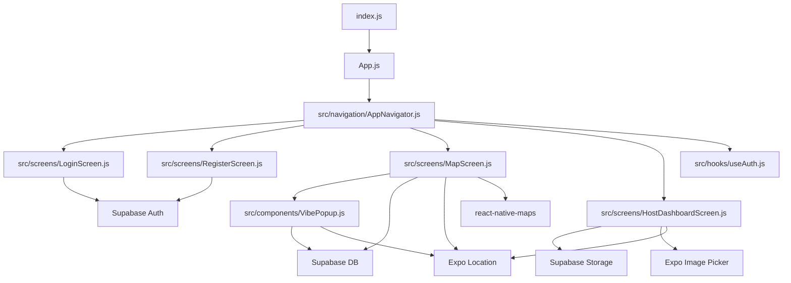
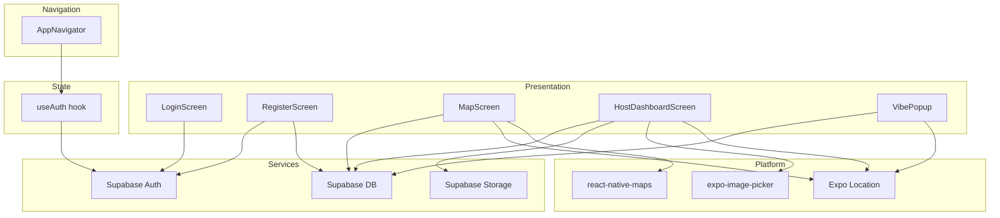
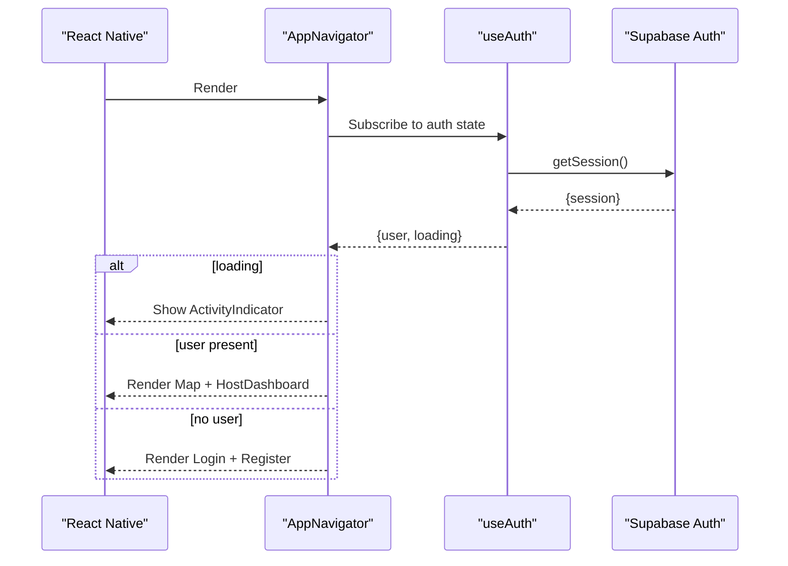
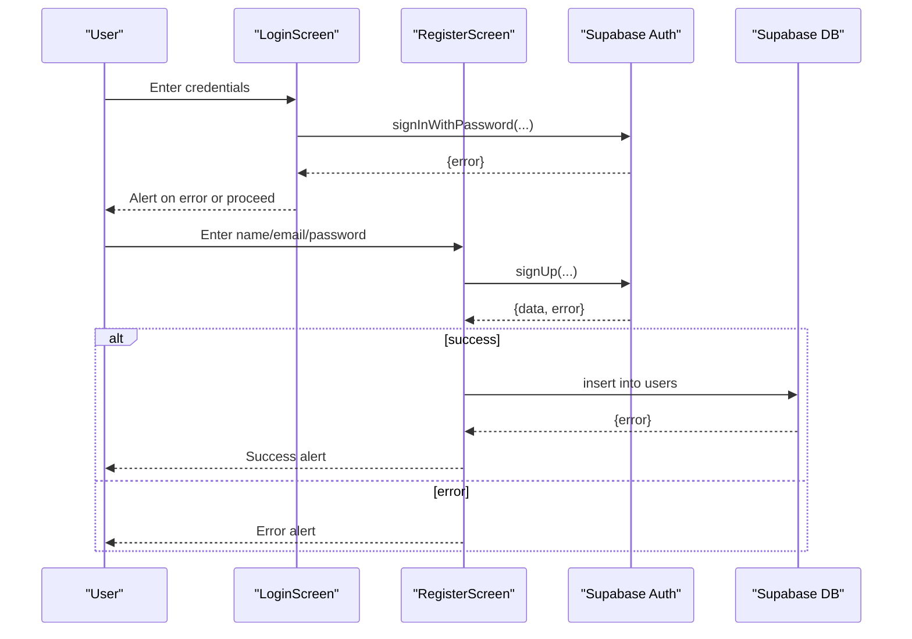
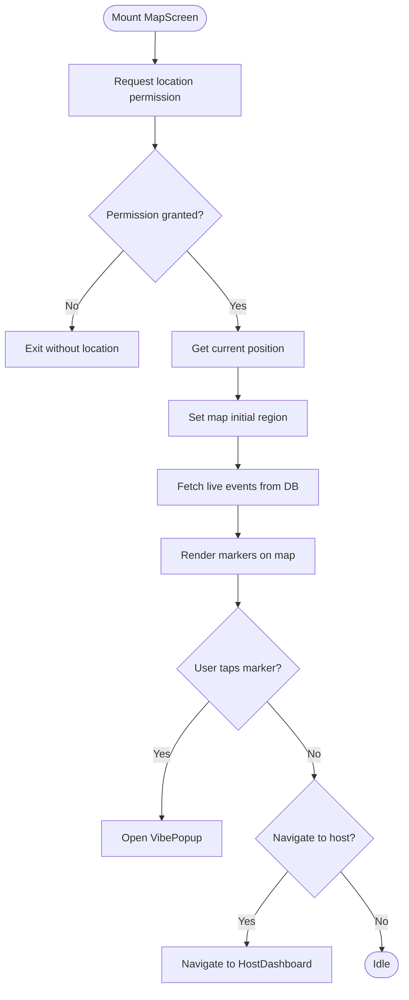
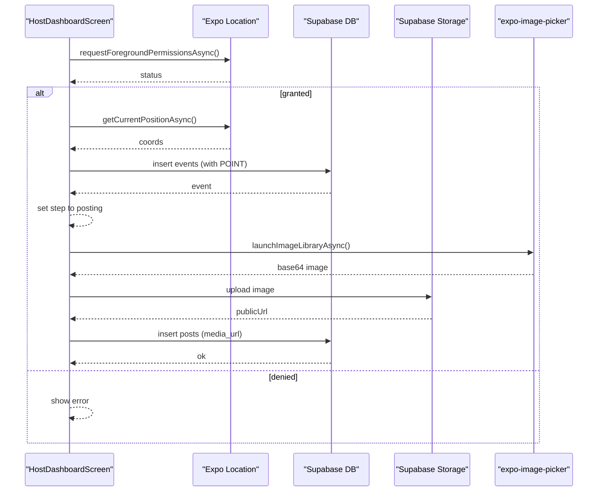
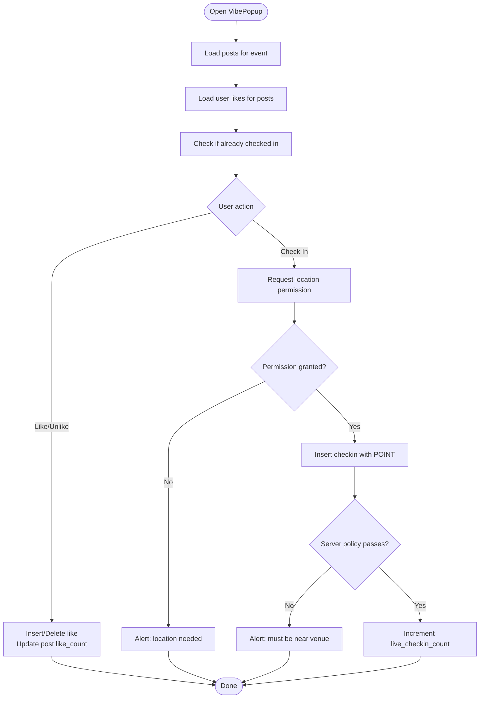
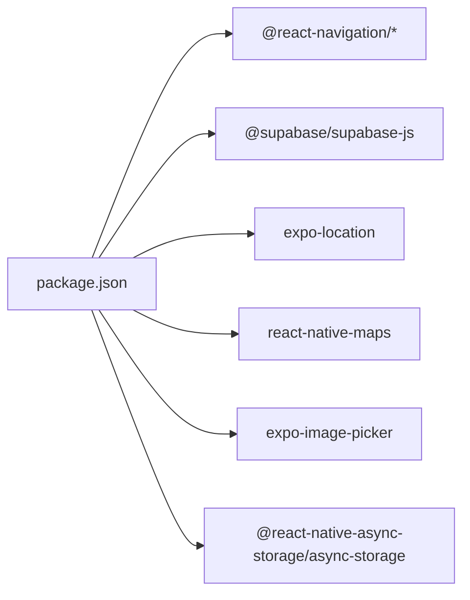

# Architecture Overview

<cite>
**Referenced Files in This Document**
- [index.js](file://index.js)
- [App.js](file://App.js)
- [package.json](file://package.json)
- [src/navigation/AppNavigator.js](file://src/navigation/AppNavigator.js)
- [src/hooks/useAuth.js](file://src/hooks/useAuth.js)
- [src/screens/LoginScreen.js](file://src/screens/LoginScreen.js)
- [src/screens/RegisterScreen.js](file://src/screens/RegisterScreen.js)
- [src/screens/MapScreen.js](file://src/screens/MapScreen.js)
- [src/screens/HostDashboardScreen.js](file://src/screens/HostDashboardScreen.js)
- [src/components/VibePopup.js](file://src/components/VibePopup.js)
- [supabase/sql/sql/phase6_checkins.sql](file://supabase/sql/sql/phase6_checkins.sql)
</cite>

## Table of Contents
1. Introduction
2. Project Structure
3. Core Components
4. Architecture Overview
5. Detailed Component Analysis
6. Dependency Analysis
7. Performance Considerations
8. Troubleshooting Guide
9. Conclusion

## Introduction
This document describes the architecture of the Outside mobile application built with React Native and Expo. It explains the component-based architecture, separation of concerns across screens, components, hooks, and navigation, and details the service layer that integrates directly with Supabase for authentication, database, and storage operations. It also documents the navigation structure using React Navigation with conditional routing based on authentication state, data flow patterns from UI to external APIs, system boundaries, and integration points with third-party services such as location services and map rendering.

## Project Structure
The app follows a feature-oriented layout:
- Entry points register the root component and bootstrap the app.
- Navigation defines routes and guards access based on authentication state.
- Screens implement user-facing flows (authentication, map, hosting).
- A shared component renders event detail overlays.
- A custom hook centralizes authentication state management.
- Database and storage interactions are performed via direct Supabase client calls within screens and components.

**Diagram sources**
- [index.js:1-9](file://index.js#L1-L9)
- [App.js:1-5](file://App.js#L1-L5)
- [src/navigation/AppNavigator.js:1-40](file://src/navigation/AppNavigator.js#L1-L40)
- [src/screens/LoginScreen.js:1-97](file://src/screens/LoginScreen.js#L1-L97)
- [src/screens/RegisterScreen.js:1-126](file://src/screens/RegisterScreen.js#L1-L126)
- [src/screens/MapScreen.js:1-100](file://src/screens/MapScreen.js#L1-L100)
- [src/screens/HostDashboardScreen.js:1-305](file://src/screens/HostDashboardScreen.js#L1-L305)
- [src/components/VibePopup.js:1-333](file://src/components/VibePopup.js#L1-L333)
- [src/hooks/useAuth.js:1-22](file://src/hooks/useAuth.js#L1-L22)

**Section sources**
- [index.js:1-9](file://index.js#L1-L9)
- [App.js:1-5](file://App.js#L1-L5)
- [package.json:1-32](file://package.json#L1-L32)

## Core Components
- App entrypoint: Registers the root component with Expo and renders the navigation container.
- Navigation: Conditional stack navigator that shows authentication screens when unauthenticated and map/hosting screens when authenticated.
- Authentication hook: Manages current session and auth state changes via Supabase.
- Screens:
  - Login: Authenticates users with email/password.
  - Register: Creates an account and inserts a user profile.
  - Map: Displays live events on a map, requests location permissions, and fetches active events.
  - Host Dashboard: Creates live events, posts media, and ends events.
- Shared component: VibePopup displays event details, posts, likes, and check-ins.

Key responsibilities and separation of concerns:
- UI logic is encapsulated in screens and components.
- Global auth state is centralized in a custom hook.
- External integrations (Supabase, location, maps, image picker) are invoked within screens/components where needed.

**Section sources**
- [App.js:1-5](file://App.js#L1-L5)
- [src/navigation/AppNavigator.js:1-40](file://src/navigation/AppNavigator.js#L1-L40)
- [src/hooks/useAuth.js:1-22](file://src/hooks/useAuth.js#L1-L22)
- [src/screens/LoginScreen.js:1-97](file://src/screens/LoginScreen.js#L1-L97)
- [src/screens/RegisterScreen.js:1-126](file://src/screens/RegisterScreen.js#L1-L126)
- [src/screens/MapScreen.js:1-100](file://src/screens/MapScreen.js#L1-L100)
- [src/screens/HostDashboardScreen.js:1-305](file://src/screens/HostDashboardScreen.js#L1-L305)
- [src/components/VibePopup.js:1-333](file://src/components/VibePopup.js#L1-L333)

## Architecture Overview
The app uses a layered approach:
- Presentation Layer: React Native screens and components render UI and handle local state.
- Navigation Layer: React Navigation manages screen transitions and guards routes by authentication state.
- Service Layer: Direct Supabase client calls provide authentication, database, and storage operations.
- Platform Integrations: Expo Location for geolocation; react-native-maps for map rendering; expo-image-picker for media selection.

**Diagram sources**
- [src/navigation/AppNavigator.js:1-40](file://src/navigation/AppNavigator.js#L1-L40)
- [src/hooks/useAuth.js:1-22](file://src/hooks/useAuth.js#L1-L22)
- [src/screens/LoginScreen.js:1-97](file://src/screens/LoginScreen.js#L1-L97)
- [src/screens/RegisterScreen.js:1-126](file://src/screens/RegisterScreen.js#L1-L126)
- [src/screens/MapScreen.js:1-100](file://src/screens/MapScreen.js#L1-L100)
- [src/screens/HostDashboardScreen.js:1-305](file://src/screens/HostDashboardScreen.js#L1-L305)
- [src/components/VibePopup.js:1-333](file://src/components/VibePopup.js#L1-L333)

## Detailed Component Analysis

### Navigation and Conditional Routing
- The navigator conditionally renders either authentication screens or authenticated screens based on the current user provided by the useAuth hook.
- While loading, a full-screen activity indicator is shown to prevent premature navigation decisions.

**Diagram sources**
- [src/navigation/AppNavigator.js:1-40](file://src/navigation/AppNavigator.js#L1-L40)
- [src/hooks/useAuth.js:1-22](file://src/hooks/useAuth.js#L1-L22)

**Section sources**
- [src/navigation/AppNavigator.js:1-40](file://src/navigation/AppNavigator.js#L1-L40)
- [src/hooks/useAuth.js:1-22](file://src/hooks/useAuth.js#L1-L22)

### Authentication Flow
- Login screen authenticates via Supabase password sign-in and surfaces errors through alerts.
- Register screen creates a user and inserts a profile record into the users table, then confirms success.
- The useAuth hook initializes session state and subscribes to auth state changes to keep UI in sync.

**Diagram sources**
- [src/screens/LoginScreen.js:1-97](file://src/screens/LoginScreen.js#L1-L97)
- [src/screens/RegisterScreen.js:1-126](file://src/screens/RegisterScreen.js#L1-L126)
- [src/hooks/useAuth.js:1-22](file://src/hooks/useAuth.js#L1-L22)

**Section sources**
- [src/screens/LoginScreen.js:1-97](file://src/screens/LoginScreen.js#L1-L97)
- [src/screens/RegisterScreen.js:1-126](file://src/screens/RegisterScreen.js#L1-L126)
- [src/hooks/useAuth.js:1-22](file://src/hooks/useAuth.js#L1-L22)

### Map Screen and Live Events
- Requests foreground location permission and sets initial map region based on device location.
- Fetches live events from the database and renders markers on the map.
- Allows navigation to the host dashboard to create a new live event.

**Diagram sources**
- [src/screens/MapScreen.js:1-100](file://src/screens/MapScreen.js#L1-L100)

**Section sources**
- [src/screens/MapScreen.js:1-100](file://src/screens/MapScreen.js#L1-L100)

### Host Dashboard and Media Posting
- Validates required fields and requests location permission before creating a live event.
- Inserts an event with geographic coordinates and toggles to posting mode.
- Picks an image, uploads it to storage, retrieves a public URL, and inserts a post linked to the event.
- Provides an option to end the event by updating its status and timestamp.

**Diagram sources**
- [src/screens/HostDashboardScreen.js:1-305](file://src/screens/HostDashboardScreen.js#L1-L305)

**Section sources**
- [src/screens/HostDashboardScreen.js:1-305](file://src/screens/HostDashboardScreen.js#L1-L305)

### VibePopup: Posts, Likes, and Check-ins
- Loads posts for the selected event and user-specific like states.
- Supports checking in at the venue with proximity validation enforced server-side.
- Toggles likes by inserting or deleting records and updates local UI state immediately.

**Diagram sources**
- [src/components/VibePopup.js:1-333](file://src/components/VibePopup.js#L1-L333)
- [supabase/sql/sql/phase6_checkins.sql:1-63](file://supabase/sql/sql/phase6_checkins.sql#L1-L63)

**Section sources**
- [src/components/VibePopup.js:1-333](file://src/components/VibePopup.js#L1-L333)
- [supabase/sql/sql/phase6_checkins.sql:1-63](file://supabase/sql/sql/phase6_checkins.sql#L1-L63)

## Dependency Analysis
- External dependencies include Expo, React Navigation, Supabase JS client, AsyncStorage, location services, image picker, and maps.
- The app’s runtime depends on platform capabilities for location and map rendering.
- Database policies enforce security constraints for check-ins and visibility.

**Diagram sources**
- [package.json:1-32](file://package.json#L1-L32)

**Section sources**
- [package.json:1-32](file://package.json#L1-L32)

## Performance Considerations
- Minimize re-renders by keeping heavy logic out of screens; consider moving data fetching into dedicated hooks or services.
- Use pagination or limit queries for large datasets (e.g., posts) to reduce payload size.
- Debounce or throttle location updates if implementing continuous tracking.
- Cache frequently accessed data locally (e.g., AsyncStorage) to reduce network calls.
- Optimize images by compressing before upload and using appropriate quality settings.

[No sources needed since this section provides general guidance]

## Troubleshooting Guide
Common issues and resolutions:
- Authentication failures: Ensure valid credentials and handle error messages surfaced by alerts. Verify session retrieval in the auth hook.
- Location permission denied: Prompt users to enable location in device settings; ensure permission checks before requesting location.
- Proximity check-in fails: Server-side policy enforces being within a distance threshold while the event is live; verify event is live and coordinates are accurate.
- Storage upload errors: Confirm file format and size; validate content type and bucket permissions.
- Navigation not working: Confirm route names match those defined in the navigator and that the user state is correctly resolved before rendering protected routes.

**Section sources**
- [src/screens/LoginScreen.js:1-97](file://src/screens/LoginScreen.js#L1-L97)
- [src/screens/RegisterScreen.js:1-126](file://src/screens/RegisterScreen.js#L1-L126)
- [src/screens/MapScreen.js:1-100](file://src/screens/MapScreen.js#L1-L100)
- [src/screens/HostDashboardScreen.js:1-305](file://src/screens/HostDashboardScreen.js#L1-L305)
- [src/components/VibePopup.js:1-333](file://src/components/VibePopup.js#L1-L333)
- [supabase/sql/sql/phase6_checkins.sql:1-63](file://supabase/sql/sql/phase6_checkins.sql#L1-L63)

## Conclusion
The Outside app employs a clear separation of concerns: screens handle UI and user interactions, a custom hook centralizes authentication state, and the service layer integrates directly with Supabase for auth, database, and storage. Navigation adapts to authentication state to control access. Third-party services like location and maps are integrated at the point of need. Server-side policies secure sensitive operations such as check-ins. This architecture supports scalability and maintainability while providing a responsive user experience.