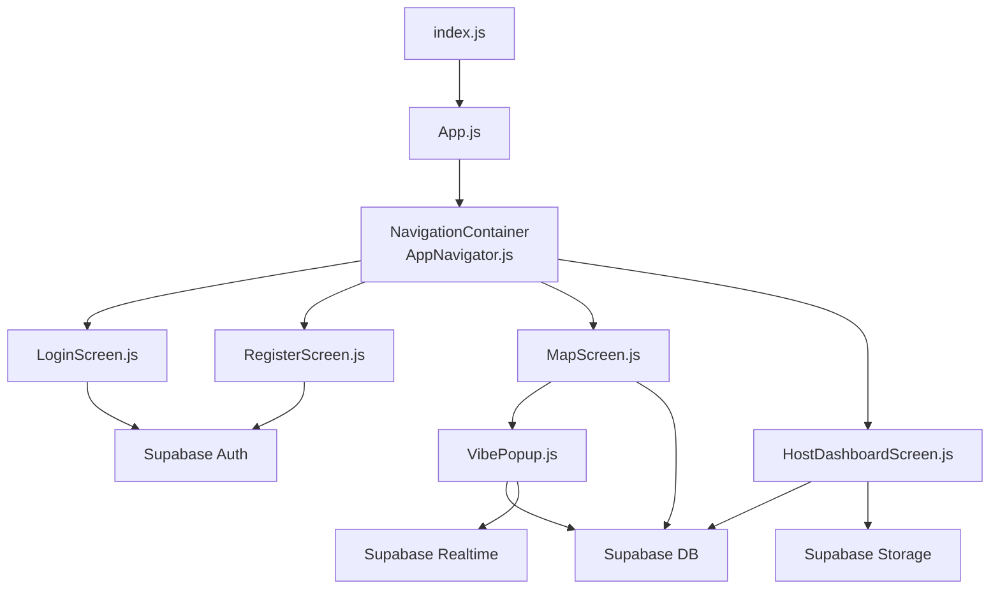
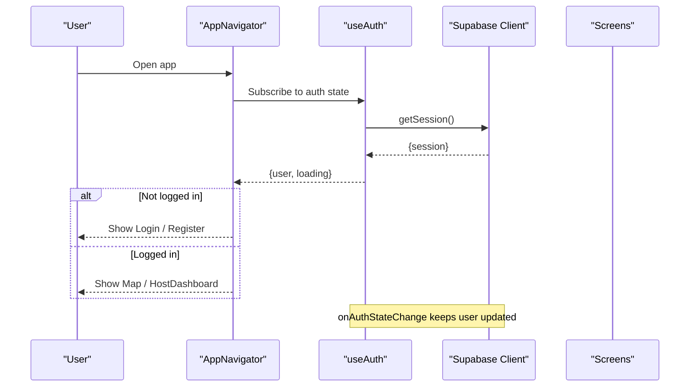
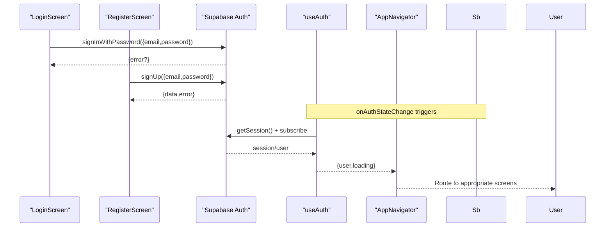
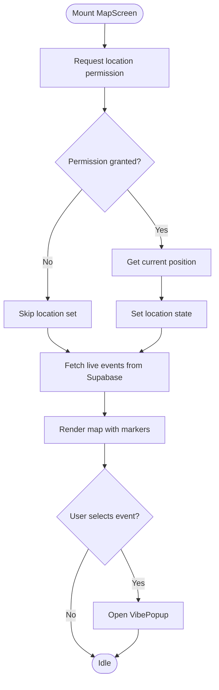
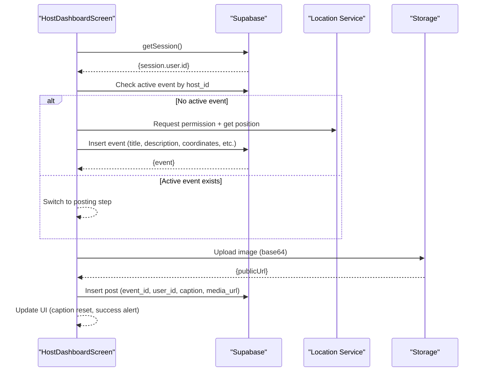
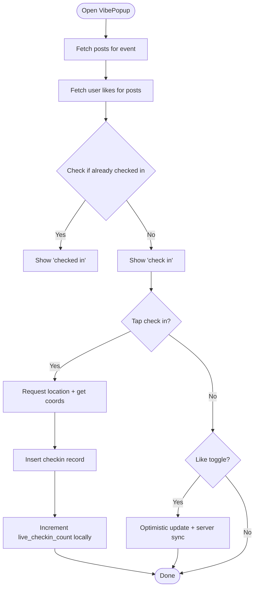
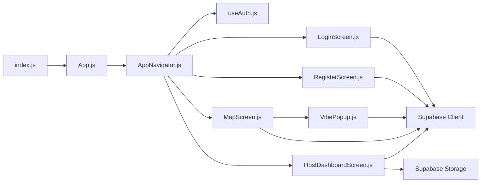

# Data Flow & State Management

<cite>
**Referenced Files in This Document**
- [App.js](file://App.js)
- [index.js](file://index.js)
- [package.json](file://package.json)
- [src/navigation/AppNavigator.js](file://src/navigation/AppNavigator.js)
- [src/hooks/useAuth.js](file://src/hooks/useAuth.js)
- [src/screens/LoginScreen.js](file://src/screens/LoginScreen.js)
- [src/screens/RegisterScreen.js](file://src/screens/RegisterScreen.js)
- [src/screens/MapScreen.js](file://src/screens/MapScreen.js)
- [src/screens/HostDashboardScreen.js](file://src/screens/HostDashboardScreen.js)
- [src/components/VibePopup.js](file://src/components/VibePopup.js)
</cite>

## Table of Contents
1. Introduction
2. Project Structure
3. Core Components
4. Architecture Overview
5. Detailed Component Analysis
6. Dependency Analysis
7. Performance Considerations
8. Troubleshooting Guide
9. Conclusion

## Introduction
This document explains how data flows through the Outside application from UI components to external APIs, with a focus on authentication state management via the useAuth hook. It covers component composition patterns, strategies to avoid prop drilling, local versus global state approaches, and real-time synchronization patterns with Supabase. It also includes examples of data binding patterns and error handling strategies used across screens and components.

## Project Structure
The app is an Expo-based React Native application that:
- Bootstraps via index.js and renders App.js.
- Uses React Navigation to route between screens based on authentication state.
- Centralizes auth state in a custom hook (useAuth).
- Interacts with Supabase for authentication, database queries, storage uploads, and real-time updates.

**Diagram sources**
- [index.js:1-9](file://index.js#L1-L9)
- [App.js:1-5](file://App.js#L1-L5)
- [src/navigation/AppNavigator.js:1-40](file://src/navigation/AppNavigator.js#L1-L40)
- [src/screens/LoginScreen.js:1-97](file://src/screens/LoginScreen.js#L1-L97)
- [src/screens/RegisterScreen.js:1-126](file://src/screens/RegisterScreen.js#L1-L126)
- [src/screens/MapScreen.js:1-100](file://src/screens/MapScreen.js#L1-L100)
- [src/screens/HostDashboardScreen.js:1-305](file://src/screens/HostDashboardScreen.js#L1-L305)
- [src/components/VibePopup.js:1-333](file://src/components/VibePopup.js#L1-L333)

**Section sources**
- [index.js:1-9](file://index.js#L1-L9)
- [App.js:1-5](file://App.js#L1-L5)
- [package.json:1-32](file://package.json#L1-L32)

## Core Components
- Authentication state provider: The useAuth hook encapsulates session retrieval and subscription to auth state changes, exposing user and loading state to consumers.
- Navigation gating: AppNavigator consumes useAuth to conditionally render authenticated or unauthenticated routes.
- Screens:
  - LoginScreen and RegisterScreen handle credential input and call Supabase auth endpoints.
  - MapScreen fetches live events and displays them on a map; it also opens VibePopup for event details.
  - HostDashboardScreen creates live events, posts media, and manages event lifecycle.
  - VibePopup lists posts, handles likes, check-ins, and displays counts.

Key responsibilities:
- Local state per screen/component for UI concerns (inputs, selection, temporary flags).
- Global state for auth via useAuth consumed at the navigation layer.
- External API calls via Supabase client imported from a shared module.

**Section sources**
- [src/hooks/useAuth.js:1-22](file://src/hooks/useAuth.js#L1-L22)
- [src/navigation/AppNavigator.js:1-40](file://src/navigation/AppNavigator.js#L1-L40)
- [src/screens/LoginScreen.js:1-97](file://src/screens/LoginScreen.js#L1-L97)
- [src/screens/RegisterScreen.js:1-126](file://src/screens/RegisterScreen.js#L1-L126)
- [src/screens/MapScreen.js:1-100](file://src/screens/MapScreen.js#L1-L100)
- [src/screens/HostDashboardScreen.js:1-305](file://src/screens/HostDashboardScreen.js#L1-L305)
- [src/components/VibePopup.js:1-333](file://src/components/VibePopup.js#L1-L333)

## Architecture Overview
The application follows a layered architecture:
- Presentation layer: Screens and components manage UI state and user interactions.
- State coordination: useAuth centralizes auth state; screens maintain local state for inputs and transient UI.
- Data access: Each screen/component directly uses the Supabase client for reads/writes and subscribes to real-time updates where needed.
- Routing: Navigation decides which screens to show based on auth state.

**Diagram sources**
- [src/navigation/AppNavigator.js:1-40](file://src/navigation/AppNavigator.js#L1-L40)
- [src/hooks/useAuth.js:1-22](file://src/hooks/useAuth.js#L1-L22)

## Detailed Component Analysis

### Authentication Flow and useAuth Pattern
- useAuth initializes by fetching the current session and subscribing to auth state changes. It exposes user and loading to consumers.
- AppNavigator consumes this hook to gate routes: if user exists, navigate to Map and HostDashboard; otherwise, show Login and Register.
- LoginScreen and RegisterScreen perform sign-in/sign-up using Supabase auth and surface errors via alerts.

**Diagram sources**
- [src/screens/LoginScreen.js:10-15](file://src/screens/LoginScreen.js#L10-L15)
- [src/screens/RegisterScreen.js:11-36](file://src/screens/RegisterScreen.js#L11-L36)
- [src/hooks/useAuth.js:8-19](file://src/hooks/useAuth.js#L8-L19)
- [src/navigation/AppNavigator.js:12-37](file://src/navigation/AppNavigator.js#L12-L37)

**Section sources**
- [src/hooks/useAuth.js:1-22](file://src/hooks/useAuth.js#L1-L22)
- [src/navigation/AppNavigator.js:12-37](file://src/navigation/AppNavigator.js#L12-L37)
- [src/screens/LoginScreen.js:10-15](file://src/screens/LoginScreen.js#L10-L15)
- [src/screens/RegisterScreen.js:11-36](file://src/screens/RegisterScreen.js#L11-L36)

### Map Screen: Local State and Event Fetching
- Manages local state for location, events list, and selected event.
- Requests location permissions and sets initial map region.
- Fetches live events from Supabase and renders markers.
- Opens VibePopup for event details.

**Diagram sources**
- [src/screens/MapScreen.js:13-33](file://src/screens/MapScreen.js#L13-L33)
- [src/screens/MapScreen.js:35-76](file://src/screens/MapScreen.js#L35-L76)

**Section sources**
- [src/screens/MapScreen.js:1-100](file://src/screens/MapScreen.js#L1-L100)

### Host Dashboard: Event Lifecycle and Media Posting
- Retrieves current user ID and checks for an active live event.
- Creates a new live event with coordinates and metadata.
- Allows picking images, uploading to storage, and creating post records linked to the event.
- Provides controls to end the event.

**Diagram sources**
- [src/screens/HostDashboardScreen.js:27-49](file://src/screens/HostDashboardScreen.js#L27-L49)
- [src/screens/HostDashboardScreen.js:51-86](file://src/screens/HostDashboardScreen.js#L51-L86)
- [src/screens/HostDashboardScreen.js:88-124](file://src/screens/HostDashboardScreen.js#L88-L124)
- [src/screens/HostDashboardScreen.js:126-143](file://src/screens/HostDashboardScreen.js#L126-L143)

**Section sources**
- [src/screens/HostDashboardScreen.js:1-305](file://src/screens/HostDashboardScreen.js#L1-L305)

### VibePopup: Posts, Likes, and Check-ins
- Loads posts for the selected event and user-specific like states.
- Handles check-in flow with location verification and conflict handling for duplicate check-ins.
- Toggles likes with optimistic UI updates and server-side adjustments.

**Diagram sources**
- [src/components/VibePopup.js:48-80](file://src/components/VibePopup.js#L48-L80)
- [src/components/VibePopup.js:82-118](file://src/components/VibePopup.js#L82-L118)
- [src/components/VibePopup.js:120-155](file://src/components/VibePopup.js#L120-L155)

**Section sources**
- [src/components/VibePopup.js:1-333](file://src/components/VibePopup.js#L1-L333)

## Dependency Analysis
- Entry points: index.js registers the root component; App.js renders the navigator.
- Navigation depends on useAuth to decide visible screens.
- Screens depend on:
  - Supabase client for auth, database, and storage operations.
  - Location services for geolocation.
  - Image picker for media capture/upload.
- Components:
  - VibePopup depends on MapScreen via props (event object) and communicates back via callbacks.

**Diagram sources**
- [index.js:1-9](file://index.js#L1-L9)
- [App.js:1-5](file://App.js#L1-L5)
- [src/navigation/AppNavigator.js:1-40](file://src/navigation/AppNavigator.js#L1-L40)
- [src/hooks/useAuth.js:1-22](file://src/hooks/useAuth.js#L1-L22)
- [src/screens/LoginScreen.js:1-97](file://src/screens/LoginScreen.js#L1-L97)
- [src/screens/RegisterScreen.js:1-126](file://src/screens/RegisterScreen.js#L1-L126)
- [src/screens/MapScreen.js:1-100](file://src/screens/MapScreen.js#L1-L100)
- [src/screens/HostDashboardScreen.js:1-305](file://src/screens/HostDashboardScreen.js#L1-L305)
- [src/components/VibePopup.js:1-333](file://src/components/VibePopup.js#L1-L333)

**Section sources**
- [package.json:1-32](file://package.json#L1-L32)

## Performance Considerations
- Minimize re-renders: Keep UI-only state local to components; only lift state when multiple components need it.
- Debounce or throttle frequent updates (e.g., location polling) if added later.
- Use efficient list rendering (FlatList) for large datasets like posts.
- Prefer selective queries (e.g., filter by is_live) to reduce payload size.
- Avoid unnecessary network calls by caching results in local state until explicit refresh is needed.

[No sources needed since this section provides general guidance]

## Troubleshooting Guide
Common issues and strategies:
- Authentication errors: Display user-friendly alerts and ensure loading states are cleared on both success and failure paths.
- Duplicate check-ins: Handle unique constraint errors gracefully by treating them as success and updating UI accordingly.
- Permission denials: Prompt users to enable location access before attempting location-dependent actions.
- Network failures: Wrap async operations in try/catch and provide feedback via alerts or disabled states.

Examples in code:
- Login and registration error handling with alerts and loading toggles.
- Check-in conflict handling for duplicate entries.
- Location permission checks before accessing device location.

**Section sources**
- [src/screens/LoginScreen.js:10-15](file://src/screens/LoginScreen.js#L10-L15)
- [src/screens/RegisterScreen.js:11-36](file://src/screens/RegisterScreen.js#L11-L36)
- [src/components/VibePopup.js:82-118](file://src/components/VibePopup.js#L82-L118)
- [src/screens/HostDashboardScreen.js:51-86](file://src/screens/HostDashboardScreen.js#L51-L86)

## Conclusion
Outside employs a clear separation of concerns:
- Global auth state via useAuth drives routing decisions.
- Screens manage local UI state and interact directly with Supabase for data operations.
- Real-time synchronization can be achieved by leveraging Supabase subscriptions (as demonstrated by auth state changes), while other data flows currently use request/response patterns.
- Error handling is consistent across flows, providing immediate feedback and maintaining UI consistency.

[No sources needed since this section summarizes without analyzing specific files]