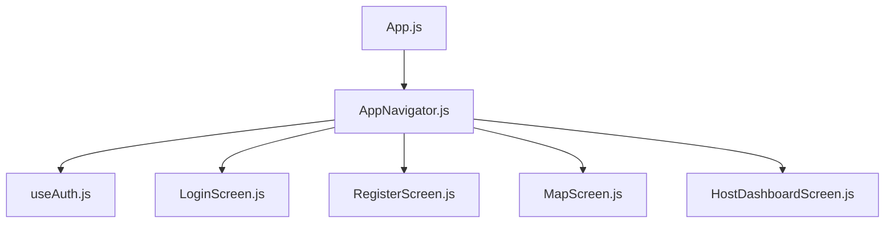
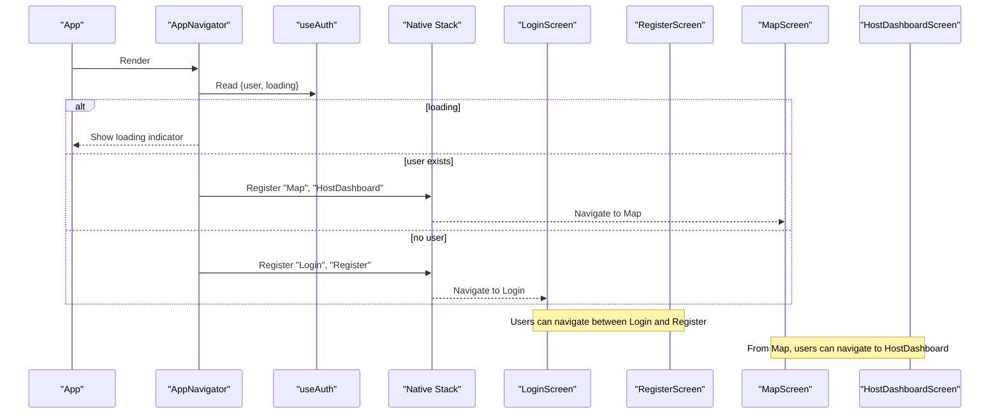
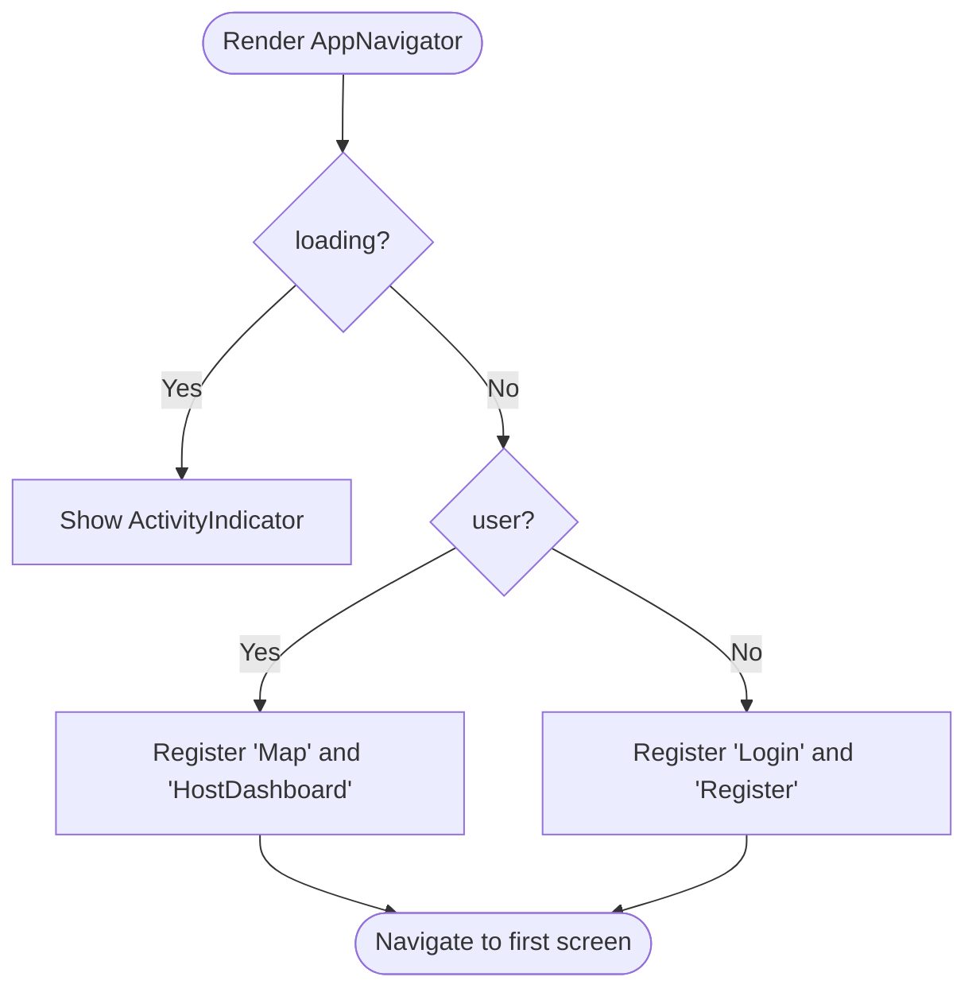
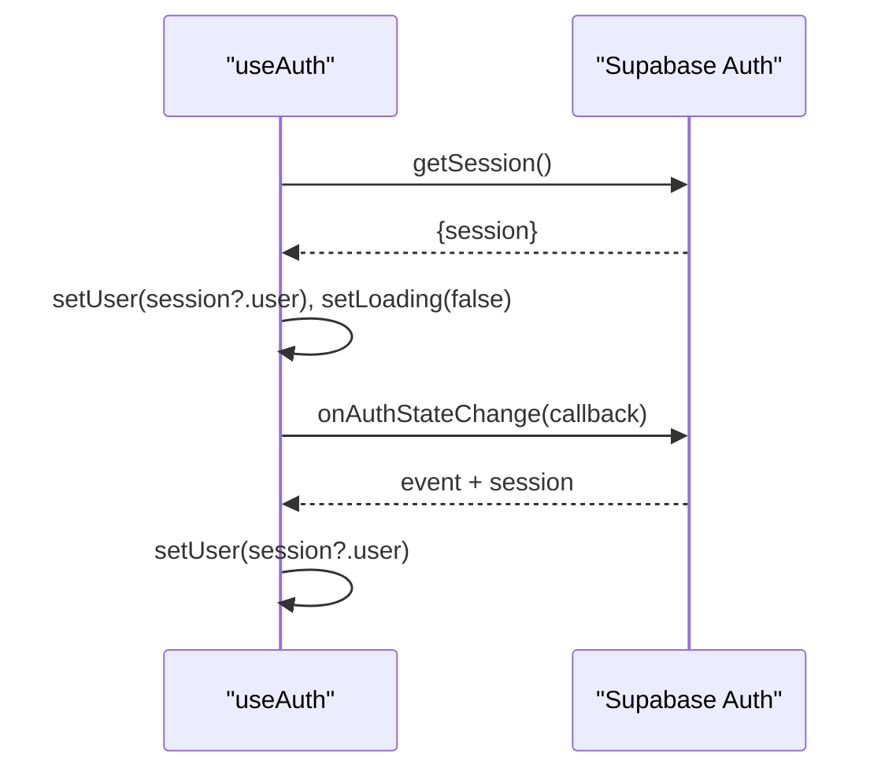
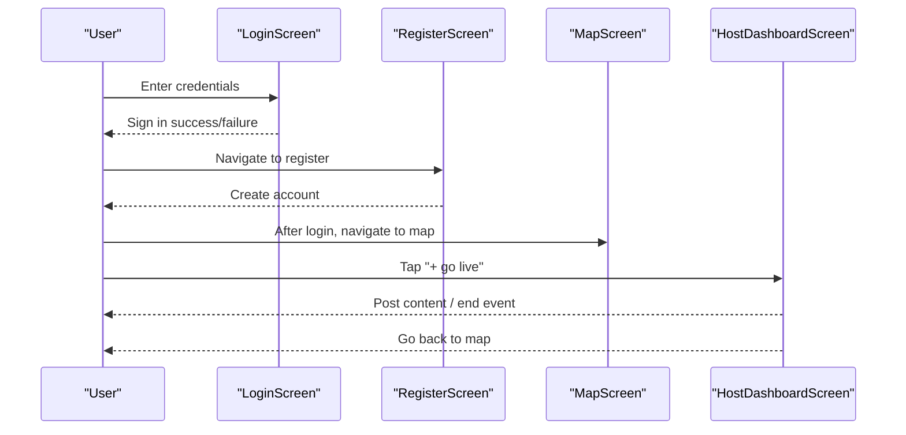
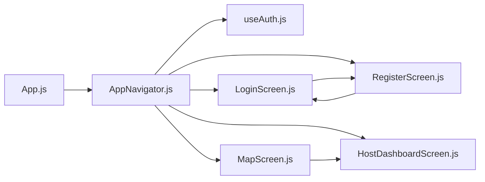

# Navigation & Routing Architecture

<cite>
**Referenced Files in This Document**
- [App.js](file://App.js)
- [AppNavigator.js](file://src/navigation/AppNavigator.js)
- [useAuth.js](file://src/hooks/useAuth.js)
- [LoginScreen.js](file://src/screens/LoginScreen.js)
- [RegisterScreen.js](file://src/screens/RegisterScreen.js)
- [MapScreen.js](file://src/screens/MapScreen.js)
- [HostDashboardScreen.js](file://src/screens/HostDashboardScreen.js)
</cite>

## Table of Contents
1. [Introduction](#introduction)
2. [Project Structure](#project-structure)
3. [Core Components](#core-components)
4. [Architecture Overview](#architecture-overview)
5. [Detailed Component Analysis](#detailed-component-analysis)
6. [Dependency Analysis](#dependency-analysis)
7. [Performance Considerations](#performance-considerations)
8. [Troubleshooting Guide](#troubleshooting-guide)
9. [Conclusion](#conclusion)

## Introduction
This document explains the navigation and routing architecture of the Outside application. It covers how React Navigation is configured, how screens are organized, and how authentication state drives conditional routing to protected or public routes. It also documents navigation flows between authentication screens and main app features, route guards, parameter passing patterns, and deep linking considerations.

## Project Structure
The navigation setup is centralized in a single navigator component that renders either authenticated or unauthenticated stacks based on the current user session. The root app mounts this navigator, which wraps all screens with a native stack navigator. Screens handle their own local navigation using the navigation prop provided by React Navigation.

**Diagram sources**
- [App.js:1-5](file://App.js#L1-L5)
- [AppNavigator.js:1-40](file://src/navigation/AppNavigator.js#L1-L40)
- [useAuth.js:1-22](file://src/hooks/useAuth.js#L1-L22)
- [LoginScreen.js:1-97](file://src/screens/LoginScreen.js#L1-L97)
- [RegisterScreen.js:1-126](file://src/screens/RegisterScreen.js#L1-L126)
- [MapScreen.js:1-100](file://src/screens/MapScreen.js#L1-L100)
- [HostDashboardScreen.js:1-305](file://src/screens/HostDashboardScreen.js#L1-L305)

**Section sources**
- [App.js:1-5](file://App.js#L1-L5)
- [AppNavigator.js:1-40](file://src/navigation/AppNavigator.js#L1-L40)

## Core Components
- AppNavigator: Central router that conditionally renders either the authenticated stack (Map, HostDashboard) or the unauthenticated stack (Login, Register) based on the current user from useAuth. It also shows a loading indicator while auth state is being resolved.
- useAuth: Hook that fetches the current session and subscribes to auth state changes, exposing user and loading flags to consumers.
- LoginScreen and RegisterScreen: Public screens for authentication flows; they navigate between each other and rely on Supabase auth.
- MapScreen: Primary authenticated screen that displays live events and navigates to the host dashboard.
- HostDashboardScreen: Authenticated screen for creating and managing live events; it can navigate back to previous screens.

Key responsibilities:
- Conditional routing based on authentication state
- Loading state handling before rendering the navigator
- Local navigation between screens via the navigation prop

**Section sources**
- [AppNavigator.js:12-40](file://src/navigation/AppNavigator.js#L12-L40)
- [useAuth.js:4-22](file://src/hooks/useAuth.js#L4-L22)
- [LoginScreen.js:5-45](file://src/screens/LoginScreen.js#L5-L45)
- [RegisterScreen.js:5-75](file://src/screens/RegisterScreen.js#L5-L75)
- [MapScreen.js:8-77](file://src/screens/MapScreen.js#L8-L77)
- [HostDashboardScreen.js:17-215](file://src/screens/HostDashboardScreen.js#L17-L215)

## Architecture Overview
The app uses a single native stack navigator with conditional screen registration. When a user is authenticated, the stack includes Map and HostDashboard; otherwise, it includes Login and Register. Authentication state is managed centrally via useAuth, ensuring consistent routing decisions across the app.

**Diagram sources**
- [AppNavigator.js:12-40](file://src/navigation/AppNavigator.js#L12-L40)
- [useAuth.js:8-19](file://src/hooks/useAuth.js#L8-L19)
- [LoginScreen.js:41-43](file://src/screens/LoginScreen.js#L41-L43)
- [RegisterScreen.js:70-72](file://src/screens/RegisterScreen.js#L70-L72)
- [MapScreen.js:63-68](file://src/screens/MapScreen.js#L63-L68)

## Detailed Component Analysis

### AppNavigator: Conditional Routing and Route Guards
- Renders a loading view until the auth session is resolved.
- Conditionally registers screens:
  - Authenticated: Map, HostDashboard
  - Unauthenticated: Login, Register
- Uses headerShown: false globally for a clean UI.

Route guard behavior:
- If no user is present, only Login and Register are available.
- Once a user is present, only Map and HostDashboard are available.

**Diagram sources**
- [AppNavigator.js:12-40](file://src/navigation/AppNavigator.js#L12-L40)

**Section sources**
- [AppNavigator.js:12-40](file://src/navigation/AppNavigator.js#L12-L40)

### useAuth: Session Management and State Subscription
- Fetches the current session once on mount.
- Subscribes to auth state changes to keep user state up-to-date.
- Exposes user and loading to consumers.

**Diagram sources**
- [useAuth.js:8-19](file://src/hooks/useAuth.js#L8-L19)

**Section sources**
- [useAuth.js:1-22](file://src/hooks/useAuth.js#L1-L22)

### LoginScreen: Authentication Entry Point
- Collects email and password.
- Calls sign-in via Supabase.
- Navigates to Register when needed.
- Displays loading state during sign-in.

Navigation pattern:
- Uses navigation.navigate('Register') to switch to registration.

**Section sources**
- [LoginScreen.js:10-45](file://src/screens/LoginScreen.js#L10-L45)

### RegisterScreen: Account Creation Flow
- Validates inputs and calls sign-up via Supabase.
- Creates a user profile record after successful sign-up.
- Navigates back to Login when needed.

Navigation pattern:
- Uses navigation.navigate('Login') to return to login.

**Section sources**
- [RegisterScreen.js:11-75](file://src/screens/RegisterScreen.js#L11-L75)

### MapScreen: Main Feature Screen
- Requests location permissions and sets initial map region.
- Fetches live events from the database.
- Provides a button to navigate to HostDashboard.

Navigation pattern:
- Uses navigation.navigate('HostDashboard') to open the host flow.

Parameter passing:
- No parameters are currently passed to HostDashboard.

**Section sources**
- [MapScreen.js:13-77](file://src/screens/MapScreen.js#L13-L77)

### HostDashboardScreen: Live Event Management
- Retrieves current user session and checks for an active event.
- Allows creating a new live event and posting media to it.
- Supports ending an event and navigating back.

Navigation pattern:
- Uses navigation.goBack() to return to the previous screen.

Parameter passing:
- No parameters are currently received from MapScreen.

**Section sources**
- [HostDashboardScreen.js:27-215](file://src/screens/HostDashboardScreen.js#L27-L215)

### Navigation Flows Between Screens
- Unauthenticated flow: Login <-> Register
- Authenticated flow: Map -> HostDashboard -> back to previous screen

**Diagram sources**
- [LoginScreen.js:41-43](file://src/screens/LoginScreen.js#L41-L43)
- [RegisterScreen.js:70-72](file://src/screens/RegisterScreen.js#L70-L72)
- [MapScreen.js:63-68](file://src/screens/MapScreen.js#L63-L68)
- [HostDashboardScreen.js:148-150](file://src/screens/HostDashboardScreen.js#L148-L150)

## Dependency Analysis
The navigation layer depends on authentication state and individual screens depend on navigation utilities.

**Diagram sources**
- [App.js:1-5](file://App.js#L1-L5)
- [AppNavigator.js:1-40](file://src/navigation/AppNavigator.js#L1-L40)
- [useAuth.js:1-22](file://src/hooks/useAuth.js#L1-L22)
- [LoginScreen.js:1-97](file://src/screens/LoginScreen.js#L1-L97)
- [RegisterScreen.js:1-126](file://src/screens/RegisterScreen.js#L1-L126)
- [MapScreen.js:1-100](file://src/screens/MapScreen.js#L1-L100)
- [HostDashboardScreen.js:1-305](file://src/screens/HostDashboardScreen.js#L1-L305)

**Section sources**
- [AppNavigator.js:1-40](file://src/navigation/AppNavigator.js#L1-L40)
- [useAuth.js:1-22](file://src/hooks/useAuth.js#L1-L22)

## Performance Considerations
- Avoid re-rendering the entire navigator by keeping heavy logic out of AppNavigator. Currently, AppNavigator only reads lightweight user/loading flags.
- Prefer lazy loading for large screens if the app grows (e.g., dynamic imports).
- Minimize network calls inside navigation components; prefer fetching data within screens and caching where appropriate.
- Use navigation.goBack() instead of complex stack manipulations to reduce overhead.

[No sources needed since this section provides general guidance]

## Troubleshooting Guide
Common issues and resolutions:
- Stuck on loading screen: Ensure useAuth resolves loading correctly and that Supabase client is initialized. Verify that getSession returns a session or null promptly.
- Redirect loops: Confirm that conditional screen registration in AppNavigator matches the intended user state. If both stacks render simultaneously, ensure the ternary logic is correct.
- Navigation errors: Verify that screen names used in navigation.navigate match those registered in the navigator. For example, 'Login', 'Register', 'Map', 'HostDashboard'.
- Deep links not working: Add a config object to NavigationContainer with a prefix and matching screen names to enable deep linking. Ensure screen names align with link paths.

**Section sources**
- [AppNavigator.js:12-40](file://src/navigation/AppNavigator.js#L12-L40)
- [useAuth.js:8-19](file://src/hooks/useAuth.js#L8-L19)
- [LoginScreen.js:41-43](file://src/screens/LoginScreen.js#L41-L43)
- [RegisterScreen.js:70-72](file://src/screens/RegisterScreen.js#L70-L72)
- [MapScreen.js:63-68](file://src/screens/MapScreen.js#L63-L68)

## Conclusion
The Outside app uses a simple yet effective navigation architecture centered around a single native stack navigator with conditional screen registration based on authentication state. Authentication is handled by a dedicated hook that keeps the navigator informed of the current user. Screens navigate locally using the navigation prop, enabling straightforward flows between public and protected areas. To scale further, consider adding deep linking configuration, parameterized navigation, and more granular route guards as the feature set expands.