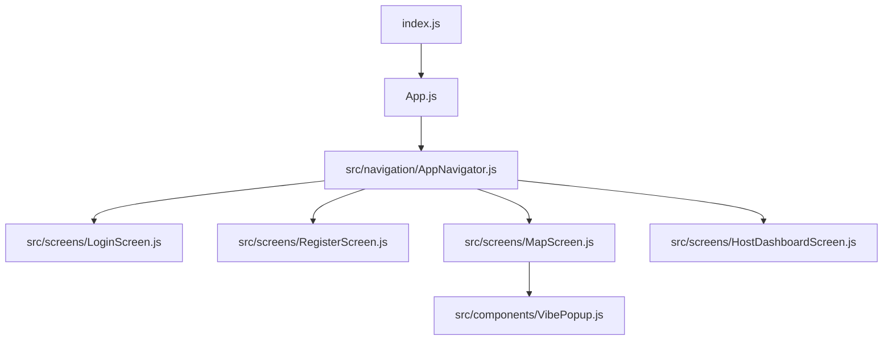
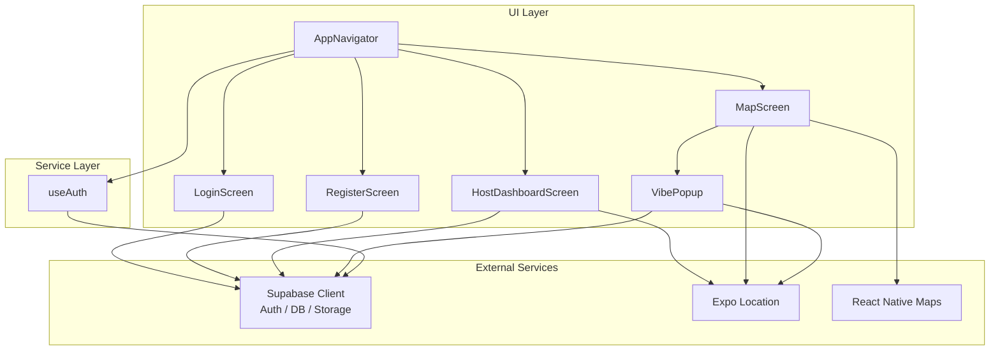
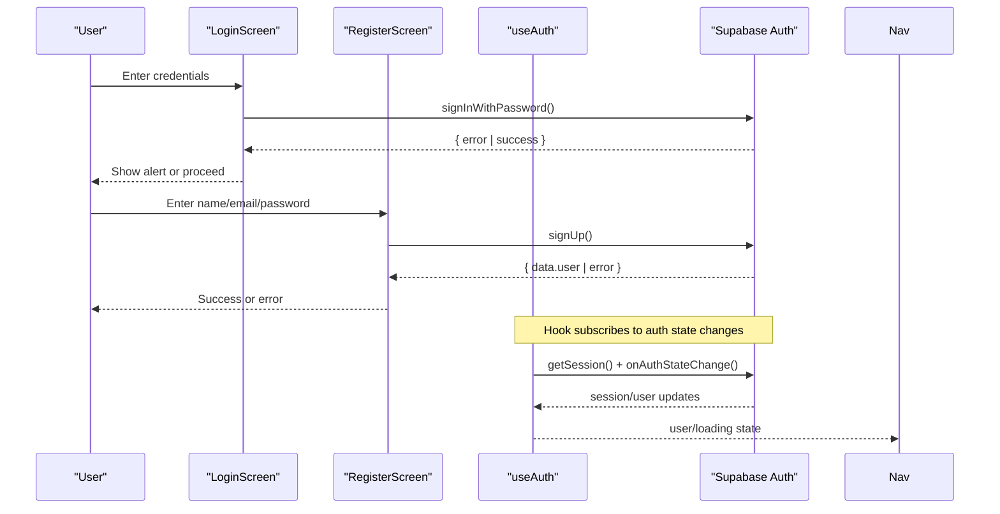
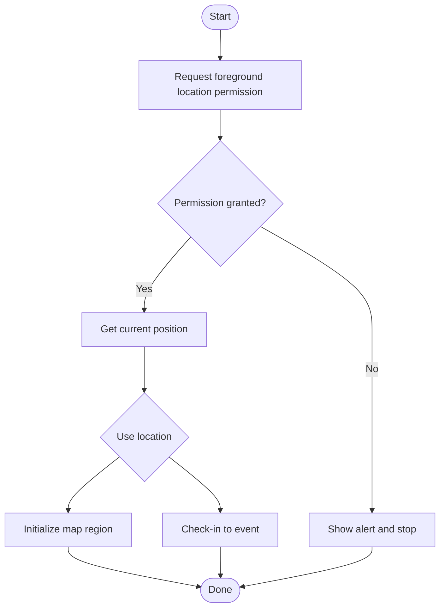
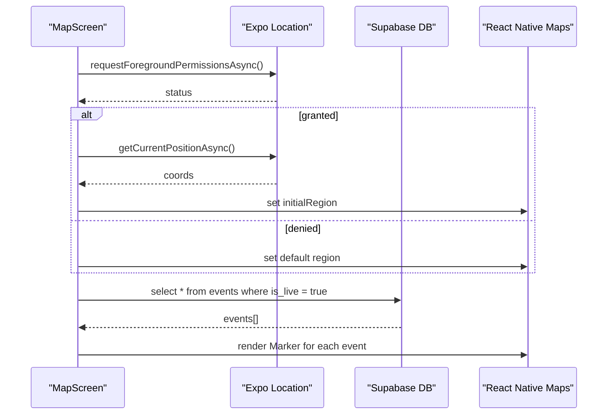
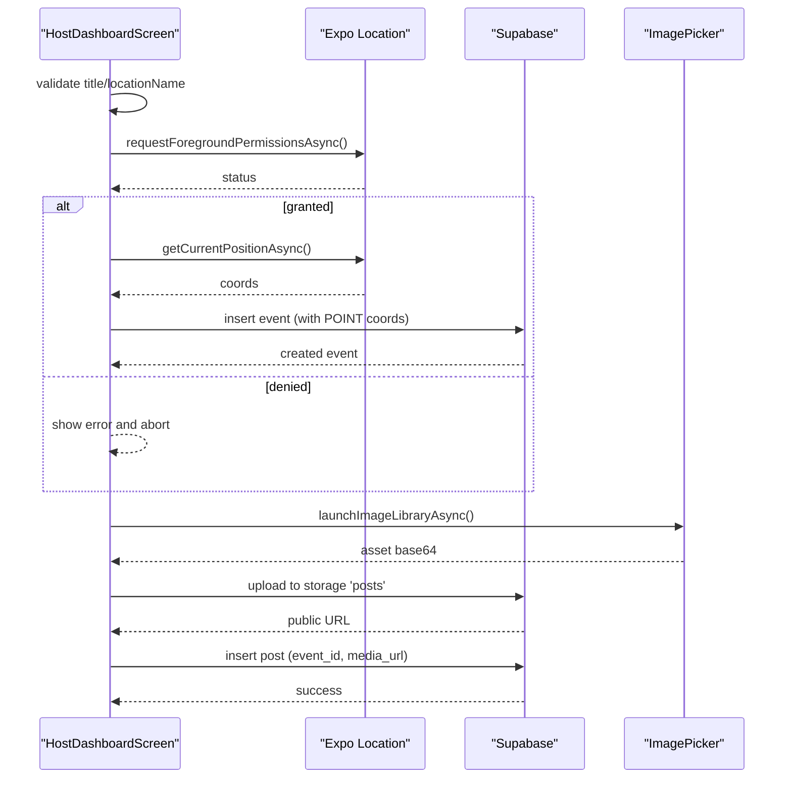
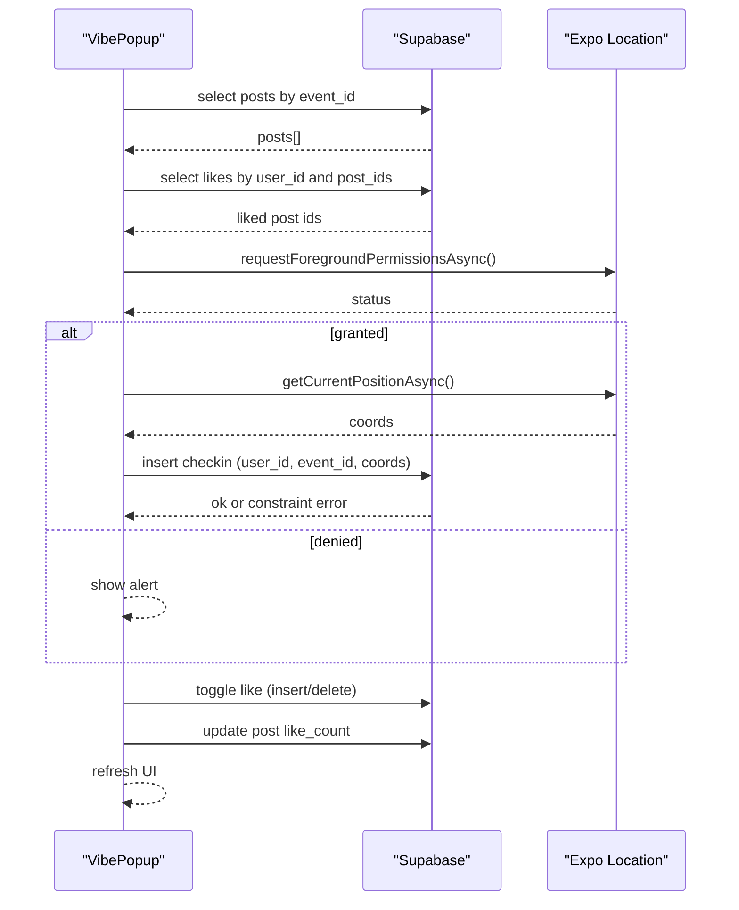

# Service Layer & External Integrations

<cite>
**Referenced Files in This Document**
- [App.js](file://App.js)
- [index.js](file://index.js)
- [package.json](file://package.json)
- [src/navigation/AppNavigator.js](file://src/navigation/AppNavigator.js)
- [src/hooks/useAuth.js](file://src/hooks/useAuth.js)
- [src/screens/LoginScreen.js](file://src/screens/LoginScreen.js)
- [src/screens/RegisterScreen.js](file://src/screens/RegisterScreen.js)
- [src/screens/MapScreen.js](file://src/screens/MapScreen.js)
- [src/screens/HostDashboardScreen.js](file://src/screens/HostDashboardScreen.js)
- [src/components/VibePopup.js](file://src/components/VibePopup.js)
</cite>

## Table of Contents
1. [Introduction](#introduction)
2. [Project Structure](#project-structure)
3. [Core Components](#core-components)
4. [Architecture Overview](#architecture-overview)
5. [Detailed Component Analysis](#detailed-component-analysis)
6. [Dependency Analysis](#dependency-analysis)
7. [Performance Considerations](#performance-considerations)
8. [Troubleshooting Guide](#troubleshooting-guide)
9. [Conclusion](#conclusion)

## Introduction
This document explains the service layer architecture and external integrations for the Outside application. It focuses on:
- Direct Supabase client integration for authentication, database operations, and file storage
- Location services using Expo Location API with permission handling and GPS usage
- Map rendering with React Native Maps, marker management, and real-time location updates
- Error handling strategies, retry mechanisms, and offline capability considerations for external dependencies

The app is an Expo-based React Native application that uses a minimal entry point to bootstrap navigation and screens. The service layer is implemented as direct calls to the Supabase client from components and hooks, rather than through a dedicated service module.

## Project Structure
At runtime, the app starts at the root index file, registers the root component, and renders the navigation stack that routes users based on authentication state. Screens interact directly with Supabase and platform APIs (location, image picker).



**Diagram sources**
- [index.js:1-9](file://index.js#L1-L9)
- [App.js:1-5](file://App.js#L1-L5)
- [src/navigation/AppNavigator.js:1-40](file://src/navigation/AppNavigator.js#L1-L40)
- [src/screens/MapScreen.js:1-100](file://src/screens/MapScreen.js#L1-L100)
- [src/components/VibePopup.js:1-333](file://src/components/VibePopup.js#L1-L333)

**Section sources**
- [index.js:1-9](file://index.js#L1-L9)
- [App.js:1-5](file://App.js#L1-L5)
- [src/navigation/AppNavigator.js:1-40](file://src/navigation/AppNavigator.js#L1-L40)

## Core Components
- Authentication hook: Centralizes session retrieval and auth state subscription to keep UI in sync with Supabase auth state.
- Navigation: Routes between login/register and authenticated screens based on current user.
- Map screen: Requests location permissions, fetches live events from Supabase, and renders markers.
- Host dashboard: Creates live events with geospatial coordinates, uploads images to Supabase Storage, and posts media linked to events.
- Vibe popup: Displays event details, posts, likes, and check-ins; enforces location permission for check-in.

Key responsibilities:
- Supabase client is imported directly into components/hooks for auth, database queries/mutations, and storage operations.
- Expo Location is used for foreground permissions and current position acquisition.
- React Native Maps renders the map and markers for live events.

**Section sources**
- [src/hooks/useAuth.js:1-22](file://src/hooks/useAuth.js#L1-L22)
- [src/navigation/AppNavigator.js:1-40](file://src/navigation/AppNavigator.js#L1-L40)
- [src/screens/MapScreen.js:1-100](file://src/screens/MapScreen.js#L1-L100)
- [src/screens/HostDashboardScreen.js:1-305](file://src/screens/HostDashboardScreen.js#L1-L305)
- [src/components/VibePopup.js:1-333](file://src/components/VibePopup.js#L1-L333)

## Architecture Overview
The app follows a thin-service-layer pattern where screens and hooks call the Supabase client directly. Platform capabilities are accessed via Expo modules.



**Diagram sources**
- [src/navigation/AppNavigator.js:1-40](file://src/navigation/AppNavigator.js#L1-L40)
- [src/hooks/useAuth.js:1-22](file://src/hooks/useAuth.js#L1-L22)
- [src/screens/LoginScreen.js:1-97](file://src/screens/LoginScreen.js#L1-L97)
- [src/screens/RegisterScreen.js:1-126](file://src/screens/RegisterScreen.js#L1-L126)
- [src/screens/MapScreen.js:1-100](file://src/screens/MapScreen.js#L1-L100)
- [src/screens/HostDashboardScreen.js:1-305](file://src/screens/HostDashboardScreen.js#L1-L305)
- [src/components/VibePopup.js:1-333](file://src/components/VibePopup.js#L1-L333)

## Detailed Component Analysis

### Authentication Flow (Direct Supabase Integration)
- Session retrieval and state subscription are handled by a custom hook that listens to auth changes and updates UI state accordingly.
- Login and register screens call Supabase auth methods directly and handle errors with user-facing alerts.



**Diagram sources**
- [src/screens/LoginScreen.js:10-15](file://src/screens/LoginScreen.js#L10-L15)
- [src/screens/RegisterScreen.js:11-36](file://src/screens/RegisterScreen.js#L11-L36)
- [src/hooks/useAuth.js:8-19](file://src/hooks/useAuth.js#L8-L19)

**Section sources**
- [src/hooks/useAuth.js:1-22](file://src/hooks/useAuth.js#L1-L22)
- [src/screens/LoginScreen.js:1-97](file://src/screens/LoginScreen.js#L1-L97)
- [src/screens/RegisterScreen.js:1-126](file://src/screens/RegisterScreen.js#L1-L126)

### Location Services Integration (Expo Location)
- Foreground permissions are requested before acquiring the current position.
- Permissions are required both for displaying the user’s location on the map and for checking in to events.
- If permissions are not granted, flows short-circuit with user feedback.



**Diagram sources**
- [src/screens/MapScreen.js:13-21](file://src/screens/MapScreen.js#L13-L21)
- [src/screens/HostDashboardScreen.js:51-86](file://src/screens/HostDashboardScreen.js#L51-L86)
- [src/components/VibePopup.js:82-118](file://src/components/VibePopup.js#L82-L118)

**Section sources**
- [src/screens/MapScreen.js:1-100](file://src/screens/MapScreen.js#L1-L100)
- [src/screens/HostDashboardScreen.js:51-86](file://src/screens/HostDashboardScreen.js#L51-L86)
- [src/components/VibePopup.js:82-118](file://src/components/VibePopup.js#L82-L118)

### Map Rendering and Markers (React Native Maps)
- The map initializes with either the user’s current coordinates or a default region.
- Live events are fetched from Supabase and rendered as markers.
- Tapping a marker opens a detail popup showing posts and interactions.



**Diagram sources**
- [src/screens/MapScreen.js:13-33](file://src/screens/MapScreen.js#L13-L33)
- [src/screens/MapScreen.js:35-62](file://src/screens/MapScreen.js#L35-L62)

**Section sources**
- [src/screens/MapScreen.js:1-100](file://src/screens/MapScreen.js#L1-L100)

### Host Dashboard: Creating Events and Posting Media
- Validates inputs and requests location permission before creating a live event with geospatial coordinates.
- Uploads images to Supabase Storage and inserts post records linked to the active event.
- Provides controls to end the live event.



**Diagram sources**
- [src/screens/HostDashboardScreen.js:51-86](file://src/screens/HostDashboardScreen.js#L51-L86)
- [src/screens/HostDashboardScreen.js:88-124](file://src/screens/HostDashboardScreen.js#L88-L124)

**Section sources**
- [src/screens/HostDashboardScreen.js:1-305](file://src/screens/HostDashboardScreen.js#L1-L305)

### Vibe Popup: Posts, Likes, and Check-ins
- Loads posts for the selected event and tracks user likes.
- Enforces location permission for check-in and handles duplicate check-in constraints gracefully.
- Updates like counts and local UI state optimistically while persisting changes.



**Diagram sources**
- [src/components/VibePopup.js:48-80](file://src/components/VibePopup.js#L48-L80)
- [src/components/VibePopup.js:82-118](file://src/components/VibePopup.js#L82-L118)
- [src/components/VibePopup.js:120-155](file://src/components/VibePopup.js#L120-L155)

**Section sources**
- [src/components/VibePopup.js:1-333](file://src/components/VibePopup.js#L1-L333)

## Dependency Analysis
- External libraries declared in package.json include Supabase JS client, Expo Location, Image Picker, and React Native Maps.
- The app bootstraps via index.js and App.js, then delegates routing to AppNavigator.
- Components import the Supabase client directly; there is no centralized service module.

```mermaid
graph LR
Pkg["package.json"]
I["index.js"]
A["App.js"]
N["AppNavigator"]
H["useAuth"]
LS["LoginScreen"]
RS["RegisterScreen"]
MS["MapScreen"]
HS["HostDashboardScreen"]
VP["VibePopup"]
Pkg --> |declares| Libs["@supabase/supabase-js", "expo-location", "react-native-maps"]
I --> A
A --> N
N --> LS
N --> RS
N --> MS
N --> HS
MS --> VP
LS --> H
RS --> H
H --> |uses| Supa["Supabase Client"]
MS --> |uses| Supa
HS --> |uses| Supa
VP --> |uses| Supa
MS --> |uses| Loc["Expo Location"]
HS --> |uses| Loc
VP --> |uses| Loc
```

**Diagram sources**
- [package.json:5-22](file://package.json#L5-L22)
- [index.js:1-9](file://index.js#L1-L9)
- [App.js:1-5](file://App.js#L1-L5)
- [src/navigation/AppNavigator.js:1-40](file://src/navigation/AppNavigator.js#L1-L40)
- [src/hooks/useAuth.js:1-22](file://src/hooks/useAuth.js#L1-L22)
- [src/screens/MapScreen.js:1-100](file://src/screens/MapScreen.js#L1-L100)
- [src/screens/HostDashboardScreen.js:1-305](file://src/screens/HostDashboardScreen.js#L1-L305)
- [src/components/VibePopup.js:1-333](file://src/components/VibePopup.js#L1-L333)

**Section sources**
- [package.json:1-32](file://package.json#L1-L32)
- [src/navigation/AppNavigator.js:1-40](file://src/navigation/AppNavigator.js#L1-L40)

## Performance Considerations
- Minimize network calls: Cache events locally when possible and debounce re-fetches if polling.
- Optimize map rendering: Limit markers to visible region and avoid unnecessary re-renders by memoizing lists.
- Defer heavy work: Load posts only when the popup is opened; use pagination for large datasets.
- Reduce image payload: Compress images before upload and store thumbnails for list views.
- Avoid redundant permission prompts: Cache permission status and only prompt when necessary.

[No sources needed since this section provides general guidance]

## Troubleshooting Guide
Common issues and resolutions:
- Location permission denied: Ensure foreground permission is requested before calling getCurrentPositionAsync. Provide clear user guidance to enable location access.
- Duplicate check-in constraint: Handle unique constraint errors by treating them as successful check-ins and updating UI accordingly.
- Network failures: Wrap async calls in try/catch, surface user-friendly messages, and consider retry logic for transient errors.
- Storage upload errors: Validate image format and size; retry upload on failure and provide feedback.
- Empty or stale data: Add loading states and empty-state messaging; refresh data on focus or pull-to-refresh.

**Section sources**
- [src/screens/HostDashboardScreen.js:51-86](file://src/screens/HostDashboardScreen.js#L51-L86)
- [src/components/VibePopup.js:82-118](file://src/components/VibePopup.js#L82-L118)
- [src/screens/LoginScreen.js:10-15](file://src/screens/LoginScreen.js#L10-L15)
- [src/screens/RegisterScreen.js:11-36](file://src/screens/RegisterScreen.js#L11-L36)

## Conclusion
The Outside app integrates Supabase directly from components and hooks for authentication, database, and storage operations. Location services are managed via Expo Location with explicit permission handling, and maps are rendered using React Native Maps with dynamic markers for live events. Robust error handling is present throughout, with user-facing alerts and graceful handling of constraints. For improved resilience, consider adding retry mechanisms, caching strategies, and offline support for critical flows such as posting and check-ins.

[No sources needed since this section summarizes without analyzing specific files]