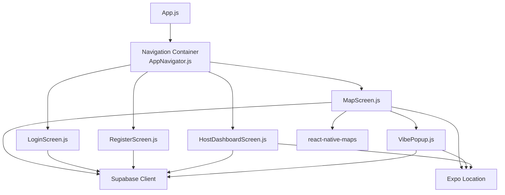
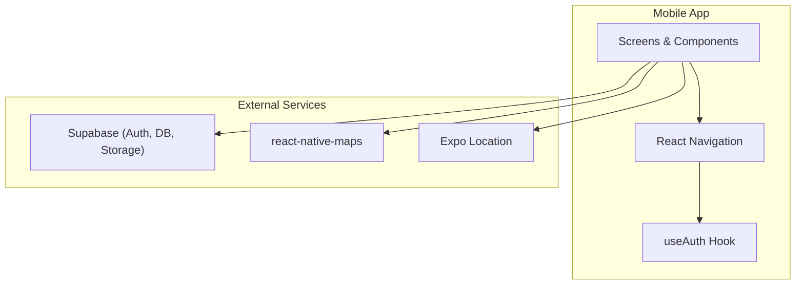
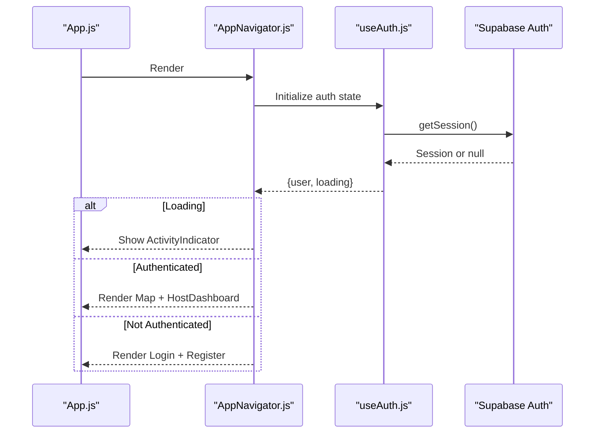
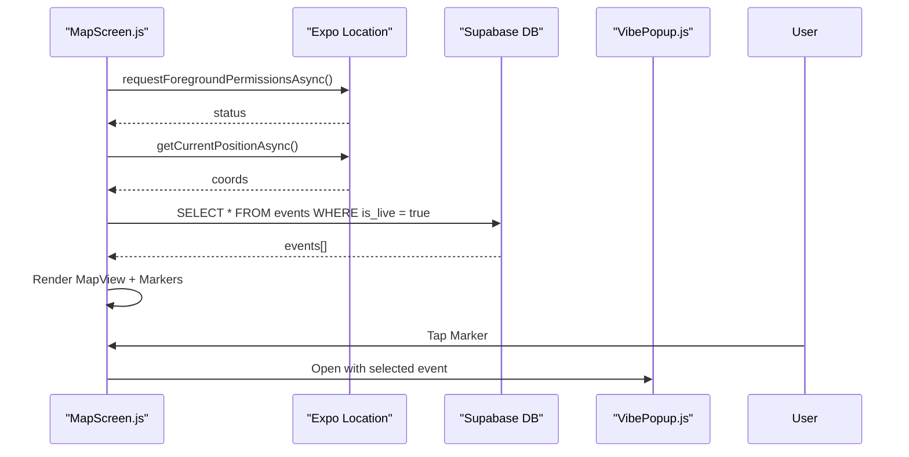
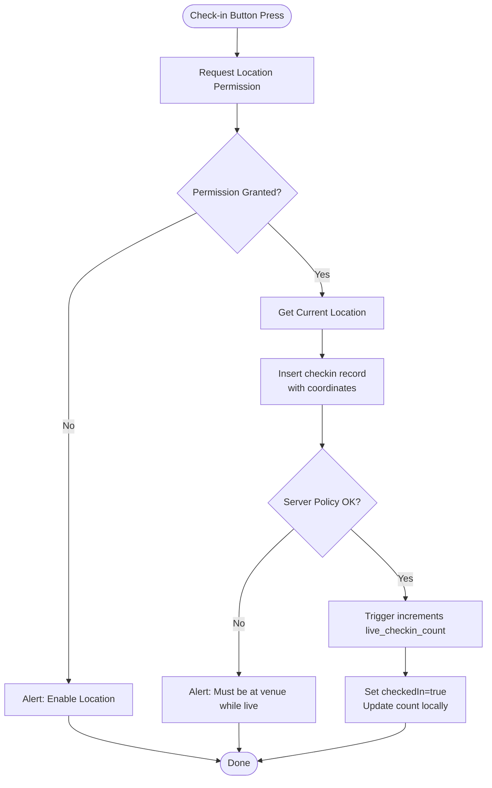
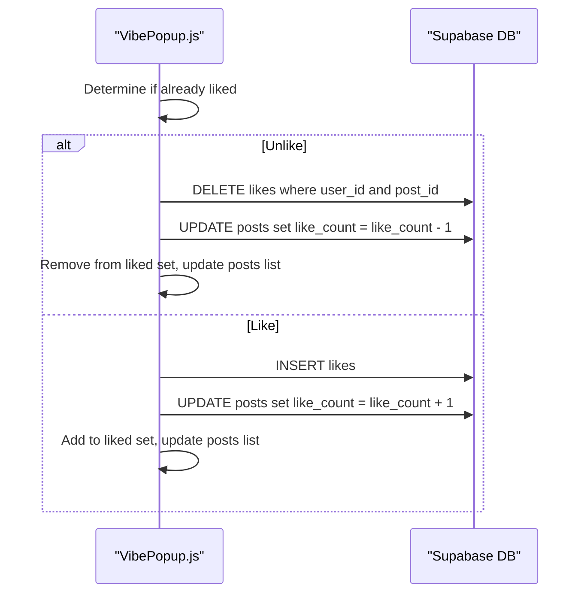
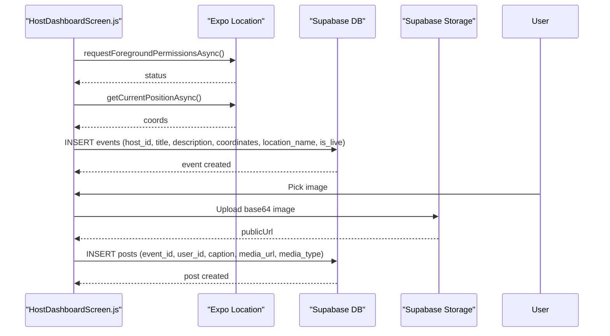
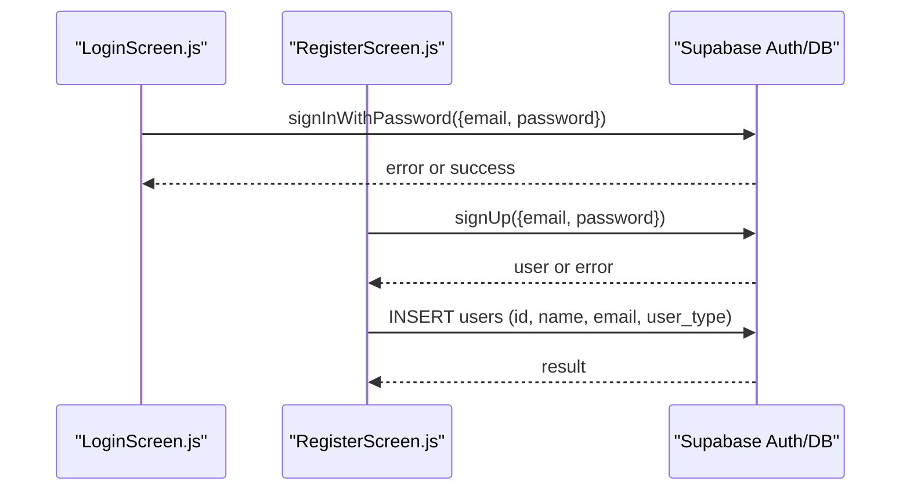
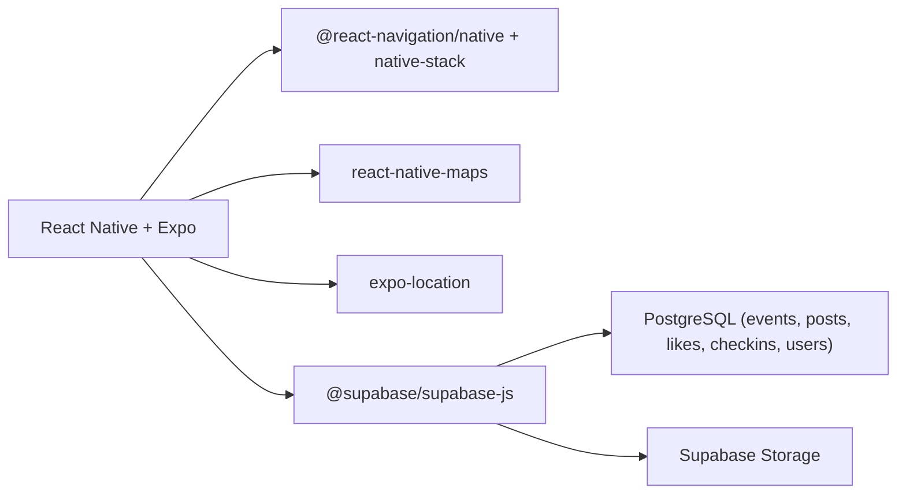

# System Design & Architecture Patterns

<cite>
**Referenced Files in This Document**
- [App.js](file://App.js)
- [package.json](file://package.json)
- [src/navigation/AppNavigator.js](file://src/navigation/AppNavigator.js)
- [src/hooks/useAuth.js](file://src/hooks/useAuth.js)
- [src/screens/MapScreen.js](file://src/screens/MapScreen.js)
- [src/screens/LoginScreen.js](file://src/screens/LoginScreen.js)
- [src/screens/RegisterScreen.js](file://src/screens/RegisterScreen.js)
- [src/screens/HostDashboardScreen.js](file://src/screens/HostDashboardScreen.js)
- [src/components/VibePopup.js](file://src/components/VibePopup.js)
- [supabase/sql/sql/phase6_checkins.sql](file://supabase/sql/sql/phase6_checkins.sql)
</cite>

## Table of Contents
1. [Introduction](#introduction)
2. [Project Structure](#project-structure)
3. [Core Components](#core-components)
4. [Architecture Overview](#architecture-overview)
5. [Detailed Component Analysis](#detailed-component-analysis)
6. [Dependency Analysis](#dependency-analysis)
7. [Performance Considerations](#performance-considerations)
8. [Troubleshooting Guide](#troubleshooting-guide)
9. [Conclusion](#conclusion)

## Introduction
This document describes the system design and architecture patterns for the Outside mobile application built with React Native and Expo. It explains how screens, components, hooks, and navigation are organized to separate concerns, and how the app integrates with external services such as Supabase (authentication, database, storage), location services, and map rendering. It also outlines architectural trade-offs, scalability considerations, performance strategies, and mobile-specific constraints.

## Project Structure
The app follows a feature-oriented structure:
- Entry point renders a navigation container that decides which screens to show based on authentication state.
- Screens encapsulate user flows and orchestrate data fetching and side effects.
- A reusable component provides an event detail overlay with check-in and social interactions.
- A custom hook centralizes authentication state management.
- External integrations include Supabase for auth, database, and storage; Expo Location for geolocation; and react-native-maps for map rendering.

**Diagram sources**
- [App.js:1-5](file://App.js#L1-L5)
- [src/navigation/AppNavigator.js:1-40](file://src/navigation/AppNavigator.js#L1-L40)
- [src/screens/MapScreen.js:1-100](file://src/screens/MapScreen.js#L1-L100)
- [src/screens/LoginScreen.js:1-97](file://src/screens/LoginScreen.js#L1-L97)
- [src/screens/RegisterScreen.js:1-126](file://src/screens/RegisterScreen.js#L1-L126)
- [src/screens/HostDashboardScreen.js:1-305](file://src/screens/HostDashboardScreen.js#L1-L305)
- [src/components/VibePopup.js:1-333](file://src/components/VibePopup.js#L1-L333)

**Section sources**
- [App.js:1-5](file://App.js#L1-L5)
- [package.json:1-32](file://package.json#L1-L32)

## Core Components
- Navigation layer: Centralized routing and conditional screen rendering based on authentication state.
- Authentication hook: Manages session retrieval and live updates via Supabase auth events.
- Screens:
  - MapScreen: Requests location permissions, fetches live events from Supabase, renders markers, and opens the VibePopup.
  - LoginScreen and RegisterScreen: Handle credential-based sign-in and registration with profile creation.
  - HostDashboardScreen: Creates live events with location, posts media to Supabase Storage, and ends events.
- Reusable component:
  - VibePopup: Displays event details, allows users to check in near the venue, like/unlike posts, and view post feeds.

Key responsibilities and separation of concerns:
- UI logic is isolated in screens and components.
- Data access is performed directly via Supabase client within screens/components.
- Navigation decisions are centralized in the navigator.
- Authentication state is abstracted into a hook consumed by the navigator.

**Section sources**
- [src/navigation/AppNavigator.js:1-40](file://src/navigation/AppNavigator.js#L1-L40)
- [src/hooks/useAuth.js:1-22](file://src/hooks/useAuth.js#L1-L22)
- [src/screens/MapScreen.js:1-100](file://src/screens/MapScreen.js#L1-L100)
- [src/screens/LoginScreen.js:1-97](file://src/screens/LoginScreen.js#L1-L97)
- [src/screens/RegisterScreen.js:1-126](file://src/screens/RegisterScreen.js#L1-L126)
- [src/screens/HostDashboardScreen.js:1-305](file://src/screens/HostDashboardScreen.js#L1-L305)
- [src/components/VibePopup.js:1-333](file://src/components/VibePopup.js#L1-L333)

## Architecture Overview
The app uses a layered architecture:
- Presentation Layer: React Native screens and components render UI and handle user interactions.
- Navigation Layer: React Navigation manages screen transitions and guards routes based on auth state.
- State Layer: Local component state holds transient UI state; the useAuth hook maintains global auth state.
- Integration Layer: Direct calls to Supabase (auth, database, storage) and Expo Location for geospatial features.
- Data Layer: PostgreSQL-backed tables managed by Supabase, including policies and triggers for security and consistency.

**Diagram sources**
- [src/navigation/AppNavigator.js:1-40](file://src/navigation/AppNavigator.js#L1-L40)
- [src/hooks/useAuth.js:1-22](file://src/hooks/useAuth.js#L1-L22)
- [src/screens/MapScreen.js:1-100](file://src/screens/MapScreen.js#L1-L100)
- [src/screens/LoginScreen.js:1-97](file://src/screens/LoginScreen.js#L1-L97)
- [src/screens/RegisterScreen.js:1-126](file://src/screens/RegisterScreen.js#L1-L126)
- [src/screens/HostDashboardScreen.js:1-305](file://src/screens/HostDashboardScreen.js#L1-L305)
- [src/components/VibePopup.js:1-333](file://src/components/VibePopup.js#L1-L333)

## Detailed Component Analysis

### Navigation and Authentication Flow
The navigator conditionally renders authenticated or unauthenticated screens using the useAuth hook. While loading, it shows a spinner. After load, it either navigates to Map and HostDashboard when authenticated, or Login and Register when not.

**Diagram sources**
- [src/navigation/AppNavigator.js:1-40](file://src/navigation/AppNavigator.js#L1-L40)
- [src/hooks/useAuth.js:1-22](file://src/hooks/useAuth.js#L1-L22)

**Section sources**
- [src/navigation/AppNavigator.js:1-40](file://src/navigation/AppNavigator.js#L1-L40)
- [src/hooks/useAuth.js:1-22](file://src/hooks/useAuth.js#L1-L22)

### Map Screen and Event Interaction
MapScreen requests location permissions, fetches live events from Supabase, and renders markers. Tapping a marker opens VibePopup for that event.

**Diagram sources**
- [src/screens/MapScreen.js:1-100](file://src/screens/MapScreen.js#L1-L100)
- [src/components/VibePopup.js:1-333](file://src/components/VibePopup.js#L1-L333)

**Section sources**
- [src/screens/MapScreen.js:1-100](file://src/screens/MapScreen.js#L1-L100)

### Check-in Flow with Proximity Gate
VibePopup handles check-ins with proximity validation enforced server-side via Supabase policies and triggers.

**Diagram sources**
- [src/components/VibePopup.js:82-118](file://src/components/VibePopup.js#L82-L118)
- [supabase/sql/sql/phase6_checkins.sql:20-63](file://supabase/sql/sql/phase6_checkins.sql#L20-L63)

**Section sources**
- [src/components/VibePopup.js:82-118](file://src/components/VibePopup.js#L82-L118)
- [supabase/sql/sql/phase6_checkins.sql:1-63](file://supabase/sql/sql/phase6_checkins.sql#L1-L63)

### Like/Unlike Post Flow
VibePopup toggles likes by updating local state and calling Supabase to insert/delete likes and adjust post like counts.

**Diagram sources**
- [src/components/VibePopup.js:120-155](file://src/components/VibePopup.js#L120-L155)

**Section sources**
- [src/components/VibePopup.js:120-155](file://src/components/VibePopup.js#L120-L155)

### Host Dashboard: Go Live and Post Media
HostDashboardScreen creates live events with location and posts images to Supabase Storage, then persists post metadata to the database.

**Diagram sources**
- [src/screens/HostDashboardScreen.js:51-124](file://src/screens/HostDashboardScreen.js#L51-L124)

**Section sources**
- [src/screens/HostDashboardScreen.js:51-124](file://src/screens/HostDashboardScreen.js#L51-L124)

### Authentication Screens
LoginScreen performs password-based sign-in; RegisterScreen signs up and creates a user profile.

**Diagram sources**
- [src/screens/LoginScreen.js:10-15](file://src/screens/LoginScreen.js#L10-L15)
- [src/screens/RegisterScreen.js:11-36](file://src/screens/RegisterScreen.js#L11-L36)

**Section sources**
- [src/screens/LoginScreen.js:10-15](file://src/screens/LoginScreen.js#L10-L15)
- [src/screens/RegisterScreen.js:11-36](file://src/screens/RegisterScreen.js#L11-L36)

## Dependency Analysis
Technology stack and integration points:
- React Native + Expo: Provides cross-platform runtime and native module bridges.
- React Navigation: Handles stack-based navigation and route guards.
- Supabase:
  - Auth: Session management and real-time auth state changes.
  - Database: Tables for events, posts, likes, checkins, users; policies enforce security; triggers maintain aggregates.
  - Storage: Image uploads and public URL retrieval.
- Expo Location: Foreground location permission and current position retrieval.
- react-native-maps: Renders map and markers for events.

**Diagram sources**
- [package.json:5-23](file://package.json#L5-L23)
- [src/navigation/AppNavigator.js:1-40](file://src/navigation/AppNavigator.js#L1-L40)
- [src/screens/MapScreen.js:1-100](file://src/screens/MapScreen.js#L1-L100)
- [src/components/VibePopup.js:1-333](file://src/components/VibePopup.js#L1-L333)
- [src/screens/HostDashboardScreen.js:1-305](file://src/screens/HostDashboardScreen.js#L1-L305)

**Section sources**
- [package.json:5-23](file://package.json#L5-L23)

## Performance Considerations
- Minimize re-renders: Keep heavy computations out of render paths; memoize derived values where appropriate.
- Efficient lists: Use FlatList with stable keys and avoid unnecessary item re-creation.
- Network efficiency:
  - Fetch only necessary fields from Supabase queries.
  - Avoid polling; rely on server-side triggers and policies to keep data consistent.
  - Batch operations where possible (e.g., update like counts atomically).
- Image handling:
  - Compress images before upload to reduce bandwidth.
  - Cache images locally when feasible to reduce repeated downloads.
- Location usage:
  - Request permissions once and cache results to avoid redundant prompts.
  - Limit frequency of location reads to conserve battery.
- Map rendering:
  - Render markers efficiently; consider clustering if many events appear.
  - Defer non-critical UI until map is ready.

[No sources needed since this section provides general guidance]

## Troubleshooting Guide
Common issues and resolutions:
- Location permission denied: Ensure foreground permission is requested before reading location; inform users to enable location in settings.
- Check-in fails due to proximity: Server policy enforces being within range of a live event; verify event is live and coordinates are accurate.
- Duplicate check-in prevented: Unique constraint prevents multiple check-ins per user per event; treat duplicate errors as success.
- Auth state mismatch: The navigator relies on useAuth; ensure session retrieval completes before rendering protected routes.
- Storage upload failures: Validate image format and size; handle errors gracefully and retry if transient.

**Section sources**
- [src/components/VibePopup.js:82-118](file://src/components/VibePopup.js#L82-L118)
- [supabase/sql/sql/phase6_checkins.sql:8-18](file://supabase/sql/sql/phase6_checkins.sql#L8-L18)
- [src/screens/HostDashboardScreen.js:88-124](file://src/screens/HostDashboardScreen.js#L88-L124)

## Conclusion
The Outside app adopts a clear separation of concerns across navigation, screens, components, and hooks, integrating tightly with Supabase for authentication, data, and storage, and leveraging Expo Location and react-native-maps for geospatial features. Security and consistency are enforced server-side through policies and triggers, reducing client-side complexity. Scalability can be improved by optimizing network requests, caching media, and refining map rendering. The architecture balances simplicity with robustness, suitable for iterative growth and enhanced feature sets.