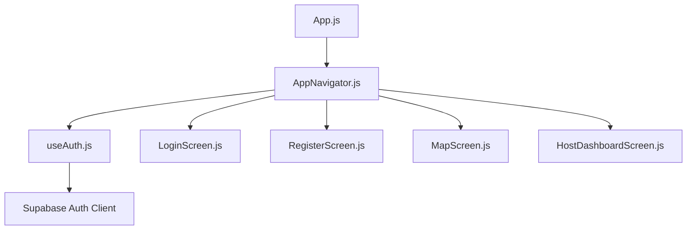
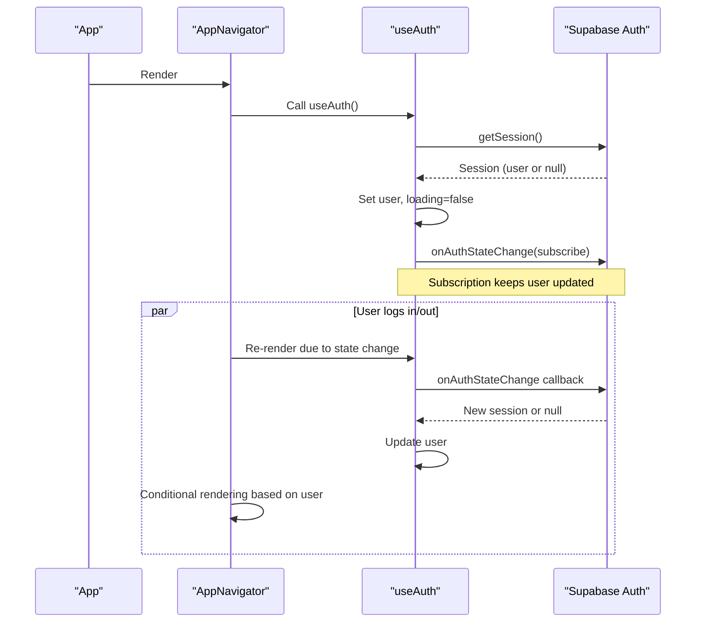
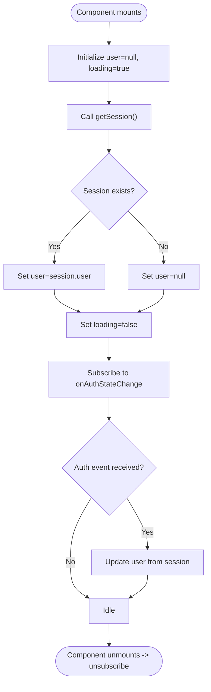
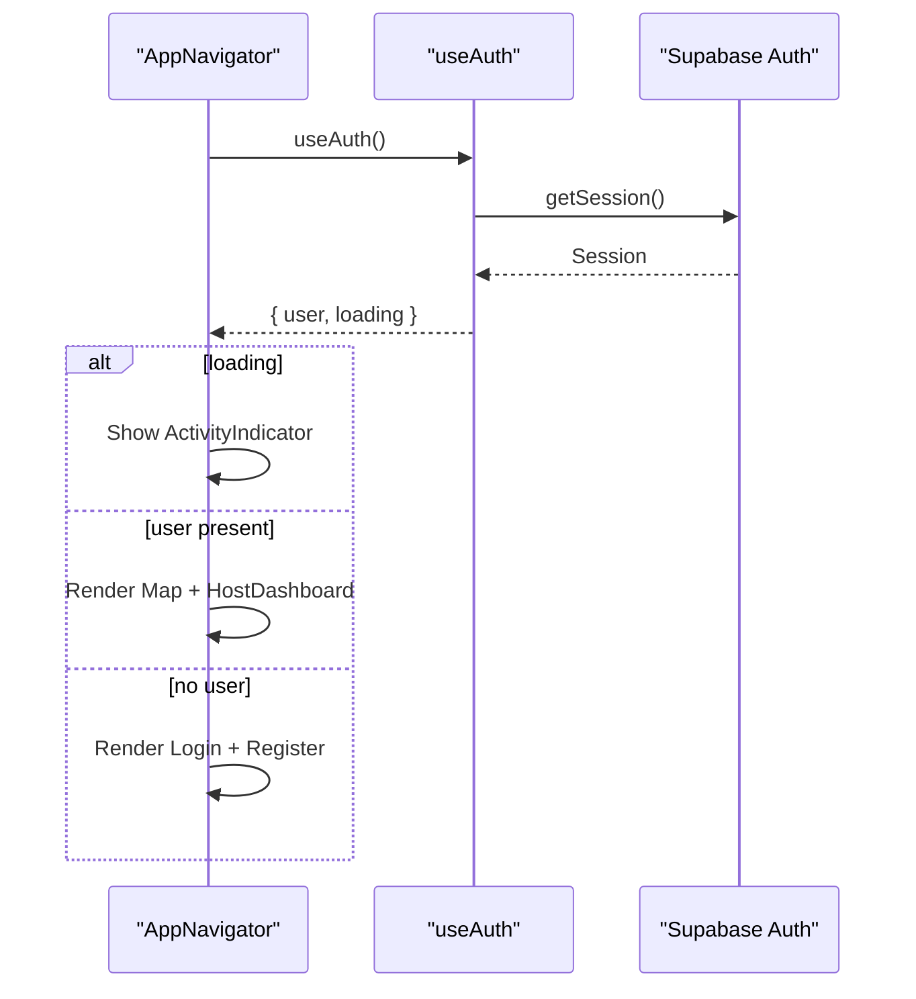
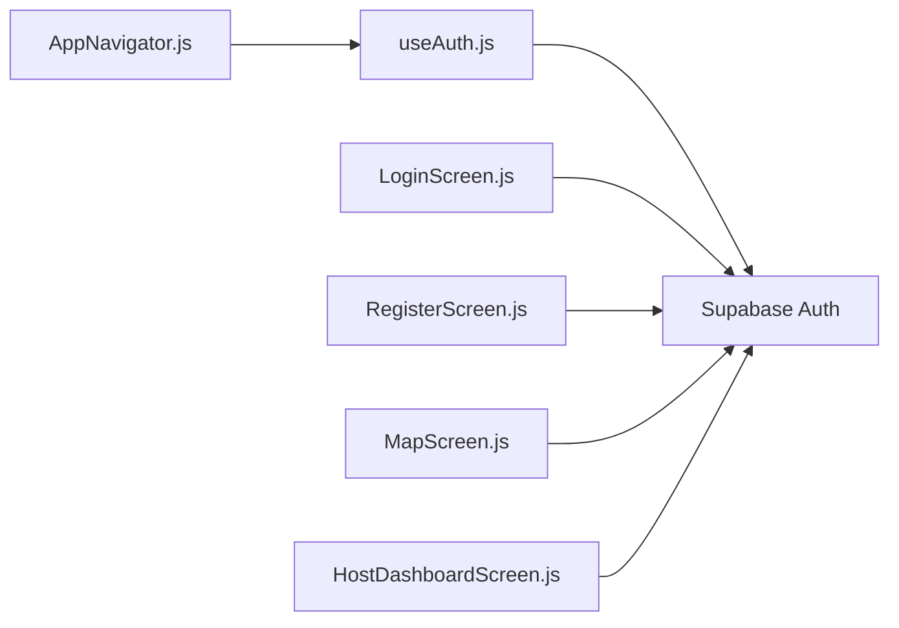

# Authentication Hook

<cite>
**Referenced Files in This Document**
- [useAuth.js](file://src/hooks/useAuth.js)
- [AppNavigator.js](file://src/navigation/AppNavigator.js)
- [LoginScreen.js](file://src/screens/LoginScreen.js)
- [RegisterScreen.js](file://src/screens/RegisterScreen.js)
- [MapScreen.js](file://src/screens/MapScreen.js)
- [HostDashboardScreen.js](file://src/screens/HostDashboardScreen.js)
- [App.js](file://App.js)
</cite>

## Table of Contents
1. [Introduction](#introduction)
2. [Project Structure](#project-structure)
3. [Core Components](#core-components)
4. [Architecture Overview](#architecture-overview)
5. [Detailed Component Analysis](#detailed-component-analysis)
6. [Dependency Analysis](#dependency-analysis)
7. [Performance Considerations](#performance-considerations)
8. [Troubleshooting Guide](#troubleshooting-guide)
9. [Conclusion](#conclusion)

## Introduction
This document explains the custom useAuth hook that centralizes authentication state for the application. It covers how user state and loading status are managed, how Supabase auth sessions are restored on startup, and how real-time authentication changes are handled via Supabase’s onAuthStateChange listener. It also documents how screens and navigation consume the hook to conditionally render content and guard routes.

## Project Structure
The authentication flow is implemented as a small, focused React hook and consumed at the top-level navigation layer:
- The useAuth hook encapsulates session restoration and subscription to auth state changes.
- AppNavigator uses the hook to decide which screens to show based on the current user and loading state.
- Login and Register screens trigger sign-in/sign-up flows directly with Supabase; after success, the global auth state updates automatically through the subscription.
- Protected screens (Map and Host Dashboard) are only available when a user is authenticated.

**Diagram sources**
- [App.js:1-5](file://App.js#L1-L5)
- [AppNavigator.js:1-40](file://src/navigation/AppNavigator.js#L1-L40)
- [useAuth.js:1-22](file://src/hooks/useAuth.js#L1-L22)

**Section sources**
- [App.js:1-5](file://App.js#L1-L5)
- [AppNavigator.js:1-40](file://src/navigation/AppNavigator.js#L1-L40)
- [useAuth.js:1-22](file://src/hooks/useAuth.js#L1-L22)

## Core Components
- useAuth hook:
  - Manages local user and loading state.
  - Restores the current session on mount using getSession.
  - Subscribes to onAuthStateChange to keep user state in sync with Supabase auth events.
  - Returns { user, loading } to consumers.
- AppNavigator:
  - Consumes useAuth to show a loading indicator while determining auth state.
  - Renders either protected screens (Map, HostDashboard) or public screens (Login, Register) based on user presence.

Key behaviors:
- Automatic session restoration: On first render, the hook calls getSession to populate the user if a valid session exists.
- Real-time updates: The onAuthStateChange listener updates the user whenever the session changes (e.g., login, logout, token refresh).
- Loading state: While the initial session check completes, the app shows an ActivityIndicator to avoid UI flicker.

**Section sources**
- [useAuth.js:1-22](file://src/hooks/useAuth.js#L1-L22)
- [AppNavigator.js:12-21](file://src/navigation/AppNavigator.js#L12-L21)
- [AppNavigator.js:23-39](file://src/navigation/AppNavigator.js#L23-L39)

## Architecture Overview
The authentication architecture centers around a single source of truth for auth state provided by useAuth. Navigation decides which screens to present based on this state. Screens perform auth actions via Supabase, and the resulting state changes propagate back into the UI through the hook’s subscription.

**Diagram sources**
- [useAuth.js:8-18](file://src/hooks/useAuth.js#L8-L18)
- [AppNavigator.js:12-21](file://src/navigation/AppNavigator.js#L12-L21)
- [AppNavigator.js:23-39](file://src/navigation/AppNavigator.js#L23-L39)

## Detailed Component Analysis

### useAuth Hook
Responsibilities:
- Initialize user and loading state.
- Restore session immediately on mount.
- Subscribe to auth state changes to keep user state synchronized.
- Clean up subscription on unmount.

Data model returned:
- user: Current authenticated user object or null.
- loading: Boolean indicating whether the initial session check has completed.

Implementation highlights:
- Session restoration: Uses getSession to set the user and mark loading as false once resolved.
- Real-time updates: onAuthStateChange updates user whenever the session changes without requiring re-authentication.
- Cleanup: Unsubscribes from the listener to prevent memory leaks.

**Diagram sources**
- [useAuth.js:4-21](file://src/hooks/useAuth.js#L4-L21)

**Section sources**
- [useAuth.js:1-22](file://src/hooks/useAuth.js#L1-L22)

### AppNavigator Integration
Behavior:
- Calls useAuth to obtain user and loading.
- Shows a full-screen ActivityIndicator while loading.
- Conditionally renders:
  - Protected stack: Map and HostDashboard when user is present.
  - Public stack: Login and Register when no user is present.

This provides a simple, centralized navigation guard.

**Diagram sources**
- [AppNavigator.js:12-39](file://src/navigation/AppNavigator.js#L12-L39)
- [useAuth.js:8-18](file://src/hooks/useAuth.js#L8-L18)

**Section sources**
- [AppNavigator.js:12-39](file://src/navigation/AppNavigator.js#L12-L39)

### Login and Register Screens
These screens initiate authentication flows directly with Supabase:
- LoginScreen:
  - Collects email and password.
  - Calls signInWithPassword.
  - Displays errors via Alert.
  - After successful sign-in, Supabase emits an auth state change, which the useAuth subscription processes, updating the global user state and causing navigation to switch to protected screens.
- RegisterScreen:
  - Validates inputs.
  - Calls signUp and creates a profile row.
  - On success, Supabase triggers an auth state change; the hook updates user state and navigation proceeds accordingly.

Note: These screens do not call useAuth themselves; they rely on the global auth subscription established by the hook to reflect state changes across the app.

**Section sources**
- [LoginScreen.js:10-15](file://src/screens/LoginScreen.js#L10-L15)
- [RegisterScreen.js:11-36](file://src/screens/RegisterScreen.js#L11-L36)

### Protected Screens (Map and HostDashboard)
- MapScreen:
  - Accessible only when a user is authenticated (guarded by AppNavigator).
  - Uses Supabase to fetch live events and displays them on a map.
- HostDashboardScreen:
  - Accessible only when a user is authenticated.
  - Retrieves the current session to get the host ID and manages live events and posts.

These screens benefit from the navigation guard and can assume a valid user context during their lifecycle.

**Section sources**
- [MapScreen.js:23-33](file://src/screens/MapScreen.js#L23-L33)
- [HostDashboardScreen.js:27-36](file://src/screens/HostDashboardScreen.js#L27-L36)

## Dependency Analysis
- useAuth depends on:
  - React hooks: useState, useEffect.
  - Supabase client: getSession and onAuthStateChange.
- AppNavigator depends on:
  - useAuth for auth state.
  - React Navigation components to render stacks conditionally.
- Screens depend on:
  - Supabase client for auth and data operations.
  - Navigation API for routing between screens.

**Diagram sources**
- [useAuth.js:1-22](file://src/hooks/useAuth.js#L1-L22)
- [AppNavigator.js:1-40](file://src/navigation/AppNavigator.js#L1-L40)
- [LoginScreen.js:1-97](file://src/screens/LoginScreen.js#L1-L97)
- [RegisterScreen.js:1-126](file://src/screens/RegisterScreen.js#L1-L126)
- [MapScreen.js:1-100](file://src/screens/MapScreen.js#L1-L100)
- [HostDashboardScreen.js:1-305](file://src/screens/HostDashboardScreen.js#L1-L305)

**Section sources**
- [useAuth.js:1-22](file://src/hooks/useAuth.js#L1-L22)
- [AppNavigator.js:1-40](file://src/navigation/AppNavigator.js#L1-L40)

## Performance Considerations
- Minimal re-renders: The hook updates only user and loading, avoiding unnecessary component churn.
- Single subscription: One onAuthStateChange subscription per hook instance prevents redundant listeners.
- Initial loading gate: Showing an ActivityIndicator during getSession avoids layout shifts and improves perceived performance.
- Cleanup: Unsubscribing on unmount prevents memory leaks.

[No sources needed since this section provides general guidance]

## Troubleshooting Guide
Common issues and resolutions:
- Stuck on loading screen:
  - Ensure getSession resolves correctly and that Supabase is initialized properly.
  - Verify network connectivity and that the session is persisted by Supabase.
- Auth state not updating:
  - Confirm that onAuthStateChange is subscribed and not unsubscribed prematurely.
  - Check that login/signup flows complete successfully and emit auth events.
- Navigation not switching after login:
  - Verify that AppNavigator reads the latest user state from useAuth and conditionally renders protected screens.
- Errors during sign-in/sign-up:
  - Inspect alerts and console logs in LoginScreen and RegisterScreen for error messages.

**Section sources**
- [AppNavigator.js:12-21](file://src/navigation/AppNavigator.js#L12-L21)
- [LoginScreen.js:10-15](file://src/screens/LoginScreen.js#L10-L15)
- [RegisterScreen.js:11-36](file://src/screens/RegisterScreen.js#L11-L36)

## Conclusion
The useAuth hook provides a clean, centralized way to manage authentication state by combining session restoration and real-time updates via Supabase. AppNavigator leverages this hook to implement simple yet effective navigation guards, ensuring users see appropriate screens based on their authentication status. Screens interact with Supabase directly for auth actions, while the hook ensures the rest of the UI stays consistent and up-to-date.

[No sources needed since this section summarizes without analyzing specific files]