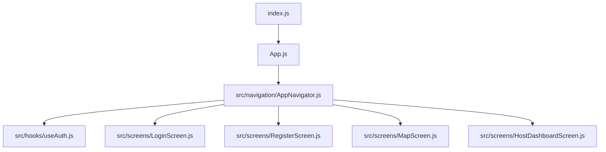
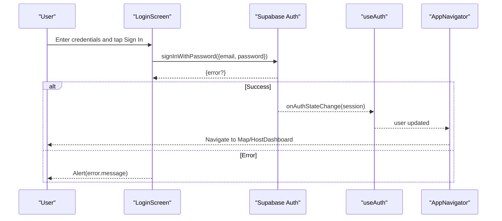
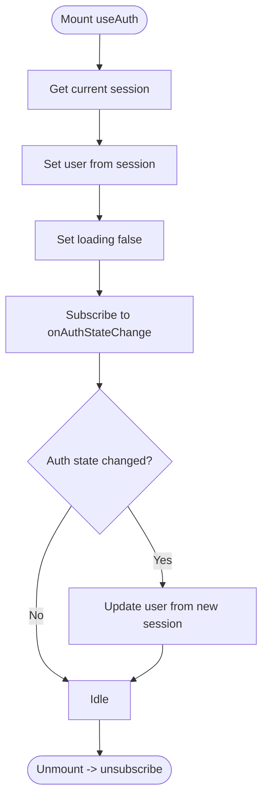
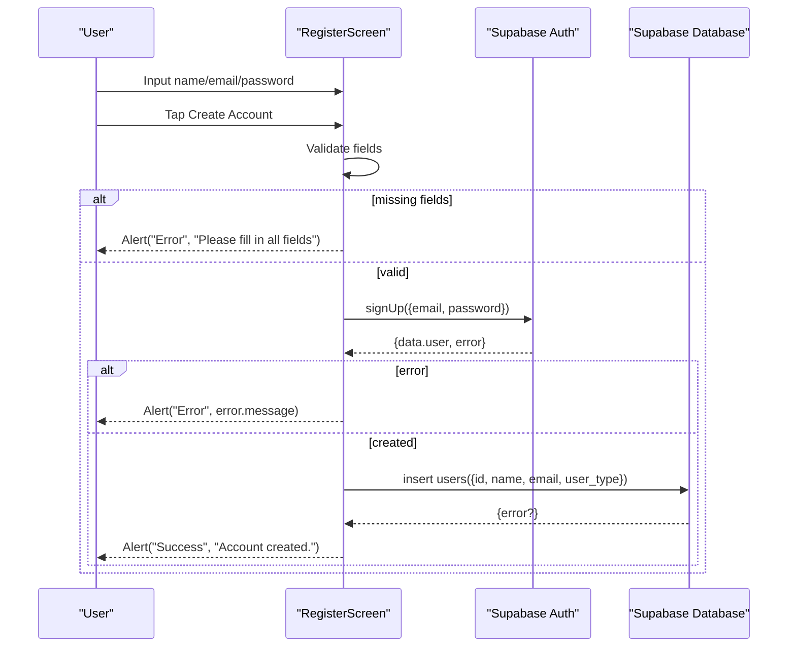
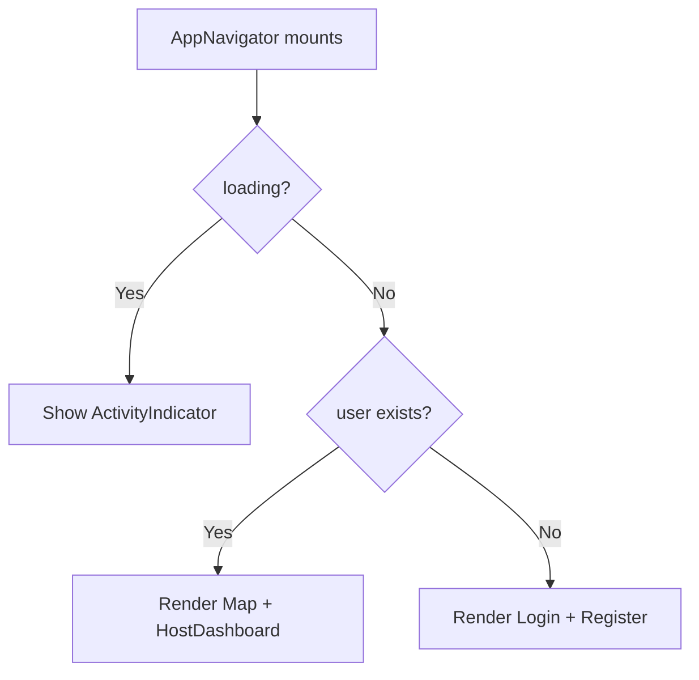
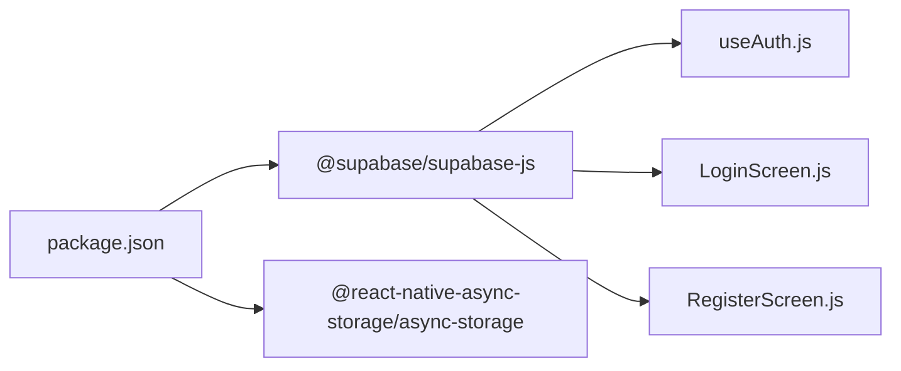

# Authentication System

<cite>
**Referenced Files in This Document**
- [App.js](file://App.js)
- [index.js](file://index.js)
- [package.json](file://package.json)
- [src/hooks/useAuth.js](file://src/hooks/useAuth.js)
- [src/navigation/AppNavigator.js](file://src/navigation/AppNavigator.js)
- [src/screens/LoginScreen.js](file://src/screens/LoginScreen.js)
- [src/screens/RegisterScreen.js](file://src/screens/RegisterScreen.js)
</cite>

## Table of Contents
1. Introduction
2. Project Structure
3. Core Components
4. Architecture Overview
5. Detailed Component Analysis
6. Dependency Analysis
7. Performance Considerations
8. Troubleshooting Guide
9. Conclusion

## Introduction
This document explains the authentication system implemented in the React Native application. It covers user registration and login flows using the Supabase Auth API, a custom useAuth hook for managing authentication state and session changes, screen components for login and registration with form validation and error handling, navigation guards that protect routes based on authentication state, and security considerations including password policies and account management. It also clarifies how sessions are persisted by Supabase’s client and how the app integrates with AsyncStorage via dependencies.

## Project Structure
The authentication logic is distributed across hooks, screens, and navigation:
- The root entry points initialize the Expo app and render the navigator.
- The navigator conditionally renders authenticated or unauthenticated screens based on the current user.
- The useAuth hook subscribes to Supabase auth state changes and exposes the current user and loading status.
- Login and Register screens call Supabase Auth methods and handle errors and feedback.



**Diagram sources**
- [index.js:1-9](file://index.js#L1-L9)
- [App.js:1-5](file://App.js#L1-L5)
- [src/navigation/AppNavigator.js:1-40](file://src/navigation/AppNavigator.js#L1-L40)
- [src/hooks/useAuth.js:1-22](file://src/hooks/useAuth.js#L1-L22)
- [src/screens/LoginScreen.js:1-97](file://src/screens/LoginScreen.js#L1-L97)
- [src/screens/RegisterScreen.js:1-126](file://src/screens/RegisterScreen.js#L1-L126)

**Section sources**
- [index.js:1-9](file://index.js#L1-L9)
- [App.js:1-5](file://App.js#L1-L5)
- [src/navigation/AppNavigator.js:1-40](file://src/navigation/AppNavigator.js#L1-L40)

## Core Components
- useAuth hook: Initializes session retrieval and listens for auth state changes to keep UI in sync with the current user.
- AppNavigator: Uses useAuth to guard routes; shows authenticated screens when a user exists, otherwise shows login/register.
- LoginScreen: Collects email/password and calls Supabase sign-in with password flow.
- RegisterScreen: Validates inputs, creates an account via Supabase sign-up, and inserts a profile record into the users table.

Key responsibilities:
- Session persistence: Handled by Supabase client (which persists sessions on supported platforms).
- State synchronization: onAuthStateChange updates the user in real time.
- Navigation gating: Conditional rendering based on user presence.

**Section sources**
- [src/hooks/useAuth.js:1-22](file://src/hooks/useAuth.js#L1-L22)
- [src/navigation/AppNavigator.js:12-39](file://src/navigation/AppNavigator.js#L12-L39)
- [src/screens/LoginScreen.js:10-15](file://src/screens/LoginScreen.js#L10-L15)
- [src/screens/RegisterScreen.js:11-36](file://src/screens/RegisterScreen.js#L11-L36)

## Architecture Overview
The authentication architecture centers around Supabase Auth and React Navigation:
- The app starts at index.js and renders App.js, which mounts AppNavigator.
- AppNavigator consumes useAuth to determine whether to show protected or public screens.
- Screens interact directly with Supabase Auth to sign in or sign up.
- Sessions are managed by Supabase and reflected in the UI through the hook’s subscription.



**Diagram sources**
- [src/screens/LoginScreen.js:10-15](file://src/screens/LoginScreen.js#L10-L15)
- [src/hooks/useAuth.js:8-18](file://src/hooks/useAuth.js#L8-L18)
- [src/navigation/AppNavigator.js:12-39](file://src/navigation/AppNavigator.js#L12-L39)

## Detailed Component Analysis

### Custom useAuth Hook
Responsibilities:
- Retrieve the current session once on mount to set initial user and loading state.
- Subscribe to auth state changes to update the user reactively.
- Clean up subscriptions on unmount.

Behavioral notes:
- Exposes user and loading flags consumed by the navigator to gate routes.
- Relies on Supabase client configuration located outside this file to establish connection and persistence.



**Diagram sources**
- [src/hooks/useAuth.js:8-18](file://src/hooks/useAuth.js#L8-L18)

**Section sources**
- [src/hooks/useAuth.js:1-22](file://src/hooks/useAuth.js#L1-L22)

### Login Screen
Flow:
- Collects email and password.
- Calls Supabase sign-in with password.
- Displays alerts on error.
- Disables button during request to prevent duplicate submissions.

Validation and UX:
- Basic required field checks are not enforced locally; rely on Supabase server-side validation.
- Provides immediate feedback via alert on failure.

```mermaid
sequenceDiagram
participant U as "User"
participant L as "LoginScreen"
participant S as "Supabase Auth"
U->>L : Input email/password
U->>L : Tap Sign In
L->>S : signInWithPassword({email, password})
S-->>L : {error}
alt error
L-->>U : Alert("Error", error.message)
else success
Note over L,S : Session established; useAuth updates user
end
```

**Diagram sources**
- [src/screens/LoginScreen.js:10-15](file://src/screens/LoginScreen.js#L10-L15)

**Section sources**
- [src/screens/LoginScreen.js:1-97](file://src/screens/LoginScreen.js#L1-L97)

### Register Screen
Flow:
- Validates that name, email, and password are provided.
- Creates an account via Supabase sign-up.
- On successful creation, inserts a profile row into the users table with id, name, email, and user_type.
- Shows success alert after completion.

Validation and UX:
- Enforces non-empty fields before calling the API.
- Handles and logs profile insertion errors without blocking the success flow.



**Diagram sources**
- [src/screens/RegisterScreen.js:11-36](file://src/screens/RegisterScreen.js#L11-L36)

**Section sources**
- [src/screens/RegisterScreen.js:1-126](file://src/screens/RegisterScreen.js#L1-L126)

### Navigation Guards
Behavior:
- AppNavigator uses useAuth to check if a user exists.
- If a user is present, it renders protected screens (Map and HostDashboard).
- Otherwise, it renders public screens (Login and Register).
- While loading, it displays an activity indicator.



**Diagram sources**
- [src/navigation/AppNavigator.js:12-39](file://src/navigation/AppNavigator.js#L12-L39)

**Section sources**
- [src/navigation/AppNavigator.js:1-40](file://src/navigation/AppNavigator.js#L1-L40)

## Dependency Analysis
External dependencies relevant to authentication:
- @supabase/supabase-js: Provides Supabase client and Auth APIs used across hooks and screens.
- @react-native-async-storage/async-storage: Installed dependency indicating platform session storage support; Supabase client uses it under the hood to persist sessions on supported platforms.



**Diagram sources**
- [package.json:5-22](file://package.json#L5-L22)
- [src/hooks/useAuth.js:2-2](file://src/hooks/useAuth.js#L2-L2)
- [src/screens/LoginScreen.js:3-3](file://src/screens/LoginScreen.js#L3-L3)
- [src/screens/RegisterScreen.js:3-3](file://src/screens/RegisterScreen.js#L3-L3)

**Section sources**
- [package.json:5-22](file://package.json#L5-L22)

## Performance Considerations
- Minimize re-renders: The useAuth hook centralizes auth state; avoid duplicating session checks in multiple places.
- Debounce rapid navigations: Ensure navigation guards do not trigger excessive remounts.
- Network resilience: Handle transient network errors gracefully in screens and consider retry logic where appropriate.
- Profile writes: Keep database inserts minimal and robust; log errors but avoid blocking user-facing success flows unnecessarily.

[No sources needed since this section provides general guidance]

## Troubleshooting Guide
Common issues and remedies:
- Sign-in failures:
  - Verify credentials and ensure the account exists.
  - Check Supabase project settings (e.g., enabled email/password provider).
  - Inspect error messages shown via alerts in the login flow.
- Registration failures:
  - Confirm required fields are filled before submission.
  - Review Supabase schema for the users table and ensure the insert matches expected columns.
  - Log and inspect profile insertion errors.
- Session not restoring:
  - Ensure Supabase client is configured correctly and platform supports session persistence.
  - Confirm that onAuthStateChange is subscribed and not unsubscribed prematurely.
- Navigation not updating:
  - Verify that useAuth returns the correct user and loading states.
  - Ensure AppNavigator reads these values to switch between public and protected screens.

**Section sources**
- [src/screens/LoginScreen.js:10-15](file://src/screens/LoginScreen.js#L10-L15)
- [src/screens/RegisterScreen.js:11-36](file://src/screens/RegisterScreen.js#L11-L36)
- [src/hooks/useAuth.js:8-18](file://src/hooks/useAuth.js#L8-L18)
- [src/navigation/AppNavigator.js:12-39](file://src/navigation/AppNavigator.js#L12-L39)

## Conclusion
The authentication system leverages Supabase Auth for secure sign-in/sign-up, a lightweight useAuth hook for reactive state management, and navigation guards to protect routes. Registration includes basic client-side validation and profile creation. Sessions are persisted by Supabase’s client on supported platforms, enabling automatic restoration across app restarts. For enhanced security, enforce strong password policies on the server side and consider adding additional validations and protections in future iterations.

[No sources needed since this section summarizes without analyzing specific files]