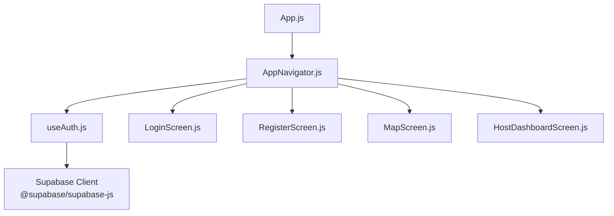
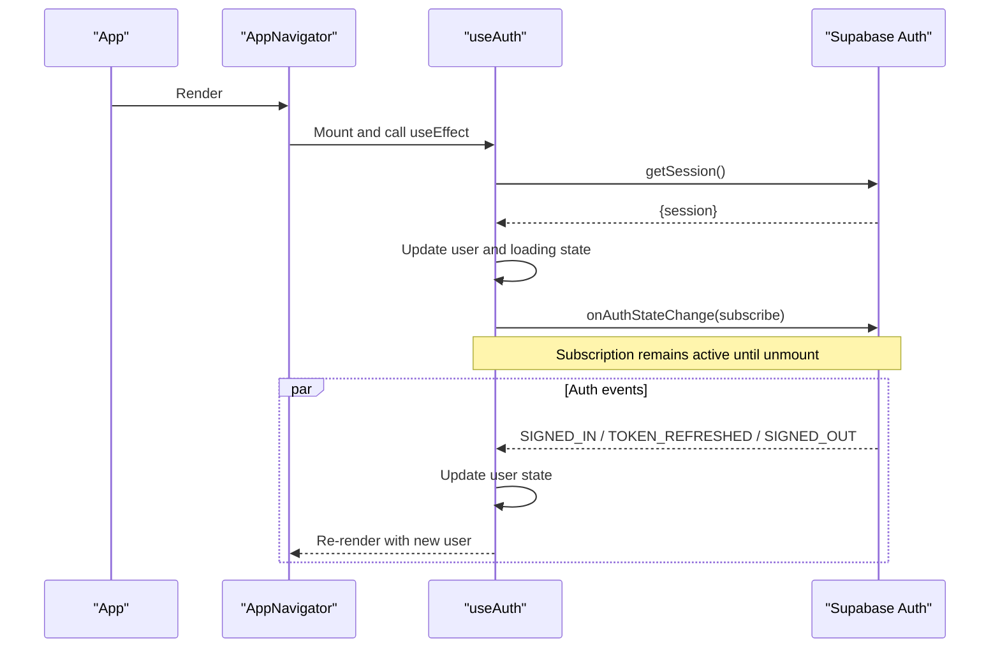
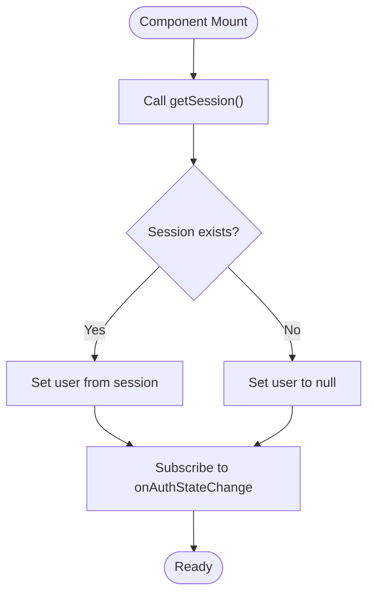
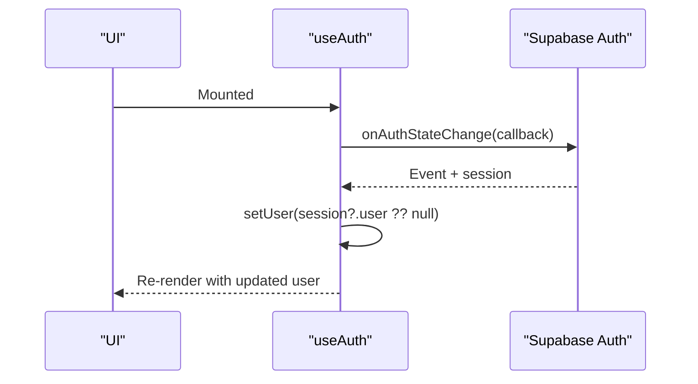
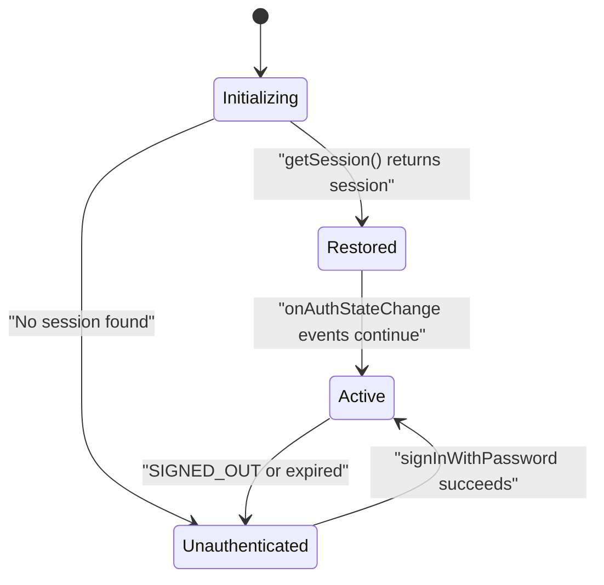
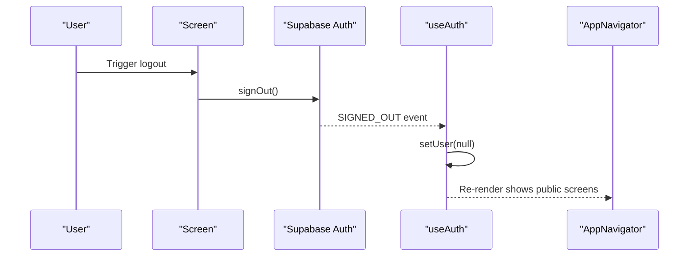
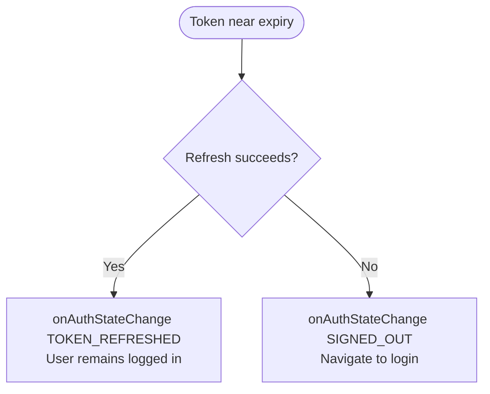
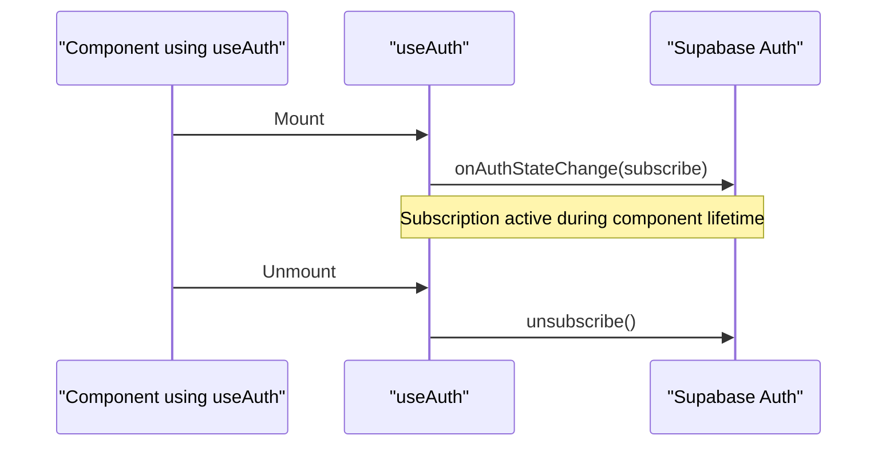
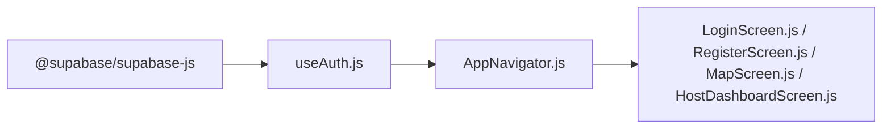

# Session Management

<cite>
**Referenced Files in This Document**
- [useAuth.js](file://src/hooks/useAuth.js)
- [AppNavigator.js](file://src/navigation/AppNavigator.js)
- [LoginScreen.js](file://src/screens/LoginScreen.js)
- [RegisterScreen.js](file://src/screens/RegisterScreen.js)
- [HostDashboardScreen.js](file://src/screens/HostDashboardScreen.js)
- [MapScreen.js](file://src/screens/MapScreen.js)
- [package.json](file://package.json)
</cite>

## Table of Contents
1. [Introduction](#introduction)
2. [Project Structure](#project-structure)
3. [Core Components](#core-components)
4. [Architecture Overview](#architecture-overview)
5. [Detailed Component Analysis](#detailed-component-analysis)
6. [Dependency Analysis](#dependency-analysis)
7. [Performance Considerations](#performance-considerations)
8. [Troubleshooting Guide](#troubleshooting-guide)
9. [Conclusion](#conclusion)

## Introduction
This document explains how sessions are managed in the application’s authentication system using Supabase Auth. It covers session initialization at app startup, handling of authentication state changes, persistence across app restarts, and lifecycle events such as automatic restoration, logout handling, and expiration management. It also outlines security considerations for session storage and token management, and provides examples of monitoring session state and cleaning up subscriptions when components unmount.

## Project Structure
The session management logic is centralized in a custom React hook that initializes the session and subscribes to authentication state changes. The navigation layer uses this hook to decide which screens to show based on whether a user is authenticated. Authentication actions (sign-in, sign-up) are implemented in dedicated screens and rely on the same Supabase client.

**Diagram sources**
- [AppNavigator.js:1-40](file://src/navigation/AppNavigator.js#L1-L40)
- [useAuth.js:1-22](file://src/hooks/useAuth.js#L1-L22)
- [LoginScreen.js:1-97](file://src/screens/LoginScreen.js#L1-L97)
- [RegisterScreen.js:1-126](file://src/screens/RegisterScreen.js#L1-L126)
- [MapScreen.js:1-100](file://src/screens/MapScreen.js#L1-L100)
- [HostDashboardScreen.js:1-305](file://src/screens/HostDashboardScreen.js#L1-L305)

**Section sources**
- [AppNavigator.js:1-40](file://src/navigation/AppNavigator.js#L1-L40)
- [useAuth.js:1-22](file://src/hooks/useAuth.js#L1-L22)

## Core Components
- useAuth hook: Initializes the current session via getSession() and sets up an onAuthStateChange subscription to keep UI state in sync with authentication events. It returns the current user and a loading flag, and unsubscribes from the event stream when the component unmounts.
- AppNavigator: Consumes useAuth to render either authenticated or unauthenticated routes based on the presence of a user.
- LoginScreen and RegisterScreen: Perform authentication actions using the Supabase client. Successful sign-in triggers auth state change events that update the UI automatically.
- HostDashboardScreen and MapScreen: Use the Supabase client for data operations; they do not manage auth state directly but benefit from global session restoration handled by the hook.

Key behaviors:
- On mount, the hook calls getSession() to restore any existing session from persistent storage managed by Supabase Auth.
- The hook subscribes to onAuthStateChange to react to login, logout, token refresh, and session expiration events.
- Navigation switches between login/register and protected screens based on the current user.

**Section sources**
- [useAuth.js:8-19](file://src/hooks/useAuth.js#L8-L19)
- [AppNavigator.js:12-39](file://src/navigation/AppNavigator.js#L12-L39)
- [LoginScreen.js:10-15](file://src/screens/LoginScreen.js#L10-L15)
- [RegisterScreen.js:11-35](file://src/screens/RegisterScreen.js#L11-L35)

## Architecture Overview
The session lifecycle integrates three layers:
- Initialization: When the app starts, the navigator mounts and consumes useAuth. The hook retrieves the persisted session and subscribes to auth state changes.
- State propagation: Changes in authentication state (login/logout/token refresh) update the user state in the hook, causing the navigator to re-render and switch routes accordingly.
- Persistence: Supabase Auth persists the session (access and refresh tokens) in secure storage provided by the environment (e.g., AsyncStorage on mobile). The hook relies on this persistence to restore sessions across app restarts.

**Diagram sources**
- [useAuth.js:8-19](file://src/hooks/useAuth.js#L8-L19)
- [AppNavigator.js:12-39](file://src/navigation/AppNavigator.js#L12-L39)

## Detailed Component Analysis

### Session Initialization and Restoration
- The hook calls getSession() on mount to retrieve any existing session stored by Supabase Auth. If present, it updates the user state and stops the loading indicator.
- It then subscribes to onAuthStateChange to handle future authentication events without requiring manual polling.

**Diagram sources**
- [useAuth.js:8-19](file://src/hooks/useAuth.js#L8-L19)

**Section sources**
- [useAuth.js:8-19](file://src/hooks/useAuth.js#L8-L19)

### Authentication State Change Handling
- The onAuthStateChange callback updates the user whenever the session changes due to sign-in, sign-out, token refresh, or expiration.
- Because the navigator depends on the user state returned by the hook, UI transitions (showing protected vs public screens) occur automatically.

**Diagram sources**
- [useAuth.js:14-16](file://src/hooks/useAuth.js#L14-L16)
- [AppNavigator.js:12-39](file://src/navigation/AppNavigator.js#L12-L39)

**Section sources**
- [useAuth.js:14-16](file://src/hooks/useAuth.js#L14-L16)
- [AppNavigator.js:12-39](file://src/navigation/AppNavigator.js#L12-L39)

### Automatic Session Restoration Across App Restarts
- Supabase Auth persists the session in the platform’s secure storage (e.g., AsyncStorage on mobile). On app restart, getSession() restores the session if valid, allowing users to remain logged in seamlessly.
- The hook ensures the UI reflects the restored session immediately after startup.

**Diagram sources**
- [useAuth.js:8-19](file://src/hooks/useAuth.js#L8-L19)
- [LoginScreen.js:10-15](file://src/screens/LoginScreen.js#L10-L15)

**Section sources**
- [useAuth.js:8-19](file://src/hooks/useAuth.js#L8-L19)
- [LoginScreen.js:10-15](file://src/screens/LoginScreen.js#L10-L15)

### Logout Handling
- While explicit logout is not implemented in the analyzed files, the onAuthStateChange subscription will receive SIGNED_OUT events when a session ends (e.g., server-side invalidation or token expiry), updating the user state to null and navigating back to public screens.
- To add explicit logout, call the Supabase sign-out method and let the subscription handle UI updates.

[No diagram sources needed since this sequence illustrates a recommended flow beyond current code]

### Session Expiration Management
- Token refresh and expiration are handled by Supabase Auth. When tokens expire, the SDK attempts to refresh them; if successful, onAuthStateChange emits a token refresh event keeping the user logged in. If refresh fails, a signed-out event occurs, and the UI transitions to unauthenticated state.
- The hook’s subscription ensures the UI stays consistent with these backend-managed lifecycle events.

[No diagram sources needed since this flow describes SDK behavior]

### Session State Monitoring and Cleanup
- Monitoring: The hook exposes user and loading states to consumers (e.g., AppNavigator) so the UI can react to authentication changes in real time.
- Cleanup: The hook returns a cleanup function that unsubscribes from onAuthStateChange when the component unmounts, preventing memory leaks and stale updates.

**Diagram sources**
- [useAuth.js:14-18](file://src/hooks/useAuth.js#L14-L18)

**Section sources**
- [useAuth.js:14-18](file://src/hooks/useAuth.js#L14-L18)

## Dependency Analysis
- The application depends on @supabase/supabase-js for authentication and data access.
- The hook centralizes session management, reducing duplication and ensuring consistent behavior across screens.
- Navigation depends on the hook’s user state to control route visibility.

**Diagram sources**
- [package.json:5-22](file://package.json#L5-L22)
- [useAuth.js:1-22](file://src/hooks/useAuth.js#L1-L22)
- [AppNavigator.js:1-40](file://src/navigation/AppNavigator.js#L1-L40)
- [LoginScreen.js:1-97](file://src/screens/LoginScreen.js#L1-L97)
- [RegisterScreen.js:1-126](file://src/screens/RegisterScreen.js#L1-L126)
- [MapScreen.js:1-100](file://src/screens/MapScreen.js#L1-L100)
- [HostDashboardScreen.js:1-305](file://src/screens/HostDashboardScreen.js#L1-L305)

**Section sources**
- [package.json:5-22](file://package.json#L5-L22)
- [useAuth.js:1-22](file://src/hooks/useAuth.js#L1-L22)
- [AppNavigator.js:1-40](file://src/navigation/AppNavigator.js#L1-L40)

## Performance Considerations
- Minimize redundant network calls: Rely on Supabase’s session persistence and onAuthStateChange to avoid frequent getSession() calls in multiple components.
- Avoid heavy work in onAuthStateChange callbacks: Keep handlers lightweight to prevent UI jank during frequent token refresh events.
- Debounce or throttle expensive operations triggered by auth changes if necessary (e.g., fetching large datasets after login).

[No sources needed since this section provides general guidance]

## Troubleshooting Guide
Common issues and resolutions:
- Stale UI after logout: Ensure the component using useAuth remains mounted so the onAuthStateChange subscription can update state. Verify that navigation reacts to user being null.
- Memory leaks: Confirm that components using useAuth are properly unmounted and that the hook’s cleanup unsubscribes from onAuthStateChange.
- Unexpected redirects: Check that getSession() resolves correctly and that loading state is cleared before rendering protected routes.

**Section sources**
- [useAuth.js:8-19](file://src/hooks/useAuth.js#L8-L19)
- [AppNavigator.js:12-39](file://src/navigation/AppNavigator.js#L12-L39)

## Conclusion
The application implements robust session management through a centralized hook that initializes sessions on startup, subscribes to authentication state changes, and cleans up subscriptions on unmount. Supabase Auth handles persistence and token lifecycle, enabling seamless session restoration and safe navigation between authenticated and public screens. Following the outlined practices ensures reliable UX, minimal overhead, and strong security posture for session storage and token management.