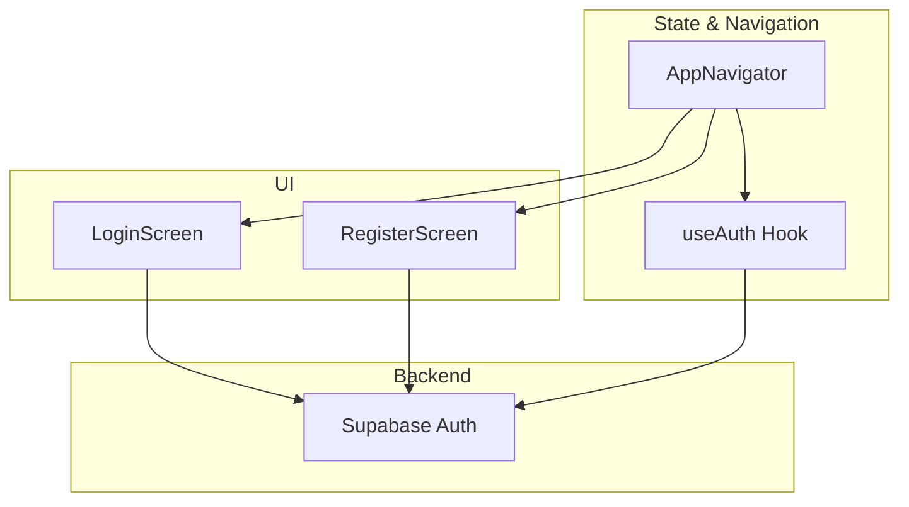
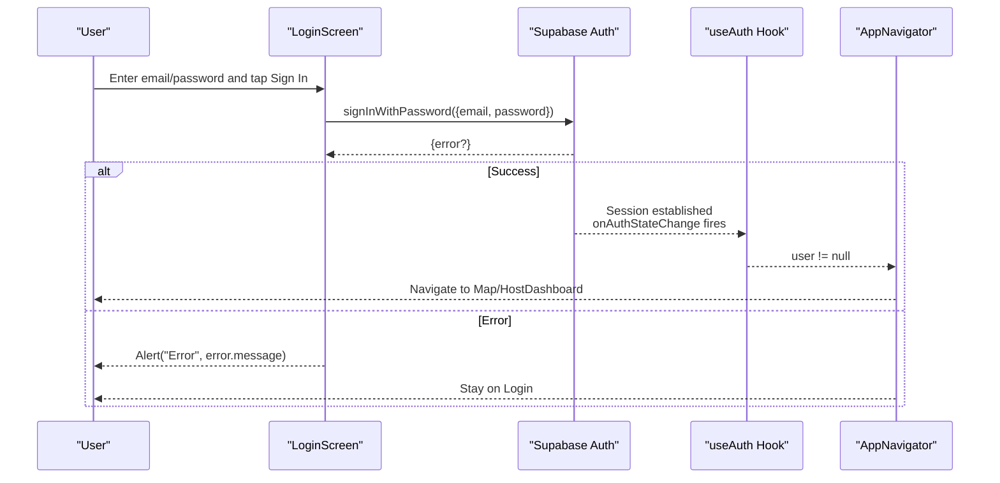
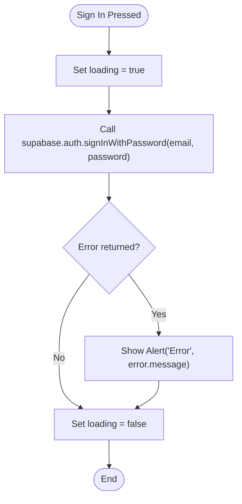
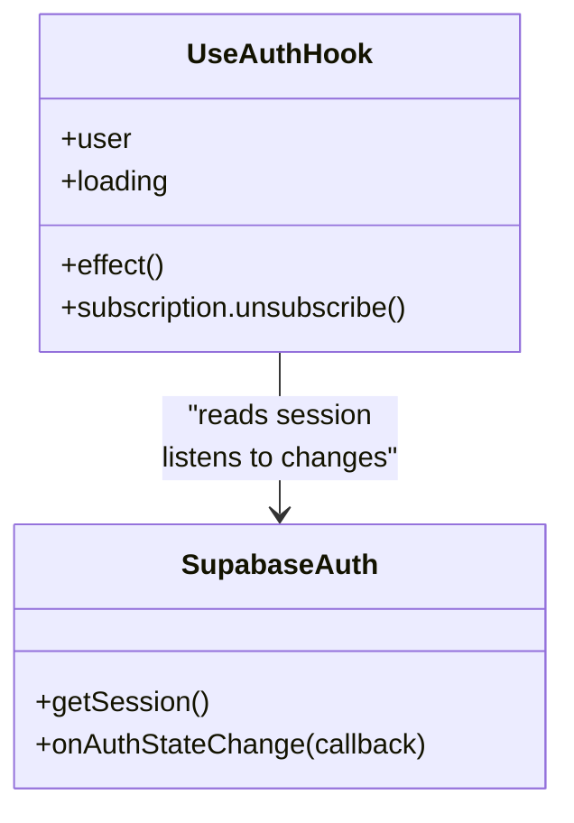
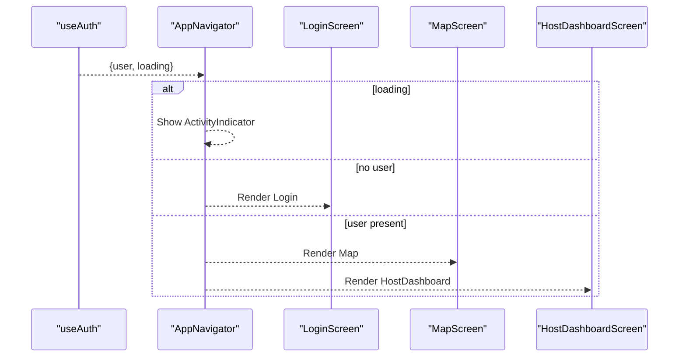
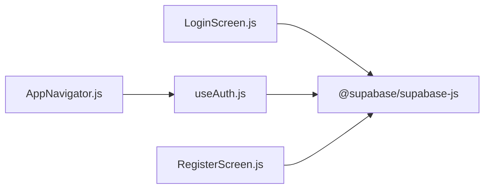

# User Login

<cite>
**Referenced Files in This Document**
- [LoginScreen.js](file://src/screens/LoginScreen.js)
- [useAuth.js](file://src/hooks/useAuth.js)
- [AppNavigator.js](file://src/navigation/AppNavigator.js)
- [RegisterScreen.js](file://src/screens/RegisterScreen.js)
- [package.json](file://package.json)
</cite>

## Table of Contents
1. [Introduction](#introduction)
2. [Project Structure](#project-structure)
3. [Core Components](#core-components)
4. [Architecture Overview](#architecture-overview)
5. [Detailed Component Analysis](#detailed-component-analysis)
6. [Dependency Analysis](#dependency-analysis)
7. [Performance Considerations](#performance-considerations)
8. [Troubleshooting Guide](#troubleshooting-guide)
9. [Conclusion](#conclusion)

## Introduction
This document explains the user login functionality end-to-end: how credentials are captured and validated, how authentication is performed with Supabase Auth, how sessions are established and observed, and how navigation responds to authentication state. It also covers user experience details such as loading indicators, success navigation, and error messaging.

## Project Structure
The login feature spans a small set of focused files:
- A login screen that collects email/password and triggers authentication
- An authentication hook that tracks current session and updates UI state
- A navigator that renders protected or unauthenticated screens based on session state
- A registration screen for account creation (related context)
- Package configuration indicating use of Supabase JS client

**Diagram sources**
- [LoginScreen.js:1-46](file://src/screens/LoginScreen.js#L1-L46)
- [useAuth.js:1-22](file://src/hooks/useAuth.js#L1-L22)
- [AppNavigator.js:1-40](file://src/navigation/AppNavigator.js#L1-L40)
- [RegisterScreen.js:1-75](file://src/screens/RegisterScreen.js#L1-L75)

**Section sources**
- [LoginScreen.js:1-46](file://src/screens/LoginScreen.js#L1-L46)
- [useAuth.js:1-22](file://src/hooks/useAuth.js#L1-L22)
- [AppNavigator.js:1-40](file://src/navigation/AppNavigator.js#L1-L40)
- [RegisterScreen.js:1-75](file://src/screens/RegisterScreen.js#L1-L75)
- [package.json:1-32](file://package.json#L1-L32)

## Core Components
- Login form and submission: Captures email and password, shows a loading state, calls Supabase sign-in, and displays errors via an alert when authentication fails.
- Authentication state management: Initializes session, listens for auth state changes, and exposes current user and loading status to consumers.
- Navigation gating: Renders either authenticated screens (Map, HostDashboard) or unauthenticated screens (Login, Register) based on the current user.

Key behaviors:
- Credential input handling: Controlled inputs for email and password; email field uses an email keyboard and disables auto-capitalization.
- Form validation: Minimal client-side validation is not implemented in the login flow; required fields are enforced by Supabase on the server side.
- Authentication flow: Uses Supabase’s password-based sign-in method; errors are surfaced to the user through an alert.
- Session establishment: The app retrieves the existing session at startup and subscribes to auth state changes to keep UI in sync.
- Error handling: Errors from sign-in are caught and shown to the user; network issues will surface as Supabase errors.

**Section sources**
- [LoginScreen.js:5-46](file://src/screens/LoginScreen.js#L5-L46)
- [useAuth.js:4-22](file://src/hooks/useAuth.js#L4-L22)
- [AppNavigator.js:12-40](file://src/navigation/AppNavigator.js#L12-L40)

## Architecture Overview
The login architecture integrates React Native UI with Supabase Auth and React Navigation:

**Diagram sources**
- [LoginScreen.js:10-15](file://src/screens/LoginScreen.js#L10-L15)
- [useAuth.js:8-18](file://src/hooks/useAuth.js#L8-L18)
- [AppNavigator.js:12-36](file://src/navigation/AppNavigator.js#L12-L36)

## Detailed Component Analysis

### Login Screen: Credential Input Handling, Validation, and Submission
- Inputs: Email and password controlled by local state; email input configured for email entry and disabled auto-capitalize.
- Loading indicator: Button text switches to “signing in...” while processing; button is disabled during request.
- Submission: Calls Supabase sign-in with provided credentials; sets loading state before and after call.
- Error handling: Displays an alert with the error message if sign-in fails.
- Navigation: No explicit navigation on success; relies on navigator re-rendering due to updated auth state.

**Diagram sources**
- [LoginScreen.js:10-15](file://src/screens/LoginScreen.js#L10-L15)
- [LoginScreen.js:38-40](file://src/screens/LoginScreen.js#L38-L40)

**Section sources**
- [LoginScreen.js:5-46](file://src/screens/LoginScreen.js#L5-L46)

### Authentication Hook: Session Establishment and State Updates
- Initial session retrieval: On mount, fetches the current session and sets user and loading accordingly.
- Real-time updates: Subscribes to auth state changes to update user whenever session changes (login/logout).
- Cleanup: Unsubscribes from auth state change listener on unmount.

**Diagram sources**
- [useAuth.js:4-22](file://src/hooks/useAuth.js#L4-L22)

**Section sources**
- [useAuth.js:1-22](file://src/hooks/useAuth.js#L1-L22)

### Navigator: Protected Routes and Redirects
- Loading overlay: Shows an activity indicator while auth state is being determined.
- Route selection: If a user exists, renders Map and HostDashboard; otherwise renders Login and Register.
- Behavior: After successful login, the navigator re-renders because the hook’s user state updates, automatically switching to protected screens.

**Diagram sources**
- [AppNavigator.js:12-40](file://src/navigation/AppNavigator.js#L12-L40)

**Section sources**
- [AppNavigator.js:1-40](file://src/navigation/AppNavigator.js#L1-L40)

### Registration Flow (Related Context)
- Validates presence of name, email, and password before submission.
- Creates account via Supabase sign-up and optionally inserts a profile record.
- Provides feedback via alerts and navigates back to login.

**Section sources**
- [RegisterScreen.js:11-36](file://src/screens/RegisterScreen.js#L11-L36)
- [RegisterScreen.js:38-75](file://src/screens/RegisterScreen.js#L38-L75)

## Dependency Analysis
- External dependency: Supabase JS client is used for authentication and session management.
- Internal dependencies:
  - LoginScreen depends on Supabase client to authenticate users.
  - useAuth depends on Supabase client to retrieve session and listen to auth changes.
  - AppNavigator depends on useAuth to decide which screens to render.

**Diagram sources**
- [package.json:5-10](file://package.json#L5-L10)
- [LoginScreen.js:3](file://src/screens/LoginScreen.js#L3)
- [useAuth.js:2](file://src/hooks/useAuth.js#L2)
- [AppNavigator.js:8](file://src/navigation/AppNavigator.js#L8)
- [RegisterScreen.js:3](file://src/screens/RegisterScreen.js#L3)

**Section sources**
- [package.json:5-10](file://package.json#L5-L10)
- [LoginScreen.js:3](file://src/screens/LoginScreen.js#L3)
- [useAuth.js:2](file://src/hooks/useAuth.js#L2)
- [AppNavigator.js:8](file://src/navigation/AppNavigator.js#L8)
- [RegisterScreen.js:3](file://src/screens/RegisterScreen.js#L3)

## Performance Considerations
- Avoid unnecessary re-renders: The navigator only re-renders when auth state changes; ensure components do not trigger extra state updates during login.
- Debounce or guard repeated submissions: The button is disabled while loading to prevent duplicate requests.
- Minimize network calls: Rely on Supabase’s session persistence to avoid redundant sign-in attempts on app start.

[No sources needed since this section provides general guidance]

## Troubleshooting Guide
Common issues and remedies:
- Invalid credentials: Supabase returns an error; the login screen shows an alert with the error message. Verify email/password and ensure the account exists.
- Network issues: If the device cannot reach Supabase, the sign-in promise rejects with an error; display a user-friendly message and retry.
- Stale session state: If the app appears stuck on Login despite a valid session, confirm that the navigator is receiving updated user state from the auth hook.
- Missing navigation on success: Since navigation on success is handled by navigator re-rendering, ensure the auth hook is mounted and subscribed correctly.

**Section sources**
- [LoginScreen.js:10-15](file://src/screens/LoginScreen.js#L10-L15)
- [useAuth.js:8-18](file://src/hooks/useAuth.js#L8-L18)
- [AppNavigator.js:12-36](file://src/navigation/AppNavigator.js#L12-L36)

## Conclusion
The login flow captures credentials, authenticates via Supabase, and leverages a shared auth hook to manage session state across the app. The navigator reacts to authentication state to gate protected routes. While minimal client-side validation is present, robust server-side validation and error reporting are handled by Supabase. For enhanced UX, consider adding explicit success navigation after login and richer error messages for network failures.

[No sources needed since this section summarizes without analyzing specific files]