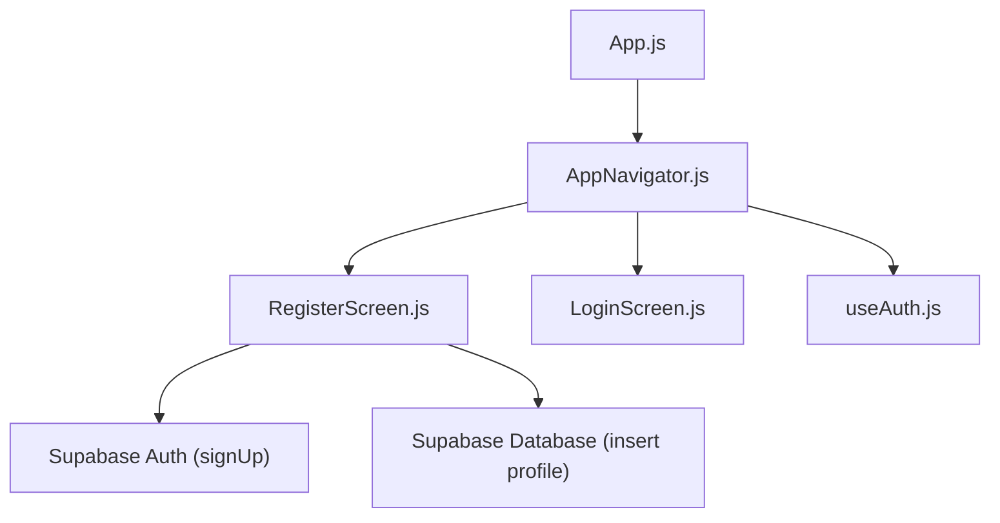
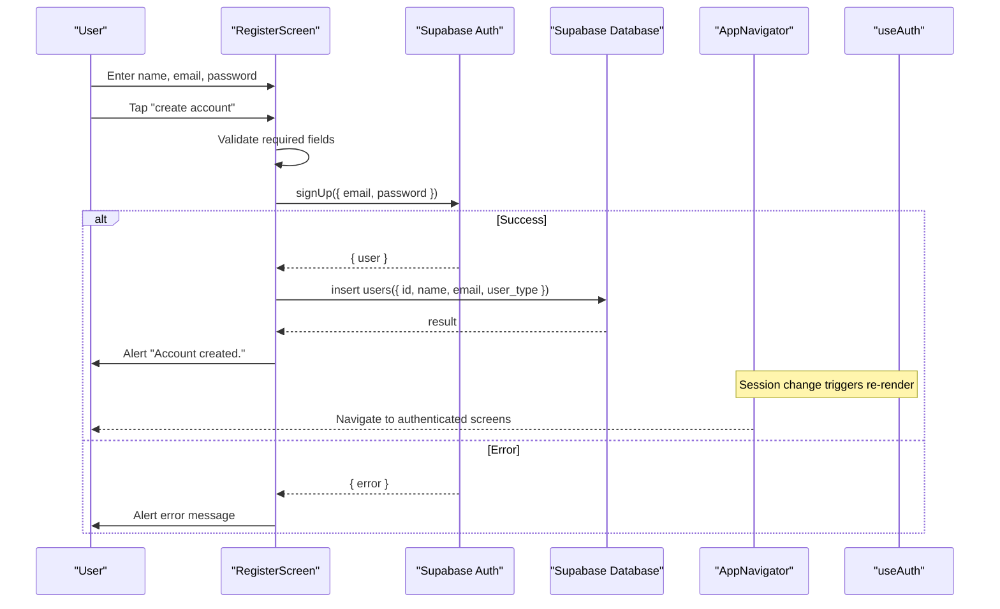
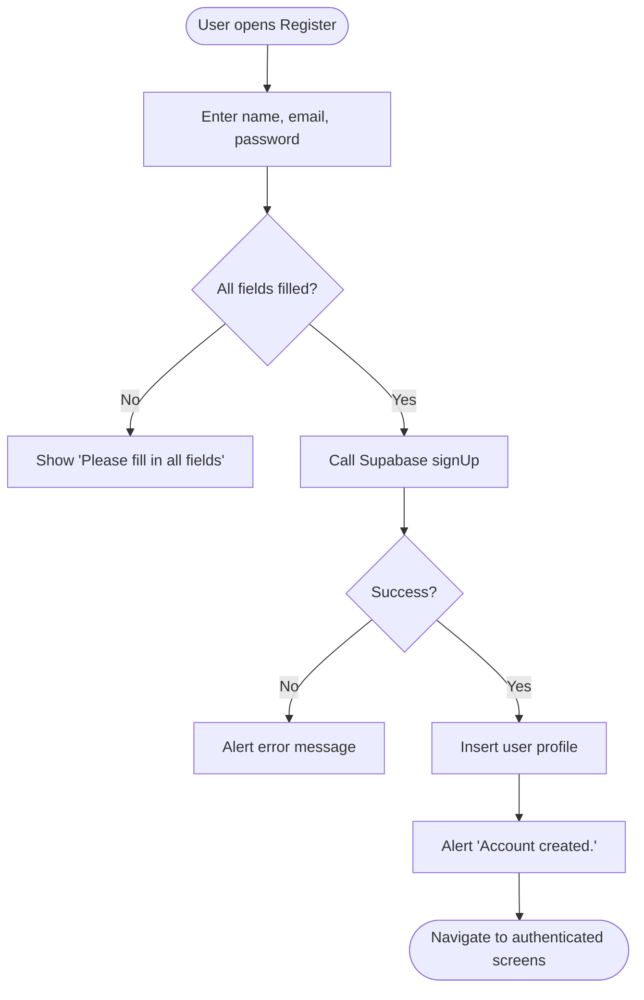
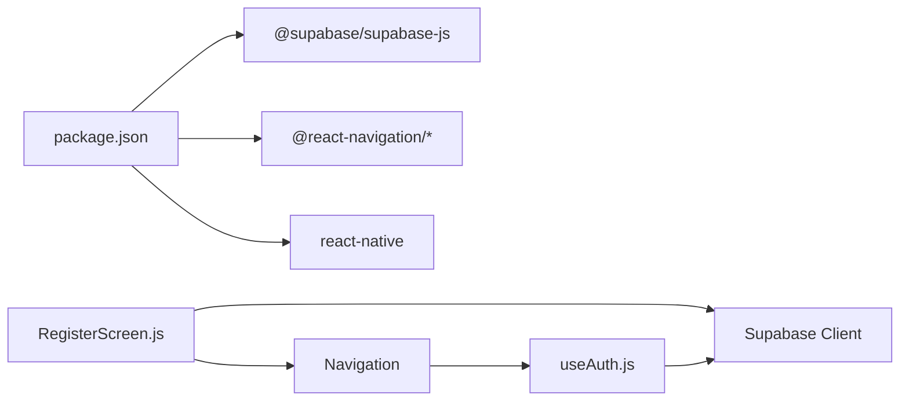

# User Registration

<cite>
**Referenced Files in This Document**
- [RegisterScreen.js](file://src/screens/RegisterScreen.js)
- [useAuth.js](file://src/hooks/useAuth.js)
- [AppNavigator.js](file://src/navigation/AppNavigator.js)
- [LoginScreen.js](file://src/screens/LoginScreen.js)
- [package.json](file://package.json)
</cite>

## Table of Contents
1. [Introduction](#introduction)
2. [Project Structure](#project-structure)
3. [Core Components](#core-components)
4. [Architecture Overview](#architecture-overview)
5. [Detailed Component Analysis](#detailed-component-analysis)
6. [Dependency Analysis](#dependency-analysis)
7. [Performance Considerations](#performance-considerations)
8. [Troubleshooting Guide](#troubleshooting-guide)
9. [Conclusion](#conclusion)

## Introduction
This document explains the user registration functionality implemented in the application. It covers the registration form UI, input handling for name, email, and password, validation rules, error state management, and integration with Supabase Auth to create new accounts. It also describes the user experience around loading states, success feedback, and error scenarios such as duplicate emails or network failures.

## Project Structure
The registration feature is primarily implemented in a single screen component that renders inputs and handles submission. Authentication state is managed by a custom hook, and navigation routes are configured to show the registration screen when no user is authenticated.

**Diagram sources**
- [AppNavigator.js:10-39](file://src/navigation/AppNavigator.js#L10-L39)
- [RegisterScreen.js:1-36](file://src/screens/RegisterScreen.js#L1-L36)
- [useAuth.js:4-21](file://src/hooks/useAuth.js#L4-L21)

**Section sources**
- [AppNavigator.js:10-39](file://src/navigation/AppNavigator.js#L10-L39)
- [RegisterScreen.js:1-75](file://src/screens/RegisterScreen.js#L1-L75)
- [useAuth.js:4-21](file://src/hooks/useAuth.js#L4-L21)

## Core Components
- Registration Screen: Renders name, email, and password inputs; validates required fields; calls Supabase Auth to sign up; creates a user profile row; shows loading and success/error alerts.
- Authentication Hook: Tracks current session and updates UI routing based on authentication state.
- Navigation: Conditionally renders Login/Register screens when unauthenticated and Map/HostDashboard when authenticated.

Key responsibilities:
- Form state and submission handling live in the registration screen.
- Global auth state and session changes are handled by the hook.
- Routing logic determines which screens are visible based on auth state.

**Section sources**
- [RegisterScreen.js:5-75](file://src/screens/RegisterScreen.js#L5-L75)
- [useAuth.js:4-21](file://src/hooks/useAuth.js#L4-L21)
- [AppNavigator.js:12-39](file://src/navigation/AppNavigator.js#L12-L39)

## Architecture Overview
The registration flow integrates React Native UI with Supabase services:

**Diagram sources**
- [RegisterScreen.js:11-36](file://src/screens/RegisterScreen.js#L11-L36)
- [useAuth.js:8-18](file://src/hooks/useAuth.js#L8-L18)
- [AppNavigator.js:12-39](file://src/navigation/AppNavigator.js#L12-L39)

## Detailed Component Analysis

### Registration Form Implementation
- Inputs:
  - Name: text input with auto capitalization.
  - Email: text input with email keyboard and no auto capitalization.
  - Password: secure text entry.
- Submission:
  - Validates that name, email, and password are non-empty.
  - Sets loading state before calling Supabase Auth.
  - On success, inserts a user profile into the database with id, name, email, and default user type.
  - Shows success alert and resets loading state.
  - On error, displays an alert with the error message and resets loading state.

Validation rules:
- Required fields: name, email, password must be present.
- No client-side format validation beyond empty checks.

Error state management:
- Uses alerts for both validation errors and API errors.
- Loading state disables the submit button and updates button text during submission.

User experience:
- Visual feedback via disabled button and changing button text while creating the account.
- Immediate success feedback via alert after successful registration.

Code snippet paths:
- Form inputs and handlers: [RegisterScreen.js:42-73](file://src/screens/RegisterScreen.js#L42-L73)
- Validation and submission: [RegisterScreen.js:11-36](file://src/screens/RegisterScreen.js#L11-L36)

**Section sources**
- [RegisterScreen.js:11-73](file://src/screens/RegisterScreen.js#L11-L73)

### Supabase Auth Integration
- Account creation:
  - Calls Supabase Auth signUp with email and password.
  - On success, receives a user object used to create a profile row in the database.
- Email verification:
  - The implementation does not explicitly handle email verification flows or redirect logic within this screen. Verification behavior depends on Supabase configuration.
- Profile creation:
  - Inserts a record into the users table with id, name, email, and user_type set to explorer.

Integration points:
- Auth API usage path: [RegisterScreen.js:17-22](file://src/screens/RegisterScreen.js#L17-L22)
- Database insertion path: [RegisterScreen.js:24-33](file://src/screens/RegisterScreen.js#L24-L33)

Note: The import path references a local Supabase client module. Ensure the module exists and is correctly configured for your environment.

**Section sources**
- [RegisterScreen.js:17-33](file://src/screens/RegisterScreen.js#L17-L33)

### Authentication State and Navigation
- The app uses a custom hook to track the current session and listen for auth state changes.
- Navigation conditionally renders Login/Register when no user is authenticated and navigates to authenticated screens otherwise.
- After successful registration, the session update from Supabase will cause the navigator to switch to authenticated screens.

Code snippet paths:
- Auth state tracking: [useAuth.js:8-18](file://src/hooks/useAuth.js#L8-L18)
- Conditional navigation: [AppNavigator.js:12-39](file://src/navigation/AppNavigator.js#L12-L39)

**Section sources**
- [useAuth.js:8-18](file://src/hooks/useAuth.js#L8-L18)
- [AppNavigator.js:12-39](file://src/navigation/AppNavigator.js#L12-L39)

### Conceptual Overview

[No sources needed since this diagram shows conceptual workflow, not actual code structure]

## Dependency Analysis
- External dependencies relevant to registration:
  - Supabase JS SDK for authentication and database operations.
  - React Navigation for routing between Login, Register, and authenticated screens.
  - Expo and React Native runtime for UI components and platform APIs.

**Diagram sources**
- [package.json:5-22](file://package.json#L5-L22)
- [RegisterScreen.js:1-36](file://src/screens/RegisterScreen.js#L1-L36)
- [useAuth.js:1-21](file://src/hooks/useAuth.js#L1-L21)
- [AppNavigator.js:1-39](file://src/navigation/AppNavigator.js#L1-L39)

**Section sources**
- [package.json:5-22](file://package.json#L5-L22)
- [RegisterScreen.js:1-36](file://src/screens/RegisterScreen.js#L1-L36)
- [useAuth.js:1-21](file://src/hooks/useAuth.js#L1-L21)
- [AppNavigator.js:1-39](file://src/navigation/AppNavigator.js#L1-L39)

## Performance Considerations
- Minimal client-side validation reduces overhead but may allow invalid data to reach the server; consider adding robust validation to prevent unnecessary network calls.
- Single-screen state keeps memory footprint low; avoid heavy computations in render paths.
- Alerts provide immediate feedback without blocking the UI thread.

[No sources needed since this section provides general guidance]

## Troubleshooting Guide
Common issues and how they are handled:
- Missing fields:
  - Behavior: Displays an alert prompting the user to fill all fields.
  - Location: [RegisterScreen.js:12-15](file://src/screens/RegisterScreen.js#L12-L15)
- Duplicate email or weak password:
  - Behavior: Supabase returns an error; the screen shows an alert with the error message.
  - Location: [RegisterScreen.js:17-22](file://src/screens/RegisterScreen.js#L17-L22)
- Network errors:
  - Behavior: Errors from Supabase are caught and shown via alert.
  - Location: [RegisterScreen.js:17-22](file://src/screens/RegisterScreen.js#L17-L22)
- Profile creation failure:
  - Behavior: Logs a console error; registration still completes and shows success alert.
  - Location: [RegisterScreen.js:24-33](file://src/screens/RegisterScreen.js#L24-L33)

Recommendations:
- Add explicit error handling for profile insertion to inform the user if profile creation fails.
- Implement stronger validation (email format, password strength) to reduce failed attempts.
- Provide user-friendly messages for common Supabase errors (e.g., duplicate email).

**Section sources**
- [RegisterScreen.js:12-33](file://src/screens/RegisterScreen.js#L12-L33)

## Conclusion
The registration feature provides a straightforward flow: collect name, email, and password; validate required fields; call Supabase Auth to create an account; optionally create a user profile; and display success or error feedback. Authentication state drives navigation to either login/register or authenticated screens. To improve reliability and UX, consider enhancing validation, handling profile creation errors explicitly, and tailoring error messages for better clarity.

[No sources needed since this section summarizes without analyzing specific files]