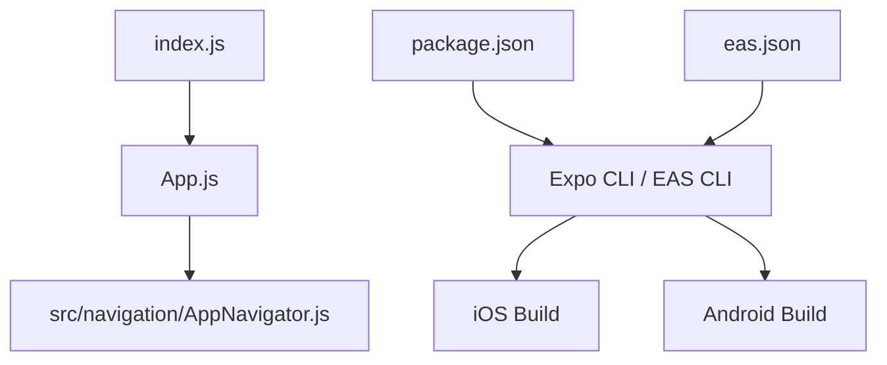
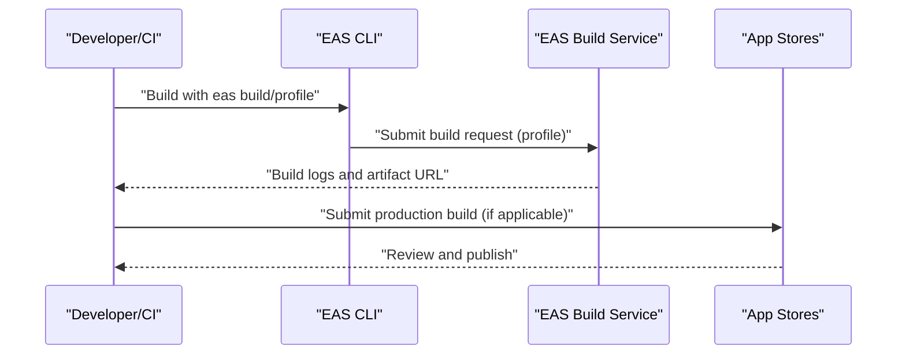
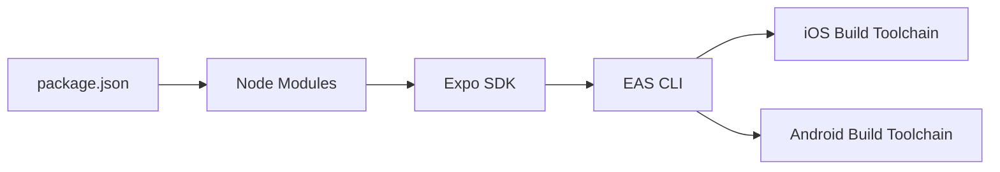

# Build and Deployment

<cite>
**Referenced Files in This Document**
- [eas.json](file://eas.json)
- [package.json](file://package.json)
- [index.js](file://index.js)
- [App.js](file://App.js)
- [AppNavigator.js](file://src/navigation/AppNavigator.js)
</cite>

## Table of Contents
1. Introduction
2. Project Structure
3. Core Components
4. Architecture Overview
5. Detailed Component Analysis
6. Dependency Analysis
7. Performance Considerations
8. Troubleshooting Guide
9. Conclusion

## Introduction
This document provides comprehensive build and deployment guidance for the Outside mobile application using Expo Application Services (EAS). It covers EAS configuration, building and distributing iOS and Android apps (development builds and production releases), environment variable handling, asset management, app signing procedures, store deployment workflows, testing distribution channels, troubleshooting common issues, and performance optimization tips for production builds.

## Project Structure
The project is an Expo-based React Native application with a minimal root structure:
- index.js registers the root component for both development and native builds
- App.js renders the navigation container
- src/navigation/AppNavigator.js defines the app’s navigation flow
- eas.json configures EAS build profiles and submission settings
- package.json declares dependencies and scripts used during development and CI

**Diagram sources**
- [index.js:1-9](file://index.js#L1-L9)
- [App.js:1-5](file://App.js#L1-L5)
- [AppNavigator.js:1-40](file://src/navigation/AppNavigator.js#L1-L40)
- [package.json:24-29](file://package.json#L24-L29)
- [eas.json:1-22](file://eas.json#L1-L22)

**Section sources**
- [index.js:1-9](file://index.js#L1-L9)
- [App.js:1-5](file://App.js#L1-L5)
- [AppNavigator.js:1-40](file://src/navigation/AppNavigator.js#L1-L40)
- [package.json:1-32](file://package.json#L1-L32)
- [eas.json:1-22](file://eas.json#L1-L22)

## Core Components
- EAS Configuration: The eas.json file defines CLI version requirements, build profiles (development, preview, production), and submission settings for production.
- Entry Points: index.js registers the root component; App.js renders the navigation stack; AppNavigator.js routes users based on authentication state.
- Scripts and Dependencies: package.json includes Expo and related dependencies, plus scripts to start the dev server for each platform.

Key responsibilities:
- eas.json: Controls how EAS builds are configured and submitted.
- index.js: Ensures the app runs correctly in both Expo Go and native builds.
- App.js and AppNavigator.js: Provide the user-facing navigation and routing logic.
- package.json: Declares runtime dependencies and development scripts.

**Section sources**
- [eas.json:1-22](file://eas.json#L1-L22)
- [index.js:1-9](file://index.js#L1-L9)
- [App.js:1-5](file://App.js#L1-L5)
- [AppNavigator.js:1-40](file://src/navigation/AppNavigator.js#L1-L40)
- [package.json:1-32](file://package.json#L1-L32)

## Architecture Overview
The build and deployment architecture centers around EAS:
- Local or CI environments invoke EAS CLI commands defined by eas.json profiles.
- EAS compiles and signs artifacts for iOS and Android according to each profile.
- Artifacts can be distributed via internal channels (preview/internal) or submitted to app stores (production).

**Diagram sources**
- [eas.json:1-22](file://eas.json#L1-L22)
- [package.json:24-29](file://package.json#L24-L29)

## Detailed Component Analysis

### EAS Build Profiles and Submission
- Development profile: Enables development client builds and sets internal distribution for quick iteration.
- Preview profile: Internal distribution suitable for sharing pre-release builds within teams.
- Production profile: Auto-increments versioning and prepares artifacts for store submission.
- Submit section: Configures production submission behavior.

Operational guidance:
- Use the development profile for local debugging with the Expo Dev Client.
- Use the preview profile for internal testing and QA.
- Use the production profile for final artifacts intended for app stores.

**Section sources**
- [eas.json:1-22](file://eas.json#L1-L22)

### Application Entry and Navigation
- index.js registers the root component, ensuring compatibility with both Expo Go and native builds.
- App.js renders the navigation container.
- AppNavigator.js manages navigation stacks and guards access based on authentication state.

Build implications:
- Ensure index.js remains the entry point for all builds.
- Keep navigation logic lightweight to avoid slow startup times in production.

**Section sources**
- [index.js:1-9](file://index.js#L1-L9)
- [App.js:1-5](file://App.js#L1-L5)
- [AppNavigator.js:1-40](file://src/navigation/AppNavigator.js#L1-L40)

### Scripts and Dependencies
- package.json contains scripts to start the development server for Android, iOS, and web.
- Dependencies include Expo, navigation libraries, Supabase client, and platform-specific modules.

Build implications:
- Use npm/yarn/pnpm to install dependencies before building.
- Lock versions via package-lock.json to ensure reproducible builds.

**Section sources**
- [package.json:1-32](file://package.json#L1-L32)

## Dependency Analysis
The build pipeline depends on:
- EAS CLI and service for cloud builds and submissions
- Expo SDK and related packages declared in package.json
- Platform toolchains managed by EAS (Xcode for iOS, Gradle/Android SDK for Android)

**Diagram sources**
- [package.json:1-32](file://package.json#L1-L32)
- [eas.json:1-22](file://eas.json#L1-L22)

**Section sources**
- [package.json:1-32](file://package.json#L1-L32)
- [eas.json:1-22](file://eas.json#L1-L22)

## Performance Considerations
- Prefer production builds for release artifacts to benefit from optimizations applied by EAS.
- Keep dependency versions pinned to reduce rebuild variance and potential regressions.
- Minimize heavy initialization in the root component and navigation layer to improve cold start times.
- Avoid unnecessary assets in the bundle; place large media in external storage when possible.
- Use platform-specific configurations only when required to keep builds lean.

[No sources needed since this section provides general guidance]

## Troubleshooting Guide
Common issues and resolutions:
- Build fails due to missing or incompatible toolchains: Ensure your environment meets the EAS CLI version requirement and that platform toolchains are available if building locally. When using EAS cloud builds, rely on managed environments to resolve toolchain issues.
- Version mismatches between Expo SDK and dependencies: Align package versions with the Expo SDK specified in package.json to avoid runtime or build errors.
- Authentication or Supabase integration errors at runtime: Verify that environment variables and credentials are correctly set in your backend services and that the app initializes them safely in production builds.
- Slow or flaky builds: Use consistent dependency versions and consider caching node_modules and EAS build caches in CI pipelines.

[No sources needed since this section provides general guidance]

## Conclusion
The Outside application uses EAS to streamline building and distributing iOS and Android apps across development, preview, and production profiles. By configuring eas.json appropriately, maintaining clean entry points and navigation, and pinning dependencies in package.json, you can achieve reliable, repeatable builds. Follow the outlined workflows for internal testing and store submissions, and apply the performance and troubleshooting recommendations to maintain a smooth development and release process.

[No sources needed since this section summarizes without analyzing specific files]