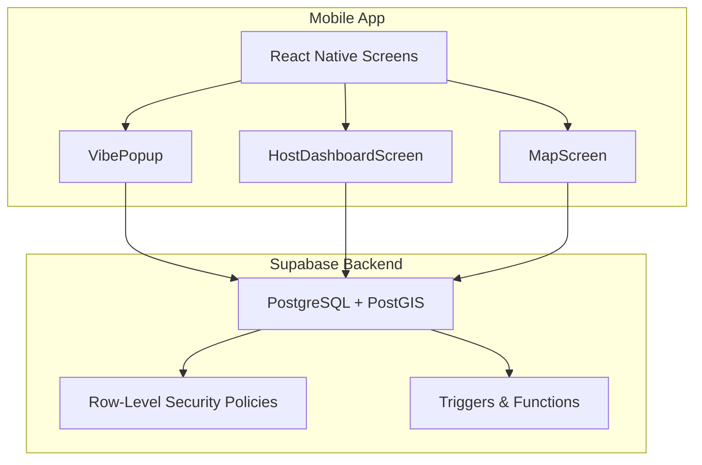
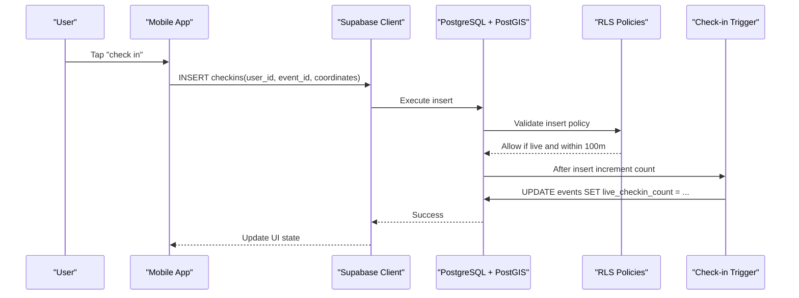
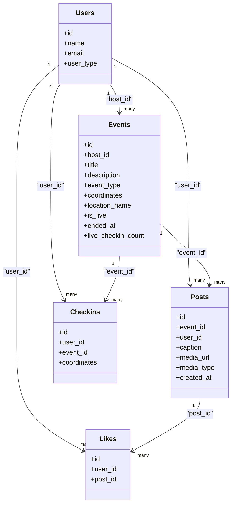
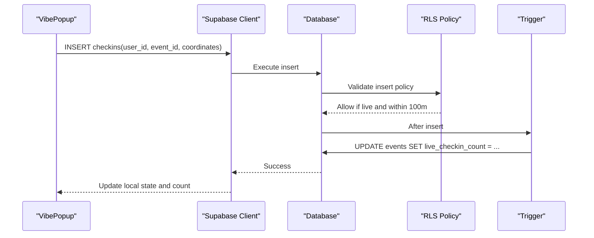
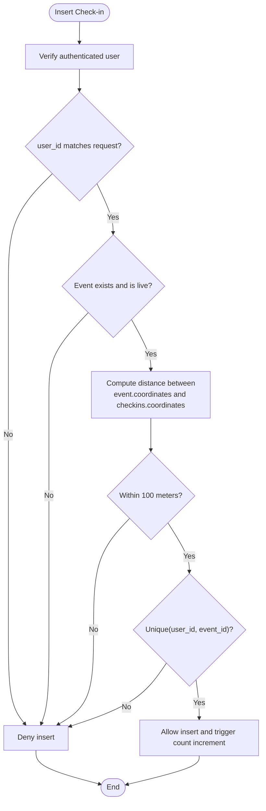
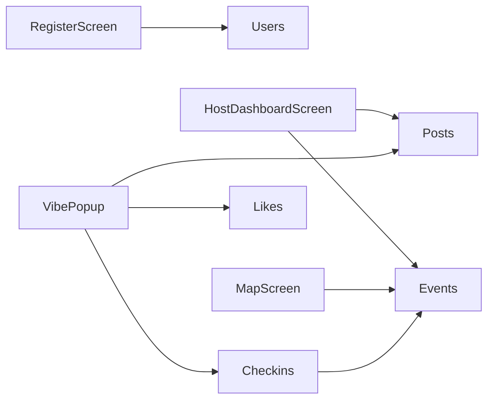

# Database Schema

<cite>
**Referenced Files in This Document**
- [phase6_checkins.sql](file://supabase/sql/sql/phase6_checkins.sql)
- [VibePopup.js](file://src/components/VibePopup.js)
- [HostDashboardScreen.js](file://src/screens/HostDashboardScreen.js)
- [MapScreen.js](file://src/screens/MapScreen.js)
- [RegisterScreen.js](file://src/screens/RegisterScreen.js)
</cite>

## Table of Contents
1. Introduction
2. Project Structure
3. Core Components
4. Architecture Overview
5. Detailed Component Analysis
6. Dependency Analysis
7. Performance Considerations
8. Troubleshooting Guide
9. Conclusion
10. Appendices

## Introduction
This document describes the Outside application’s database schema and data model, focusing on entities for users, events, posts, likes, and check-ins. It consolidates field definitions, relationships, constraints, indexes, validation rules enforced at the database level, security policies, and migration strategies inferred from the repository. It also provides sample query patterns derived from the application code to illustrate common operations.

## Project Structure
The project is a React Native app that uses Supabase as its backend. The only explicit SQL migration included in this repository adds support for proximity-gated check-ins and live event counters. Other tables (users, events, posts, likes) are referenced by the application code and interact with Supabase via client SDK calls.

[No sources needed since this diagram shows conceptual workflow, not actual code structure]

## Core Components
Based on the repository, the following core data entities are used:

- Users
  - Purpose: Identity and profile for authenticated users.
  - Evidence: Created during registration; referenced by foreign keys in other tables.
  - Key fields inferred: id (primary key), name, email, user_type.

- Events
  - Purpose: Represents live or past gatherings with location and status.
  - Evidence: Created by hosts; queried for live events; includes geographic coordinates and live flag.
  - Key fields inferred: id (primary key), host_id (foreign key to users), title, description, event_type, coordinates (geography), location_name, is_live, ended_at, live_checkin_count.

- Posts
  - Purpose: Media content associated with an event.
  - Evidence: Inserted by hosts for active events; media stored in Supabase Storage and URL persisted here.
  - Key fields inferred: id (primary key), event_id (foreign key to events), user_id (foreign key to users), caption, media_url, media_type, created_at.

- Likes
  - Purpose: Records which users liked which posts.
  - Evidence: Queried per user to determine liked post IDs; implies a many-to-many link between users and posts.
  - Key fields inferred: id (primary key), user_id (foreign key to users), post_id (foreign key to posts).

- Check-ins
  - Purpose: Records when a user checks into a live event within proximity.
  - Evidence: Enforced by Row-Level Security and triggers; stores coordinates and enforces uniqueness per user-event pair.
  - Key fields inferred: id (primary key), user_id (foreign key to users), event_id (foreign key to events), coordinates (geography).

Relationships
- Users 1..* Events (host_id)
- Users 1..* Posts (user_id)
- Users 1..* Likes (user_id)
- Events 1..* Posts (event_id)
- Events 1..* Check-ins (event_id)
- Users 1..* Check-ins (user_id)
- Posts 1..* Likes (post_id)

Indexes and Constraints
- Unique constraint on check-ins(user_id, event_id) to prevent duplicate check-ins per event.
- Foreign key relationships implied by usage across tables (e.g., posts.event_id references events.id).
- A trigger increments events.live_checkin_count on each successful check-in insert.

Validation Rules Enforced at Database Level
- Proximity-gated check-in: Only allowed if the event is live and the check-in coordinates are within 100 meters of the event’s coordinates using geography-based distance.
- Ownership enforcement: Users can only read their own check-ins via row-level security policy.
- Live counter consistency: Trigger ensures live_checkin_count stays synchronized after inserts.

Security Policies
- Select policy on check-ins restricts visibility to the record owner.
- Insert policy on check-ins enforces authentication, ownership, event liveness, and proximity constraints.

Migration Strategy
- The repository includes a single migration file that alters existing tables and adds policies/triggers. This suggests a phased evolution approach where new features are added via incremental SQL migrations.

**Section sources**
- [phase6_checkins.sql:5-10](file://supabase/sql/sql/phase6_checkins.sql#L5-L10)
- [phase6_checkins.sql:14-40](file://supabase/sql/sql/phase6_checkins.sql#L14-L40)
- [phase6_checkins.sql:47-63](file://supabase/sql/sql/phase6_checkins.sql#L47-L63)
- [RegisterScreen.js:24-32](file://src/screens/RegisterScreen.js#L24-L32)
- [HostDashboardScreen.js:65-77](file://src/screens/HostDashboardScreen.js#L65-L77)
- [HostDashboardScreen.js:108-116](file://src/screens/HostDashboardScreen.js#L108-L116)
- [VibePopup.js:48-69](file://src/components/VibePopup.js#L48-L69)
- [VibePopup.js:72-98](file://src/components/VibePopup.js#L72-L98)

## Architecture Overview
The data architecture centers around Supabase-managed PostgreSQL with PostGIS for geospatial queries. Application screens perform CRUD operations through the Supabase JS client. Database-level policies and triggers enforce business rules such as proximity gating and live counter synchronization.

**Diagram sources**
- [phase6_checkins.sql:23-40](file://supabase/sql/sql/phase6_checkins.sql#L23-L40)
- [phase6_checkins.sql:47-63](file://supabase/sql/sql/phase6_checkins.sql#L47-L63)
- [VibePopup.js:82-118](file://src/components/VibePopup.js#L82-L118)

## Detailed Component Analysis

### Users
- Role: Authenticated identity and profile holder.
- Creation: Inserted immediately after sign-up with id, name, email, and default user_type.
- Usage: Referenced by events.host_id, posts.user_id, likes.user_id, checkins.user_id.

Sample creation flow
- Registration creates a user profile entry linked to the auth user id.

**Section sources**
- [RegisterScreen.js:24-32](file://src/screens/RegisterScreen.js#L24-L32)

### Events
- Role: Central entity for live gatherings with geolocation and lifecycle flags.
- Fields inferred: id, host_id, title, description, event_type, coordinates (geography), location_name, is_live, ended_at, live_checkin_count.
- Operations:
  - Create: Host creates a live event with coordinates and metadata.
  - Read: Map screen lists live events.
  - Update: Host ends an event by setting is_live false and recording ended_at.

Common query patterns
- Fetch live events for map display.
- Retrieve a single live event owned by the current user.

**Section sources**
- [HostDashboardScreen.js:65-77](file://src/screens/HostDashboardScreen.js#L65-L77)
- [HostDashboardScreen.js:126-134](file://src/screens/HostDashboardScreen.js#L126-L134)
- [MapScreen.js:23-31](file://src/screens/MapScreen.js#L23-L31)

### Posts
- Role: Media content tied to an event and author.
- Fields inferred: id, event_id, user_id, caption, media_url, media_type, created_at.
- Operations:
  - Create: Host uploads image to storage and persists media_url in posts along with event and author context.

Common query patterns
- Load posts for a given event ordered by recency.

**Section sources**
- [HostDashboardScreen.js:88-119](file://src/screens/HostDashboardScreen.js#L88-L119)
- [VibePopup.js:48-58](file://src/components/VibePopup.js#L48-L58)

### Likes
- Role: Tracks user interactions with posts.
- Fields inferred: id, user_id, post_id.
- Operations:
  - Read: Fetch liked post IDs for the current user to update UI state.
  - Write: Toggle like entries (implied by UI behavior).

Common query patterns
- Get all likes for a set of posts by the current user.

**Section sources**
- [VibePopup.js:60-69](file://src/components/VibePopup.js#L60-L69)

### Check-ins
- Role: Records proximity-based attendance at live events.
- Fields inferred: id, user_id, event_id, coordinates (geography).
- Constraints:
  - Unique(user_id, event_id) prevents duplicate check-ins per event.
- Policies:
  - Select: Users can view only their own check-ins.
  - Insert: Must be authenticated, match user_id, event must be live, and distance <= 100 meters using geography.
- Trigger:
  - After insert, increments events.live_checkin_count.

Common query patterns
- Check if a user has already checked into an event.
- Insert a new check-in with coordinates.

**Section sources**
- [phase6_checkins.sql:5-10](file://supabase/sql/sql/phase6_checkins.sql#L5-L10)
- [phase6_checkins.sql:14-40](file://supabase/sql/sql/phase6_checkins.sql#L14-L40)
- [phase6_checkins.sql:47-63](file://supabase/sql/sql/phase6_checkins.sql#L47-L63)
- [VibePopup.js:72-98](file://src/components/VibePopup.js#L72-L98)

#### Class Diagram (Entities and Relationships)

**Diagram sources**
- [RegisterScreen.js:24-32](file://src/screens/RegisterScreen.js#L24-L32)
- [HostDashboardScreen.js:65-77](file://src/screens/HostDashboardScreen.js#L65-L77)
- [HostDashboardScreen.js:108-116](file://src/screens/HostDashboardScreen.js#L108-L116)
- [VibePopup.js:48-69](file://src/components/VibePopup.js#L48-L69)
- [phase6_checkins.sql:5-10](file://supabase/sql/sql/phase6_checkins.sql#L5-L10)

#### Sequence Diagram (Check-in Flow)

**Diagram sources**
- [phase6_checkins.sql:23-40](file://supabase/sql/sql/phase6_checkins.sql#L23-L40)
- [phase6_checkins.sql:47-63](file://supabase/sql/sql/phase6_checkins.sql#L47-L63)
- [VibePopup.js:82-118](file://src/components/VibePopup.js#L82-L118)

#### Flowchart (Proximity Validation Logic)

**Diagram sources**
- [phase6_checkins.sql:23-40](file://supabase/sql/sql/phase6_checkins.sql#L23-L40)
- [phase6_checkins.sql:9-10](file://supabase/sql/sql/phase6_checkins.sql#L9-L10)

## Dependency Analysis
The application depends on Supabase tables and relies heavily on Row-Level Security and triggers to enforce business logic. The mobile screens call specific tables and columns, establishing implicit contracts with the database schema.

**Diagram sources**
- [RegisterScreen.js:24-32](file://src/screens/RegisterScreen.js#L24-L32)
- [HostDashboardScreen.js:65-77](file://src/screens/HostDashboardScreen.js#L65-L77)
- [HostDashboardScreen.js:108-116](file://src/screens/HostDashboardScreen.js#L108-L116)
- [MapScreen.js:23-31](file://src/screens/MapScreen.js#L23-L31)
- [VibePopup.js:48-69](file://src/components/VibePopup.js#L48-L69)
- [VibePopup.js:72-98](file://src/components/VibePopup.js#L72-L98)

**Section sources**
- [RegisterScreen.js:24-32](file://src/screens/RegisterScreen.js#L24-L32)
- [HostDashboardScreen.js:65-77](file://src/screens/HostDashboardScreen.js#L65-L77)
- [HostDashboardScreen.js:108-116](file://src/screens/HostDashboardScreen.js#L108-L116)
- [MapScreen.js:23-31](file://src/screens/MapScreen.js#L23-L31)
- [VibePopup.js:48-69](file://src/components/VibePopup.js#L48-L69)
- [VibePopup.js:72-98](file://src/components/VibePopup.js#L72-L98)

## Performance Considerations
- Geospatial queries: Using geography types and ST_DWithin ensures accurate meter-based distance calculations. For high-volume proximity checks, consider indexing the coordinates column appropriately (e.g., GIST index on geography) to optimize distance queries.
- Live counter updates: The trigger performs a simple increment per check-in, minimizing application-side overhead but adding write amplification on the events table.
- Query efficiency: Fetching posts and likes per event should leverage server-side ordering and filtering to reduce payload size.

[No sources needed since this section provides general guidance]

## Troubleshooting Guide
Common issues and resolutions based on observed behavior:
- Duplicate check-in attempts: Handled by unique constraint; client treats error code indicating uniqueness as success and marks user as checked in.
- Proximity failures: If insert fails due to policy violation, ensure the device location is accurate and the event is live; otherwise, the policy will deny the insert.
- Visibility restrictions: Users cannot see other users’ check-ins due to select policy; aggregate counts remain visible.

**Section sources**
- [phase6_checkins.sql:9-10](file://supabase/sql/sql/phase6_checkins.sql#L9-L10)
- [phase6_checkins.sql:14-40](file://supabase/sql/sql/phase6_checkins.sql#L14-L40)
- [VibePopup.js:99-112](file://src/components/VibePopup.js#L99-L112)

## Conclusion
The Outside application’s data model centers on users, events, posts, likes, and check-ins, with strong database-level enforcement for proximity-based check-ins and live counters. Row-Level Security policies and triggers provide robust validation and consistency guarantees. The repository’s migration strategy uses incremental SQL changes to evolve the schema safely over time.

[No sources needed since this section summarizes without analyzing specific files]

## Appendices

### Field Definitions Summary
- Users
  - id: Primary key
  - name: Text
  - email: Text
  - user_type: Text (default 'explorer')
- Events
  - id: Primary key
  - host_id: Foreign key to users
  - title: Text
  - description: Text
  - event_type: Text
  - coordinates: Geography (POINT)
  - location_name: Text
  - is_live: Boolean
  - ended_at: Timestamp
  - live_checkin_count: Integer (default 0)
- Posts
  - id: Primary key
  - event_id: Foreign key to events
  - user_id: Foreign key to users
  - caption: Text
  - media_url: Text
  - media_type: Text
  - created_at: Timestamp
- Likes
  - id: Primary key
  - user_id: Foreign key to users
  - post_id: Foreign key to posts
- Check-ins
  - id: Primary key
  - user_id: Foreign key to users
  - event_id: Foreign key to events
  - coordinates: Geography (POINT)

**Section sources**
- [RegisterScreen.js:24-32](file://src/screens/RegisterScreen.js#L24-L32)
- [HostDashboardScreen.js:65-77](file://src/screens/HostDashboardScreen.js#L65-L77)
- [HostDashboardScreen.js:108-116](file://src/screens/HostDashboardScreen.js#L108-L116)
- [VibePopup.js:48-69](file://src/components/VibePopup.js#L48-L69)
- [phase6_checkins.sql:5-10](file://supabase/sql/sql/phase6_checkins.sql#L5-L10)

### Security Policies and Access Control
- Check-ins select policy: Restricts reading to the record owner.
- Check-ins insert policy: Requires authentication, ownership, event liveness, and proximity within 100 meters.
- Trigger function runs with elevated privileges to safely update event counters without granting direct update rights to users.

**Section sources**
- [phase6_checkins.sql:14-40](file://supabase/sql/sql/phase6_checkins.sql#L14-L40)
- [phase6_checkins.sql:47-63](file://supabase/sql/sql/phase6_checkins.sql#L47-L63)

### Migration Strategies and Version Management
- Incremental migrations: Add columns, constraints, policies, functions, and triggers via dedicated SQL files.
- Example: phase6_checkins.sql adds live_checkin_count, uniqueness constraint, RLS policies, and a trigger to maintain consistency.
- Best practice: Keep each migration focused and idempotent; test in staging before applying to production.

**Section sources**
- [phase6_checkins.sql:5-10](file://supabase/sql/sql/phase6_checkins.sql#L5-L10)
- [phase6_checkins.sql:14-40](file://supabase/sql/sql/phase6_checkins.sql#L14-L40)
- [phase6_checkins.sql:47-63](file://supabase/sql/sql/phase6_checkins.sql#L47-L63)

### Sample Query Patterns
- Fetch live events for map markers:
  - SELECT * FROM events WHERE is_live = true;
- Load posts for an event:
  - SELECT * FROM posts WHERE event_id = ? ORDER BY created_at DESC;
- Get liked posts for a user:
  - SELECT post_id FROM likes WHERE user_id = ? AND post_id IN (...);
- Check existing check-in:
  - SELECT id FROM checkins WHERE user_id = ? AND event_id = ? LIMIT 1;
- Insert a check-in:
  - INSERT INTO checkins (user_id, event_id, coordinates) VALUES (?, ?, POINT(lon, lat));

**Section sources**
- [MapScreen.js:23-31](file://src/screens/MapScreen.js#L23-L31)
- [VibePopup.js:48-69](file://src/components/VibePopup.js#L48-L69)
- [VibePopup.js:72-98](file://src/components/VibePopup.js#L72-L98)