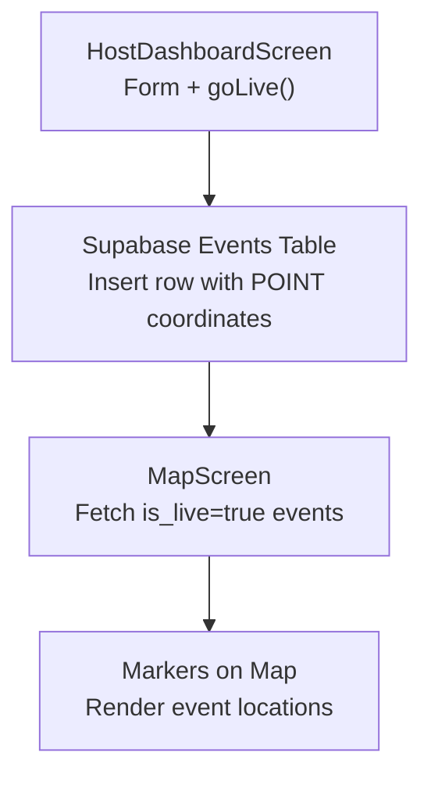
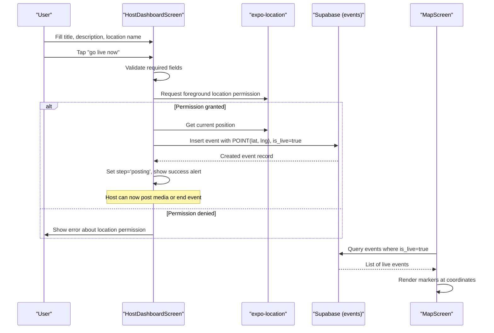
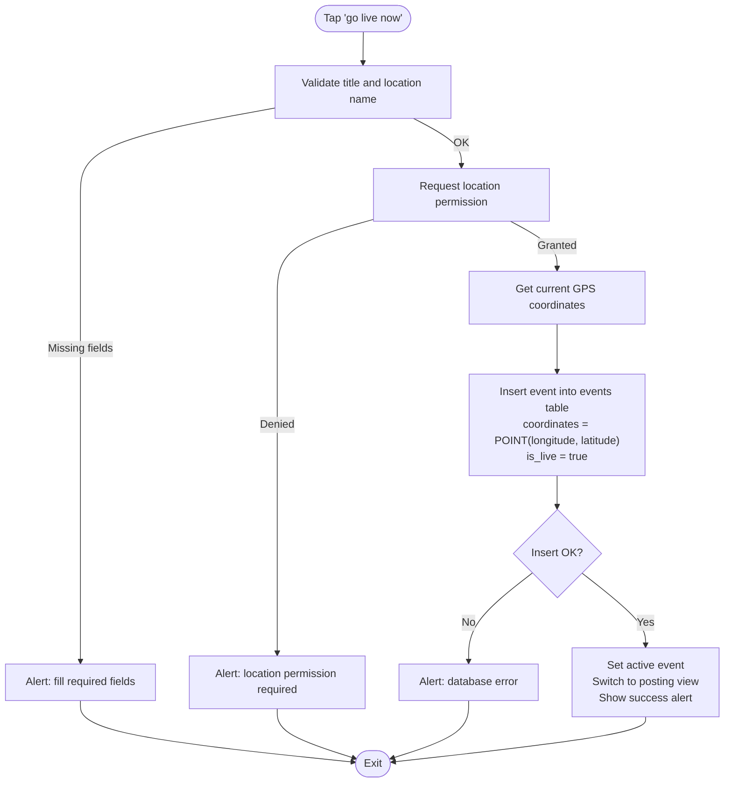
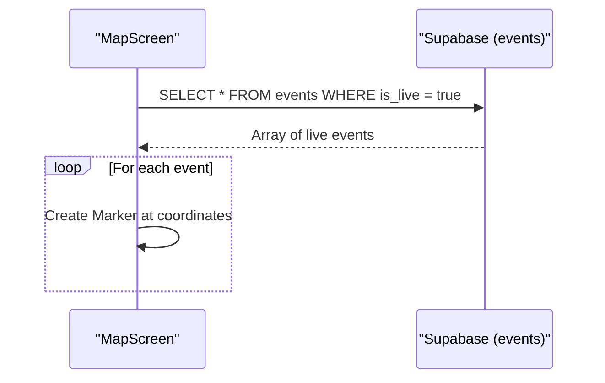
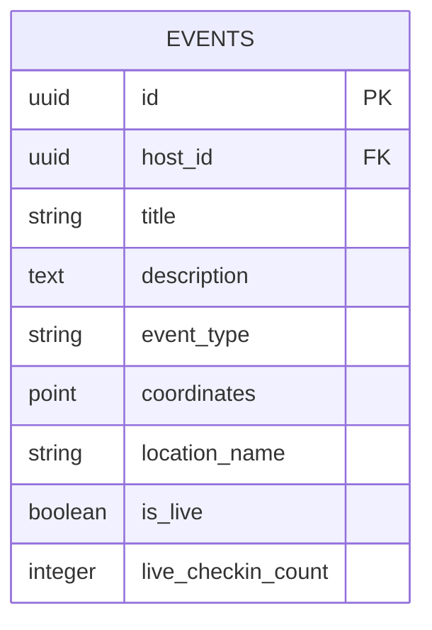
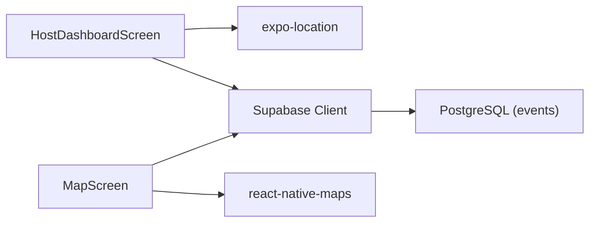

# Event Creation

<cite>
**Referenced Files in This Document**
- [HostDashboardScreen.js](file://src/screens/HostDashboardScreen.js)
- [MapScreen.js](file://src/screens/MapScreen.js)
- [phase6_checkins.sql](file://supabase/sql/sql/phase6_checkins.sql)
</cite>

## Table of Contents
1. [Introduction](#introduction)
2. [Project Structure](#project-structure)
3. [Core Components](#core-components)
4. [Architecture Overview](#architecture-overview)
5. [Detailed Component Analysis](#detailed-component-analysis)
6. [Dependency Analysis](#dependency-analysis)
7. [Performance Considerations](#performance-considerations)
8. [Troubleshooting Guide](#troubleshooting-guide)
9. [Conclusion](#conclusion)

## Introduction
This document explains how users create and publish new events from the HostDashboardScreen. It covers the form inputs (title, description, location name), the goLive() function that captures GPS coordinates, handles location permissions, inserts a new event into the database using PostgreSQL’s POINT type, and transitions the UI to a live state where hosts can post media and end the event. It also documents error handling for missing fields, denied location permissions, and database errors, and shows how created events appear on the map.

## Project Structure
The event creation flow spans:
- HostDashboardScreen: host-facing form and goLive() logic
- MapScreen: displays live events and navigates to the host dashboard
- Database schema (SQL): defines the events table and related policies used by the app

**Diagram sources**
- [HostDashboardScreen.js:51-86](file://src/screens/HostDashboardScreen.js#L51-L86)
- [MapScreen.js:23-33](file://src/screens/MapScreen.js#L23-L33)
- [MapScreen.js:48-61](file://src/screens/MapScreen.js#L48-L61)

**Section sources**
- [HostDashboardScreen.js:17-86](file://src/screens/HostDashboardScreen.js#L17-L86)
- [MapScreen.js:23-33](file://src/screens/MapScreen.js#L23-L33)

## Core Components
- HostDashboardScreen
  - Form fields: title, description, location name
  - State management: step, activeEvent, loading, userId
  - goLive(): validates inputs, requests location permission, fetches GPS, inserts event, updates UI
  - Post and End flows: posting media and ending an event
- MapScreen
  - Fetches live events and renders markers at stored coordinates
- Database (PostgreSQL via Supabase)
  - events table includes columns such as host_id, title, description, event_type, coordinates (POINT), location_name, is_live, and live_checkin_count
  - Policies and triggers manage check-ins and counts

**Section sources**
- [HostDashboardScreen.js:17-86](file://src/screens/HostDashboardScreen.js#L17-L86)
- [MapScreen.js:23-33](file://src/screens/MapScreen.js#L23-L33)
- [phase6_checkins.sql:5-6](file://supabase/sql/sql/phase6_checkins.sql#L5-L6)

## Architecture Overview
End-to-end flow from creating an event to it appearing on the map:

**Diagram sources**
- [HostDashboardScreen.js:51-86](file://src/screens/HostDashboardScreen.js#L51-L86)
- [MapScreen.js:23-33](file://src/screens/MapScreen.js#L23-L33)
- [MapScreen.js:48-61](file://src/screens/MapScreen.js#L48-L61)

## Detailed Component Analysis

### HostDashboardScreen: Form and goLive()
- Inputs
  - Title: required
  - Location name: required
  - Description: optional
- Validation
  - If title or location name are empty, an error alert is shown and insertion is aborted
- Location permission and GPS capture
  - Requests foreground location permission; if not granted, shows an error and aborts
  - Retrieves current GPS coordinates
- Database insertion
  - Inserts a new event row with:
    - host_id: current user id
    - title, description, event_type: 'popup'
    - coordinates: formatted as PostgreSQL POINT using longitude and latitude
    - location_name: provided by the user
    - is_live: true
  - On success, sets the active event and switches UI to the posting phase
- Error handling
  - Missing fields: alerts user and stops
  - Denied location permission: alerts user and stops
  - Database errors: caught and displayed via alert
- UI transition
  - After successful creation, step changes to 'posting', enabling media upload and event end actions

**Diagram sources**
- [HostDashboardScreen.js:51-86](file://src/screens/HostDashboardScreen.js#L51-L86)

**Section sources**
- [HostDashboardScreen.js:51-86](file://src/screens/HostDashboardScreen.js#L51-L86)
- [HostDashboardScreen.js:145-183](file://src/screens/HostDashboardScreen.js#L145-L183)

### MapScreen: Displaying Live Events
- Fetches all events where is_live is true
- Renders markers using coordinates stored in the events table
- Navigates to HostDashboardScreen via a “+ go live” button

**Diagram sources**
- [MapScreen.js:23-33](file://src/screens/MapScreen.js#L23-L33)
- [MapScreen.js:48-61](file://src/screens/MapScreen.js#L48-L61)

**Section sources**
- [MapScreen.js:23-33](file://src/screens/MapScreen.js#L23-L33)
- [MapScreen.js:48-61](file://src/screens/MapScreen.js#L48-L61)

### Database Schema and Data Model
- events table
  - Includes columns for host identification, title, description, event_type, coordinates (PostgreSQL POINT), location_name, is_live, and live_checkin_count
  - Coordinates are stored as POINT(longitude, latitude)
- Check-in policy and trigger
  - Ensures only nearby users can check in to live events and keeps live_checkin_count synchronized

**Diagram sources**
- [phase6_checkins.sql:5-6](file://supabase/sql/sql/phase6_checkins.sql#L5-L6)

**Section sources**
- [phase6_checkins.sql:5-6](file://supabase/sql/sql/phase6_checkins.sql#L5-L6)

## Dependency Analysis
- HostDashboardScreen depends on:
  - expo-location for permission and GPS
  - Supabase client for authentication, querying, and inserting into events
  - React Native components for UI and navigation
- MapScreen depends on:
  - Supabase client to fetch live events
  - react-native-maps to render markers
- Database dependencies:
  - PostgreSQL POINT type for coordinates
  - Policies and triggers for check-in proximity and count synchronization

**Diagram sources**
- [HostDashboardScreen.js:1-15](file://src/screens/HostDashboardScreen.js#L1-L15)
- [MapScreen.js:1-6](file://src/screens/MapScreen.js#L1-L6)

**Section sources**
- [HostDashboardScreen.js:1-15](file://src/screens/HostDashboardScreen.js#L1-L15)
- [MapScreen.js:1-6](file://src/screens/MapScreen.js#L1-L6)

## Performance Considerations
- Minimize redundant network calls: cache active event state locally while hosting
- Batch operations where possible (e.g., multiple posts per event)
- Use efficient queries: select only needed fields when fetching events
- Handle large images efficiently: compress before upload and store URLs rather than embedding media in the event row

[No sources needed since this section provides general guidance]

## Troubleshooting Guide
- Missing required fields
  - Symptom: Alert prompts to fill title and location name; no event created
  - Resolution: Ensure both fields are non-empty before tapping “go live now”
- Location permission denied
  - Symptom: Alert indicates location permission is required; process stops
  - Resolution: Grant foreground location permission in device settings or app prompt
- Database insert errors
  - Symptom: Alert shows database error message; event not created
  - Resolution: Check network connectivity, Supabase configuration, and ensure required columns exist and constraints are satisfied
- Event not visible on map
  - Symptom: No marker appears after going live
  - Resolution: Verify is_live is true and coordinates are valid POINT values; confirm MapScreen queries events with is_live=true

**Section sources**
- [HostDashboardScreen.js:51-86](file://src/screens/HostDashboardScreen.js#L51-L86)
- [MapScreen.js:23-33](file://src/screens/MapScreen.js#L23-L33)

## Conclusion
The HostDashboardScreen provides a streamlined workflow for hosts to create and publish events. The goLive() function enforces input validation, secures location access, captures GPS coordinates, and persists the event with a PostgreSQL POINT coordinate and is_live flag. Once created, events are immediately discoverable on the MapScreen, enabling real-time discovery and interaction. Robust error handling ensures clear feedback for common issues like missing fields, denied permissions, and database failures.

[No sources needed since this section summarizes without analyzing specific files]