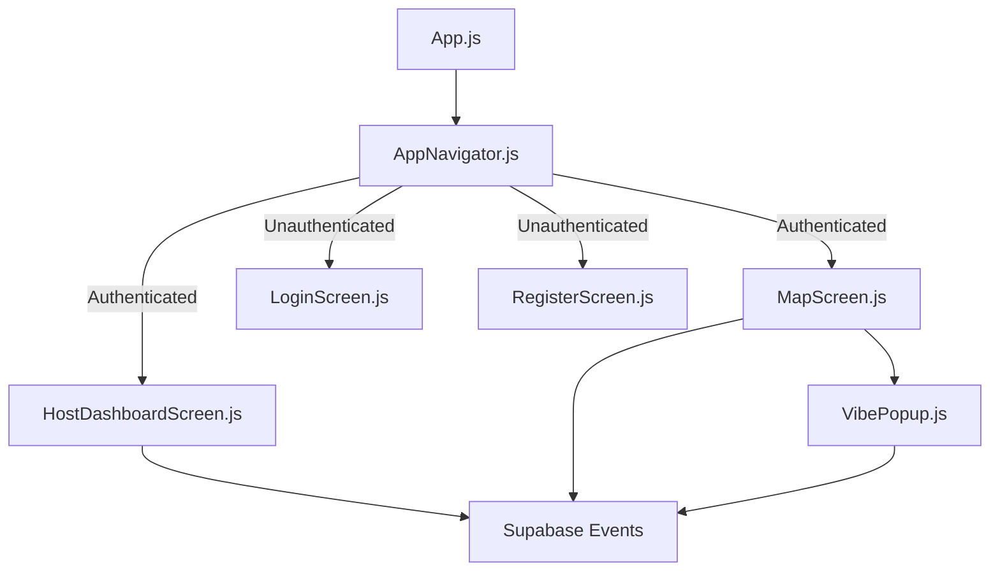
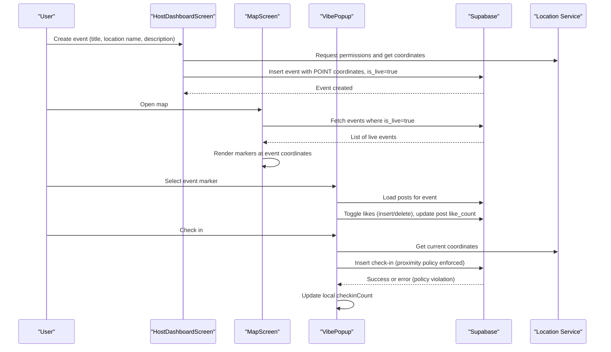
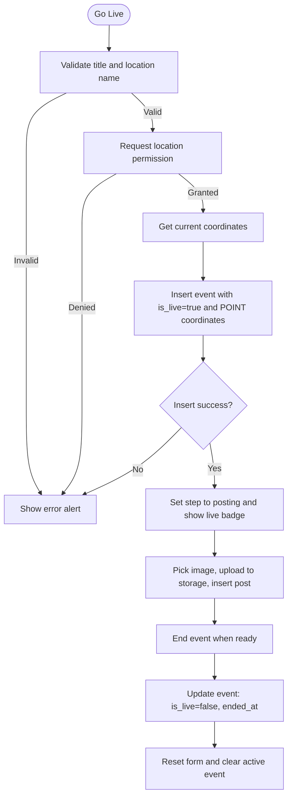
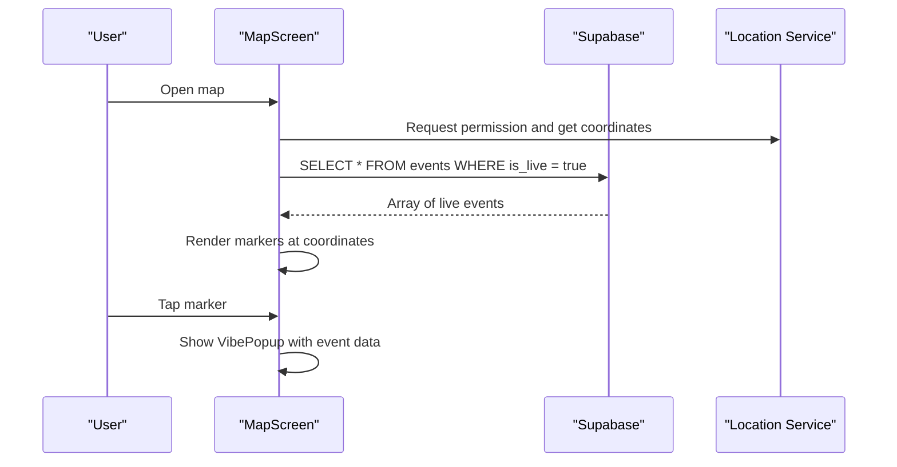
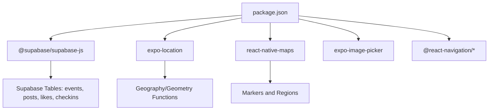

# Event Management

<cite>
**Referenced Files in This Document**
- [App.js](file://App.js)
- [AppNavigator.js](file://src/navigation/AppNavigator.js)
- [HostDashboardScreen.js](file://src/screens/HostDashboardScreen.js)
- [MapScreen.js](file://src/screens/MapScreen.js)
- [VibePopup.js](file://src/components/VibePopup.js)
- [useAuth.js](file://src/hooks/useAuth.js)
- [LoginScreen.js](file://src/screens/LoginScreen.js)
- [phase6_checkins.sql](file://supabase/sql/sql/phase6_checkins.sql)
- [package.json](file://package.json)
</cite>

## Table of Contents
1. [Introduction](#introduction)
2. [Project Structure](#project-structure)
3. [Core Components](#core-components)
4. [Architecture Overview](#architecture-overview)
5. [Detailed Component Analysis](#detailed-component-analysis)
6. [Dependency Analysis](#dependency-analysis)
7. [Performance Considerations](#performance-considerations)
8. [Troubleshooting Guide](#troubleshooting-guide)
9. [Conclusion](#conclusion)

## Introduction
This document explains the event management system that enables hosts to create and manage live events, and allows nearby users to discover and interact with those events on a map interface. It covers the full event lifecycle from creation to termination, the host dashboard for creating and managing live events, the event broadcasting mechanism that makes events visible to nearby users, event data models and status management, real-time updates via check-ins, and discovery mechanisms based on user location and proximity. It also provides examples of CRUD operations, status transitions, and integration with location services for accurate event placement.

## Project Structure
The application is a React Native (Expo) app with navigation-based screens:
- Entry point renders the navigator.
- Navigation routes authenticated users to Map and Host Dashboard; unauthenticated users to Login/Register.
- Screens implement event creation, display, and interaction.
- A database migration defines proximity-gated check-ins and live counts.



**Diagram sources**
- [App.js:1-5](file://App.js#L1-L5)
- [AppNavigator.js:10-39](file://src/navigation/AppNavigator.js#L10-L39)
- [MapScreen.js:1-100](file://src/screens/MapScreen.js#L1-L100)
- [HostDashboardScreen.js:1-305](file://src/screens/HostDashboardScreen.js#L1-L305)
- [VibePopup.js:1-333](file://src/components/VibePopup.js#L1-L333)

**Section sources**
- [App.js:1-5](file://App.js#L1-L5)
- [AppNavigator.js:10-39](file://src/navigation/AppNavigator.js#L10-L39)

## Core Components
- HostDashboardScreen: Creates live events, posts media content during an active event, and ends events.
- MapScreen: Displays live events as markers on a map using user location and fetches live events from the database.
- VibePopup: Shows event details, posts feed, like interactions, and proximity-gated check-ins that update live counts.
- useAuth: Manages authentication state and guards navigation.
- Database Migration: Enforces proximity rules for check-ins and maintains live check-in counts.

**Section sources**
- [HostDashboardScreen.js:17-143](file://src/screens/HostDashboardScreen.js#L17-L143)
- [MapScreen.js:8-77](file://src/screens/MapScreen.js#L8-L77)
- [VibePopup.js:18-228](file://src/components/VibePopup.js#L18-L228)
- [useAuth.js:4-22](file://src/hooks/useAuth.js#L4-L22)
- [phase6_checkins.sql:1-63](file://supabase/sql/sql/phase6_checkins.sql#L1-L63)

## Architecture Overview
The system integrates UI components with Supabase for data and storage, and uses location services for geospatial features.



**Diagram sources**
- [HostDashboardScreen.js:51-86](file://src/screens/HostDashboardScreen.js#L51-L86)
- [MapScreen.js:23-33](file://src/screens/MapScreen.js#L23-L33)
- [VibePopup.js:48-118](file://src/components/VibePopup.js#L48-L118)
- [phase6_checkins.sql:20-40](file://supabase/sql/sql/phase6_checkins.sql#L20-L40)

## Detailed Component Analysis

### Host Dashboard: Creating and Managing Live Events
- Creation flow:
  - Validates required fields (title, location name).
  - Requests foreground location permission and captures coordinates.
  - Inserts an event row with host_id, title, description, event_type, coordinates (POINT), location_name, and sets is_live=true.
  - On success, switches to posting mode and shows confirmation.
- Posting flow:
  - Picks image, uploads to storage bucket, retrieves public URL, and inserts a post linked to the active event.
- Ending flow:
  - Updates the event to set is_live=false and records ended_at timestamp, then resets UI state.



**Diagram sources**
- [HostDashboardScreen.js:51-86](file://src/screens/HostDashboardScreen.js#L51-L86)
- [HostDashboardScreen.js:88-124](file://src/screens/HostDashboardScreen.js#L88-L124)
- [HostDashboardScreen.js:126-143](file://src/screens/HostDashboardScreen.js#L126-L143)

**Section sources**
- [HostDashboardScreen.js:17-143](file://src/screens/HostDashboardScreen.js#L17-L143)

### Map Screen: Event Discovery and Broadcasting
- Location handling:
  - Requests foreground location permission and stores coordinates.
  - Uses initial region based on user location or fallback defaults.
- Event discovery:
  - Fetches all events where is_live=true and renders them as markers with titles derived from location_name.
  - Taps open VibePopup for selected event.



**Diagram sources**
- [MapScreen.js:13-33](file://src/screens/MapScreen.js#L13-L33)
- [MapScreen.js:35-77](file://src/screens/MapScreen.js#L35-L77)

**Section sources**
- [MapScreen.js:8-77](file://src/screens/MapScreen.js#L8-L77)

### VibePopup: Interactions, Likes, and Proximity-Gated Check-ins
- Posts feed:
  - Loads posts for the selected event ordered by creation time.
  - Loads user’s liked posts to render like states.
- Like toggling:
  - Inserts or deletes a like record and updates post like_count accordingly.
- Check-in:
  - Requires foreground location permission.
  - Inserts a check-in with user_id, event_id, and coordinates.
  - Server-side policy enforces uniqueness per user per event and proximity within 100 meters of a live event using geography distance functions.
  - Trigger increments live_checkin_count on the event.

```mermaid
sequenceDiagram
participant User as "User"
participant Popup as "VibePopup"
participant Supa as "Supabase"
participant Loc as "Location Service"
User->>Popup : Open event popup
Popup->>Supa : Load posts for event
Popup->>Supa : Load user likes for posts
User->>Popup : Tap like
Popup->>Supa : Insert or delete like; update post like_count
User->>Popup : Tap check in
Popup->>Loc : Get current coordinates
Popup->>Supa : Insert check-in (user_id, event_id, coordinates)
Note over Supa : Policy checks is_live and ST_DWithin <= 100m
Supa-->>Popup : Success or error
Popup->>Popup : Increment local checkinCount
```

**Diagram sources**
- [VibePopup.js:48-118](file://src/components/VibePopup.js#L48-L118)
- [phase6_checkins.sql:20-40](file://supabase/sql/sql/phase6_checkins.sql#L20-L40)
- [phase6_checkins.sql:42-63](file://supabase/sql/sql/phase6_checkins.sql#L42-L63)

**Section sources**
- [VibePopup.js:18-228](file://src/components/VibePopup.js#L18-L228)
- [phase6_checkins.sql:1-63](file://supabase/sql/sql/phase6_checkins.sql#L1-L63)

### Authentication and Navigation
- useAuth monitors session state and subscribes to auth changes to reflect logged-in/out status.
- AppNavigator conditionally renders Map/HostDashboard for authenticated users and Login/Register otherwise.

**Section sources**
- [useAuth.js:4-22](file://src/hooks/useAuth.js#L4-L22)
- [AppNavigator.js:10-39](file://src/navigation/AppNavigator.js#L10-L39)

## Dependency Analysis
Key dependencies and their roles:
- @supabase/supabase-js: Client for database queries, storage, and auth.
- expo-location: Foreground location access for event placement and proximity checks.
- react-native-maps: Map rendering and markers for event discovery.
- expo-image-picker: Media selection for event posts.
- Navigation libraries: Route between screens based on auth state.



**Diagram sources**
- [package.json:5-22](file://package.json#L5-L22)
- [phase6_checkins.sql:20-40](file://supabase/sql/sql/phase6_checkins.sql#L20-L40)

**Section sources**
- [package.json:5-22](file://package.json#L5-L22)

## Performance Considerations
- Minimize network calls:
  - Cache fetched events locally while on the map screen to avoid repeated queries.
  - Debounce or throttle location updates if polling becomes necessary.
- Efficient queries:
  - Filter events by is_live to reduce payload size.
  - Use indexes on frequently queried columns such as is_live and host_id if supported by your schema.
- Storage operations:
  - Compress images before upload to reduce bandwidth and storage costs.
- Real-time updates:
  - Consider subscribing to Supabase realtime channels for live event changes and check-in count updates to avoid polling.

[No sources needed since this section provides general guidance]

## Troubleshooting Guide
Common issues and resolutions:
- Location permission denied:
  - Ensure foreground permission is requested before capturing coordinates.
  - Provide user feedback to enable location access.
- Check-in fails due to proximity policy:
  - The server enforces that check-ins must be within 100 meters of a live event using geography distance functions. If rejected, prompt the user to move closer to the venue.
- Duplicate check-in:
  - The unique constraint prevents multiple check-ins per user per event. Handle duplicate errors gracefully by marking the user as checked in.
- Event not appearing on map:
  - Verify that is_live is set to true when creating the event and that coordinates are valid POINT values.
- Storage upload errors:
  - Confirm storage bucket configuration and permissions for the posts bucket.

**Section sources**
- [HostDashboardScreen.js:51-86](file://src/screens/HostDashboardScreen.js#L51-L86)
- [VibePopup.js:82-118](file://src/components/VibePopup.js#L82-L118)
- [phase6_checkins.sql:20-40](file://supabase/sql/sql/phase6_checkins.sql#L20-L40)

## Conclusion
The event management system provides a complete lifecycle for creating, broadcasting, and terminating live events, with robust location-based discovery and interaction. Hosts can launch events with precise coordinates and manage them through a dedicated dashboard. Users discover events on a map, view posts, like content, and perform proximity-gated check-ins that update live counts. The architecture leverages Supabase for data and storage, Expo location services for geospatial features, and React Navigation for routing based on authentication state.

[No sources needed since this section summarizes without analyzing specific files]