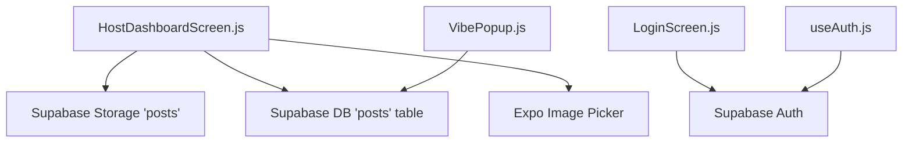
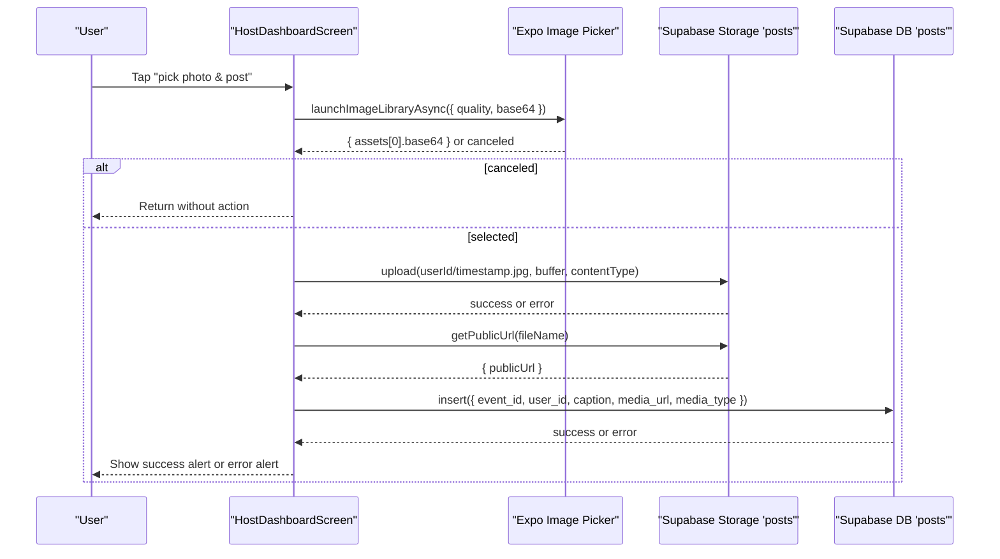
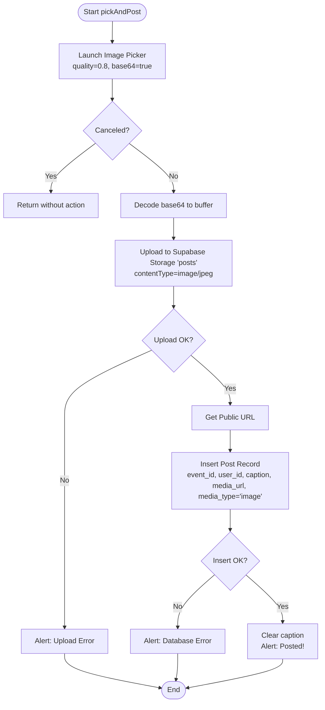
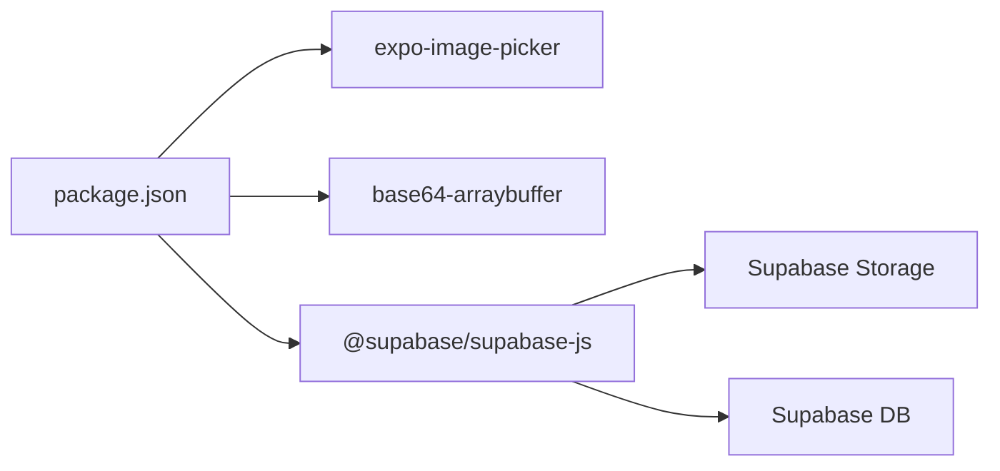

# Event Posting

<cite>
**Referenced Files in This Document**
- [HostDashboardScreen.js](file://src/screens/HostDashboardScreen.js)
- [VibePopup.js](file://src/components/VibePopup.js)
- [LoginScreen.js](file://src/screens/LoginScreen.js)
- [useAuth.js](file://src/hooks/useAuth.js)
- [package.json](file://package.json)
- [phase6_checkins.sql](file://supabase/sql/sql/phase6_checkins.sql)
</cite>

## Table of Contents
1. [Introduction](#introduction)
2. [Project Structure](#project-structure)
3. [Core Components](#core-components)
4. [Architecture Overview](#architecture-overview)
5. [Detailed Component Analysis](#detailed-component-analysis)
6. [Dependency Analysis](#dependency-analysis)
7. [Performance Considerations](#performance-considerations)
8. [Troubleshooting Guide](#troubleshooting-guide)
9. [Conclusion](#conclusion)

## Introduction
This document explains the event posting system that allows hosts to share photos and captions during live events. It focuses on the pickAndPost() function, which orchestrates image selection via Expo Image Picker, base64 decoding, uploading images to a Supabase storage bucket, generating public URLs, and creating database records that link posts to events. It also covers error handling for user cancellations, upload failures, and database operations, and provides a complete workflow example from image selection to successful publication.

## Project Structure
The posting feature is implemented primarily in the host dashboard screen, with supporting components for authentication and post consumption:
- HostDashboardScreen handles going live and posting media during an active event.
- VibePopup displays posts associated with an event and supports likes.
- LoginScreen and useAuth manage authentication state used by posting flows.
- package.json lists dependencies including Expo Image Picker and Supabase client.
- phase6_checkins.sql shows related database schema changes for check-ins (contextual).

**Diagram sources**
- [HostDashboardScreen.js:88-124](file://src/screens/HostDashboardScreen.js#L88-L124)
- [VibePopup.js:48-58](file://src/components/VibePopup.js#L48-L58)
- [LoginScreen.js:10-15](file://src/screens/LoginScreen.js#L10-L15)
- [useAuth.js:8-18](file://src/hooks/useAuth.js#L8-L18)

**Section sources**
- [HostDashboardScreen.js:17-49](file://src/screens/HostDashboardScreen.js#L17-L49)
- [VibePopup.js:18-58](file://src/components/VibePopup.js#L18-L58)
- [LoginScreen.js:5-15](file://src/screens/LoginScreen.js#L5-L15)
- [useAuth.js:4-22](file://src/hooks/useAuth.js#L4-L22)
- [package.json:5-22](file://package.json#L5-L22)

## Core Components
- HostDashboardScreen: Manages event lifecycle and the pickAndPost() flow for uploading images and creating posts linked to an active event.
- VibePopup: Consumes posts for a given event and renders them with captions and like counts.
- Authentication helpers: LoginScreen and useAuth provide session context required for uploads and inserts.

Key responsibilities:
- Image selection and compression via Expo Image Picker options.
- Base64 decoding to binary buffer for upload.
- Upload to Supabase storage bucket named "posts".
- Generate public URL for the uploaded asset.
- Insert a post record linking to the active event and storing caption and media URL.

**Section sources**
- [HostDashboardScreen.js:88-124](file://src/screens/HostDashboardScreen.js#L88-L124)
- [VibePopup.js:48-58](file://src/components/VibePopup.js#L48-L58)
- [LoginScreen.js:10-15](file://src/screens/LoginScreen.js#L10-L15)
- [useAuth.js:8-18](file://src/hooks/useAuth.js#L8-L18)

## Architecture Overview
The posting workflow integrates UI, image picker, storage, and database layers:

**Diagram sources**
- [HostDashboardScreen.js:88-124](file://src/screens/HostDashboardScreen.js#L88-L124)

## Detailed Component Analysis

### pickAndPost() Function
Responsibilities:
- Launch image library with editing enabled and quality set to 0.8 to compress images.
- Request base64 output for immediate processing.
- Handle cancellation gracefully by returning early.
- Decode base64 string into a binary buffer using base64-arraybuffer.
- Upload to Supabase storage bucket "posts" with content type image/jpeg.
- Retrieve a public URL for the uploaded file.
- Create a post record in the database with event_id, user_id, caption, media_url, and media_type set to "image".
- Provide user feedback via alerts and clear the caption input on success.

Error handling:
- If the user cancels selection, the function returns without further action.
- Upload errors are caught and surfaced to the user via an alert.
- Database insertion errors are caught and surfaced to the user via an alert.
- Loading state is managed to disable repeated submissions during network operations.

**Diagram sources**
- [HostDashboardScreen.js:88-124](file://src/screens/HostDashboardScreen.js#L88-L124)

**Section sources**
- [HostDashboardScreen.js:88-124](file://src/screens/HostDashboardScreen.js#L88-L124)

### File Upload Process
- Image compression: Handled by setting quality to 0.8 in the image picker configuration.
- Storage bucket organization: Files are stored under a "posts" bucket with filenames organized by userId and timestamp to avoid collisions.
- Content type: Explicitly set to image/jpeg for proper handling.
- Public URL generation: After upload, a public URL is retrieved for display and persistence in the database.
- Database record creation: A new post row is inserted linking to the active event and containing the media URL and caption.

**Section sources**
- [HostDashboardScreen.js:88-124](file://src/screens/HostDashboardScreen.js#L88-L124)

### Database Record Creation and Linking
- The post record includes:
  - event_id: Links the post to the currently active event.
  - user_id: Identifies the host who created the post.
  - caption: Optional text accompanying the image.
  - media_url: Public URL of the uploaded image.
  - media_type: Set to "image" to distinguish media types.
- Posts are later consumed by VibePopup to render event media.

**Section sources**
- [HostDashboardScreen.js:108-117](file://src/screens/HostDashboardScreen.js#L108-L117)
- [VibePopup.js:48-58](file://src/components/VibePopup.js#L48-L58)

### Error Handling Patterns
- Cancellation: Early return when image selection is canceled.
- Upload failure: Errors from storage upload are caught and shown to the user.
- Database failure: Errors from inserting the post are caught and shown to the user.
- Consistent UX: Alerts inform users of success or failure; loading state prevents duplicate actions.

**Section sources**
- [HostDashboardScreen.js:95-124](file://src/screens/HostDashboardScreen.js#L95-L124)

### Complete Posting Workflow Example
Step-by-step:
1. Host navigates to the live event screen after going live.
2. Host enters an optional caption and taps "pick photo & post".
3. Expo Image Picker opens; host selects an image or cancels.
4. If selected, the image is compressed (quality 0.8) and converted to base64.
5. The app decodes base64 to a binary buffer and uploads it to the "posts" bucket.
6. On successful upload, a public URL is generated.
7. The app inserts a post record linking to the active event with the media URL and caption.
8. On success, the caption is cleared and a success alert is shown; on failure, an error alert is displayed.

**Section sources**
- [HostDashboardScreen.js:88-124](file://src/screens/HostDashboardScreen.js#L88-L124)

## Dependency Analysis
External dependencies relevant to posting:
- expo-image-picker: Provides image selection and compression options.
- base64-arraybuffer: Decodes base64 strings to binary buffers for upload.
- @supabase/supabase-js: Client for storage and database operations.

**Diagram sources**
- [package.json:5-22](file://package.json#L5-L22)

**Section sources**
- [package.json:5-22](file://package.json#L5-L22)

## Performance Considerations
- Image compression: Using quality 0.8 reduces payload size and speeds up uploads while maintaining acceptable visual quality.
- Base64 conversion: Converting to base64 before upload adds CPU overhead; consider evaluating direct binary upload if performance becomes critical.
- Network latency: Uploading and inserting are sequential; ensure robust error handling and user feedback to mitigate perceived slowness.
- Storage naming: Organizing files by userId and timestamp avoids collisions and simplifies retrieval.

[No sources needed since this section provides general guidance]

## Troubleshooting Guide
Common issues and resolutions:
- Image selection canceled: The function returns early; no action is taken. Ensure the user intentionally cancels and try again.
- Upload fails: Check network connectivity and Supabase storage permissions. The app will show an error alert with the message.
- Database insert fails: Verify that the active event exists and the user has permission to insert posts. Errors are surfaced via alerts.
- Location permission not granted: When going live, location permission is required; ensure permissions are granted before starting an event.

**Section sources**
- [HostDashboardScreen.js:51-86](file://src/screens/HostDashboardScreen.js#L51-L86)
- [HostDashboardScreen.js:88-124](file://src/screens/HostDashboardScreen.js#L88-L124)
- [LoginScreen.js:10-15](file://src/screens/LoginScreen.js#L10-L15)

## Conclusion
The event posting system enables hosts to quickly capture and publish photos with captions during live events. The pickAndPost() function coordinates image selection, compression, storage upload, URL generation, and database record creation, with clear error handling and user feedback. By organizing uploads per user and linking posts to events, the system ensures scalable and traceable media management for live experiences.