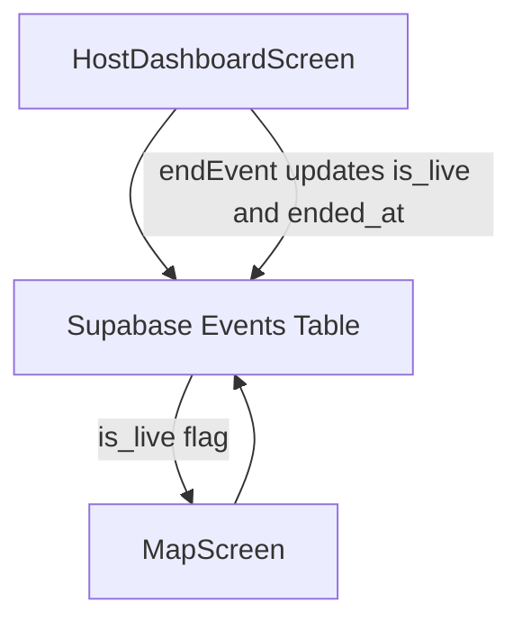
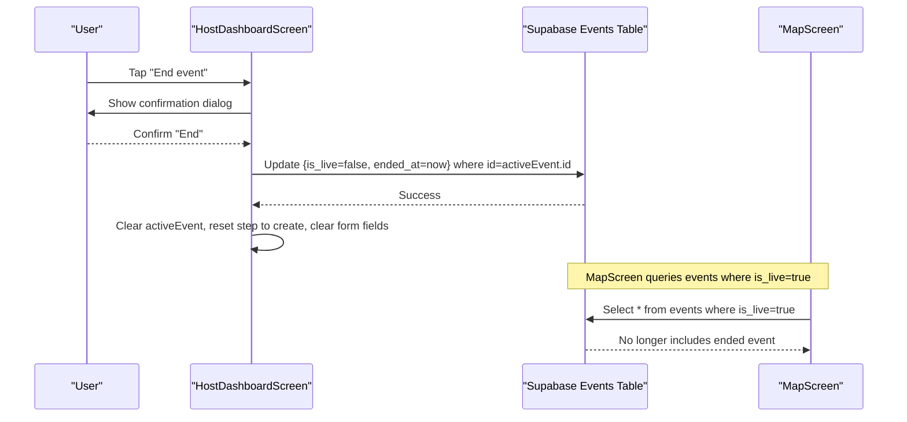
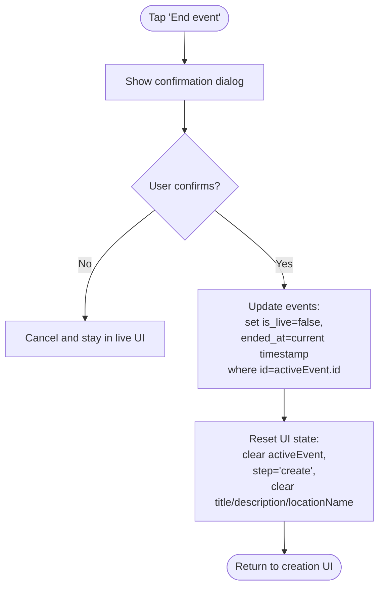
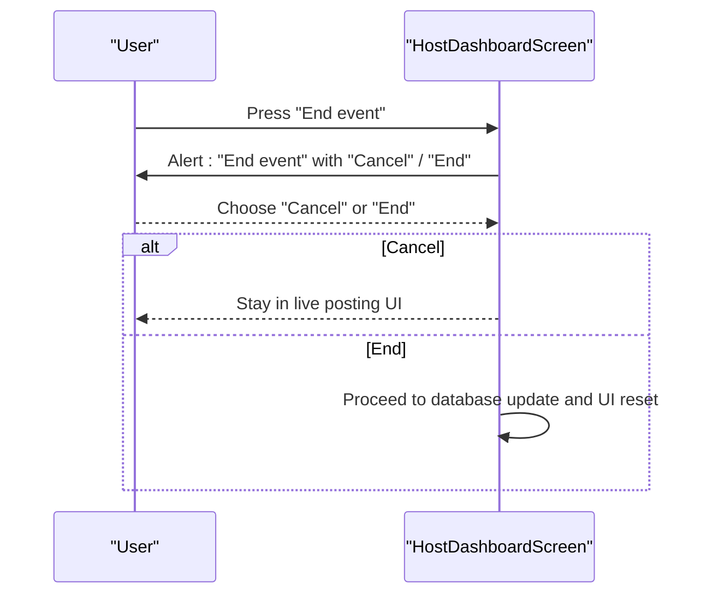
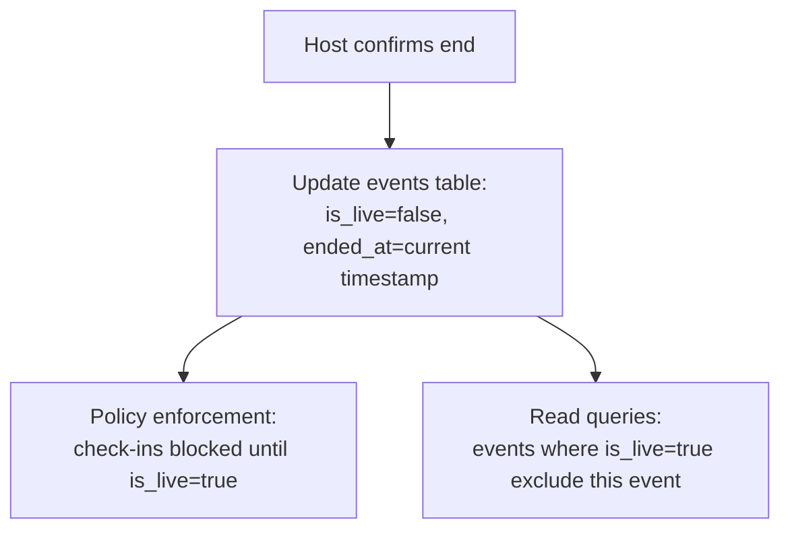
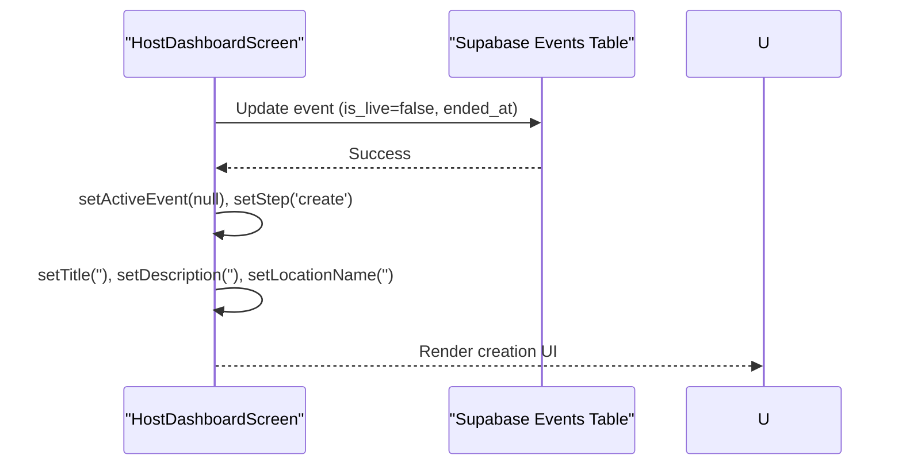
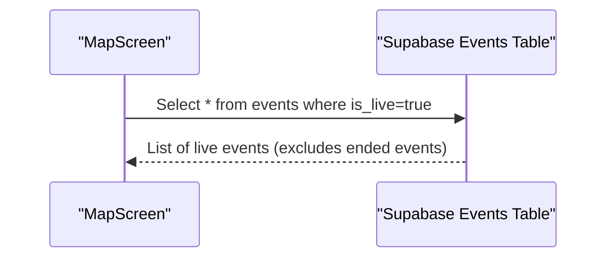
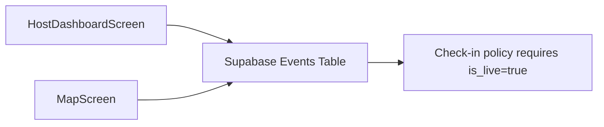

# Event Termination

<cite>
**Referenced Files in This Document**
- [HostDashboardScreen.js](file://src/screens/HostDashboardScreen.js)
- [MapScreen.js](file://src/screens/MapScreen.js)
- [phase6_checkins.sql](file://supabase/sql/sql/phase6_checkins.sql)
</cite>

## Table of Contents
1. [Introduction](#introduction)
2. [Project Structure](#project-structure)
3. [Core Components](#core-components)
4. [Architecture Overview](#architecture-overview)
5. [Detailed Component Analysis](#detailed-component-analysis)
6. [Dependency Analysis](#dependency-analysis)
7. [Performance Considerations](#performance-considerations)
8. [Troubleshooting Guide](#troubleshooting-guide)
9. [Conclusion](#conclusion)

## Introduction
This document explains the event termination functionality that allows a host to end their live event. It focuses on the endEvent() function, which:
- Prompts the user with a confirmation dialog
- Updates the database to mark the event as not live and record the ended_at timestamp
- Resets the UI state back to the event creation interface

It also describes how ending an event affects other parts of the system, such as the map view that only shows live events.

## Project Structure
The event termination flow spans a single screen component and interacts with the database layer via Supabase. The map screen consumes the live status of events to determine what to display.

**Diagram sources**
- [HostDashboardScreen.js:126-143](file://src/screens/HostDashboardScreen.js#L126-L143)
- [MapScreen.js:23-33](file://src/screens/MapScreen.js#L23-L33)

**Section sources**
- [HostDashboardScreen.js:126-143](file://src/screens/HostDashboardScreen.js#L126-L143)
- [MapScreen.js:23-33](file://src/screens/MapScreen.js#L23-L33)

## Core Components
- HostDashboardScreen: Implements goLive(), posting workflow, and endEvent(). It manages local state for active events and form fields, and renders either the creation or live posting UI based on step and activeEvent.
- MapScreen: Displays markers for events where is_live is true. When an event ends, it will no longer be fetched or shown.
- Database schema (events): Includes is_live and ended_at fields used to track live status and termination time. Additional logic enforces that check-ins can only occur when is_live is true.

Key responsibilities:
- User confirmation before ending an event
- Updating event status and recording termination time
- Resetting UI state to allow creating a new event

**Section sources**
- [HostDashboardScreen.js:17-49](file://src/screens/HostDashboardScreen.js#L17-L49)
- [HostDashboardScreen.js:126-143](file://src/screens/HostDashboardScreen.js#L126-L143)
- [MapScreen.js:23-33](file://src/screens/MapScreen.js#L23-L33)
- [phase6_checkins.sql:20-40](file://supabase/sql/sql/phase6_checkins.sql#L20-L40)

## Architecture Overview
The termination flow is a simple client-to-database update with immediate UI feedback and downstream effects on read queries.

**Diagram sources**
- [HostDashboardScreen.js:126-143](file://src/screens/HostDashboardScreen.js#L126-L143)
- [MapScreen.js:23-33](file://src/screens/MapScreen.js#L23-L33)

## Detailed Component Analysis

### endEvent() Function: Confirmation, Database Update, and UI Reset
- Confirmation dialog: Presents a two-option alert allowing cancellation or proceeding to end the event.
- Database update: Sets is_live to false and records ended_at as the current timestamp for the active event.
- UI reset: Clears the active event, switches the step back to create, and clears form inputs so the host can start a new event immediately.

**Diagram sources**
- [HostDashboardScreen.js:126-143](file://src/screens/HostDashboardScreen.js#L126-L143)

**Section sources**
- [HostDashboardScreen.js:126-143](file://src/screens/HostDashboardScreen.js#L126-L143)

### User Confirmation Flow
- The host taps the “End event” button in the live posting UI.
- A confirmation dialog appears with options to cancel or confirm ending the event.
- If canceled, the host remains in the live posting UI.
- If confirmed, the termination process proceeds.

**Diagram sources**
- [HostDashboardScreen.js:126-143](file://src/screens/HostDashboardScreen.js#L126-L143)

**Section sources**
- [HostDashboardScreen.js:126-143](file://src/screens/HostDashboardScreen.js#L126-L143)

### Database Operations for Event Closure
- The update sets is_live to false and records ended_at with the current timestamp for the specific event being ended.
- This change prevents further check-ins because policies require is_live to be true for check-in operations.
- It also removes the event from the set of live events returned by queries filtering on is_live=true.

**Diagram sources**
- [HostDashboardScreen.js:126-143](file://src/screens/HostDashboardScreen.js#L126-L143)
- [phase6_checkins.sql:20-40](file://supabase/sql/sql/phase6_checkins.sql#L20-L40)

**Section sources**
- [HostDashboardScreen.js:126-143](file://src/screens/HostDashboardScreen.js#L126-L143)
- [phase6_checkins.sql:20-40](file://supabase/sql/sql/phase6_checkins.sql#L20-L40)

### Cleanup of Active Event State and Transition Back to Creation Interface
- After updating the database, the component clears the active event reference and resets the step to the creation phase.
- Form fields (title, description, location name) are cleared to provide a clean slate for starting a new event.
- The UI re-renders to show the creation interface instead of the live posting interface.

**Diagram sources**
- [HostDashboardScreen.js:126-143](file://src/screens/HostDashboardScreen.js#L126-L143)

**Section sources**
- [HostDashboardScreen.js:126-143](file://src/screens/HostDashboardScreen.js#L126-L143)

### Impact on Map Display
- The map screen fetches events where is_live is true. Once an event is ended, it will no longer appear on the map.
- This ensures users only see currently active events.

**Diagram sources**
- [MapScreen.js:23-33](file://src/screens/MapScreen.js#L23-L33)

**Section sources**
- [MapScreen.js:23-33](file://src/screens/MapScreen.js#L23-L33)

## Dependency Analysis
- HostDashboardScreen depends on Supabase to persist event state changes and to detect existing active events on load.
- MapScreen depends on the same events table to filter visible markers by is_live.
- Database policies enforce that check-ins can only happen when is_live is true, ensuring consistency between termination and user interactions.

**Diagram sources**
- [HostDashboardScreen.js:126-143](file://src/screens/HostDashboardScreen.js#L126-L143)
- [MapScreen.js:23-33](file://src/screens/MapScreen.js#L23-L33)
- [phase6_checkins.sql:20-40](file://supabase/sql/sql/phase6_checkins.sql#L20-L40)

**Section sources**
- [HostDashboardScreen.js:126-143](file://src/screens/HostDashboardScreen.js#L126-L143)
- [MapScreen.js:23-33](file://src/screens/MapScreen.js#L23-L33)
- [phase6_checkins.sql:20-40](file://supabase/sql/sql/phase6_checkins.sql#L20-L40)

## Performance Considerations
- The termination operation performs a single targeted update on the events table, which is efficient.
- MapScreen queries only live events; after termination, the result set shrinks, reducing rendering overhead.
- Avoid unnecessary re-fetching by relying on the immediate UI state reset in the host screen; consider adding optimistic UI updates if real-time sync is desired across clients.

[No sources needed since this section provides general guidance]

## Troubleshooting Guide
- If the event does not disappear from the map after ending:
  - Verify the update executed successfully and that ended_at was recorded.
  - Ensure the map screen’s query filters on is_live=true.
- If check-ins still work after ending:
  - Confirm the database policy requires is_live=true for check-ins.
  - Validate that the update set is_live=false for the correct event id.
- If the UI does not return to the creation screen:
  - Check that the step is set to 'create' and activeEvent is cleared.
  - Ensure form fields are reset to empty strings.

**Section sources**
- [MapScreen.js:23-33](file://src/screens/MapScreen.js#L23-L33)
- [phase6_checkins.sql:20-40](file://supabase/sql/sql/phase6_checkins.sql#L20-L40)
- [HostDashboardScreen.js:126-143](file://src/screens/HostDashboardScreen.js#L126-L143)

## Conclusion
The endEvent() function provides a safe and straightforward way for hosts to terminate live events. It uses a confirmation dialog to prevent accidental closures, updates the database to mark the event as inactive and record the termination time, and resets the UI to the creation interface. Ending an event also removes it from the map view and blocks further check-ins due to database policies requiring is_live to be true.

[No sources needed since this section summarizes without analyzing specific files]