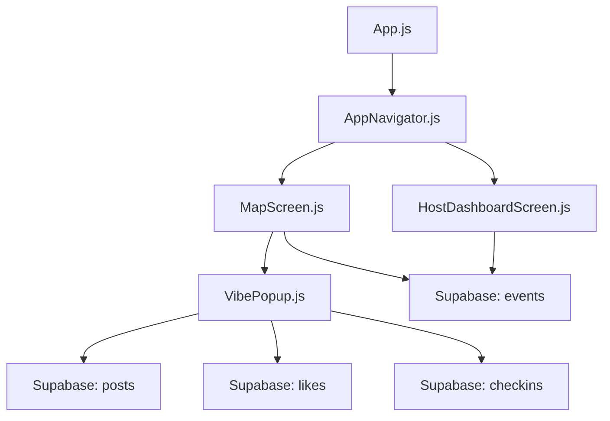
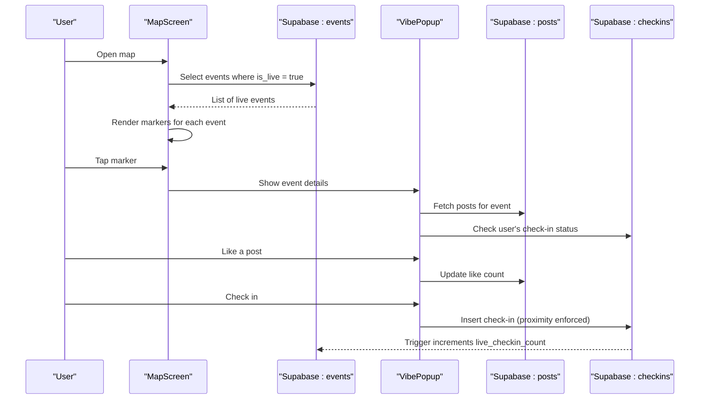
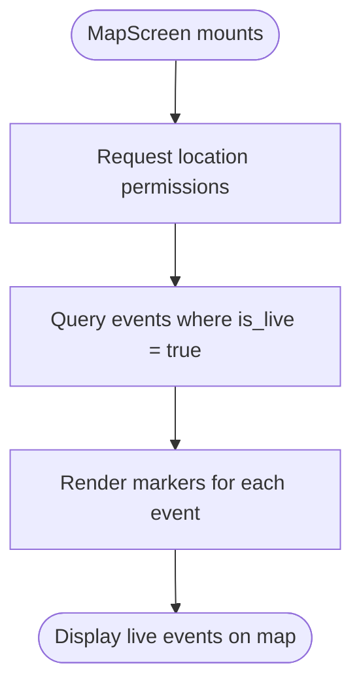
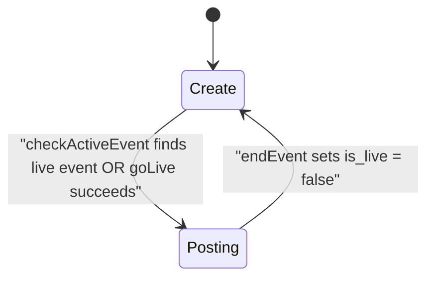
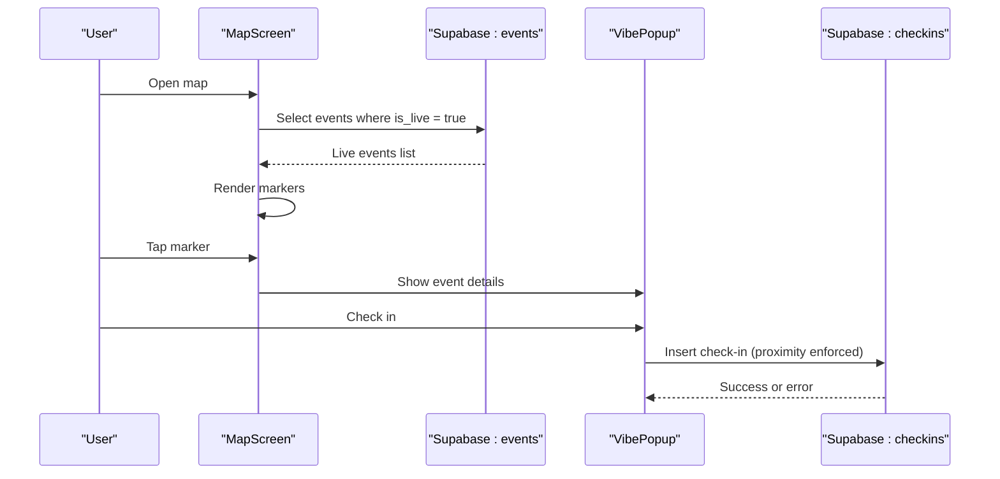
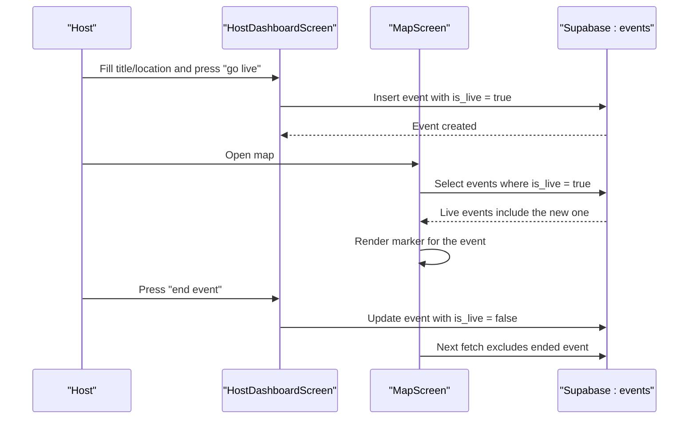
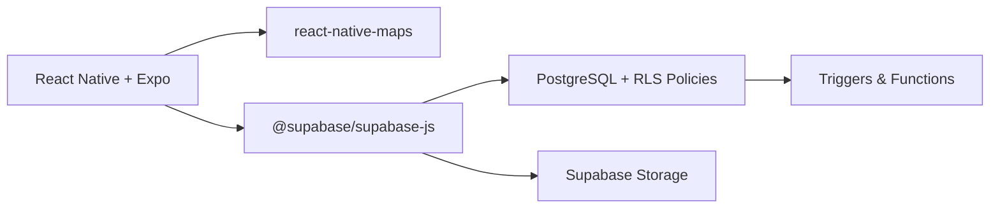
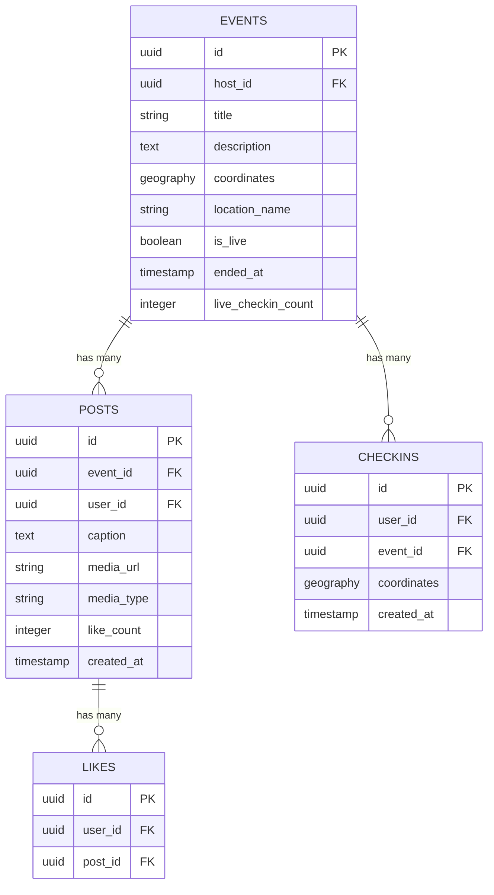

# Live Broadcasting

<cite>
**Referenced Files in This Document**
- [App.js](file://App.js)
- [AppNavigator.js](file://src/navigation/AppNavigator.js)
- [MapScreen.js](file://src/screens/MapScreen.js)
- [HostDashboardScreen.js](file://src/screens/HostDashboardScreen.js)
- [VibePopup.js](file://src/components/VibePopup.js)
- [phase6_checkins.sql](file://supabase/sql/sql/phase6_checkins.sql)
- [package.json](file://package.json)
</cite>

## Table of Contents
1. Introduction
2. Project Structure
3. Core Components
4. Architecture Overview
5. Detailed Component Analysis
6. Dependency Analysis
7. Performance Considerations
8. Troubleshooting Guide
9. Conclusion
10. Appendices

## Introduction
This document explains the live broadcasting system that makes events visible to nearby users on a map interface. It focuses on how the is_live flag controls event visibility and real-time updates, how active events are detected via checkActiveEvent(), and how UI states transition between create and posting modes. It also details how other users discover live events through MapScreen, how proximity-based interactions work (including check-ins), and how the host dashboard integrates with map discovery features.

## Project Structure
The application is a React Native app using Expo and Supabase for data and storage. The navigation routes authenticated users to a map screen where they can discover live events and hosts to a dashboard where they can start and manage live events.

**Diagram sources**
- [App.js:1-5](file://App.js#L1-L5)
- [AppNavigator.js:1-40](file://src/navigation/AppNavigator.js#L1-L40)
- [MapScreen.js:1-100](file://src/screens/MapScreen.js#L1-L100)
- [HostDashboardScreen.js:1-305](file://src/screens/HostDashboardScreen.js#L1-L305)
- [VibePopup.js:1-333](file://src/components/VibePopup.js#L1-L333)

**Section sources**
- [App.js:1-5](file://App.js#L1-L5)
- [AppNavigator.js:1-40](file://src/navigation/AppNavigator.js#L1-L40)
- [package.json:1-32](file://package.json#L1-L32)

## Core Components
- MapScreen: Displays nearby live events as markers and opens a detail popup for each event. It fetches only events marked as live.
- HostDashboardScreen: Allows hosts to create an event, go live, post media during the event, and end the event. It detects existing live events via checkActiveEvent() and switches UI state accordingly.
- VibePopup: Shows event details, posts, like counts, and enables proximity-gated check-ins. It updates local state when posts or likes change.
- Database policies and triggers: Enforce that check-ins occur only near a live event and keep the live_checkin_count synchronized.

Key responsibilities:
- Visibility control: is_live determines whether an event appears on the map.
- State transitions: create vs posting states in the host dashboard based on active event detection.
- Discovery: MapScreen filters events by is_live and renders them as markers.
- Proximity: Check-ins require being within a defined distance of a live event.

**Section sources**
- [MapScreen.js:23-33](file://src/screens/MapScreen.js#L23-L33)
- [HostDashboardScreen.js:38-49](file://src/screens/HostDashboardScreen.js#L38-L49)
- [HostDashboardScreen.js:51-86](file://src/screens/HostDashboardScreen.js#L51-L86)
- [HostDashboardScreen.js:126-143](file://src/screens/HostDashboardScreen.js#L126-L143)
- [VibePopup.js:48-80](file://src/components/VibePopup.js#L48-L80)
- [phase6_checkins.sql:20-40](file://supabase/sql/sql/phase6_checkins.sql#L20-L40)

## Architecture Overview
The system uses a simple client-server model:
- Clients (React Native screens) interact with Supabase for auth, database queries, and storage.
- Events are stored with an is_live flag; only live events are shown on the map.
- Hosts create events and set is_live to true; ending an event sets is_live to false.
- Users open the map to see live events and can interact via a popup to view posts, like content, and check in if nearby.

**Diagram sources**
- [MapScreen.js:23-33](file://src/screens/MapScreen.js#L23-L33)
- [MapScreen.js:48-61](file://src/screens/MapScreen.js#L48-L61)
- [VibePopup.js:48-80](file://src/components/VibePopup.js#L48-L80)
- [VibePopup.js:82-118](file://src/components/VibePopup.js#L82-L118)
- [phase6_checkins.sql:42-63](file://supabase/sql/sql/phase6_checkins.sql#L42-L63)

## Detailed Component Analysis

### Event Visibility and Real-Time Updates via is_live
- MapScreen fetches events filtered by is_live = true, ensuring only live events appear on the map.
- When a host starts an event, is_live is set to true; when ended, it is set to false, removing the event from the map on next refresh.
- Note: The current implementation performs one-time fetches on mount. For true real-time updates, consider adding subscriptions or periodic polling to reflect changes without manual reloads.

**Diagram sources**
- [MapScreen.js:13-21](file://src/screens/MapScreen.js#L13-L21)
- [MapScreen.js:23-33](file://src/screens/MapScreen.js#L23-L33)
- [MapScreen.js:48-61](file://src/screens/MapScreen.js#L48-L61)

**Section sources**
- [MapScreen.js:23-33](file://src/screens/MapScreen.js#L23-L33)
- [HostDashboardScreen.js:51-86](file://src/screens/HostDashboardScreen.js#L51-L86)
- [HostDashboardScreen.js:126-143](file://src/screens/HostDashboardScreen.js#L126-L143)

### Active Event Detection and UI State Transitions (create vs posting)
- On load, HostDashboardScreen retrieves the current session and calls checkActiveEvent(uid).
- If a live event exists for the user, the UI switches to posting mode; otherwise, it remains in create mode.
- When going live, the host provides title and location name, captures coordinates, inserts an event with is_live = true, and transitions to posting mode.
- Ending an event sets is_live = false and resets the UI back to create mode.

**Diagram sources**
- [HostDashboardScreen.js:27-36](file://src/screens/HostDashboardScreen.js#L27-L36)
- [HostDashboardScreen.js:38-49](file://src/screens/HostDashboardScreen.js#L38-L49)
- [HostDashboardScreen.js:51-86](file://src/screens/HostDashboardScreen.js#L51-L86)
- [HostDashboardScreen.js:126-143](file://src/screens/HostDashboardScreen.js#L126-L143)

**Section sources**
- [HostDashboardScreen.js:27-36](file://src/screens/HostDashboardScreen.js#L27-L36)
- [HostDashboardScreen.js:38-49](file://src/screens/HostDashboardScreen.js#L38-L49)
- [HostDashboardScreen.js:51-86](file://src/screens/HostDashboardScreen.js#L51-L86)
- [HostDashboardScreen.js:126-143](file://src/screens/HostDashboardScreen.js#L126-L143)

### Event Discovery on MapScreen and Proximity Filtering
- MapScreen requests location permissions and initializes the map region based on the user’s current location.
- It queries events where is_live = true and renders markers at the event coordinates.
- Tapping a marker opens VibePopup for that event.
- Proximity filtering for check-ins is enforced server-side: users can only check in if they are within a specified distance of a live event.

**Diagram sources**
- [MapScreen.js:13-21](file://src/screens/MapScreen.js#L13-L21)
- [MapScreen.js:23-33](file://src/screens/MapScreen.js#L23-L33)
- [MapScreen.js:48-61](file://src/screens/MapScreen.js#L48-L61)
- [VibePopup.js:82-118](file://src/components/VibePopup.js#L82-L118)
- [phase6_checkins.sql:20-40](file://supabase/sql/sql/phase6_checkins.sql#L20-L40)

**Section sources**
- [MapScreen.js:13-21](file://src/screens/MapScreen.js#L13-L21)
- [MapScreen.js:23-33](file://src/screens/MapScreen.js#L23-L33)
- [MapScreen.js:48-61](file://src/screens/MapScreen.js#L48-L61)
- [VibePopup.js:82-118](file://src/components/VibePopup.js#L82-L118)
- [phase6_checkins.sql:20-40](file://supabase/sql/sql/phase6_checkins.sql#L20-L40)

### Real-Time Event Synchronization and User Experience
- Current behavior: MapScreen and VibePopup perform one-time fetches on mount or when dependencies change. This means new posts or check-ins may not appear instantly without re-opening or refreshing.
- Recommended improvements:
  - Add real-time subscriptions to events and posts tables to push updates to clients.
  - Implement periodic polling for live_checkin_count to keep the “people here” number current.
  - Use optimistic UI updates for likes and check-ins to improve responsiveness while awaiting server confirmation.

Example user experience during live events:
- Host creates an event and goes live; the event appears on the map immediately after insertion.
- Nearby users see the marker and can open the popup to view posts and check in if close enough.
- Hosts can post photos and captions during the event; users can like posts and see updated counts.
- When the host ends the event, is_live becomes false and the event disappears from the map on the next refresh.

**Section sources**
- [MapScreen.js:23-33](file://src/screens/MapScreen.js#L23-L33)
- [VibePopup.js:48-80](file://src/components/VibePopup.js#L48-L80)
- [VibePopup.js:120-155](file://src/components/VibePopup.js#L120-L155)
- [HostDashboardScreen.js:51-86](file://src/screens/HostDashboardScreen.js#L51-L86)
- [HostDashboardScreen.js:126-143](file://src/screens/HostDashboardScreen.js#L126-L143)

### Integration Between Host Dashboard and Map Discovery
- HostDashboardScreen inserts events with is_live = true; these become visible on MapScreen due to the is_live filter.
- Ending an event sets is_live = false, removing it from the map on subsequent fetches.
- Navigation flows:
  - From MapScreen, users can navigate to HostDashboard to start hosting.
  - After going live, the host remains in posting mode to add content until ending the event.

**Diagram sources**
- [HostDashboardScreen.js:51-86](file://src/screens/HostDashboardScreen.js#L51-L86)
- [HostDashboardScreen.js:126-143](file://src/screens/HostDashboardScreen.js#L126-L143)
- [MapScreen.js:23-33](file://src/screens/MapScreen.js#L23-L33)
- [MapScreen.js:48-61](file://src/screens/MapScreen.js#L48-L61)

**Section sources**
- [HostDashboardScreen.js:51-86](file://src/screens/HostDashboardScreen.js#L51-L86)
- [HostDashboardScreen.js:126-143](file://src/screens/HostDashboardScreen.js#L126-L143)
- [MapScreen.js:23-33](file://src/screens/MapScreen.js#L23-L33)
- [MapScreen.js:48-61](file://src/screens/MapScreen.js#L48-L61)

## Dependency Analysis
- Client dependencies:
  - React Native and Expo for UI and device capabilities (location, image picker).
  - Supabase JS client for authentication, database queries, and storage.
  - react-native-maps for displaying the map and markers.
- Server-side constraints:
  - Policies ensure users can only check in near a live event and restrict visibility of check-ins to the user who made them.
  - A trigger keeps live_checkin_count in sync upon check-in insertions.

**Diagram sources**
- [package.json:5-22](file://package.json#L5-L22)
- [phase6_checkins.sql:42-63](file://supabase/sql/sql/phase6_checkins.sql#L42-L63)

**Section sources**
- [package.json:5-22](file://package.json#L5-L22)
- [phase6_checkins.sql:4-18](file://supabase/sql/sql/phase6_checkins.sql#L4-L18)
- [phase6_checkins.sql:20-40](file://supabase/sql/sql/phase6_checkins.sql#L20-L40)
- [phase6_checkins.sql:42-63](file://supabase/sql/sql/phase6_checkins.sql#L42-L63)

## Performance Considerations
- One-time fetches: MapScreen and VibePopup fetch data once on mount. For high-frequency updates (likes, check-ins), consider:
  - Real-time subscriptions to events and posts tables.
  - Polling intervals for live_checkin_count to avoid excessive network calls.
- Location permissions: Requesting location on every action can be costly. Cache permissions and reuse location data where appropriate.
- Image uploads: Ensure compression and size limits to reduce upload time and bandwidth usage.
- Marker rendering: Limit the number of markers by filtering to nearby events if needed.

[No sources needed since this section provides general guidance]

## Troubleshooting Guide
Common issues and resolutions:
- No events showing on map:
  - Verify that events have is_live = true.
  - Confirm that MapScreen successfully fetched events and that errors are logged.
- Cannot check in:
  - Ensure location permissions are granted.
  - Proximity policy requires being within the allowed distance of a live event; verify event.is_live and coordinates.
  - Duplicate check-in attempts return a specific error code; handle gracefully by marking as already checked in.
- Event not disappearing after ending:
  - Confirm that is_live was set to false and that the map re-fetches events.
- Posts not appearing:
  - Check storage upload success and posts table insertion.
  - Ensure posts are ordered by creation time and loaded in VibePopup.

**Section sources**
- [MapScreen.js:23-33](file://src/screens/MapScreen.js#L23-L33)
- [VibePopup.js:82-118](file://src/components/VibePopup.js#L82-L118)
- [phase6_checkins.sql:20-40](file://supabase/sql/sql/phase6_checkins.sql#L20-L40)
- [HostDashboardScreen.js:51-86](file://src/screens/HostDashboardScreen.js#L51-L86)
- [HostDashboardScreen.js:126-143](file://src/screens/HostDashboardScreen.js#L126-L143)

## Conclusion
The live broadcasting system centers around the is_live flag to control event visibility on the map. HostDashboardScreen manages event lifecycle and UI states, while MapScreen discovers live events and VibePopup enables interaction including likes and proximity-gated check-ins. To enhance real-time experiences, consider adding subscriptions and polling to keep the UI synchronized with server state.

[No sources needed since this section summarizes without analyzing specific files]

## Appendices

### Data Model Relationships

**Diagram sources**
- [phase6_checkins.sql:4-10](file://supabase/sql/sql/phase6_checkins.sql#L4-L10)
- [VibePopup.js:48-80](file://src/components/VibePopup.js#L48-L80)
- [HostDashboardScreen.js:88-124](file://src/screens/HostDashboardScreen.js#L88-L124)