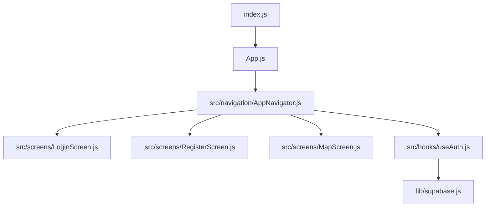
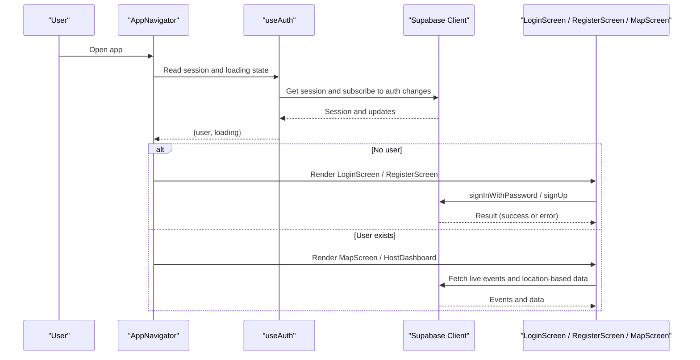
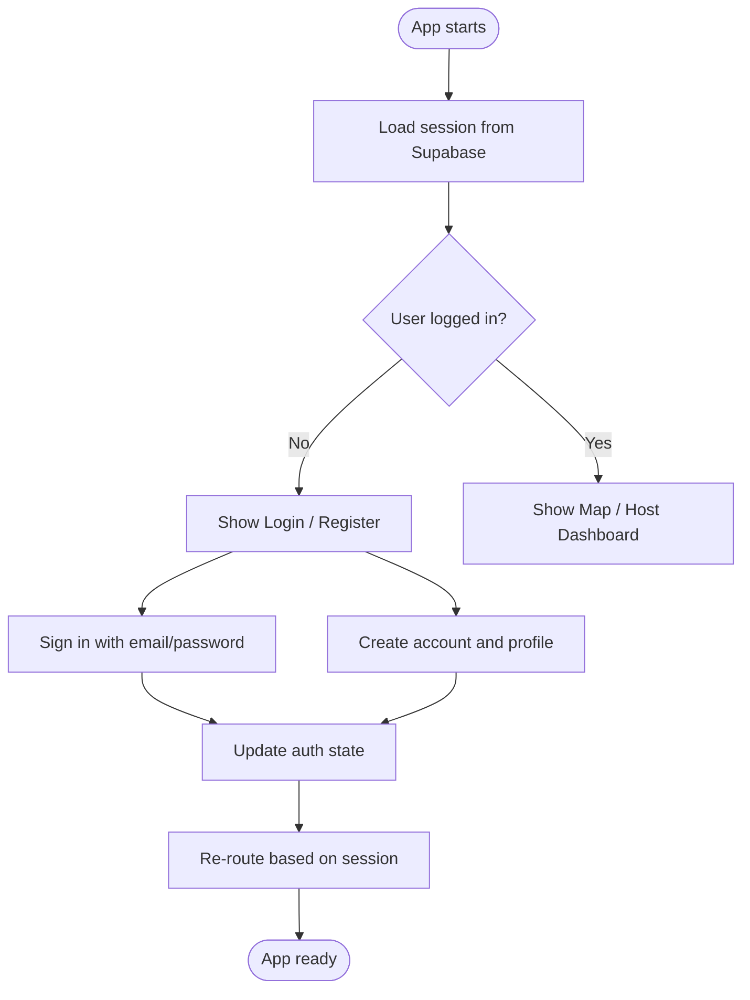
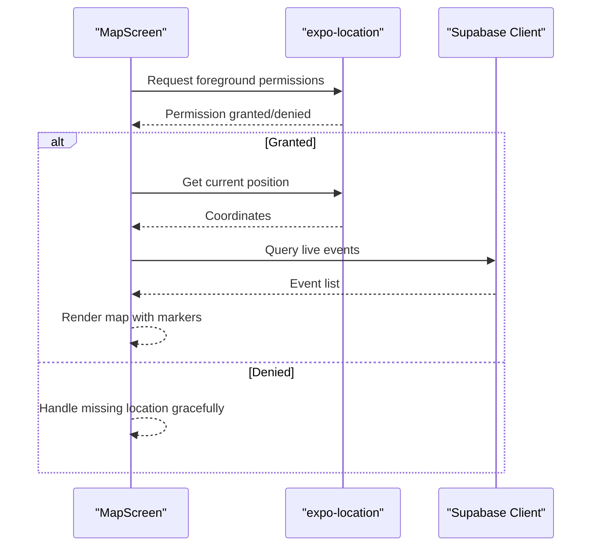
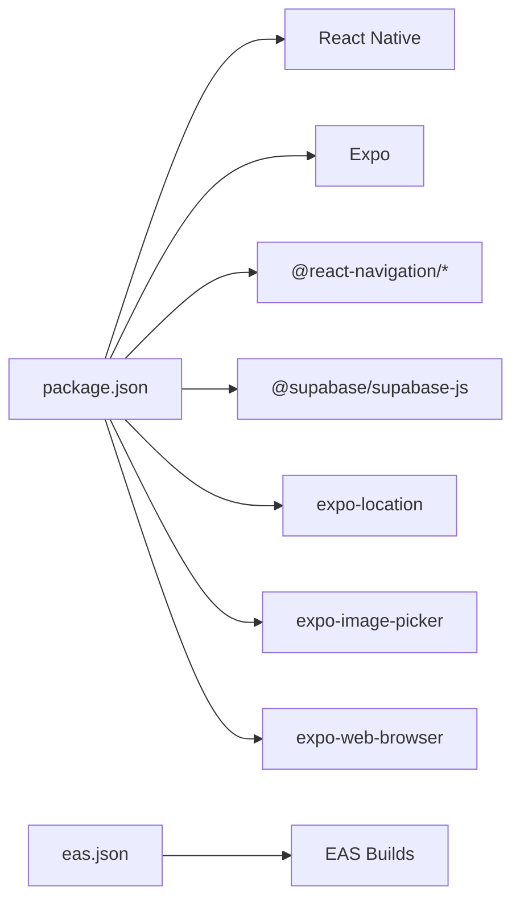

# Getting Started

<cite>
**Referenced Files in This Document**
- [package.json](file://package.json)
- [index.js](file://index.js)
- [App.js](file://App.js)
- [eas.json](file://eas.json)
- [src/navigation/AppNavigator.js](file://src/navigation/AppNavigator.js)
- [src/hooks/useAuth.js](file://src/hooks/useAuth.js)
- [src/screens/LoginScreen.js](file://src/screens/LoginScreen.js)
- [src/screens/RegisterScreen.js](file://src/screens/RegisterScreen.js)
- [src/screens/MapScreen.js](file://src/screens/MapScreen.js)
- [.gitignore](file://.gitignore)
</cite>

## Table of Contents
1. [Introduction](#introduction)
2. [Project Structure](#project-structure)
3. [Core Components](#core-components)
4. [Architecture Overview](#architecture-overview)
5. [Detailed Component Analysis](#detailed-component-analysis)
6. [Dependency Analysis](#dependency-analysis)
7. [Performance Considerations](#performance-considerations)
8. [Troubleshooting Guide](#troubleshooting-guide)
9. [Conclusion](#conclusion)
10. [Appendices](#appendices)

## Introduction
This guide helps you set up and run the Outside mobile application locally. The app is built with Expo and React Native, uses Supabase for authentication and data, and supports iOS, Android, and Web development workflows. You will learn prerequisites, installation steps, environment configuration for Supabase credentials, running the app on different platforms, troubleshooting common issues, and IDE setup recommendations.

## Project Structure
Outside follows a standard Expo project layout:
- Entry points: index.js registers the root component; App.js renders the navigation container.
- Navigation: src/navigation/AppNavigator.js defines routes and guards based on authentication state.
- Screens: src/screens contains Login, Register, Map, and HostDashboard screens.
- Hooks: src/hooks/useAuth.js manages Supabase auth session and state.
- Configuration: package.json defines dependencies and scripts; eas.json configures EAS builds.
- Environment: lib/supabase.js holds Supabase client credentials and is gitignored to keep secrets safe.

**Diagram sources**
- [index.js:1-9](file://index.js#L1-L9)
- [App.js:1-5](file://App.js#L1-L5)
- [src/navigation/AppNavigator.js:1-40](file://src/navigation/AppNavigator.js#L1-L40)
- [src/screens/LoginScreen.js:1-46](file://src/screens/LoginScreen.js#L1-L46)
- [src/screens/RegisterScreen.js:1-126](file://src/screens/RegisterScreen.js#L1-L126)
- [src/screens/MapScreen.js:1-100](file://src/screens/MapScreen.js#L1-L100)
- [src/hooks/useAuth.js:1-22](file://src/hooks/useAuth.js#L1-L22)

**Section sources**
- [index.js:1-9](file://index.js#L1-L9)
- [App.js:1-5](file://App.js#L1-L5)
- [src/navigation/AppNavigator.js:1-40](file://src/navigation/AppNavigator.js#L1-L40)
- [package.json:1-31](file://package.json#L1-L31)
- [eas.json:1-22](file://eas.json#L1-L22)

## Core Components
- App entrypoint: index.js bootstraps the app using Expo’s registerRootComponent and loads App.js.
- Root component: App.js renders the navigation container that controls routing.
- Navigation: AppNavigator sets up stack screens and switches between login/register and map/host dashboard based on authentication state.
- Authentication hook: useAuth subscribes to Supabase auth changes and exposes user and loading state.
- Screens:
  - LoginScreen handles sign-in via Supabase.
  - RegisterScreen creates accounts and inserts user profiles into Supabase.
  - MapScreen requests location permissions, fetches live events from Supabase, and displays them on a map.

Key implementation references:
- App bootstrap: [index.js:1-9](file://index.js#L1-L9), [App.js:1-5](file://App.js#L1-L5)
- Navigation and routing: [src/navigation/AppNavigator.js:1-40](file://src/navigation/AppNavigator.js#L1-L40)
- Auth state management: [src/hooks/useAuth.js:1-22](file://src/hooks/useAuth.js#L1-L22)
- Sign-in flow: [src/screens/LoginScreen.js:1-46](file://src/screens/LoginScreen.js#L1-L46)
- Sign-up flow: [src/screens/RegisterScreen.js:1-126](file://src/screens/RegisterScreen.js#L1-L126)
- Location and data fetching: [src/screens/MapScreen.js:1-100](file://src/screens/MapScreen.js#L1-L100)

**Section sources**
- [index.js:1-9](file://index.js#L1-L9)
- [App.js:1-5](file://App.js#L1-L5)
- [src/navigation/AppNavigator.js:1-40](file://src/navigation/AppNavigator.js#L1-L40)
- [src/hooks/useAuth.js:1-22](file://src/hooks/useAuth.js#L1-L22)
- [src/screens/LoginScreen.js:1-46](file://src/screens/LoginScreen.js#L1-L46)
- [src/screens/RegisterScreen.js:1-126](file://src/screens/RegisterScreen.js#L1-L126)
- [src/screens/MapScreen.js:1-100](file://src/screens/MapScreen.js#L1-L100)

## Architecture Overview
The app uses Expo as the runtime, React Navigation for UI routing, and Supabase for authentication and data. The navigation layer checks the current auth session to decide which screens to show. Data flows from Supabase into screens like MapScreen, while user interactions trigger auth operations in LoginScreen and RegisterScreen.

**Diagram sources**
- [src/navigation/AppNavigator.js:1-40](file://src/navigation/AppNavigator.js#L1-L40)
- [src/hooks/useAuth.js:1-22](file://src/hooks/useAuth.js#L1-L22)
- [src/screens/LoginScreen.js:1-46](file://src/screens/LoginScreen.js#L1-L46)
- [src/screens/RegisterScreen.js:1-126](file://src/screens/RegisterScreen.js#L1-L126)
- [src/screens/MapScreen.js:1-100](file://src/screens/MapScreen.js#L1-L100)

## Detailed Component Analysis

### Authentication Flow
- useAuth initializes by fetching the current session and subscribing to auth state changes. It exposes user and loading flags to consumers.
- AppNavigator reads these flags to route users to either authentication screens or protected screens.
- LoginScreen calls Supabase sign-in and shows alerts on errors.
- RegisterScreen validates inputs, signs up via Supabase, and creates a profile row.

**Diagram sources**
- [src/hooks/useAuth.js:1-22](file://src/hooks/useAuth.js#L1-L22)
- [src/navigation/AppNavigator.js:1-40](file://src/navigation/AppNavigator.js#L1-L40)
- [src/screens/LoginScreen.js:1-46](file://src/screens/LoginScreen.js#L1-L46)
- [src/screens/RegisterScreen.js:1-126](file://src/screens/RegisterScreen.js#L1-L126)

**Section sources**
- [src/hooks/useAuth.js:1-22](file://src/hooks/useAuth.js#L1-L22)
- [src/navigation/AppNavigator.js:1-40](file://src/navigation/AppNavigator.js#L1-L40)
- [src/screens/LoginScreen.js:1-46](file://src/screens/LoginScreen.js#L1-L46)
- [src/screens/RegisterScreen.js:1-126](file://src/screens/RegisterScreen.js#L1-L126)

### Map and Location Flow
- MapScreen requests foreground location permission and retrieves the current position.
- It then queries Supabase for live events and renders markers on the map.
- Errors are logged to the console for debugging.

**Diagram sources**
- [src/screens/MapScreen.js:1-100](file://src/screens/MapScreen.js#L1-L100)

**Section sources**
- [src/screens/MapScreen.js:1-100](file://src/screens/MapScreen.js#L1-L100)

## Dependency Analysis
- Runtime and framework: Expo and React Native versions are pinned in package.json.
- Navigation: React Navigation native and native-stack provide routing.
- Backend: Supabase JS SDK provides authentication and database access.
- Platform integrations: expo-location for geolocation, expo-image-picker for media, expo-web-browser for web flows.
- Build tooling: EAS CLI configured in eas.json for development, preview, and production builds.

**Diagram sources**
- [package.json:1-31](file://package.json#L1-L31)
- [eas.json:1-22](file://eas.json#L1-L22)

**Section sources**
- [package.json:1-31](file://package.json#L1-L31)
- [eas.json:1-22](file://eas.json#L1-L22)

## Performance Considerations
- Minimize unnecessary re-renders in navigation and screens by memoizing callbacks and data where appropriate.
- Defer heavy computations off the main thread when possible.
- Use pagination or filtering for large datasets fetched from Supabase to reduce payload size.
- Cache frequently accessed data locally if applicable, while ensuring consistency with server state.

[No sources needed since this section provides general guidance]

## Troubleshooting Guide
Common setup issues and resolutions:
- Missing Node.js version: The Supabase SDK requires Node.js 20+. Ensure your Node.js version meets the requirement before installing dependencies.
- Missing Supabase client file: The app imports a Supabase client from lib/supabase.js, which is gitignored to protect credentials. Create this file with your Supabase URL and anon key, then add it to .gitignore so secrets remain local.
- Expo CLI version mismatch: eas.json specifies a minimum EAS CLI version. Install or update the EAS CLI to match the required version.
- Platform-specific requirements:
  - iOS: Requires macOS with Xcode installed and configured.
  - Android: Requires Android Studio and an emulator or device connected.
  - Web: Runs in the browser; ensure a modern browser is available.
- Permissions: On iOS/Android, location features require granting foreground permissions at runtime. If denied, the map will not display user location.
- Network errors: Verify internet connectivity and that your Supabase project is active and accessible.

Verification steps after setup:
- Run the dev server and confirm the app launches without import errors.
- Attempt to sign up and sign in to validate Supabase integration.
- On mobile devices, grant location permission and verify that the map loads and markers appear.
- For web, open the app in a browser and check the console for any network or permission errors.

**Section sources**
- [package-lock.json:2816-2899](file://package-lock.json#L2816-L2899)
- [eas.json:1-22](file://eas.json#L1-L22)
- [src/screens/MapScreen.js:1-100](file://src/screens/MapScreen.js#L1-L100)
- [.gitignore:44-45](file://.gitignore#L44-L45)

## Conclusion
You now have the essentials to set up, configure, and run the Outside app across iOS, Android, and Web. Ensure your environment meets the prerequisites, create the Supabase client file with your credentials, and use the provided scripts to start development. Refer to the troubleshooting guide for common issues and verification steps to confirm a successful setup.

[No sources needed since this section summarizes without analyzing specific files]

## Appendices

### Prerequisites
- Node.js 20+ (required by Supabase SDK)
- npm or yarn
- Expo CLI (installed globally or via npx)
- Platform toolchains:
  - iOS: macOS with Xcode
  - Android: Android Studio and an emulator/device
  - Web: Modern browser

### Installation Steps
1. Clone the repository and navigate to the project root.
2. Install dependencies using your preferred package manager:
   - npm install
   - or yarn install
3. Configure Supabase credentials:
   - Create lib/supabase.js with your Supabase URL and anon key.
   - Ensure lib/supabase.js is listed in .gitignore to prevent committing secrets.
4. Verify EAS CLI version matches the requirement in eas.json.

**Section sources**
- [package.json:1-31](file://package.json#L1-L31)
- [eas.json:1-22](file://eas.json#L1-L22)
- [.gitignore:44-45](file://.gitignore#L44-L45)

### Running the App
Use the scripts defined in package.json:
- Start the dev server: npm start
- Run on Android: npm run android
- Run on iOS: npm run ios
- Run on Web: npm run web

**Section sources**
- [package.json:24-29](file://package.json#L24-L29)

### Development Workflow Tips
- Use Expo Go for quick iteration on supported features; for full native capabilities, build a development client using EAS.
- Keep Node.js updated to meet dependency requirements.
- Use platform simulators/emulators for testing location and camera features.
- Monitor console logs for errors during sign-in, sign-up, and data fetching.

[No sources needed since this section provides general guidance]