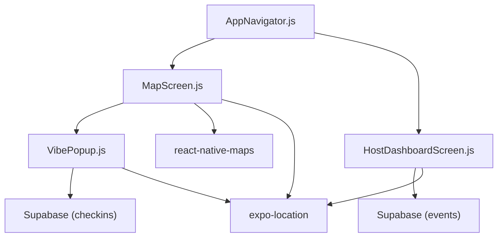
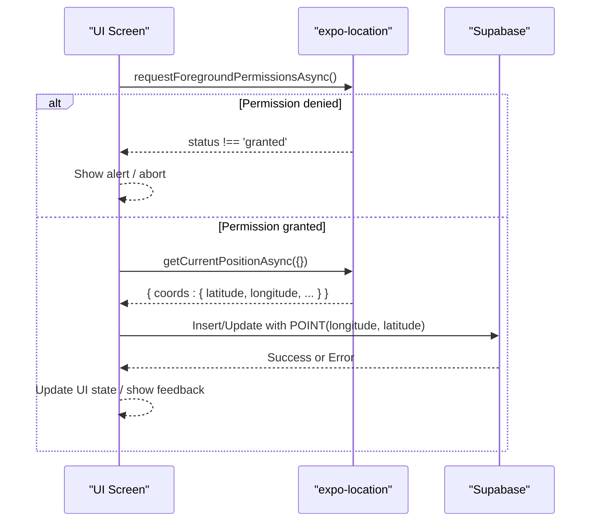
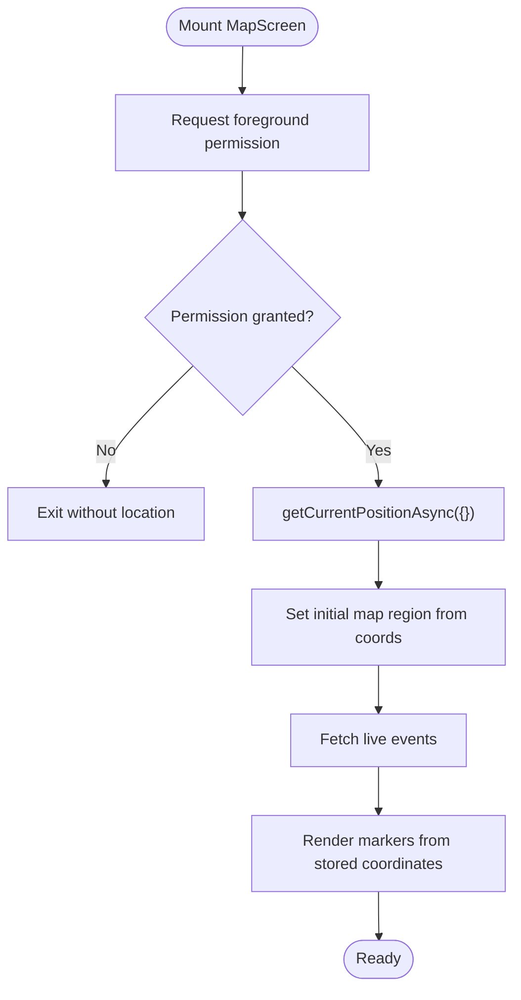
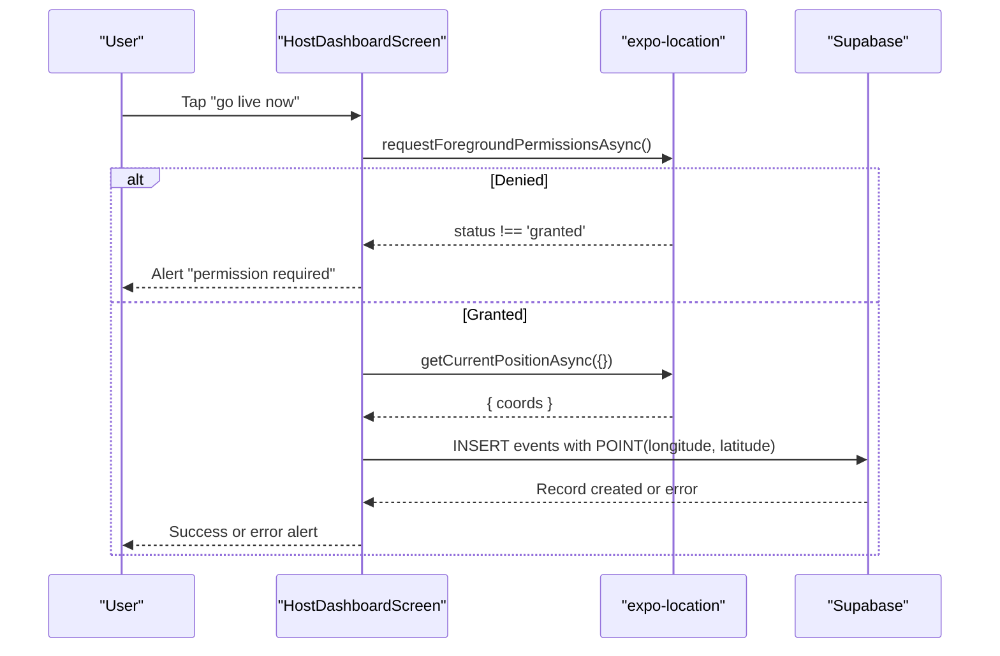
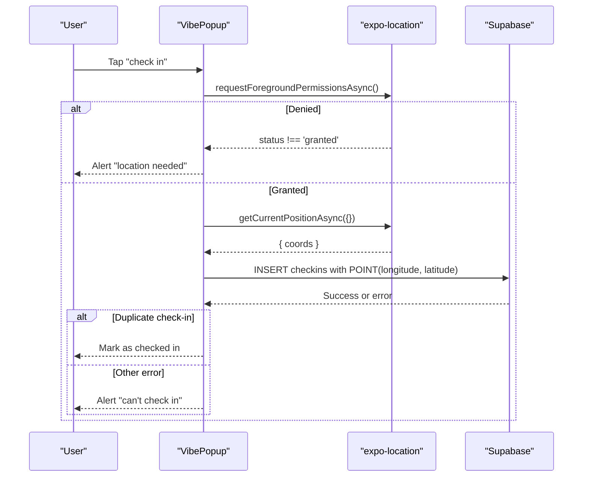
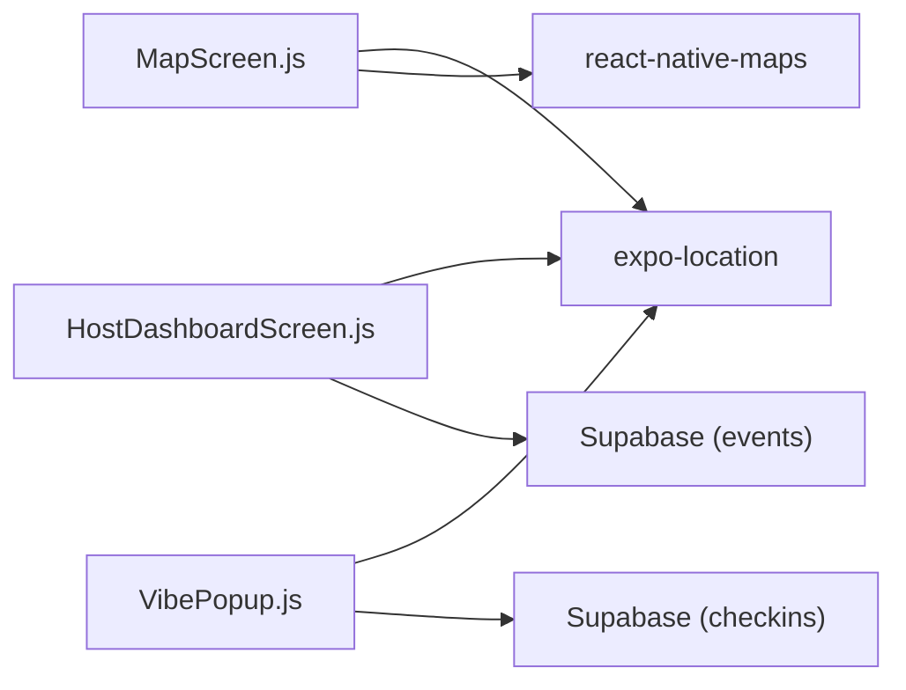
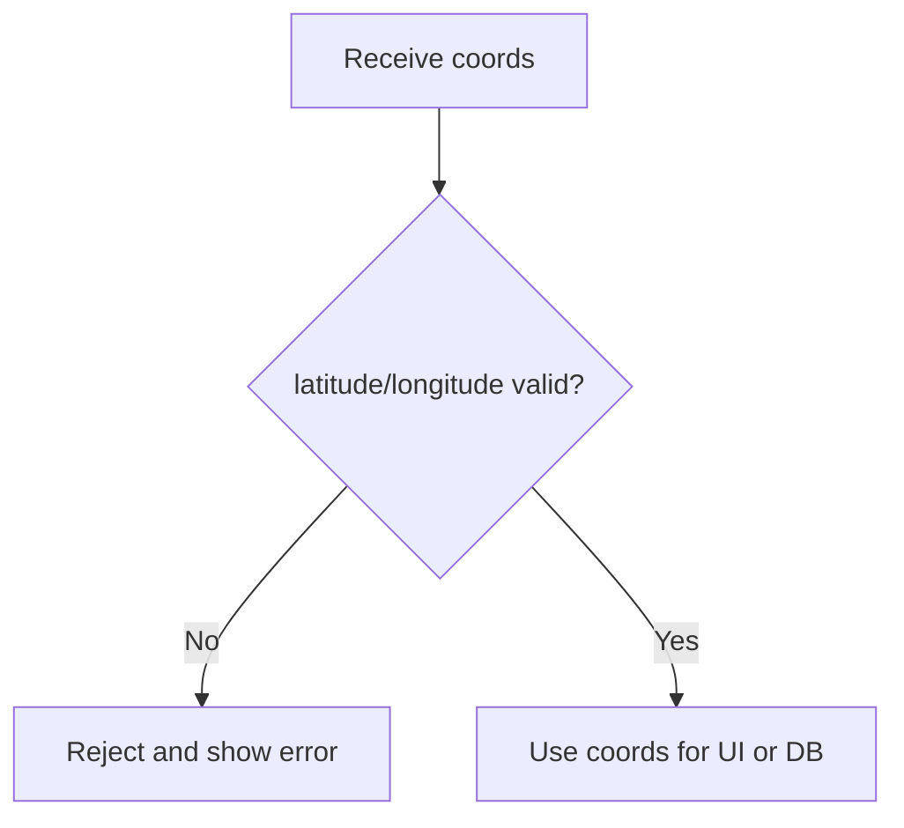

# Current Location Detection

<cite>
**Referenced Files in This Document**
- [MapScreen.js](file://src/screens/MapScreen.js)
- [HostDashboardScreen.js](file://src/screens/HostDashboardScreen.js)
- [VibePopup.js](file://src/components/VibePopup.js)
- [AppNavigator.js](file://src/navigation/AppNavigator.js)
- [package.json](file://package.json)
</cite>

## Table of Contents
1. [Introduction](#introduction)
2. [Project Structure](#project-structure)
3. [Core Components](#core-components)
4. [Architecture Overview](#architecture-overview)
5. [Detailed Component Analysis](#detailed-component-analysis)
6. [Dependency Analysis](#dependency-analysis)
7. [Performance Considerations](#performance-considerations)
8. [Troubleshooting Guide](#troubleshooting-guide)
9. [Conclusion](#conclusion)
10. [Appendices](#appendices)

## Introduction
This document explains how the app detects and uses the user’s current location to power map display, event creation, and check-ins. It focuses on:
- Using Location.getCurrentPositionAsync() to obtain coordinates
- The coordinate object structure used throughout the app
- Permission handling and error scenarios (GPS unavailability, network issues, service failures)
- Practical techniques for accuracy, timeout configuration, validation, geocoding integration, and caching strategies to improve performance

## Project Structure
Location functionality is implemented across three primary screens/components:
- Map screen requests permissions and fetches the current position to center the map
- Host dashboard captures the current position when creating a live event
- Vibe popup captures the current position when checking into an event

**Diagram sources**
- [AppNavigator.js:1-40](file://src/navigation/AppNavigator.js#L1-L40)
- [MapScreen.js:1-100](file://src/screens/MapScreen.js#L1-L100)
- [HostDashboardScreen.js:1-305](file://src/screens/HostDashboardScreen.js#L1-L305)
- [VibePopup.js:1-333](file://src/components/VibePopup.js#L1-L333)

**Section sources**
- [AppNavigator.js:1-40](file://src/navigation/AppNavigator.js#L1-L40)
- [MapScreen.js:1-100](file://src/screens/MapScreen.js#L1-L100)
- [HostDashboardScreen.js:1-305](file://src/screens/HostDashboardScreen.js#L1-L305)
- [VibePopup.js:1-333](file://src/components/VibePopup.js#L1-L333)

## Core Components
- MapScreen: Requests foreground location permission and obtains the current position to set the initial map region. Displays live events as markers using stored coordinates.
- HostDashboardScreen: On “go live,” requests permission, obtains current position, and stores it with the event record.
- VibePopup: When checking into an event, requests permission, obtains current position, and stores it with the check-in record.

All three components rely on expo-location for permission and positioning, and Supabase for persistence.

**Section sources**
- [MapScreen.js:13-21](file://src/screens/MapScreen.js#L13-L21)
- [HostDashboardScreen.js:51-86](file://src/screens/HostDashboardScreen.js#L51-L86)
- [VibePopup.js:82-118](file://src/components/VibePopup.js#L82-L118)

## Architecture Overview
The location flow follows a consistent pattern:
1. Request foreground permission
2. If granted, call getCurrentPositionAsync()
3. Use the returned coordinates for UI or persist them via Supabase
4. Handle errors and edge cases with user feedback

**Diagram sources**
- [MapScreen.js:13-21](file://src/screens/MapScreen.js#L13-L21)
- [HostDashboardScreen.js:51-86](file://src/screens/HostDashboardScreen.js#L51-L86)
- [VibePopup.js:82-118](file://src/components/VibePopup.js#L82-L118)

## Detailed Component Analysis

### MapScreen: Initial Region from Current Position
- Permissions: Requests foreground permission before attempting to read location.
- Positioning: Calls getCurrentPositionAsync() once on mount to get the user’s coordinates and sets the map’s initial region.
- Display: Uses showsUserLocation to render the user’s blue dot; does not auto-follow the user.
- Events: Loads live events and renders markers using stored coordinates.

**Diagram sources**
- [MapScreen.js:13-21](file://src/screens/MapScreen.js#L13-L21)
- [MapScreen.js:23-33](file://src/screens/MapScreen.js#L23-L33)
- [MapScreen.js:37-62](file://src/screens/MapScreen.js#L37-L62)

**Section sources**
- [MapScreen.js:13-21](file://src/screens/MapScreen.js#L13-L21)
- [MapScreen.js:23-33](file://src/screens/MapScreen.js#L23-L33)
- [MapScreen.js:37-62](file://src/screens/MapScreen.js#L37-L62)

### HostDashboardScreen: Capturing Location for Live Events
- Permissions: Requests foreground permission before going live.
- Positioning: Obtains current position and inserts it into the events table as a PostGIS point using longitude first, then latitude.
- Feedback: Shows success or error alerts based on outcome.

**Diagram sources**
- [HostDashboardScreen.js:51-86](file://src/screens/HostDashboardScreen.js#L51-L86)

**Section sources**
- [HostDashboardScreen.js:51-86](file://src/screens/HostDashboardScreen.js#L51-L86)

### VibePopup: Check-In With Current Location
- Permissions: Requests foreground permission before check-in.
- Positioning: Obtains current position and inserts a check-in record with coordinates.
- Validation: Handles duplicate check-in errors gracefully and updates UI accordingly.

**Diagram sources**
- [VibePopup.js:82-118](file://src/components/VibePopup.js#L82-L118)

**Section sources**
- [VibePopup.js:82-118](file://src/components/VibePopup.js#L82-L118)

## Dependency Analysis
- expo-location: Used by MapScreen, HostDashboardScreen, and VibePopup for permission and positioning.
- react-native-maps: Used by MapScreen to render the map and markers.
- Supabase: Used by HostDashboardScreen and VibePopup to store coordinates with events and check-ins.

**Diagram sources**
- [MapScreen.js:1-100](file://src/screens/MapScreen.js#L1-L100)
- [HostDashboardScreen.js:1-305](file://src/screens/HostDashboardScreen.js#L1-L305)
- [VibePopup.js:1-333](file://src/components/VibePopup.js#L1-L333)
- [package.json:1-32](file://package.json#L1-L32)

**Section sources**
- [package.json:1-32](file://package.json#L1-L32)

## Performance Considerations
- Accuracy vs. battery: The current calls use default options. For better accuracy, consider enabling high accuracy mode where appropriate (e.g., during check-in). For background or frequent updates, prefer lower accuracy modes to save battery.
- Timeout and maximum age: Configure timeouts to avoid long waits in poor GPS conditions. Use maximumAge to reuse recent cached positions when acceptable.
- Debounce repeated reads: Avoid calling getCurrentPositionAsync too frequently. Batch or debounce if you need periodic updates.
- Cache last known position: Store the most recent valid coordinates locally (e.g., AsyncStorage) to quickly initialize UI while waiting for fresh fixes.
- Minimize re-renders: Keep location state minimal and update only when necessary. Avoid heavy work inside location callbacks.
- Network considerations: Offload heavy operations (geocoding, analytics) until after location is obtained and validated.

[No sources needed since this section provides general guidance]

## Troubleshooting Guide
Common issues and recommended handling:
- Permission denied or not requested: Always call requestForegroundPermissionsAsync() before reading location. If denied, prompt users to enable location access in system settings.
- GPS unavailable or slow fix: Implement timeouts and fallbacks. Provide user feedback (“Getting your location…”) and allow retries.
- Network issues affecting services: Wrap Supabase calls in try/catch and present clear messages. Retry with exponential backoff for transient errors.
- Invalid coordinates: Validate latitude and longitude ranges before using them. Reject NaN or undefined values.
- Duplicate check-ins: Handle database constraint errors gracefully (e.g., treat as success and mark as checked in).

Examples of where these are handled or should be added:
- Permission checks and alerts: [HostDashboardScreen.js:51-86](file://src/screens/HostDashboardScreen.js#L51-L86), [VibePopup.js:82-118](file://src/components/VibePopup.js#L82-L118)
- Error alerts and catch blocks: [HostDashboardScreen.js:82-86](file://src/screens/HostDashboardScreen.js#L82-L86), [VibePopup.js:99-118](file://src/components/VibePopup.js#L99-L118)

**Section sources**
- [HostDashboardScreen.js:51-86](file://src/screens/HostDashboardScreen.js#L51-L86)
- [VibePopup.js:82-118](file://src/components/VibePopup.js#L82-L118)

## Conclusion
The app consistently uses expo-location to obtain the user’s current position, validates permissions, and persists coordinates to Supabase for events and check-ins. To enhance reliability and performance:
- Add explicit accuracy and timeout configurations
- Implement robust error handling and user feedback
- Validate coordinates before use
- Integrate geocoding to enrich location data
- Cache recent locations to speed up UI initialization

[No sources needed since this section summarizes without analyzing specific files]

## Appendices

### Coordinate Object Structure
- Coordinates returned by getCurrentPositionAsync include fields such as latitude, longitude, accuracy, altitude, heading, speed, and timestamp.
- In this app, coordinates are stored as PostGIS points using longitude first, then latitude (POINT(longitude, latitude)).

**Section sources**
- [HostDashboardScreen.js:64-73](file://src/screens/HostDashboardScreen.js#L64-L73)
- [VibePopup.js:91-98](file://src/components/VibePopup.js#L91-L98)

### Example Workflows

#### Coordinate Validation Flow

[No sources needed since this diagram shows conceptual workflow, not actual code structure]

#### Geocoding Integration Strategy
- After obtaining coordinates, call a geocoding service to resolve address strings for display or search.
- Cache results keyed by coordinates to reduce API calls.
- Handle rate limits and errors gracefully.

[No sources needed since this section provides general guidance]

#### Location Caching Strategy
- Store the last successful coordinates and timestamp in local storage.
- On app start, load cached coordinates to pre-populate UI while fetching a fresh fix.
- Invalidate cache if older than a threshold or if accuracy is below a minimum.

[No sources needed since this section provides general guidance]