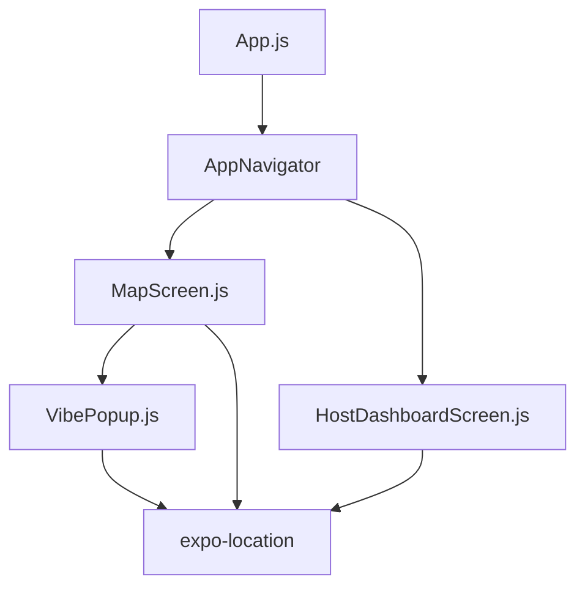
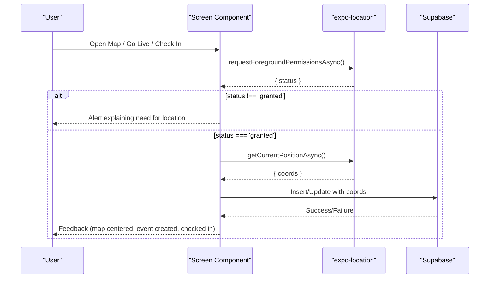
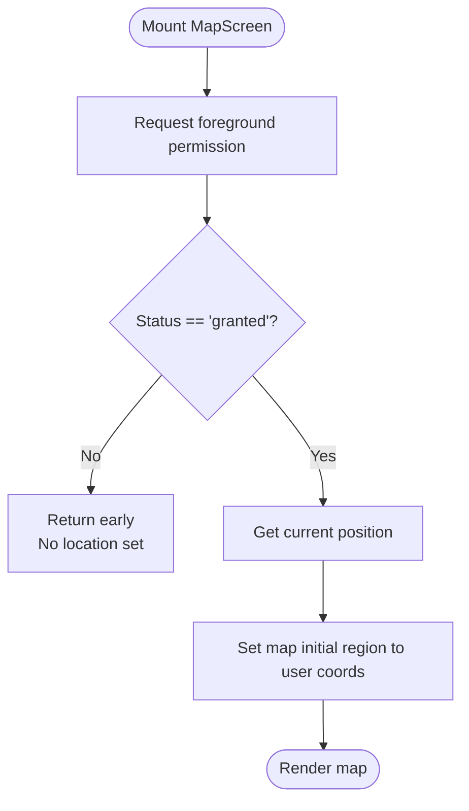
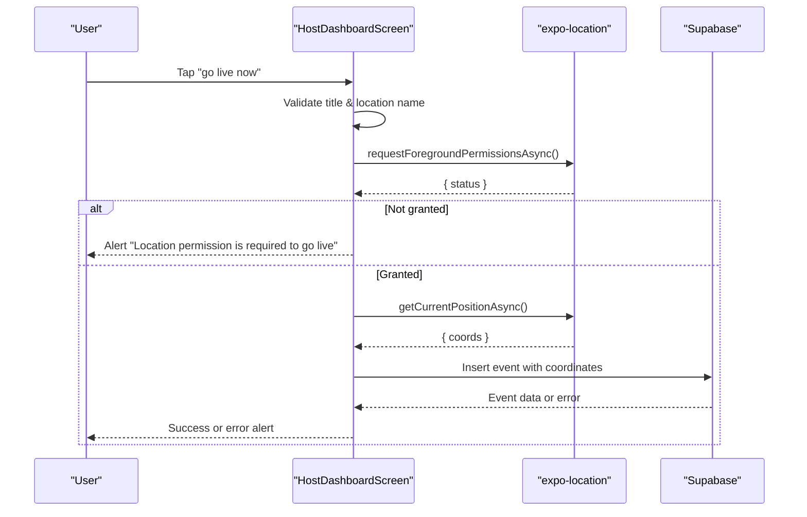
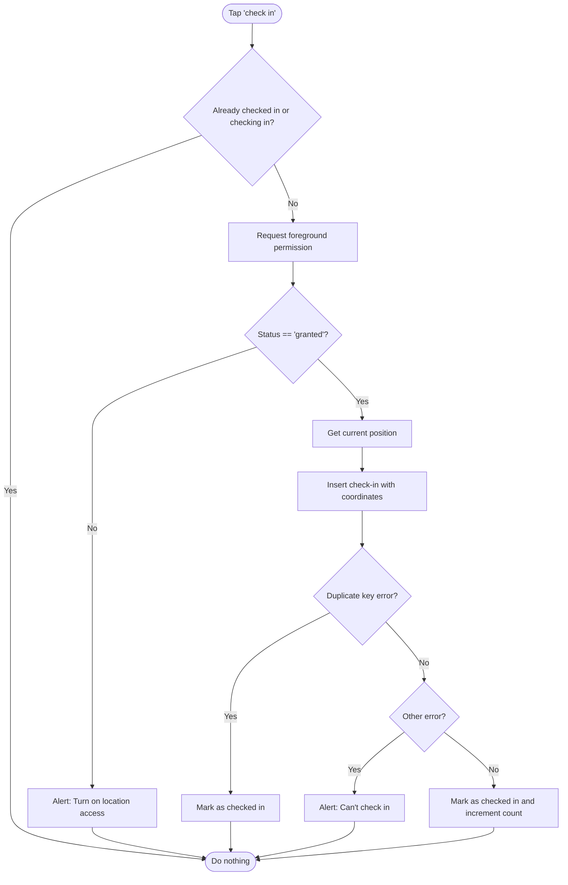
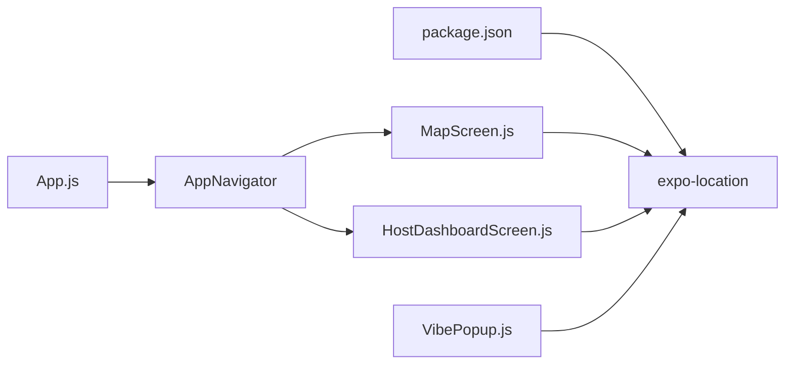

# GPS Permissions and Location Access

<cite>
**Referenced Files in This Document**
- [App.js](file://App.js)
- [MapScreen.js](file://src/screens/MapScreen.js)
- [HostDashboardScreen.js](file://src/screens/HostDashboardScreen.js)
- [VibePopup.js](file://src/components/VibePopup.js)
- [package.json](file://package.json)
- [eas.json](file://eas.json)
</cite>

## Table of Contents
1. Introduction
2. Project Structure
3. Core Components
4. Architecture Overview
5. Detailed Component Analysis
6. Dependency Analysis
7. Performance Considerations
8. Troubleshooting Guide
9. Conclusion

## Introduction
This document explains how the Outside mobile application handles GPS permissions using expo-location to request foreground location access. It covers permission status checking, error handling when permissions are denied, user experience considerations for permission prompts, fallback strategies when location services are unavailable, and platform-specific differences between iOS and Android.

## Project Structure
The app uses React Navigation with screens that require location:
- Map screen requests foreground location on mount to center the map and show nearby events.
- Host dashboard requests location when going live to attach coordinates to an event.
- Vibe popup requests location when a user checks into an event.

**Diagram sources**
- [App.js:1-5](file://App.js#L1-L5)
- [MapScreen.js:1-21](file://src/screens/MapScreen.js#L1-L21)
- [HostDashboardScreen.js:13-86](file://src/screens/HostDashboardScreen.js#L13-L86)
- [VibePopup.js:13-118](file://src/components/VibePopup.js#L13-L118)

**Section sources**
- [App.js:1-5](file://App.js#L1-L5)
- [package.json:1-31](file://package.json#L1-L31)

## Core Components
- expo-location is used to request foreground permissions via Location.requestForegroundPermissionsAsync() and to read current position via Location.getCurrentPositionAsync().
- Permission status is checked immediately after requesting; if not granted, the flow stops and the user is informed.
- When granted, the current location is fetched and used to:
  - Center the map and display markers (MapScreen).
  - Attach coordinates to a new live event (HostDashboardScreen).
  - Record a check-in at an event (VibePopup).

Key usage points:
- MapScreen requests permissions on mount and sets initial map region based on the retrieved coordinates.
- HostDashboardScreen requests permissions before creating a live event and inserts coordinates into the database.
- VibePopup requests permissions before recording a check-in and handles duplicate check-in errors gracefully.

**Section sources**
- [MapScreen.js:13-21](file://src/screens/MapScreen.js#L13-L21)
- [HostDashboardScreen.js:51-86](file://src/screens/HostDashboardScreen.js#L51-L86)
- [VibePopup.js:82-118](file://src/components/VibePopup.js#L82-L118)
- [package.json:11-20](file://package.json#L11-L20)

## Architecture Overview
The permission flow follows a consistent pattern across components:
1. Trigger action (mount or user interaction).
2. Request foreground location permission.
3. If not granted, show an alert and stop.
4. If granted, fetch current position.
5. Use the position for mapping, event creation, or check-in.

**Diagram sources**
- [MapScreen.js:13-21](file://src/screens/MapScreen.js#L13-L21)
- [HostDashboardScreen.js:51-86](file://src/screens/HostDashboardScreen.js#L51-L86)
- [VibePopup.js:82-118](file://src/components/VibePopup.js#L82-L118)

## Detailed Component Analysis

### MapScreen: Foreground Permission on Mount
- On mount, requests foreground location permission.
- If granted, retrieves current position and sets the map’s initial region to the user’s coordinates.
- If not granted, the effect returns early; the map still renders but without user-centered positioning.

**Diagram sources**
- [MapScreen.js:13-21](file://src/screens/MapScreen.js#L13-L21)

**Section sources**
- [MapScreen.js:13-21](file://src/screens/MapScreen.js#L13-L21)

### HostDashboardScreen: Permission Before Going Live
- Validates required fields before proceeding.
- Requests foreground permission; if denied, shows an alert and aborts.
- If granted, fetches current position and creates a live event with coordinates.
- Catches and displays errors from the database operation.

**Diagram sources**
- [HostDashboardScreen.js:51-86](file://src/screens/HostDashboardScreen.js#L51-L86)

**Section sources**
- [HostDashboardScreen.js:51-86](file://src/screens/HostDashboardScreen.js#L51-L86)

### VibePopup: Permission Before Checking In
- Prevents duplicate check-ins and disables button while processing.
- Requests foreground permission; if denied, informs the user to enable location access.
- If granted, fetches current position and attempts to insert a check-in record.
- Handles duplicate key errors by marking the user as already checked in.
- Displays friendly messages for other failures.

**Diagram sources**
- [VibePopup.js:82-118](file://src/components/VibePopup.js#L82-L118)

**Section sources**
- [VibePopup.js:82-118](file://src/components/VibePopup.js#L82-L118)

## Dependency Analysis
- expo-location is declared as a dependency and imported in multiple components to handle location permissions and position retrieval.
- The navigation structure routes users to screens that use location features.
- Build configuration does not include explicit platform permission keys in eas.json; ensure native permission keys are configured in your Expo config (e.g., app.json) for both iOS and Android.

**Diagram sources**
- [package.json:11-20](file://package.json#L11-L20)
- [App.js:1-5](file://App.js#L1-L5)
- [MapScreen.js:1-21](file://src/screens/MapScreen.js#L1-L21)
- [HostDashboardScreen.js:13-86](file://src/screens/HostDashboardScreen.js#L13-L86)
- [VibePopup.js:13-118](file://src/components/VibePopup.js#L13-L118)

**Section sources**
- [package.json:11-20](file://package.json#L11-L20)
- [eas.json:1-22](file://eas.json#L1-L22)

## Performance Considerations
- Requesting permissions once per relevant lifecycle (e.g., on mount for MapScreen) avoids redundant prompts.
- Debounce or throttle repeated permission checks if you anticipate frequent triggers.
- Cache the last known location briefly to avoid unnecessary calls when re-rendering.
- Keep UI responsive by disabling buttons during permission and location fetching, as done in VibePopup.

[No sources needed since this section provides general guidance]

## Troubleshooting Guide
Common issues and resolutions:
- Permission denied:
  - Behavior: Alerts inform the user that location access is required; flows abort until permission is granted.
  - Resolution: Prompt the user to enable location access in system settings and retry.
- Location services disabled:
  - Behavior: getCurrentPositionAsync may fail; catch blocks surface errors to the user.
  - Resolution: Guide the user to enable location services in device settings.
- Duplicate check-in:
  - Behavior: Database constraint error is caught and treated as success by marking the user as checked in.
  - Resolution: No action needed; UI reflects correct state.
- Missing native permission keys:
  - Behavior: Platform may block permission prompts or location access.
  - Resolution: Ensure appropriate permission keys are defined in your Expo configuration for iOS and Android.

**Section sources**
- [HostDashboardScreen.js:58-63](file://src/screens/HostDashboardScreen.js#L58-L63)
- [VibePopup.js:86-118](file://src/components/VibePopup.js#L86-L118)

## Conclusion
The Outside app consistently uses expo-location to request foreground permissions before accessing the device’s current position. Each component validates permission status, handles denials with clear user feedback, and proceeds only when granted. Robust error handling ensures graceful degradation when location services are unavailable or when database constraints prevent duplicate operations. For production readiness, confirm that platform-specific permission keys are configured in your Expo configuration so that native permission prompts function correctly on iOS and Android.

[No sources needed since this section summarizes without analyzing specific files]