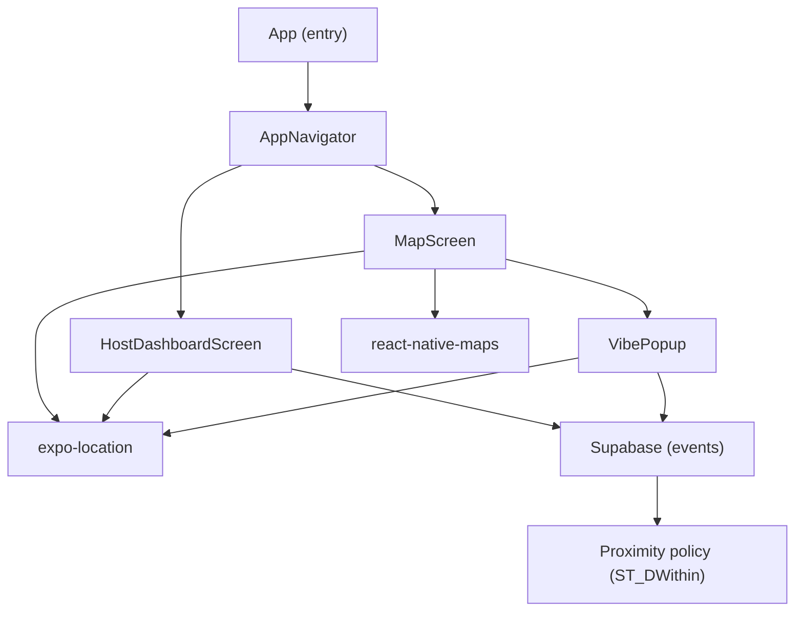
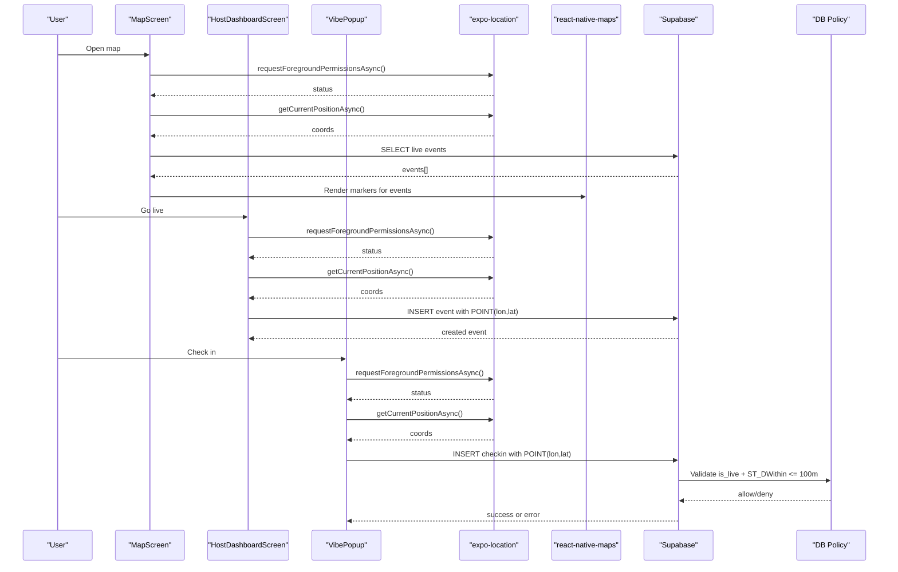
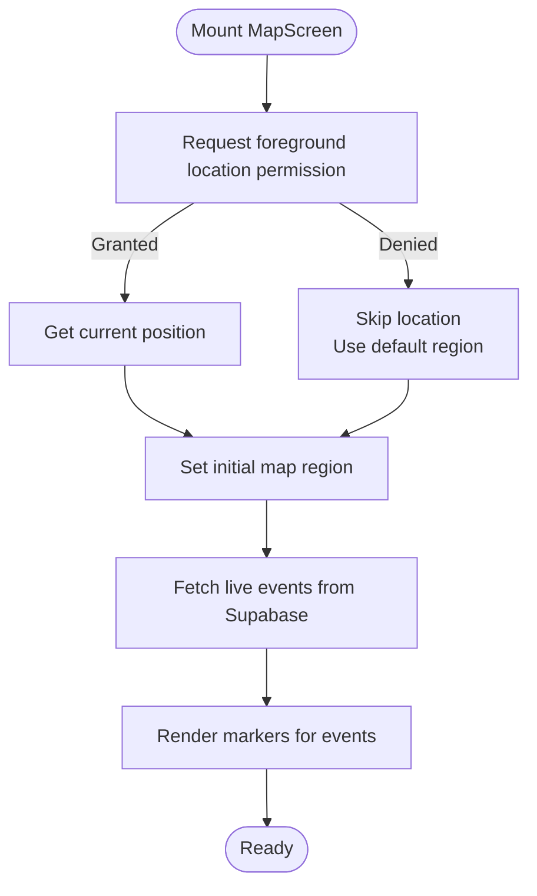
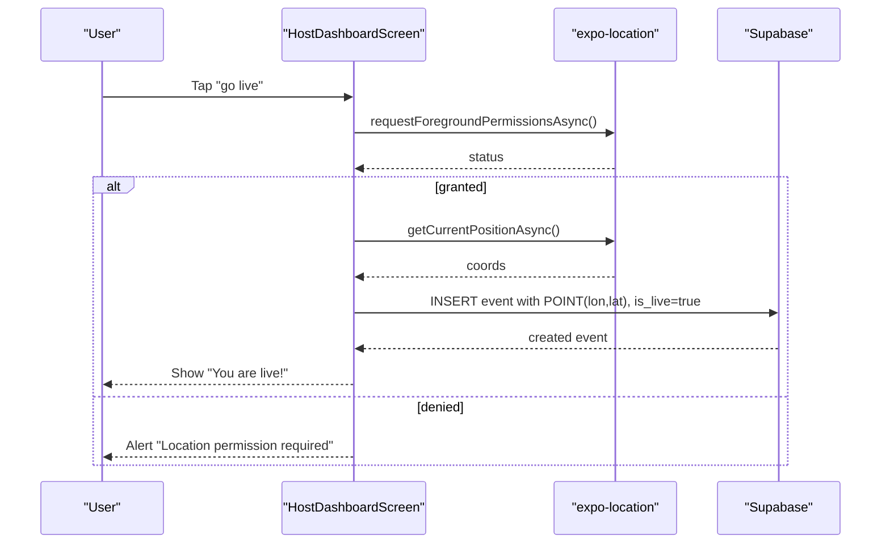
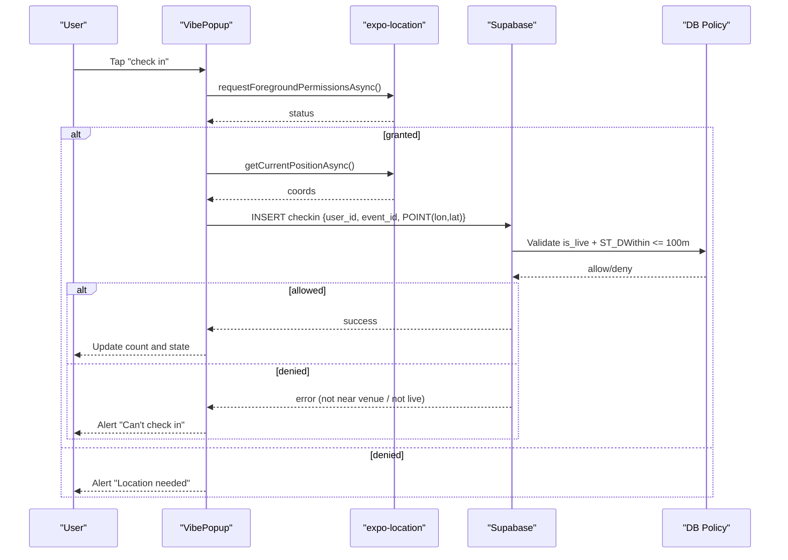
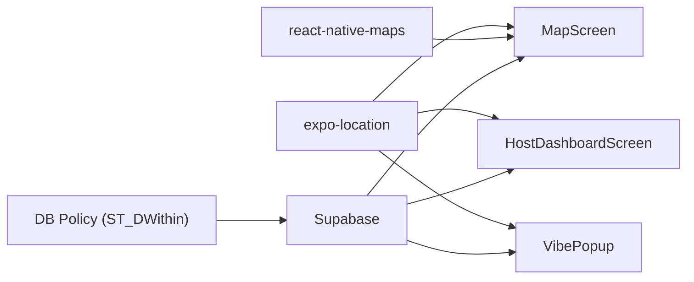

# Location Services

<cite>
**Referenced Files in This Document**
- [MapScreen.js](file://src/screens/MapScreen.js)
- [HostDashboardScreen.js](file://src/screens/HostDashboardScreen.js)
- [VibePopup.js](file://src/components/VibePopup.js)
- [AppNavigator.js](file://src/navigation/AppNavigator.js)
- [package.json](file://package.json)
- [phase6_checkins.sql](file://supabase/sql/sql/phase6_checkins.sql)
</cite>

## Table of Contents
1. [Introduction](#introduction)
2. [Project Structure](#project-structure)
3. [Core Components](#core-components)
4. [Architecture Overview](#architecture-overview)
5. [Detailed Component Analysis](#detailed-component-analysis)
6. [Dependency Analysis](#dependency-analysis)
7. [Performance Considerations](#performance-considerations)
8. [Troubleshooting Guide](#troubleshooting-guide)
9. [Conclusion](#conclusion)

## Introduction
This document explains the location services implementation for discovering and attending live events near you. It covers:
- GPS permission handling using expo-location
- Current location detection and map display with react-native-maps
- Proximity validation for check-in verification via Supabase policies
- Geofencing concepts for proximity-based notifications and attendance verification
- Examples of permission requests, error handling for GPS unavailability, and performance optimization strategies

## Project Structure
The location features are implemented across a few key screens and components:
- Map screen displays live events and user location on a map
- Host dashboard creates live events with current coordinates
- Vibe popup handles event details and proximity-gated check-ins
- Navigation wires authenticated users to the map and host flows
- Database policies enforce proximity rules at insert time

**Diagram sources**
- [AppNavigator.js:10-39](file://src/navigation/AppNavigator.js#L10-L39)
- [MapScreen.js:1-77](file://src/screens/MapScreen.js#L1-L77)
- [HostDashboardScreen.js:51-86](file://src/screens/HostDashboardScreen.js#L51-L86)
- [VibePopup.js:82-118](file://src/components/VibePopup.js#L82-L118)
- [phase6_checkins.sql:20-40](file://supabase/sql/sql/phase6_checkins.sql#L20-L40)

**Section sources**
- [AppNavigator.js:10-39](file://src/navigation/AppNavigator.js#L10-L39)
- [MapScreen.js:1-77](file://src/screens/MapScreen.js#L1-L77)
- [HostDashboardScreen.js:51-86](file://src/screens/HostDashboardScreen.js#L51-L86)
- [VibePopup.js:82-118](file://src/components/VibePopup.js#L82-L118)
- [phase6_checkins.sql:20-40](file://supabase/sql/sql/phase6_checkins.sql#L20-L40)

## Core Components
- MapScreen: Requests foreground location permission, fetches current position, loads live events from Supabase, and renders them as markers on a map centered around the user’s location when available.
- HostDashboardScreen: On “go live,” requests location permission, captures current coordinates, and inserts a new live event into Supabase so it appears on the map.
- VibePopup: Displays event details and posts; implements check-in flow that requests location permission, reads current coordinates, and attempts to insert a check-in record. A database policy enforces that check-ins succeed only within a proximity threshold of a live event.

Key responsibilities:
- Permission gating before any location read
- Fetching current coordinates once per action
- Rendering live events on the map
- Enforcing proximity rules server-side

**Section sources**
- [MapScreen.js:13-33](file://src/screens/MapScreen.js#L13-L33)
- [HostDashboardScreen.js:51-86](file://src/screens/HostDashboardScreen.js#L51-L86)
- [VibePopup.js:82-118](file://src/components/VibePopup.js#L82-L118)
- [phase6_checkins.sql:20-40](file://supabase/sql/sql/phase6_checkins.sql#L20-L40)

## Architecture Overview
The system combines client-side location capture with server-side proximity enforcement:
- Client uses expo-location to request permissions and obtain coordinates
- MapScreen shows live events fetched from Supabase and plots them on react-native-maps
- HostDashboardScreen publishes events with coordinates
- VibePopup performs check-ins; Supabase policy validates proximity using ST_DWithin with geography types

**Diagram sources**
- [MapScreen.js:13-33](file://src/screens/MapScreen.js#L13-L33)
- [HostDashboardScreen.js:51-86](file://src/screens/HostDashboardScreen.js#L51-L86)
- [VibePopup.js:82-118](file://src/components/VibePopup.js#L82-L118)
- [phase6_checkins.sql:20-40](file://supabase/sql/sql/phase6_checkins.sql#L20-L40)

## Detailed Component Analysis

### MapScreen: Live Event Discovery and Map Display
- Requests foreground location permission and obtains current coordinates to set initial map region
- Loads live events from Supabase and maps each event’s coordinates to a marker
- Renders user location dot on the map without auto-following

**Diagram sources**
- [MapScreen.js:13-33](file://src/screens/MapScreen.js#L13-L33)
- [MapScreen.js:37-62](file://src/screens/MapScreen.js#L37-L62)

**Section sources**
- [MapScreen.js:13-33](file://src/screens/MapScreen.js#L13-L33)
- [MapScreen.js:37-62](file://src/screens/MapScreen.js#L37-L62)

### HostDashboardScreen: Creating Live Events with Coordinates
- Validates inputs and requests location permission
- Captures current coordinates and inserts a live event with a spatial POINT
- Updates UI state to show the active event and confirmation

**Diagram sources**
- [HostDashboardScreen.js:51-86](file://src/screens/HostDashboardScreen.js#L51-L86)

**Section sources**
- [HostDashboardScreen.js:51-86](file://src/screens/HostDashboardScreen.js#L51-L86)

### VibePopup: Proximity-Gated Check-In Flow
- Checks if user already checked in
- Requests location permission and reads current coordinates
- Attempts to insert a check-in; Supabase policy ensures:
  - The event is live
  - The check-in point is within 100 meters of the event’s coordinates using ST_DWithin with geography types
- Handles duplicate check-in errors gracefully and updates local state

**Diagram sources**
- [VibePopup.js:82-118](file://src/components/VibePopup.js#L82-L118)
- [phase6_checkins.sql:20-40](file://supabase/sql/sql/phase6_checkins.sql#L20-L40)

**Section sources**
- [VibePopup.js:82-118](file://src/components/VibePopup.js#L82-L118)
- [phase6_checkins.sql:20-40](file://supabase/sql/sql/phase6_checkins.sql#L20-L40)

### Conceptual Overview: Geofencing Concepts
While this app does not implement background geofencing, the same proximity principle applies:
- Define a circular zone around an event’s coordinates with a radius (e.g., 100 meters)
- Use device location services to detect entry/exit
- Trigger notifications or actions when a user enters/exits the zone
- For attendance verification, combine real-time location checks with server-side proximity validation similar to the check-in policy

[No sources needed since this section provides conceptual guidance]

## Dependency Analysis
- expo-location is used for permission requests and reading current coordinates across multiple screens
- react-native-maps renders the map and markers for live events
- Supabase stores events and check-ins; policies enforce proximity constraints
- Navigation routes authenticated users to the map and host dashboard

**Diagram sources**
- [package.json:15-20](file://package.json#L15-L20)
- [MapScreen.js:1-6](file://src/screens/MapScreen.js#L1-L6)
- [HostDashboardScreen.js:13-15](file://src/screens/HostDashboardScreen.js#L13-L15)
- [VibePopup.js:13-14](file://src/components/VibePopup.js#L13-L14)
- [phase6_checkins.sql:20-40](file://supabase/sql/sql/phase6_checkins.sql#L20-L40)

**Section sources**
- [package.json:15-20](file://package.json#L15-L20)
- [MapScreen.js:1-6](file://src/screens/MapScreen.js#L1-L6)
- [HostDashboardScreen.js:13-15](file://src/screens/HostDashboardScreen.js#L13-L15)
- [VibePopup.js:13-14](file://src/components/VibePopup.js#L13-L14)
- [phase6_checkins.sql:20-40](file://supabase/sql/sql/phase6_checkins.sql#L20-L40)

## Performance Considerations
- Request location permissions once per action and reuse results where possible to avoid redundant prompts
- Avoid continuous location updates unless necessary; use getCurrentPositionAsync for one-shot reads
- Cache user location briefly in component state to prevent re-fetching on re-renders
- Limit map rendering by fetching only live events and minimizing marker updates
- Debounce or throttle any future location polling if added later
- Prefer server-side proximity checks (as implemented) to reduce client-side computation and ensure accuracy

[No sources needed since this section provides general guidance]

## Troubleshooting Guide
Common issues and resolutions:
- Location permission denied
  - Symptom: Cannot get current location; map may fall back to default region
  - Resolution: Prompt user to enable location access in OS settings; retry permission request
- GPS unavailable or inaccurate
  - Symptom: getCurrentPositionAsync fails or returns stale coordinates
  - Resolution: Retry after a delay; inform user to move outdoors or enable high-accuracy mode
- Check-in blocked by proximity policy
  - Symptom: Insert fails with policy error indicating not near venue or event not live
  - Resolution: Ensure device location is enabled and accurate; verify event is live; confirm distance is within threshold
- Duplicate check-in
  - Symptom: Unique constraint violation on check-ins
  - Resolution: Treat as success and mark user as checked in locally

**Section sources**
- [MapScreen.js:13-19](file://src/screens/MapScreen.js#L13-L19)
- [HostDashboardScreen.js:58-64](file://src/screens/HostDashboardScreen.js#L58-L64)
- [VibePopup.js:86-118](file://src/components/VibePopup.js#L86-L118)
- [phase6_checkins.sql:20-40](file://supabase/sql/sql/phase6_checkins.sql#L20-L40)

## Conclusion
The application implements robust location services by combining client-side permission handling and coordinate capture with server-side proximity enforcement. Users can discover live events on a map, hosts can publish events with precise locations, and attendees can check in only when physically near a live event. The design balances usability with security by enforcing proximity rules at the database layer while keeping the client simple and efficient.

[No sources needed since this section summarizes without analyzing specific files]