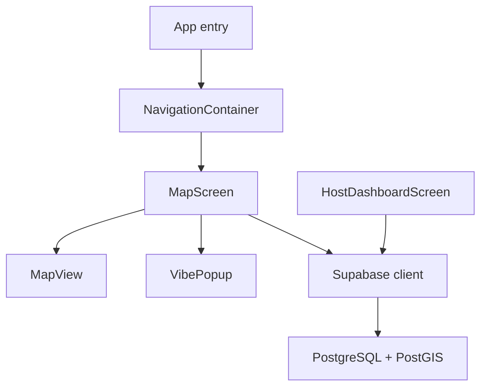
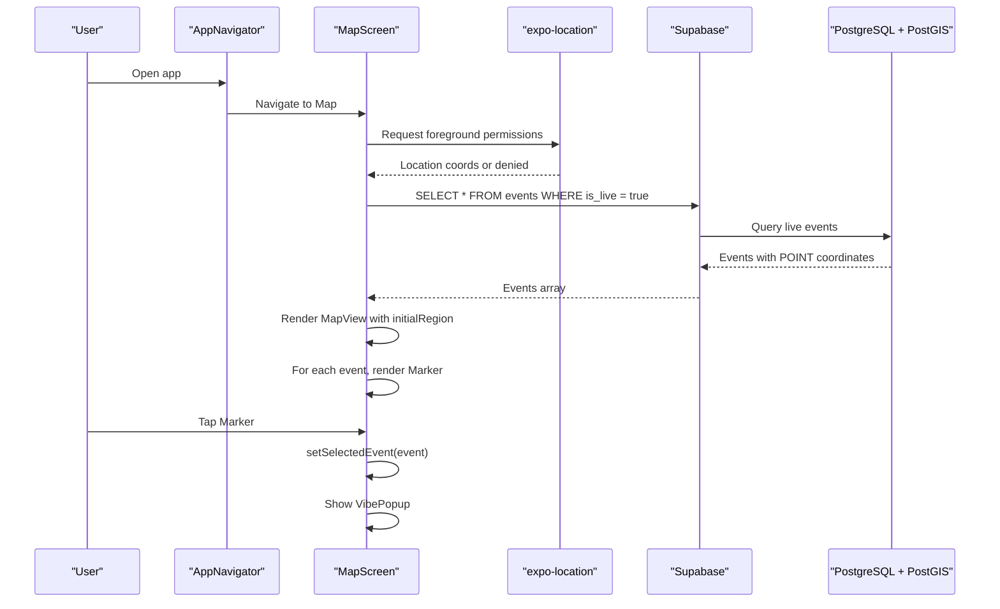
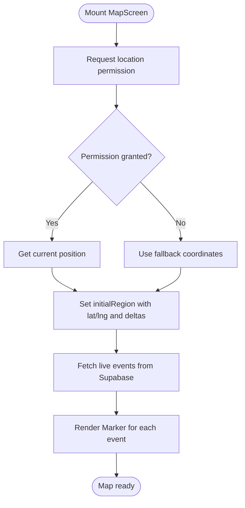
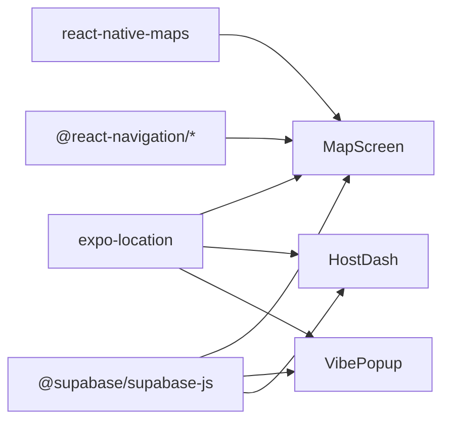

# Map Display and Event Markers

<cite>
**Referenced Files in This Document**
- [MapScreen.js](file://src/screens/MapScreen.js)
- [AppNavigator.js](file://src/navigation/AppNavigator.js)
- [VibePopup.js](file://src/components/VibePopup.js)
- [HostDashboardScreen.js](file://src/screens/HostDashboardScreen.js)
- [phase6_checkins.sql](file://supabase/sql/sql/phase6_checkins.sql)
- [package.json](file://package.json)
</cite>

## Table of Contents
1. [Introduction](#introduction)
2. [Project Structure](#project-structure)
3. [Core Components](#core-components)
4. [Architecture Overview](#architecture-overview)
5. [Detailed Component Analysis](#detailed-component-analysis)
6. [Dependency Analysis](#dependency-analysis)
7. [Performance Considerations](#performance-considerations)
8. [Troubleshooting Guide](#troubleshooting-guide)
9. [Conclusion](#conclusion)

## Introduction
This document explains how the application integrates react-native-maps to display live events as markers on a map, how user location is handled, and how event data flows from the database to the UI. It covers MapView configuration (showsUserLocation, followsUserLocation, initialRegion), marker creation with coordinate mapping from the database format to map coordinates, interactive features like onPress handlers, dynamic updates when new events go live, and performance considerations for rendering multiple markers efficiently.

## Project Structure
The map feature centers around a dedicated screen that renders a MapView and overlays Marker components for each live event. Navigation routes users to this screen after authentication. A popup component provides event details and check-in functionality. The host dashboard creates events with geospatial coordinates stored in PostGIS POINT format.

**Diagram sources**
- [AppNavigator.js:23-38](file://src/navigation/AppNavigator.js#L23-L38)
- [MapScreen.js:35-76](file://src/screens/MapScreen.js#L35-L76)
- [VibePopup.js:18-227](file://src/components/VibePopup.js#L18-L227)
- [HostDashboardScreen.js:51-86](file://src/screens/HostDashboardScreen.js#L51-L86)

**Section sources**
- [AppNavigator.js:1-40](file://src/navigation/AppNavigator.js#L1-L40)
- [MapScreen.js:1-100](file://src/screens/MapScreen.js#L1-L100)

## Core Components
- MapScreen: Initializes location permissions, fetches live events, configures MapView, and renders markers with onPress interactions.
- VibePopup: Displays event details, posts, likes, and proximity-gated check-ins.
- HostDashboardScreen: Creates live events with current device coordinates stored as PostGIS POINT values.
- Database schema: Enforces unique check-ins per event and maintains a live check-in counter via triggers.

Key responsibilities:
- Map initialization and region setup based on user location or fallback coordinates.
- Fetching live events and mapping database coordinates to map coordinates.
- Handling marker interactions to open contextual popups.
- Creating and updating events with geospatial data.

**Section sources**
- [MapScreen.js:8-76](file://src/screens/MapScreen.js#L8-L76)
- [VibePopup.js:18-227](file://src/components/VibePopup.js#L18-L227)
- [HostDashboardScreen.js:51-86](file://src/screens/HostDashboardScreen.js#L51-L86)
- [phase6_checkins.sql:1-63](file://supabase/sql/sql/phase6_checkins.sql#L1-L63)

## Architecture Overview
The app uses React Navigation to route authenticated users to the MapScreen. On mount, the screen requests location permission and retrieves the user’s current position. It then queries live events from Supabase and renders them as markers. Each marker opens a VibePopup on press. When hosts create an event, their current coordinates are stored as a PostGIS POINT; these points are later read by the map to place markers.

**Diagram sources**
- [AppNavigator.js:23-38](file://src/navigation/AppNavigator.js#L23-L38)
- [MapScreen.js:13-76](file://src/screens/MapScreen.js#L13-L76)
- [HostDashboardScreen.js:51-86](file://src/screens/HostDashboardScreen.js#L51-L86)

## Detailed Component Analysis

### MapScreen: MapView Configuration and Markers
- Location handling: Requests foreground location permission and stores coordinates in state. If not granted, the map still renders using fallback coordinates.
- Initial region: Uses the user’s current latitude/longitude if available; otherwise falls back to a default region with specific deltas.
- showsUserLocation: Enabled to show the user’s blue dot on the map.
- followsUserLocation: Disabled so the camera does not auto-follow the user.
- Marker creation: Maps database POINT coordinates to latitude/longitude for each event and attaches an onPress handler to open the VibePopup.

Coordinate mapping:
- Database stores coordinates as PostGIS POINT strings such as POINT(longitude latitude).
- The map expects latitude first, longitude second. The code extracts these values from the POINT string to construct the Marker coordinate object.

Interactive features:
- onPress on Marker sets selectedEvent state, which conditionally renders the VibePopup overlay.

Dynamic updates:
- The events list is fetched once on mount. To support real-time updates, consider adding a subscription or periodic refresh to re-fetch live events when they change.

Styling:
- MapView fills the container; additional UI elements (like the “go live” button) are positioned absolutely over the map.

**Section sources**
- [MapScreen.js:13-21](file://src/screens/MapScreen.js#L13-L21)
- [MapScreen.js:23-33](file://src/screens/MapScreen.js#L23-L33)
- [MapScreen.js:37-62](file://src/screens/MapScreen.js#L37-L62)
- [MapScreen.js:63-75](file://src/screens/MapScreen.js#L63-L75)

#### MapView Configuration Flow

**Diagram sources**
- [MapScreen.js:13-33](file://src/screens/MapScreen.js#L13-L33)
- [MapScreen.js:37-62](file://src/screens/MapScreen.js#L37-L62)

### VibePopup: Event Details and Check-ins
- Displays event title and location name.
- Loads posts associated with the event and supports liking/unliking.
- Implements proximity-gated check-ins: requires location permission and enforces being within a threshold distance of the event while it is live.
- Updates local check-in count and reflects changes in the UI.

Check-in flow:
- Requests location permission.
- Inserts a check-in record with the user’s current coordinates.
- Handles duplicate check-in errors gracefully and updates UI state accordingly.

**Section sources**
- [VibePopup.js:18-46](file://src/components/VibePopup.js#L18-L46)
- [VibePopup.js:48-80](file://src/components/VibePopup.js#L48-L80)
- [VibePopup.js:82-118](file://src/components/VibePopup.js#L82-L118)
- [VibePopup.js:120-155](file://src/components/VibePopup.js#L120-L155)
- [VibePopup.js:157-227](file://src/components/VibePopup.js#L157-L227)

### HostDashboardScreen: Creating Live Events with Coordinates
- Validates required fields before creating an event.
- Requests location permission and captures current device coordinates.
- Inserts a new event into the database with a PostGIS POINT value constructed from longitude and latitude.
- Sets the event as live so it appears on the map immediately.

**Section sources**
- [HostDashboardScreen.js:51-86](file://src/screens/HostDashboardScreen.js#L51-L86)

### Database Schema: Geospatial Constraints and Counters
- Adds a live_checkin_count column to events and keeps it synchronized via a trigger on check-in inserts.
- Enforces one check-in per user per event.
- Restricts check-in inserts to be near a live event using ST_DWithin with geography types for meter-based distance checks.

**Section sources**
- [phase6_checkins.sql:1-63](file://supabase/sql/sql/phase6_checkins.sql#L1-L63)

## Dependency Analysis
- react-native-maps: Provides MapView and Marker used in MapScreen.
- expo-location: Used to request permissions and retrieve current device coordinates for both map initialization and event creation/check-ins.
- Supabase client: Used to query live events and insert check-ins and posts.
- Navigation: Routes users to MapScreen after authentication.

**Diagram sources**
- [package.json:5-22](file://package.json#L5-L22)
- [MapScreen.js:1-6](file://src/screens/MapScreen.js#L1-L6)
- [VibePopup.js:1-14](file://src/components/VibePopup.js#L1-L14)
- [HostDashboardScreen.js:51-86](file://src/screens/HostDashboardScreen.js#L51-L86)
- [AppNavigator.js:1-8](file://src/navigation/AppNavigator.js#L1-L8)

**Section sources**
- [package.json:5-22](file://package.json#L5-L22)
- [MapScreen.js:1-6](file://src/screens/MapScreen.js#L1-L6)
- [VibePopup.js:1-14](file://src/components/VibePopup.js#L1-L14)
- [HostDashboardScreen.js:51-86](file://src/screens/HostDashboardScreen.js#L51-L86)
- [AppNavigator.js:1-8](file://src/navigation/AppNavigator.js#L1-L8)

## Performance Considerations
- Rendering many markers:
  - Ensure each Marker has a stable key (event.id) to minimize re-renders.
  - Avoid heavy work inside marker rendering; keep Marker props minimal and move complex logic out of the render path.
- Data fetching:
  - Consider polling or subscribing to changes for live events to reflect new markers without full page reloads.
  - Debounce or throttle frequent updates if implementing real-time subscriptions.
- Region changes:
  - Use controlled region state only when necessary; avoid forcing region updates on every render to prevent jank.
- Memory and layout:
  - Keep styles simple and reuse them where possible.
  - Offload expensive computations (e.g., filtering large datasets) to background processes or memoized functions.

[No sources needed since this section provides general guidance]

## Troubleshooting Guide
- Location permission denied:
  - The map will fall back to default coordinates; ensure permissions are requested before accessing location.
  - Check platform-specific settings and prompts.
- No markers appear:
  - Verify that events have is_live set to true and contain valid coordinates.
  - Confirm that the database returns POINT values and that coordinate extraction matches expected order (latitude, longitude).
- Check-in fails:
  - Ensure location permission is granted.
  - Proximity policy may reject check-ins outside the allowed distance or if the event is not live.
  - Duplicate check-ins return a specific error code; handle it gracefully by marking the user as checked in.
- Map not centered on user:
  - followsUserLocation is disabled; the map will not auto-follow. Adjust initialRegion or implement manual centering if desired.

**Section sources**
- [MapScreen.js:13-21](file://src/screens/MapScreen.js#L13-L21)
- [MapScreen.js:23-33](file://src/screens/MapScreen.js#L23-L33)
- [VibePopup.js:82-118](file://src/components/VibePopup.js#L82-L118)
- [phase6_checkins.sql:20-40](file://supabase/sql/sql/phase6_checkins.sql#L20-L40)

## Conclusion
The application integrates react-native-maps to visualize live events as markers, leveraging PostGIS coordinates stored in the database. MapScreen handles location permissions, initializes the map with user-centric regions, and renders markers with interactive onPress handlers. HostDashboardScreen creates events with precise coordinates, while VibePopup provides rich event interactions including proximity-gated check-ins. Following the recommended practices for data fetching, rendering, and error handling ensures a responsive and scalable map experience.