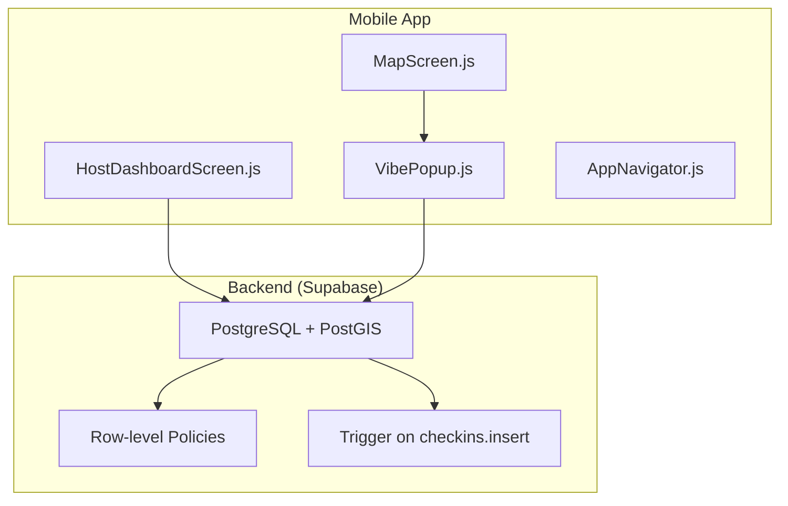
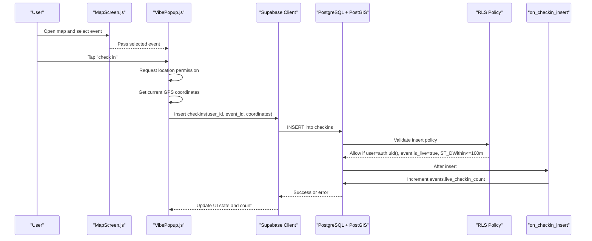
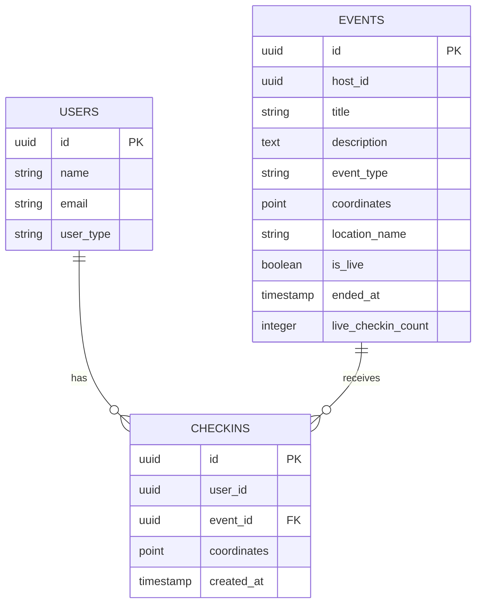
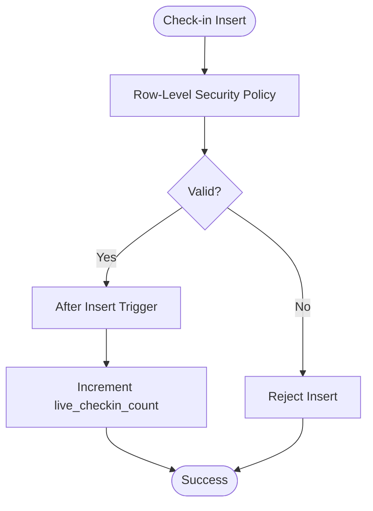
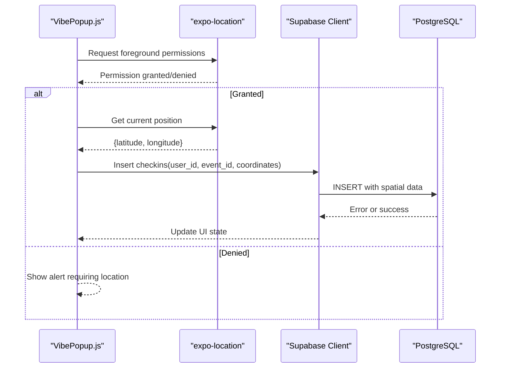
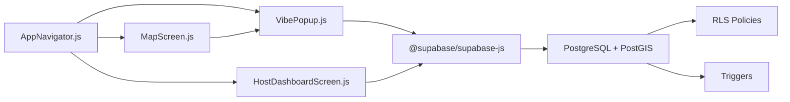

# Proximity Validation and Check-ins

<cite>
**Referenced Files in This Document**
- [phase6_checkins.sql](file://supabase/sql/sql/phase6_checkins.sql)
- [VibePopup.js](file://src/components/VibePopup.js)
- [MapScreen.js](file://src/screens/MapScreen.js)
- [HostDashboardScreen.js](file://src/screens/HostDashboardScreen.js)
- [AppNavigator.js](file://src/navigation/AppNavigator.js)
- [package.json](file://package.json)
</cite>

## Table of Contents
1. [Introduction](#introduction)
2. [Project Structure](#project-structure)
3. [Core Components](#core-components)
4. [Architecture Overview](#architecture-overview)
5. [Detailed Component Analysis](#detailed-component-analysis)
6. [Dependency Analysis](#dependency-analysis)
7. [Performance Considerations](#performance-considerations)
8. [Troubleshooting Guide](#troubleshooting-guide)
9. [Conclusion](#conclusion)

## Introduction
This document explains the proximity-based check-in validation system that verifies user attendance at live events using GPS coordinates. It covers how the mobile app captures location, how the database enforces distance thresholds with spatial functions, and how real-time attendance counts are maintained securely. You will find:
- How GPS coordinates are used to validate check-ins within a defined tolerance
- The database schema and policies for check-ins and events
- Spatial queries and distance calculations performed server-side
- Security measures to prevent fake check-ins
- Examples of distance calculation logic, validation rules, and real-time attendance tracking flows

## Project Structure
The proximity check-in feature spans the mobile UI and the backend database:
- Mobile screens capture location and trigger check-ins
- A popup component handles per-event interactions including check-in
- The host dashboard creates live events with geographic coordinates
- The database enforces proximity checks and maintains live counts via triggers and policies

**Diagram sources**
- [MapScreen.js:23-33](file://src/screens/MapScreen.js#L23-L33)
- [VibePopup.js:82-118](file://src/components/VibePopup.js#L82-L118)
- [HostDashboardScreen.js:51-86](file://src/screens/HostDashboardScreen.js#L51-L86)
- [phase6_checkins.sql:20-40](file://supabase/sql/sql/phase6_checkins.sql#L20-L40)
- [phase6_checkins.sql:47-63](file://supabase/sql/sql/phase6_checkins.sql#L47-L63)

**Section sources**
- [MapScreen.js:23-33](file://src/screens/MapScreen.js#L23-L33)
- [VibePopup.js:82-118](file://src/components/VibePopup.js#L82-L118)
- [HostDashboardScreen.js:51-86](file://src/screens/HostDashboardScreen.js#L51-L86)
- [AppNavigator.js:23-39](file://src/navigation/AppNavigator.js#L23-L39)
- [package.json:5-22](file://package.json#L5-L22)

## Core Components
- Location capture and event display: The map screen requests location permissions, fetches live events, and renders markers with coordinates.
- Event interaction and check-in: The popup component retrieves current user context, shows posts, and performs check-ins by submitting the device’s current GPS coordinates to the database.
- Host event creation: The host dashboard captures the host’s current GPS coordinates when going live and stores them as event locations.
- Database enforcement: Row-level policies enforce that check-ins can only be inserted if the user is authenticated, the event is live, and the submitted coordinates are within a meter-based threshold of the event location. A trigger increments the live attendance count atomically.

Key implementation highlights:
- Coordinates are stored as spatial POINT values and compared using geography types for accurate meter-based distances.
- The tolerance threshold is enforced server-side to prevent bypassing client-side checks.
- Live attendance is kept in sync via a database trigger after each successful check-in.

**Section sources**
- [MapScreen.js:13-33](file://src/screens/MapScreen.js#L13-L33)
- [VibePopup.js:27-80](file://src/components/VibePopup.js#L27-L80)
- [VibePopup.js:82-118](file://src/components/VibePopup.js#L82-L118)
- [HostDashboardScreen.js:51-86](file://src/screens/HostDashboardScreen.js#L51-L86)
- [phase6_checkins.sql:5-10](file://supabase/sql/sql/phase6_checkins.sql#L5-L10)
- [phase6_checkins.sql:20-40](file://supabase/sql/sql/phase6_checkins.sql#L20-L40)
- [phase6_checkins.sql:47-63](file://supabase/sql/sql/phase6_checkins.sql#L47-L63)

## Architecture Overview
The system uses a secure, server-enforced proximity validation model:
- The mobile app collects GPS coordinates from the device
- The app submits a check-in request with the user ID, event ID, and coordinates
- The database validates:
  - User identity via row-level security
  - Event is currently live
  - Submitted coordinates are within the allowed distance threshold using spatial functions
- On success, a trigger updates the live attendance counter

**Diagram sources**
- [MapScreen.js:23-33](file://src/screens/MapScreen.js#L23-L33)
- [VibePopup.js:82-118](file://src/components/VibePopup.js#L82-L118)
- [phase6_checkins.sql:20-40](file://supabase/sql/sql/phase6_checkins.sql#L20-L40)
- [phase6_checkins.sql:47-63](file://supabase/sql/sql/phase6_checkins.sql#L47-L63)

## Detailed Component Analysis

### Database Schema and Spatial Enforcement
- Events table includes a geographic coordinate column and a live flag; an additional integer column tracks live check-in counts.
- Checkins table records one entry per user per event with a unique constraint to prevent duplicates.
- Row-level security policies:
  - Users can only view their own check-ins
  - Insert policy ensures:
    - The requester is the authenticated user
    - The target event is live
    - The submitted coordinates are within a meter-based threshold of the event location using a spatial function
- A trigger increments the live attendance count immediately after a successful check-in insertion.

**Diagram sources**
- [phase6_checkins.sql:5-10](file://supabase/sql/sql/phase6_checkins.sql#L5-L10)
- [phase6_checkins.sql:20-40](file://supabase/sql/sql/phase6_checkins.sql#L20-L40)
- [phase6_checkins.sql:47-63](file://supabase/sql/sql/phase6_checkins.sql#L47-L63)

**Section sources**
- [phase6_checkins.sql:5-10](file://supabase/sql/sql/phase6_checkins.sql#L5-L10)
- [phase6_checkins.sql:20-40](file://supabase/sql/sql/phase6_checkins.sql#L20-L40)
- [phase6_checkins.sql:47-63](file://supabase/sql/sql/phase6_checkins.sql#L47-L63)

### Proximity Algorithm and Tolerance Settings
- Distance calculation method: The database casts both event and submitted coordinates to geography types and applies a spatial distance function to ensure meter-based accuracy.
- Tolerance setting: The insert policy enforces a maximum distance threshold of 100 meters between the user’s submitted coordinates and the event location.
- Live gate: The policy also requires the event to be marked as live before allowing a check-in.

Implementation notes:
- Geography casting ensures precise distance measurements across the globe
- The threshold is hardcoded in the policy for strict enforcement
- Any attempt to check in outside the threshold or for a non-live event is rejected by the database

**Section sources**
- [phase6_checkins.sql:20-40](file://supabase/sql/sql/phase6_checkins.sql#L20-L40)

### Real-Time Attendance Tracking
- Live attendance is tracked via an integer counter on the events table
- A database trigger runs after each successful check-in insertion to increment the counter
- The mobile UI reads the live count from the event object and updates the interface accordingly

**Diagram sources**
- [phase6_checkins.sql:20-40](file://supabase/sql/sql/phase6_checkins.sql#L20-L40)
- [phase6_checkins.sql:47-63](file://supabase/sql/sql/phase6_checkins.sql#L47-L63)

**Section sources**
- [phase6_checkins.sql:47-63](file://supabase/sql/sql/phase6_checkins.sql#L47-L63)

### Mobile Implementation Details
- Location capture:
  - The map screen requests foreground location permissions and retrieves the current position
  - The host dashboard requests location permissions when creating a live event and stores the coordinates
- Check-in flow:
  - The popup component requests location permissions, retrieves the current GPS coordinates, and inserts a check-in record with the user ID, event ID, and coordinates
  - Duplicate check-ins are prevented by a unique constraint on user_id and event_id
  - Errors are handled with user-facing alerts, including cases where location access is denied or the proximity check fails

**Diagram sources**
- [VibePopup.js:82-118](file://src/components/VibePopup.js#L82-L118)
- [HostDashboardScreen.js:51-86](file://src/screens/HostDashboardScreen.js#L51-L86)
- [MapScreen.js:13-21](file://src/screens/MapScreen.js#L13-L21)

**Section sources**
- [VibePopup.js:82-118](file://src/components/VibePopup.js#L82-L118)
- [HostDashboardScreen.js:51-86](file://src/screens/HostDashboardScreen.js#L51-L86)
- [MapScreen.js:13-21](file://src/screens/MapScreen.js#L13-L21)

### Security Measures Against Fake Check-ins
- Authentication requirement: Only authenticated users can insert check-ins
- Ownership verification: The insert policy ensures the requester matches the user_id
- Live-only enforcement: Check-ins are allowed only for events marked as live
- Proximity enforcement: The database enforces a strict distance threshold using spatial functions
- Privacy: Users can only view their own check-ins; aggregate counts are visible publicly
- Atomic updates: The trigger increments the live count under database privileges, preventing race conditions and unauthorized updates

**Section sources**
- [phase6_checkins.sql:12-18](file://supabase/sql/sql/phase6_checkins.sql#L12-L18)
- [phase6_checkins.sql:20-40](file://supabase/sql/sql/phase6_checkins.sql#L20-L40)
- [phase6_checkins.sql:42-58](file://supabase/sql/sql/phase6_checkins.sql#L42-L58)

## Dependency Analysis
The proximity check-in feature depends on:
- React Native navigation and screens for user interaction
- Expo location services for GPS capture
- Supabase client for database operations and authentication
- PostgreSQL with PostGIS for spatial queries and distance calculations
- Row-level security policies and database triggers for enforcement and consistency

**Diagram sources**
- [AppNavigator.js:23-39](file://src/navigation/AppNavigator.js#L23-L39)
- [MapScreen.js:23-33](file://src/screens/MapScreen.js#L23-L33)
- [VibePopup.js:82-118](file://src/components/VibePopup.js#L82-L118)
- [HostDashboardScreen.js:51-86](file://src/screens/HostDashboardScreen.js#L51-L86)
- [package.json:5-22](file://package.json#L5-L22)

**Section sources**
- [AppNavigator.js:23-39](file://src/navigation/AppNavigator.js#L23-L39)
- [package.json:5-22](file://package.json#L5-L22)

## Performance Considerations
- Server-side validation: All proximity checks occur in the database, minimizing client-side overhead and ensuring consistent enforcement
- Efficient spatial queries: Using geography types and spatial functions optimizes distance calculations
- Atomic updates: Triggers update attendance counts without additional client calls, reducing network traffic
- Minimal client logic: The mobile app focuses on capturing location and presenting results, leaving complex validations to the database

[No sources needed since this section provides general guidance]

## Troubleshooting Guide
Common issues and resolutions:
- Location permission denied:
  - The app requests foreground location permissions before capturing coordinates
  - If denied, the user is prompted to enable location access
- Check-in rejected due to proximity:
  - The database policy enforces a 100-meter threshold; attempts outside this range are rejected
  - Ensure the device’s GPS is accurate and the user is near the event location
- Duplicate check-in attempts:
  - A unique constraint prevents multiple check-ins per user per event
  - The UI treats duplicate errors as successful states to avoid confusion
- Event not live:
  - Check-ins are only allowed for events marked as live
  - Hosts must start an event and keep it live to allow check-ins

**Section sources**
- [VibePopup.js:82-118](file://src/components/VibePopup.js#L82-L118)
- [phase6_checkins.sql:8-10](file://supabase/sql/sql/phase6_checkins.sql#L8-L10)
- [phase6_checkins.sql:20-40](file://supabase/sql/sql/phase6_checkins.sql#L20-L40)

## Conclusion
The proximity-based check-in system combines mobile location capture with robust server-side validation to ensure accurate attendance verification for live events. By enforcing authentication, live status, and strict distance thresholds using spatial functions, the system prevents fake check-ins while maintaining a seamless user experience. Real-time attendance counts are updated atomically via database triggers, providing reliable live metrics. This architecture balances performance, security, and usability, making it suitable for scalable event-driven applications.

[No sources needed since this section summarizes without analyzing specific files]