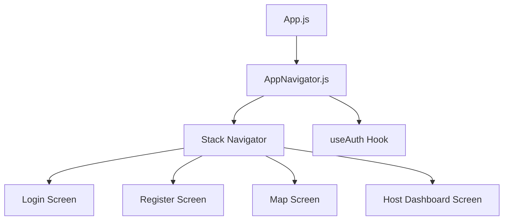
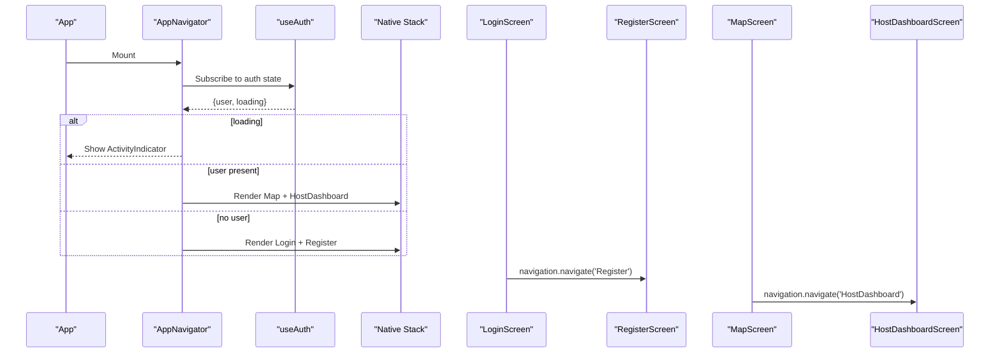
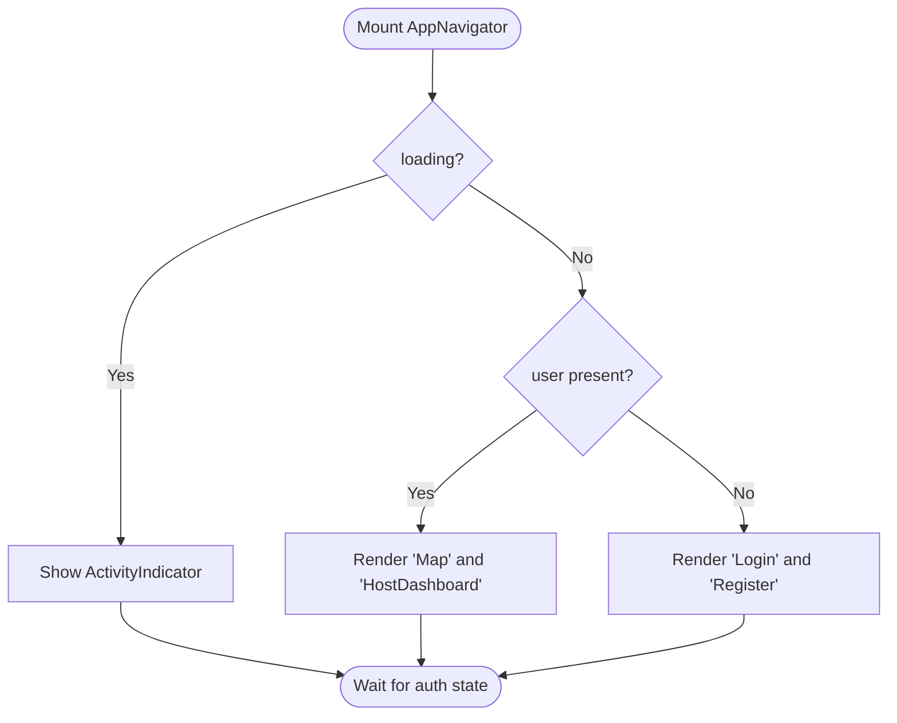
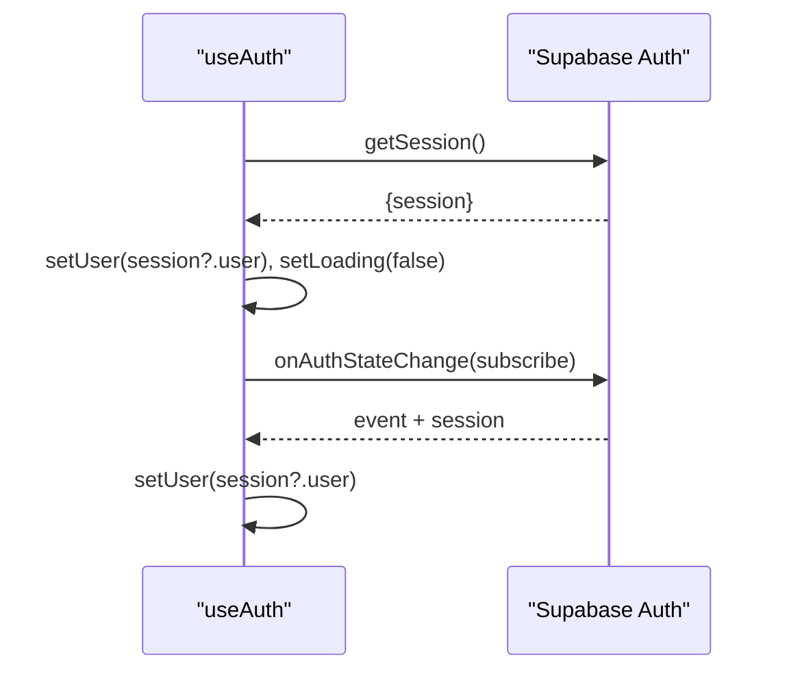
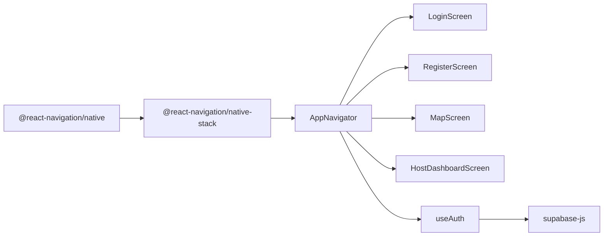

# Navigation and Routing

<cite>
**Referenced Files in This Document**
- [App.js](file://App.js)
- [AppNavigator.js](file://src/navigation/AppNavigator.js)
- [useAuth.js](file://src/hooks/useAuth.js)
- [LoginScreen.js](file://src/screens/LoginScreen.js)
- [RegisterScreen.js](file://src/screens/RegisterScreen.js)
- [MapScreen.js](file://src/screens/MapScreen.js)
- [HostDashboardScreen.js](file://src/screens/HostDashboardScreen.js)
- [package.json](file://package.json)
</cite>

## Table of Contents
1. Introduction
2. Project Structure
3. Core Components
4. Architecture Overview
5. Detailed Component Analysis
6. Dependency Analysis
7. Performance Considerations
8. Troubleshooting Guide
9. Conclusion
10. Appendices

## Introduction
This document explains the navigation and routing system used by the application. It covers how React Navigation is configured, how conditional routing is implemented based on authentication state, screen-to-screen navigation patterns, parameter passing strategies, and how to extend the app with new screens or nested navigators. It also includes guidance for protecting authenticated routes, deep linking considerations, and debugging techniques.

## Project Structure
The navigation setup is centralized in a single navigator component that conditionally renders different stacks depending on whether a user is authenticated. The root component mounts this navigator, and each screen receives the navigation prop to navigate between screens.

**Diagram sources**
- [App.js:1-5](file://App.js#L1-L5)
- [AppNavigator.js:1-40](file://src/navigation/AppNavigator.js#L1-L40)
- [useAuth.js:1-22](file://src/hooks/useAuth.js#L1-L22)

**Section sources**
- [App.js:1-5](file://App.js#L1-L5)
- [AppNavigator.js:1-40](file://src/navigation/AppNavigator.js#L1-L40)

## Core Components
- AppNavigator: Creates a native stack navigator and conditionally registers screens based on authentication state from useAuth. Displays a loading indicator while auth state is being resolved.
- useAuth: Subscribes to Supabase auth state changes and exposes current user and loading status to drive conditional routing.
- Screens: LoginScreen, RegisterScreen, MapScreen, HostDashboardScreen implement navigation via the navigation prop provided by React Navigation.

Key responsibilities:
- Conditional routing: If a user exists, show Map and HostDashboard; otherwise show Login and Register.
- Loading state: Show an ActivityIndicator until auth session is known.
- Navigation actions: Each screen uses navigation.navigate to move between screens.

**Section sources**
- [AppNavigator.js:1-40](file://src/navigation/AppNavigator.js#L1-L40)
- [useAuth.js:1-22](file://src/hooks/useAuth.js#L1-L22)
- [LoginScreen.js:1-97](file://src/screens/LoginScreen.js#L1-L97)
- [RegisterScreen.js:1-126](file://src/screens/RegisterScreen.js#L1-L126)
- [MapScreen.js:1-100](file://src/screens/MapScreen.js#L1-L100)
- [HostDashboardScreen.js:1-305](file://src/screens/HostDashboardScreen.js#L1-L305)

## Architecture Overview
The app uses a single top-level Stack Navigator. Authentication state drives which screens are available at runtime. Screens navigate using the navigation prop. There are no nested navigators currently, but the structure supports adding them easily.

**Diagram sources**
- [AppNavigator.js:12-39](file://src/navigation/AppNavigator.js#L12-L39)
- [useAuth.js:8-18](file://src/hooks/useAuth.js#L8-L18)
- [LoginScreen.js:41-43](file://src/screens/LoginScreen.js#L41-L43)
- [MapScreen.js:63-68](file://src/screens/MapScreen.js#L63-L68)

## Detailed Component Analysis

### AppNavigator: Conditional Routing Based on Authentication
- Creates a Native Stack Navigator with header hidden globally.
- Reads user and loading from useAuth.
- While loading, displays a centered ActivityIndicator.
- When user is present, registers Map and HostDashboard.
- When no user, registers Login and Register.

**Diagram sources**
- [AppNavigator.js:12-39](file://src/navigation/AppNavigator.js#L12-L39)

**Section sources**
- [AppNavigator.js:12-39](file://src/navigation/AppNavigator.js#L12-L39)

### useAuth: Navigation Guard via State Subscription
- Initializes user and loading state.
- Fetches initial session and sets loading to false.
- Subscribes to auth state changes to keep user state in sync.
- Returns user and loading to consumers (e.g., AppNavigator).

**Diagram sources**
- [useAuth.js:8-18](file://src/hooks/useAuth.js#L8-L18)

**Section sources**
- [useAuth.js:1-22](file://src/hooks/useAuth.js#L1-L22)

### Screen-to-Screen Navigation Patterns
- Login to Register: Uses navigation.navigate('Register').
- Map to HostDashboard: Uses navigation.navigate('HostDashboard').
- Back navigation: HostDashboard uses navigation.goBack().

These demonstrate basic stack navigation without parameters. For more complex flows, see Parameter Passing below.

**Section sources**
- [LoginScreen.js:41-43](file://src/screens/LoginScreen.js#L41-L43)
- [MapScreen.js:63-68](file://src/screens/MapScreen.js#L63-L68)
- [HostDashboardScreen.js:148-150](file://src/screens/HostDashboardScreen.js#L148-L150)

### Parameter Passing Between Screens
Current screens do not pass route params. To add parameters:
- Navigate with params: navigation.navigate('TargetScreen', { key: value }).
- Read params: const { route } = useRoute(); const param = route.params?.key;
- Define optional params in TypeScript if applicable.

Example usage pattern:
- From MapScreen to HostDashboard: Pass selected location or context.
- From LoginScreen to MapScreen after sign-in: Redirect with a flag or token context.

[No sources needed since this section provides general guidance]

### Adding New Screens to the Navigation Stack
Steps:
1. Create a new screen component under src/screens.
2. Import it into AppNavigator.
3. Add a Stack.Screen entry inside the appropriate conditional block (authenticated or guest).
4. Navigate to it from other screens using navigation.navigate('YourScreenName').

Ensure the screen name matches exactly what you use in navigation calls.

[No sources needed since this section provides general guidance]

### Implementing Nested Navigators
To group related screens (e.g., Auth flow vs. Main flow):
- Create a separate navigator file for each group (e.g., AuthStack, MainStack).
- In AppNavigator, render either AuthStack or MainStack based on user state.
- Use createNativeStackNavigator for each group.

Benefits:
- Cleaner separation of concerns.
- Easier to manage nested tabs or drawers later.
- Centralized guards per group.

[No sources needed since this section provides general guidance]

### Navigation Guards and Route Protection
- Current guard: AppNavigator conditionally shows screens based on user presence.
- Recommended enhancements:
  - Centralize protected routes in a wrapper or higher-order component.
  - Use a beforeEnter hook or a custom guard function to redirect unauthenticated users to Login.
  - Persist intended destination and redirect after login.

[No sources needed since this section provides general guidance]

### Deep Linking and Navigation Debugging
- Deep linking: Configure a config object on NavigationContainer with prefixes and matching rules to map URLs to routes. Ensure screen names match your route definitions.
- Debugging:
  - Enable React Navigation DevTools in development.
  - Log navigation events using listeners like navigation.addListener('state', ...) to inspect state changes.
  - Use console logs around navigation calls to trace issues.

[No sources needed since this section provides general guidance]

## Dependency Analysis
The navigation layer depends on React Navigation packages and integrates with Supabase for authentication state.

**Diagram sources**
- [package.json:6-9](file://package.json#L6-L9)
- [AppNavigator.js:1-8](file://src/navigation/AppNavigator.js#L1-L8)
- [useAuth.js:1-3](file://src/hooks/useAuth.js#L1-L3)

**Section sources**
- [package.json:6-9](file://package.json#L6-L9)
- [AppNavigator.js:1-8](file://src/navigation/AppNavigator.js#L1-L8)
- [useAuth.js:1-3](file://src/hooks/useAuth.js#L1-L3)

## Performance Considerations
- Avoid heavy computations in components that re-render frequently during navigation transitions.
- Keep auth subscription minimal; ensure cleanup to prevent memory leaks.
- Defer non-critical data fetching until screens mount.
- Use lazy loading for large screens if needed.

[No sources needed since this section provides general guidance]

## Troubleshooting Guide
Common issues and resolutions:
- Blank screen or loader stuck:
  - Verify supabase client initialization and network connectivity.
  - Confirm that getSession resolves and sets loading to false.
- Unexpected redirects:
  - Ensure screen names in navigation calls match registered Stack.Screen names.
  - Check conditional rendering logic in AppNavigator for correct user state.
- Navigation errors:
  - Confirm NavigationContainer wraps the root navigator.
  - Validate that all screens are imported and registered.

**Section sources**
- [AppNavigator.js:12-39](file://src/navigation/AppNavigator.js#L12-L39)
- [useAuth.js:8-18](file://src/hooks/useAuth.js#L8-L18)

## Conclusion
The app’s navigation is built around a single Native Stack Navigator with conditional rendering driven by authentication state. Screens navigate using the navigation prop, and the current design is simple and effective for two primary flows: guest (Login/Register) and authenticated (Map/HostDashboard). Extending the app with additional screens or nested navigators is straightforward. For robustness, consider centralizing guards, implementing deep linking, and adopting consistent parameter-passing conventions across screens.

## Appendices

### Quick Reference: Current Routes and Screens
- Guest flow:
  - Login -> Register
- Authenticated flow:
  - Map -> HostDashboard

**Section sources**
- [AppNavigator.js:26-36](file://src/navigation/AppNavigator.js#L26-L36)
- [LoginScreen.js:41-43](file://src/screens/LoginScreen.js#L41-L43)
- [MapScreen.js:63-68](file://src/screens/MapScreen.js#L63-L68)