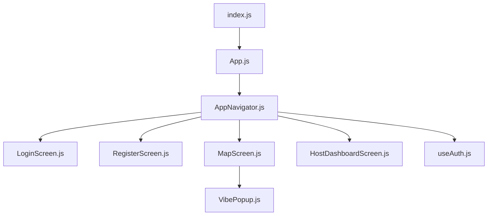
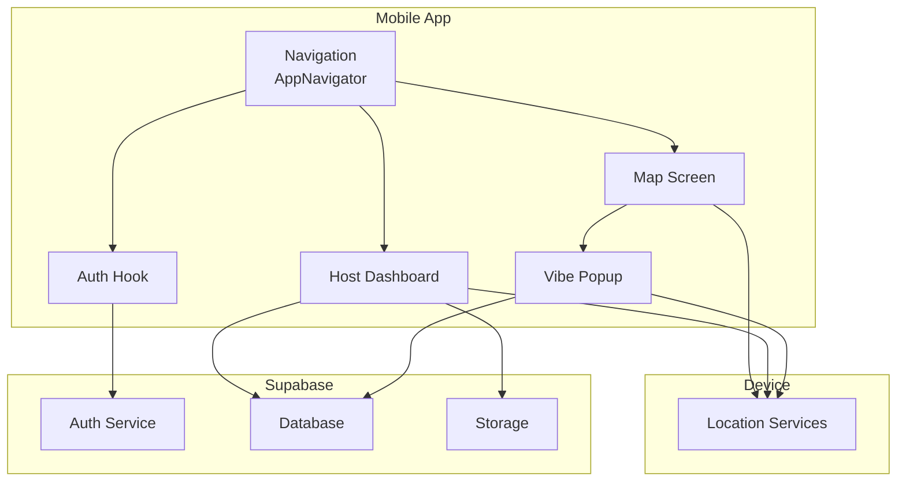
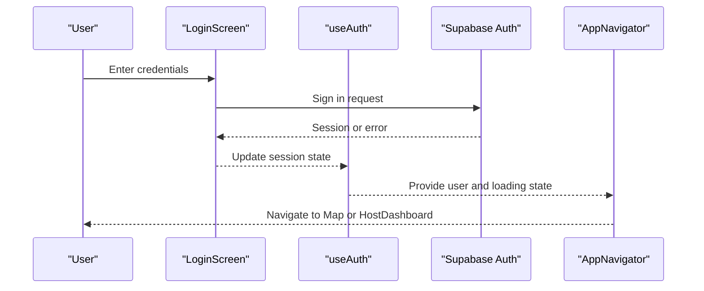
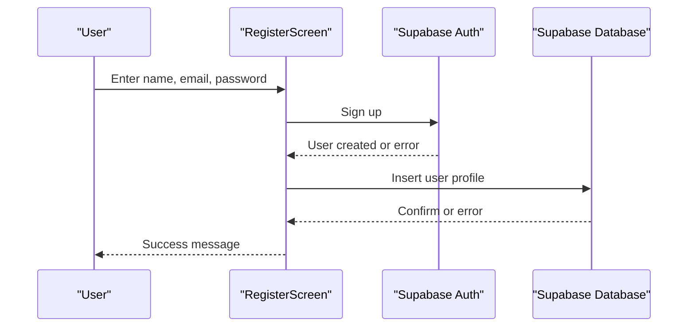
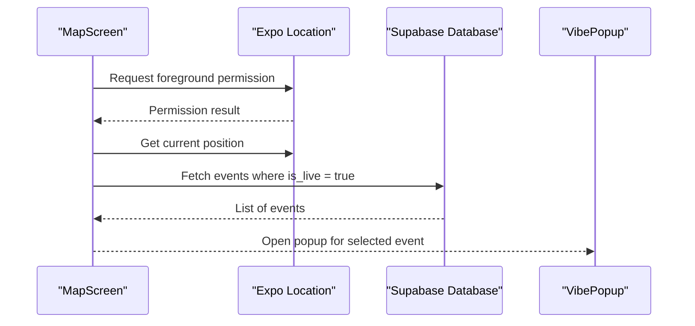
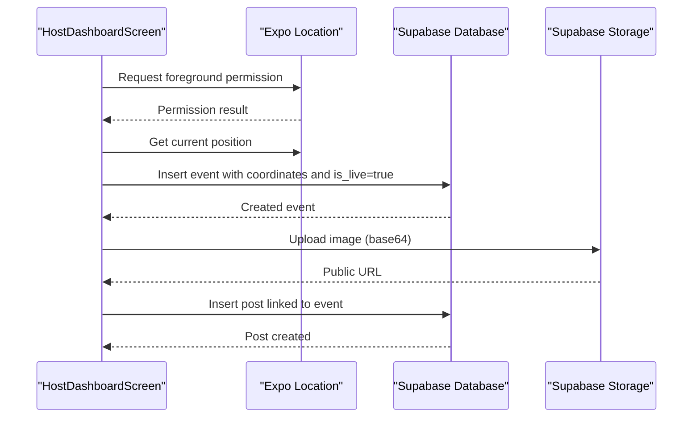
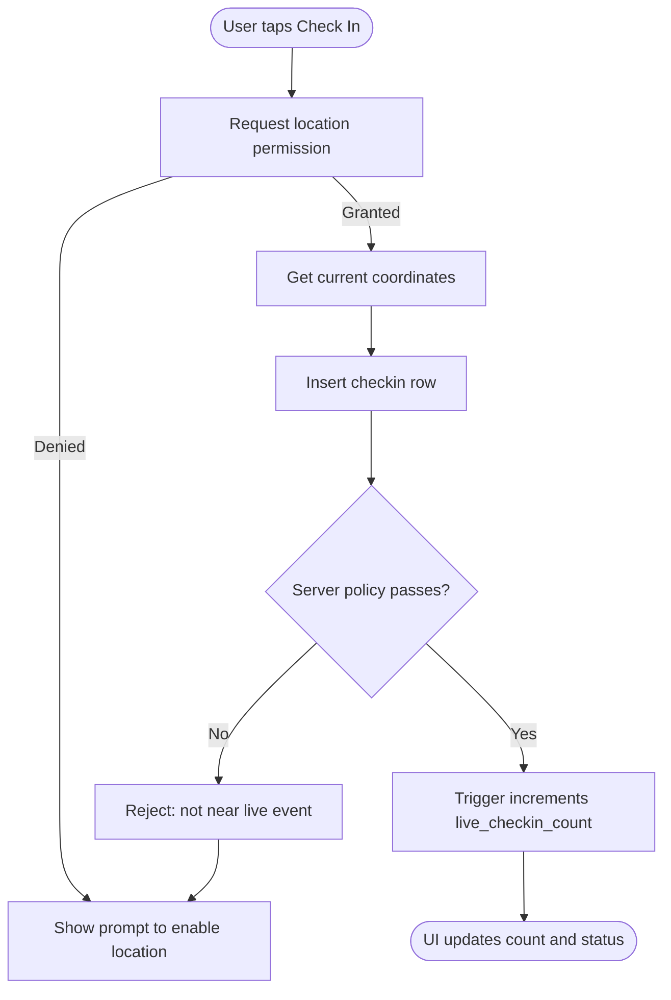
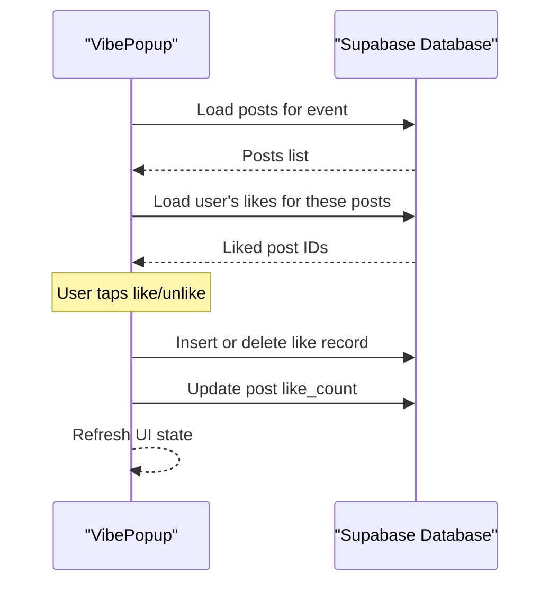
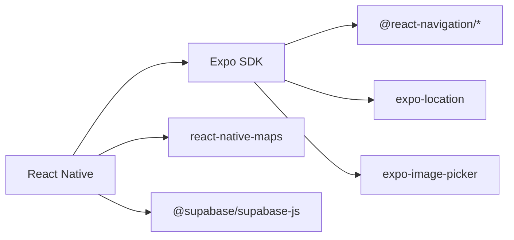

# Project Overview

<cite>
**Referenced Files in This Document**
- [package.json](file://package.json)
- [index.js](file://index.js)
- [App.js](file://App.js)
- [AppNavigator.js](file://src/navigation/AppNavigator.js)
- [LoginScreen.js](file://src/screens/LoginScreen.js)
- [RegisterScreen.js](file://src/screens/RegisterScreen.js)
- [MapScreen.js](file://src/screens/MapScreen.js)
- [HostDashboardScreen.js](file://src/screens/HostDashboardScreen.js)
- [useAuth.js](file://src/hooks/useAuth.js)
- [VibePopup.js](file://src/components/VibePopup.js)
- [phase6_checkins.sql](file://supabase/sql/sql/phase6_checkins.sql)
</cite>

## Table of Contents
1. Introduction
2. Project Structure
3. Core Components
4. Architecture Overview
5. Detailed Component Analysis
6. Dependency Analysis
7. Performance Considerations
8. Troubleshooting Guide
9. Conclusion

## Introduction
Outside is a real-time, location-based social experience app that helps users discover and participate in live events near their current location. Users can sign up or log in, browse active events on a map, host live “pop-up” events with photo sharing, and interact through likes and check-ins. The app emphasizes proximity: attendees can only check in when physically near the event venue while it is live.

Target audience and use cases:
- Social explorers looking for spontaneous local gatherings
- Event hosts who want to quickly go live and share moments with nearby people
- Communities seeking real-time discovery of what’s happening around them

Key outcomes:
- Instant visibility of live events on a map
- Verified attendance via GPS-validated check-ins
- Simple hosting flow with photo posts
- Lightweight social interactions (likes and check-in counts)

[No sources needed since this section provides general context]

## Project Structure
The app is built with React Native and Expo, using Supabase for authentication, database, and storage. Navigation routes users based on auth state to either onboarding screens or core features like the map and hosting dashboard.

**Diagram sources**
- [index.js:1-9](file://index.js#L1-L9)
- [App.js:1-5](file://App.js#L1-L5)
- [AppNavigator.js:1-40](file://src/navigation/AppNavigator.js#L1-L40)
- [LoginScreen.js:1-97](file://src/screens/LoginScreen.js#L1-L97)
- [RegisterScreen.js:1-126](file://src/screens/RegisterScreen.js#L1-L126)
- [MapScreen.js:1-100](file://src/screens/MapScreen.js#L1-L100)
- [HostDashboardScreen.js:1-305](file://src/screens/HostDashboardScreen.js#L1-L305)
- [useAuth.js:1-22](file://src/hooks/useAuth.js#L1-L22)
- [VibePopup.js:1-333](file://src/components/VibePopup.js#L1-L333)

**Section sources**
- [index.js:1-9](file://index.js#L1-L9)
- [App.js:1-5](file://App.js#L1-L5)
- [AppNavigator.js:1-40](file://src/navigation/AppNavigator.js#L1-L40)

## Core Components
- Authentication and navigation routing:
  - Auth hook manages session state and updates UI accordingly.
  - Navigator shows Login/Register when unauthenticated; Map and HostDashboard when authenticated.
- Map and discovery:
  - Requests location permissions, fetches live events from the database, and renders markers.
- Hosting and posting:
  - Captures current coordinates, creates a live event, uploads photos to storage, and publishes posts linked to the event.
- Social interactions:
  - VibePopup displays event details, posts, allows likes, and enforces proximity-gated check-ins.

**Section sources**
- [useAuth.js:1-22](file://src/hooks/useAuth.js#L1-L22)
- [AppNavigator.js:1-40](file://src/navigation/AppNavigator.js#L1-L40)
- [MapScreen.js:1-100](file://src/screens/MapScreen.js#L1-L100)
- [HostDashboardScreen.js:1-305](file://src/screens/HostDashboardScreen.js#L1-L305)
- [VibePopup.js:1-333](file://src/components/VibePopup.js#L1-L333)

## Architecture Overview
High-level system architecture showing how the mobile client interacts with Supabase services and device capabilities.

**Diagram sources**
- [AppNavigator.js:1-40](file://src/navigation/AppNavigator.js#L1-L40)
- [useAuth.js:1-22](file://src/hooks/useAuth.js#L1-L22)
- [MapScreen.js:1-100](file://src/screens/MapScreen.js#L1-L100)
- [HostDashboardScreen.js:1-305](file://src/screens/HostDashboardScreen.js#L1-L305)
- [VibePopup.js:1-333](file://src/components/VibePopup.js#L1-L333)

## Detailed Component Analysis

### Authentication Flow
Users authenticate via email/password. On success, the navigator switches to protected screens.

**Diagram sources**
- [LoginScreen.js:1-97](file://src/screens/LoginScreen.js#L1-L97)
- [useAuth.js:1-22](file://src/hooks/useAuth.js#L1-L22)
- [AppNavigator.js:1-40](file://src/navigation/AppNavigator.js#L1-L40)

**Section sources**
- [LoginScreen.js:1-97](file://src/screens/LoginScreen.js#L1-L97)
- [useAuth.js:1-22](file://src/hooks/useAuth.js#L1-L22)
- [AppNavigator.js:1-40](file://src/navigation/AppNavigator.js#L1-L40)

### Registration Flow
New users create an account and a profile record.

**Diagram sources**
- [RegisterScreen.js:1-126](file://src/screens/RegisterScreen.js#L1-L126)

**Section sources**
- [RegisterScreen.js:1-126](file://src/screens/RegisterScreen.js#L1-L126)

### Map Discovery and Live Events
The map screen requests location, loads live events, and renders markers. Tapping an event opens the VibePopup.

**Diagram sources**
- [MapScreen.js:1-100](file://src/screens/MapScreen.js#L1-L100)
- [VibePopup.js:1-333](file://src/components/VibePopup.js#L1-L333)

**Section sources**
- [MapScreen.js:1-100](file://src/screens/MapScreen.js#L1-L100)

### Hosting a Live Event and Posting Photos
Hosts capture location, create a live event, and post photos linked to the event.

**Diagram sources**
- [HostDashboardScreen.js:1-305](file://src/screens/HostDashboardScreen.js#L1-L305)

**Section sources**
- [HostDashboardScreen.js:1-305](file://src/screens/HostDashboardScreen.js#L1-L305)

### Check-in Validation and Live Count
Check-ins are enforced by server-side policies to ensure proximity and event liveness. A trigger increments the live check-in count.

**Diagram sources**
- [VibePopup.js:1-333](file://src/components/VibePopup.js#L1-L333)
- [phase6_checkins.sql:1-63](file://supabase/sql/sql/phase6_checkins.sql#L1-L63)

**Section sources**
- [VibePopup.js:1-333](file://src/components/VibePopup.js#L1-L333)
- [phase6_checkins.sql:1-63](file://supabase/sql/sql/phase6_checkins.sql#L1-L63)

### Likes and Social Interactions
Users can toggle likes on posts within an event. The UI reflects immediate changes and persists to the database.

**Diagram sources**
- [VibePopup.js:1-333](file://src/components/VibePopup.js#L1-L333)

**Section sources**
- [VibePopup.js:1-333](file://src/components/VibePopup.js#L1-L333)

## Dependency Analysis
Technology stack and key dependencies:
- React Native + Expo for cross-platform development
- React Navigation for screen routing
- Supabase for Auth, Database, and Storage
- Expo Location for GPS access
- react-native-maps for interactive maps
- expo-image-picker for selecting images

**Diagram sources**
- [package.json:1-32](file://package.json#L1-L32)

**Section sources**
- [package.json:1-32](file://package.json#L1-L32)

## Performance Considerations
- Minimize unnecessary re-renders by keeping map markers lightweight and avoiding frequent state updates.
- Use pagination or limits when fetching posts or events if lists grow large.
- Cache user session and recent events locally to reduce network calls.
- Compress images before upload to reduce bandwidth and storage costs.
- Debounce location updates and avoid polling; rely on explicit actions or minimal refresh intervals.

[No sources needed since this section provides general guidance]

## Troubleshooting Guide
Common issues and resolutions:
- Location permission denied:
  - Ensure foreground permission is requested before accessing coordinates.
  - Prompt users to enable location in device settings if denied.
- Check-in fails:
  - Server policy requires being within proximity of a live event; verify event is live and coordinates are accurate.
  - Duplicate check-ins are prevented by unique constraints; handle gracefully in UI.
- Image upload errors:
  - Validate base64 decoding and content type; confirm storage bucket permissions.
- Auth state not updating:
  - Verify session retrieval and subscription handling in the auth hook.

**Section sources**
- [MapScreen.js:1-100](file://src/screens/MapScreen.js#L1-L100)
- [HostDashboardScreen.js:1-305](file://src/screens/HostDashboardScreen.js#L1-L305)
- [VibePopup.js:1-333](file://src/components/VibePopup.js#L1-L333)
- [phase6_checkins.sql:1-63](file://supabase/sql/sql/phase6_checkins.sql#L1-L63)

## Conclusion
Outside delivers a focused, real-time social experience centered around live, location-based events. With straightforward hosting flows, verified check-ins, and simple social interactions, it enables spontaneous local connections. The architecture leverages Expo and React Native for rapid development, Supabase for robust backend services, and device location APIs to enforce proximity rules—creating a cohesive, secure, and engaging platform for discovering and participating in live events nearby.

[No sources needed since this section summarizes without analyzing specific files]