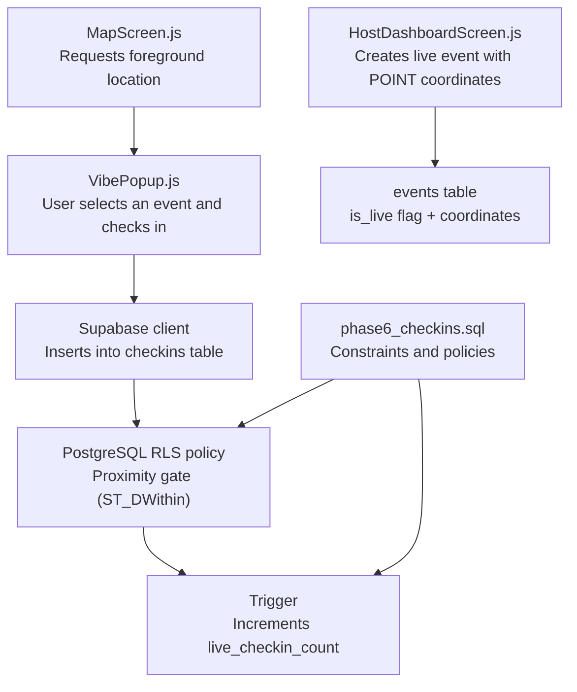
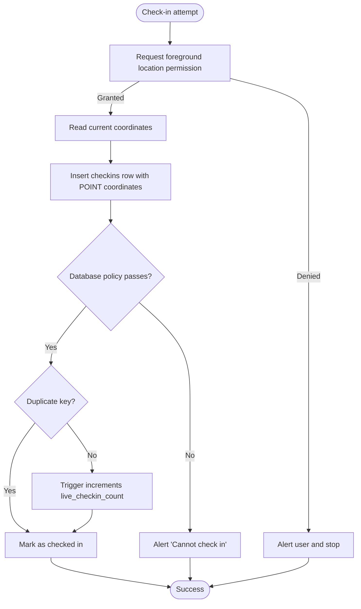
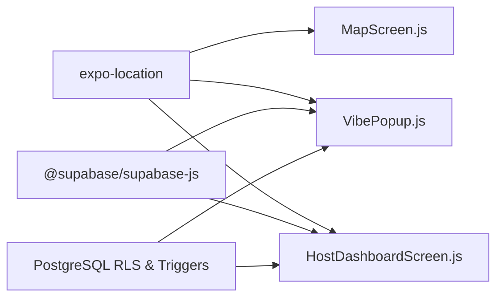

# Check-in Verification System

<cite>
**Referenced Files in This Document**
- [MapScreen.js](file://src/screens/MapScreen.js)
- [VibePopup.js](file://src/components/VibePopup.js)
- [HostDashboardScreen.js](file://src/screens/HostDashboardScreen.js)
- [phase6_checkins.sql](file://supabase/sql/sql/phase6_checkins.sql)
- [package.json](file://package.json)
</cite>

## Table of Contents
1. [Introduction](#introduction)
2. [Project Structure](#project-structure)
3. [Core Components](#core-components)
4. [Architecture Overview](#architecture-overview)
5. [Detailed Component Analysis](#detailed-component-analysis)
6. [Dependency Analysis](#dependency-analysis)
7. [Performance Considerations](#performance-considerations)
8. [Troubleshooting Guide](#troubleshooting-guide)
9. [Conclusion](#conclusion)

## Introduction
This document explains the GPS-based check-in verification system that validates user proximity to live events and enforces database constraints to prevent duplicate check-ins. It covers:
- Location permission handling with expo-location
- Coordinate capture and validation against event locations
- PostgreSQL spatial queries using POINT data type and distance calculations
- Error handling for location permissions, failed proximity checks, and network issues during check-in attempts

The system ensures users can only check in when they are physically near a live event and prevents multiple check-ins by the same user for the same event.

## Project Structure
The check-in flow spans three main areas:
- Mobile UI components that request location and initiate check-ins
- Database policies and triggers that enforce proximity and uniqueness
- Event creation that captures host coordinates as POINT values

**Diagram sources**
- [MapScreen.js:13-20](file://src/screens/MapScreen.js#L13-L20)
- [VibePopup.js:82-118](file://src/components/VibePopup.js#L82-L118)
- [HostDashboardScreen.js:51-86](file://src/screens/HostDashboardScreen.js#L51-L86)
- [phase6_checkins.sql:20-40](file://supabase/sql/sql/phase6_checkins.sql#L20-L40)
- [phase6_checkins.sql:42-63](file://supabase/sql/sql/phase6_checkins.sql#L42-L63)

**Section sources**
- [MapScreen.js:13-20](file://src/screens/MapScreen.js#L13-L20)
- [VibePopup.js:82-118](file://src/components/VibePopup.js#L82-L118)
- [HostDashboardScreen.js:51-86](file://src/screens/HostDashboardScreen.js#L51-L86)
- [phase6_checkins.sql:20-40](file://supabase/sql/sql/phase6_checkins.sql#L20-L40)
- [phase6_checkins.sql:42-63](file://supabase/sql/sql/phase6_checkins.sql#L42-L63)

## Core Components
- Location permission and capture: The app requests foreground location permission before reading device coordinates.
- Live event creation: Hosts create live events with their current coordinates stored as a POINT value.
- Check-in submission: Users submit a check-in with their current coordinates; the server enforces proximity and uniqueness via PostgreSQL policies and constraints.
- Live count maintenance: A trigger increments the live check-in counter on successful inserts.

Key implementation references:
- Foreground location permission and coordinate retrieval: [MapScreen.js:13-20](file://src/screens/MapScreen.js#L13-L20), [HostDashboardScreen.js:51-86](file://src/screens/HostDashboardScreen.js#L51-L86)
- Check-in submission and error handling: [VibePopup.js:82-118](file://src/components/VibePopup.js#L82-L118)
- Proximity policy and duplicate prevention: [phase6_checkins.sql:8-10](file://supabase/sql/sql/phase6_checkins.sql#L8-L10), [phase6_checkins.sql:20-40](file://supabase/sql/sql/phase6_checkins.sql#L20-L40)
- Live count increment trigger: [phase6_checkins.sql:42-63](file://supabase/sql/sql/phase6_checkins.sql#L42-L63)

**Section sources**
- [MapScreen.js:13-20](file://src/screens/MapScreen.js#L13-L20)
- [HostDashboardScreen.js:51-86](file://src/screens/HostDashboardScreen.js#L51-L86)
- [VibePopup.js:82-118](file://src/components/VibePopup.js#L82-L118)
- [phase6_checkins.sql:8-10](file://supabase/sql/sql/phase6_checkins.sql#L8-L10)
- [phase6_checkins.sql:20-40](file://supabase/sql/sql/phase6_checkins.sql#L20-L40)
- [phase6_checkins.sql:42-63](file://supabase/sql/sql/phase6_checkins.sql#L42-L63)

## Architecture Overview
The system combines client-side location acquisition with server-side spatial enforcement:

```mermaid
sequenceDiagram
participant U as "User"
participant MS as "MapScreen.js"
participant VP as "VibePopup.js"
participant SB as "Supabase Client"
participant PG as "PostgreSQL"
U->>MS : Open map screen
MS->>MS : Request foreground location permission
MS-->>U : Show map with user marker
U->>VP : Tap event marker to open popup
VP->>VP : Check if already checked in
U->>VP : Press "check in"
VP->>VP : Request foreground location permission
VP->>SB : Insert {user_id, event_id, coordinates}
SB->>PG : INSERT into checkins
PG->>PG : Enforce unique(user_id, event_id)
PG->>PG : Evaluate RLS policy (is_live + ST_DWithin <= 100m)
alt Within range and not duplicate
PG-->>SB : Success
SB-->>VP : No error
VP->>VP : Set checkedIn = true, increment local count
else Outside range or not live
PG-->>SB : Policy violation error
SB-->>VP : Error
VP->>U : Alert "Can't check in"
end
```

**Diagram sources**
- [MapScreen.js:13-20](file://src/screens/MapScreen.js#L13-L20)
- [VibePopup.js:82-118](file://src/components/VibePopup.js#L82-L118)
- [phase6_checkins.sql:8-10](file://supabase/sql/sql/phase6_checkins.sql#L8-L10)
- [phase6_checkins.sql:20-40](file://supabase/sql/sql/phase6_checkins.sql#L20-L40)

## Detailed Component Analysis

### Location Permission Handling (expo-location)
- The app uses foreground permissions to read the device’s current position before any geospatial operation.
- If permission is denied, the flow stops early and informs the user.

References:
- Map screen permission request: [MapScreen.js:13-20](file://src/screens/MapScreen.js#L13-L20)
- Host “go live” permission gating: [HostDashboardScreen.js:51-86](file://src/screens/HostDashboardScreen.js#L51-L86)
- Check-in permission gating: [VibePopup.js:82-118](file://src/components/VibePopup.js#L82-L118)

Error handling examples:
- Denied permission: User is alerted that location access is required.
- Network failure during insert: The client catches errors and shows a generic error alert.

**Section sources**
- [MapScreen.js:13-20](file://src/screens/MapScreen.js#L13-L20)
- [HostDashboardScreen.js:51-86](file://src/screens/HostDashboardScreen.js#L51-L86)
- [VibePopup.js:82-118](file://src/components/VibePopup.js#L82-L118)

### Coordinate Validation Against Event Locations
- Events store their location as a POINT value created from longitude and latitude at creation time.
- When checking in, the client sends its current coordinates as a POINT value.
- The server enforces that the check-in must be within 100 meters of a live event using a geographic distance function.

References:
- Event creation with POINT coordinates: [HostDashboardScreen.js:51-86](file://src/screens/HostDashboardScreen.js#L51-L86)
- Check-in insertion with POINT coordinates: [VibePopup.js:82-118](file://src/components/VibePopup.js#L82-L118)
- Server-side proximity policy: [phase6_checkins.sql:20-40](file://supabase/sql/sql/phase6_checkins.sql#L20-L40)

Spatial query details:
- Uses geography casting for meter-based distance calculation.
- Requires the event to be marked as live.
- Enforces a maximum distance threshold (100 meters).

**Section sources**
- [HostDashboardScreen.js:51-86](file://src/screens/HostDashboardScreen.js#L51-L86)
- [VibePopup.js:82-118](file://src/components/VibePopup.js#L82-L118)
- [phase6_checkins.sql:20-40](file://supabase/sql/sql/phase6_checkins.sql#L20-L40)

### Database Constraints Preventing Duplicate Check-ins
- A unique constraint ensures each user can check in once per event.
- The client treats duplicate key errors as success and marks the user as checked in.

References:
- Unique constraint definition: [phase6_checkins.sql:8-10](file://supabase/sql/sql/phase6_checkins.sql#L8-L10)
- Duplicate error handling on client: [VibePopup.js:82-118](file://src/components/VibePopup.js#L82-L118)

**Section sources**
- [phase6_checkins.sql:8-10](file://supabase/sql/sql/phase6_checkins.sql#L8-L10)
- [VibePopup.js:82-118](file://src/components/VibePopup.js#L82-L118)

### Live Count Maintenance via Trigger
- After a successful check-in insert, a trigger increments the event’s live check-in counter.
- The trigger runs with elevated privileges to safely update the events table without granting write access to regular users.

References:
- Trigger and function: [phase6_checkins.sql:42-63](file://supabase/sql/sql/phase6_checkins.sql#L42-L63)

**Section sources**
- [phase6_checkins.sql:42-63](file://supabase/sql/sql/phase6_checkins.sql#L42-L63)

### Data Flow and State Changes

**Diagram sources**
- [VibePopup.js:82-118](file://src/components/VibePopup.js#L82-L118)
- [phase6_checkins.sql:8-10](file://supabase/sql/sql/phase6_checkins.sql#L8-L10)
- [phase6_checkins.sql:20-40](file://supabase/sql/sql/phase6_checkins.sql#L20-L40)
- [phase6_checkins.sql:42-63](file://supabase/sql/sql/phase6_checkins.sql#L42-L63)

## Dependency Analysis
The check-in feature depends on:
- expo-location for device positioning
- Supabase client for authenticated database operations
- PostgreSQL RLS policies and triggers for security and consistency

**Diagram sources**
- [package.json:15-15](file://package.json#L15-L15)
- [VibePopup.js:82-118](file://src/components/VibePopup.js#L82-L118)
- [HostDashboardScreen.js:51-86](file://src/screens/HostDashboardScreen.js#L51-L86)
- [phase6_checkins.sql:20-40](file://supabase/sql/sql/phase6_checkins.sql#L20-L40)
- [phase6_checkins.sql:42-63](file://supabase/sql/sql/phase6_checkins.sql#L42-L63)

**Section sources**
- [package.json:15-15](file://package.json#L15-L15)
- [VibePopup.js:82-118](file://src/components/VibePopup.js#L82-L118)
- [HostDashboardScreen.js:51-86](file://src/screens/HostDashboardScreen.js#L51-L86)
- [phase6_checkins.sql:20-40](file://supabase/sql/sql/phase6_checkins.sql#L20-L40)
- [phase6_checkins.sql:42-63](file://supabase/sql/sql/phase6_checkins.sql#L42-L63)

## Performance Considerations
- Geography vs geometry: Using geography casting enables accurate meter-based distances but may be slightly more expensive than planar geometry. For typical venue-scale distances, this overhead is minimal.
- Indexing: Ensure spatial indexes exist on the events.coordinates column to optimize proximity checks under load.
- Batch updates: The trigger performs a single-row update per check-in, which is efficient. Avoid additional heavy computations in the trigger.
- Client retries: Implement retry logic with exponential backoff for transient network failures during check-in inserts.

[No sources needed since this section provides general guidance]

## Troubleshooting Guide
Common issues and how the system handles them:

- Location permission denied
  - Symptom: Check-in or event creation fails immediately after requesting permission.
  - Behavior: The app alerts the user that location access is required and stops the flow.
  - References: [MapScreen.js:13-20](file://src/screens/MapScreen.js#L13-L20), [HostDashboardScreen.js:51-86](file://src/screens/HostDashboardScreen.js#L51-L86), [VibePopup.js:82-118](file://src/components/VibePopup.js#L82-L118)

- Outside proximity range or event not live
  - Symptom: Insert returns a policy violation error.
  - Behavior: The client displays a message indicating the user must be at the venue while it is live.
  - References: [phase6_checkins.sql:20-40](file://supabase/sql/sql/phase6_checkins.sql#L20-L40), [VibePopup.js:82-118](file://src/components/VibePopup.js#L82-L118)

- Duplicate check-in
  - Symptom: Unique constraint violation error code.
  - Behavior: The client treats this as success and marks the user as checked in.
  - References: [phase6_checkins.sql:8-10](file://supabase/sql/sql/phase6_checkins.sql#L8-L10), [VibePopup.js:82-118](file://src/components/VibePopup.js#L82-L118)

- Network issues during check-in
  - Symptom: Unhandled exceptions or network errors during insert.
  - Behavior: The client catches errors and shows a generic error alert.
  - References: [VibePopup.js:82-118](file://src/components/VibePopup.js#L82-L118)

**Section sources**
- [MapScreen.js:13-20](file://src/screens/MapScreen.js#L13-L20)
- [HostDashboardScreen.js:51-86](file://src/screens/HostDashboardScreen.js#L51-L86)
- [VibePopup.js:82-118](file://src/components/VibePopup.js#L82-L118)
- [phase6_checkins.sql:8-10](file://supabase/sql/sql/phase6_checkins.sql#L8-L10)
- [phase6_checkins.sql:20-40](file://supabase/sql/sql/phase6_checkins.sql#L20-L40)

## Conclusion
The check-in verification system combines robust client-side location handling with strict server-side spatial enforcement. By capturing coordinates with expo-location, validating proximity using PostgreSQL geography functions, and enforcing uniqueness through database constraints, the system ensures reliable, secure, and consistent check-ins for live events. Proper error handling guides users through permission denials, proximity failures, and network issues, while triggers keep live counts accurate.

[No sources needed since this section summarizes without analyzing specific files]