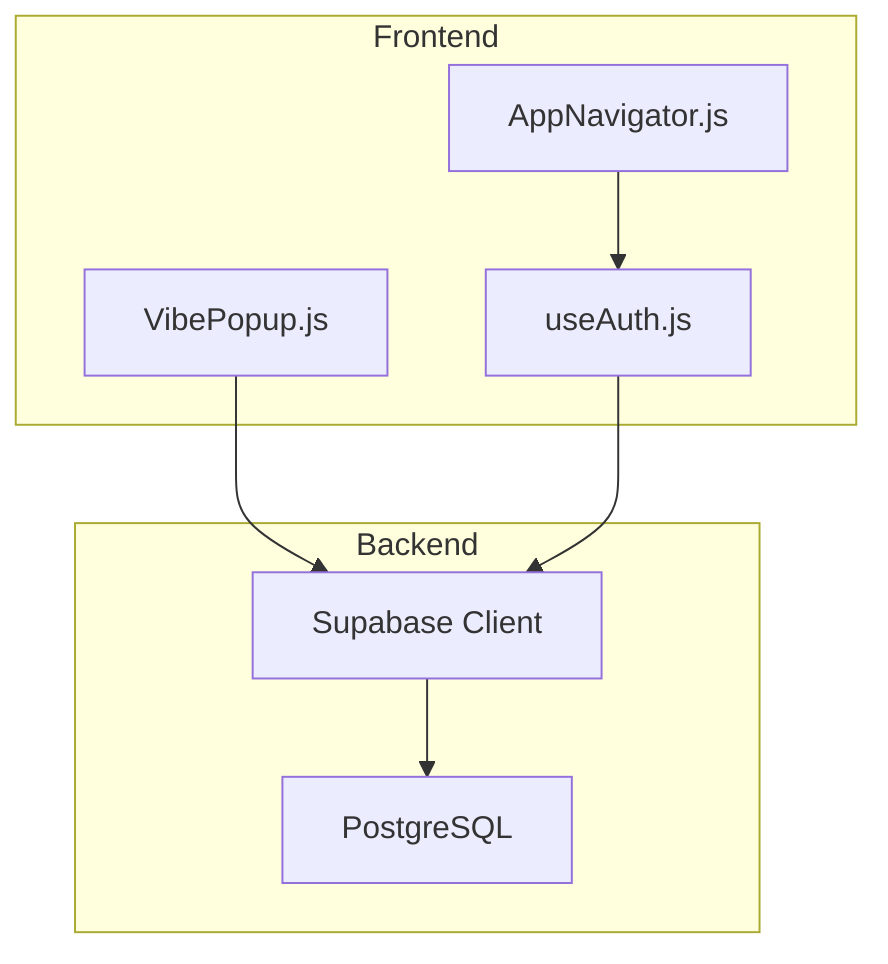
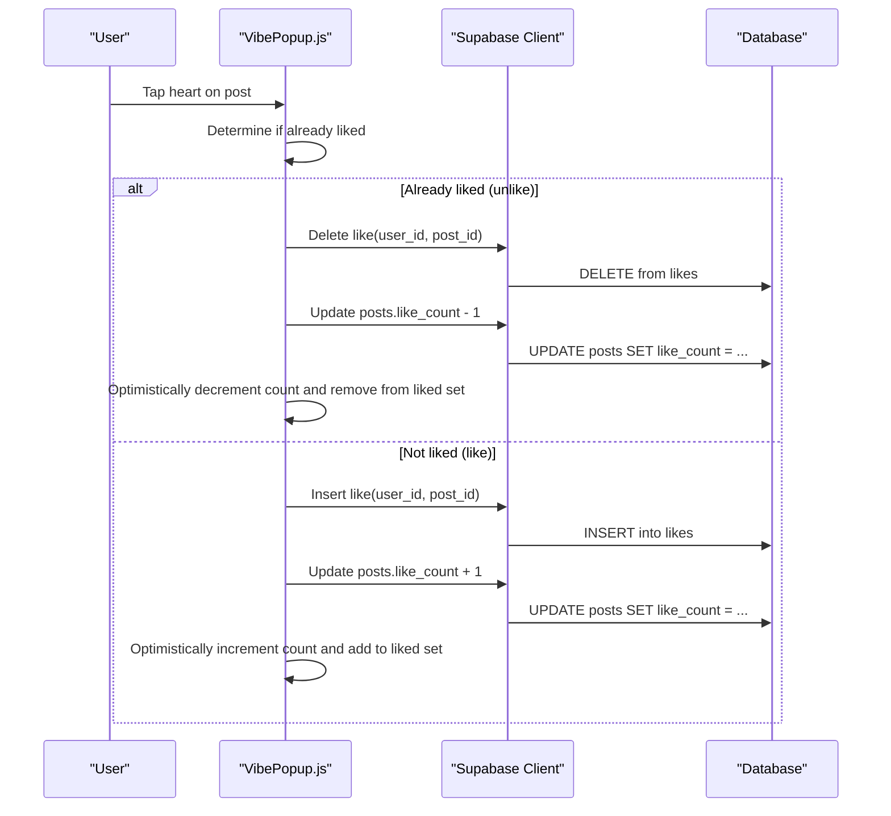
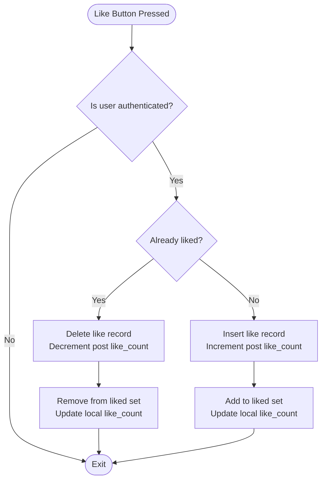
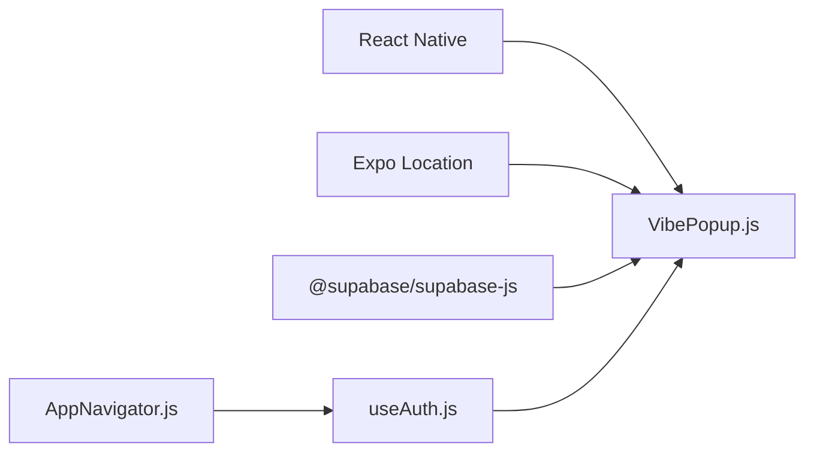

# Like System Implementation

<cite>
**Referenced Files in This Document**
- [VibePopup.js](file://src/components/VibePopup.js)
- [phase6_checkins.sql](file://supabase/sql/sql/phase6_checkins.sql)
- [AppNavigator.js](file://src/navigation/AppNavigator.js)
- [useAuth.js](file://src/hooks/useAuth.js)
- [package.json](file://package.json)
</cite>

## Table of Contents
1. [Introduction](#introduction)
2. [Project Structure](#project-structure)
3. [Core Components](#core-components)
4. [Architecture Overview](#architecture-overview)
5. [Detailed Component Analysis](#detailed-component-analysis)
6. [Dependency Analysis](#dependency-analysis)
7. [Performance Considerations](#performance-considerations)
8. [Troubleshooting Guide](#troubleshooting-guide)
9. [Conclusion](#conclusion)

## Introduction
This document explains the like system that allows users to engage with event posts through heart reactions. It covers the toggle-like behavior, how user preferences are tracked, and how post counts are updated in real time. It also documents the database schema for the likes table, the user-post relationship tracking, and the atomic operations used for like/unlike actions. Finally, it includes examples of how duplicate likes are prevented, concurrent updates are handled, and UI consistency is maintained with backend state synchronization.

## Project Structure
The like functionality is implemented in a React Native component that interacts with Supabase to read posts, track user likes, and update counts. The navigation and authentication layers provide context for the current user and route to screens where the like feature is used. Database policies and constraints (including those shown in the check-ins migration) illustrate how the project enforces data integrity at the database layer.

**Diagram sources**
- [VibePopup.js:1-333](file://src/components/VibePopup.js#L1-L333)
- [AppNavigator.js:1-40](file://src/navigation/AppNavigator.js#L1-L40)
- [useAuth.js:1-22](file://src/hooks/useAuth.js#L1-L22)

**Section sources**
- [VibePopup.js:1-333](file://src/components/VibePopup.js#L1-L333)
- [AppNavigator.js:1-40](file://src/navigation/AppNavigator.js#L1-L40)
- [useAuth.js:1-22](file://src/hooks/useAuth.js#L1-L22)

## Core Components
- VibePopup: Implements fetching posts for an event, loading the current user’s liked posts, and toggling likes with immediate UI updates.
- Navigation and Auth: Provide routing and authenticated user context required for like operations.
- Database Layer: Uses Supabase to persist likes and update post counts; policies/constraints ensure correctness.

Key responsibilities:
- Load posts for a given event and order by recency.
- Load the set of posts the current user has liked.
- Toggle like/unlike with optimistic UI updates and server-side persistence.
- Maintain consistent counts on the UI and in the database.

**Section sources**
- [VibePopup.js:48-70](file://src/components/VibePopup.js#L48-L70)
- [VibePopup.js:120-155](file://src/components/VibePopup.js#L120-L155)
- [AppNavigator.js:12-39](file://src/navigation/AppNavigator.js#L12-L39)
- [useAuth.js:4-22](file://src/hooks/useAuth.js#L4-L22)

## Architecture Overview
The like system follows a client-driven flow with optimistic UI updates and server-side persistence. When a user taps the heart icon, the component immediately reflects the change locally while concurrently updating the database. This ensures responsiveness even under network latency.

**Diagram sources**
- [VibePopup.js:120-155](file://src/components/VibePopup.js#L120-L155)

## Detailed Component Analysis

### VibePopup Like Flow
- Data loading:
  - Fetches posts for the current event and orders them by creation time.
  - Loads the current user’s liked posts to build a Set of liked post IDs for fast lookup.
- Toggle logic:
  - If the post is already liked, deletes the like record and decrements the post’s like_count.
  - If not liked, inserts a new like record and increments the post’s like_count.
- UI consistency:
  - Immediately updates local state (likedPosts and posts) to reflect the action before or during the network call, ensuring responsive feedback.
  - Renders the heart icon with the current like_count and highlights it when liked.

**Diagram sources**
- [VibePopup.js:120-155](file://src/components/VibePopup.js#L120-L155)

**Section sources**
- [VibePopup.js:48-70](file://src/components/VibePopup.js#L48-L70)
- [VibePopup.js:120-155](file://src/components/VibePopup.js#L120-L155)
- [VibePopup.js:157-178](file://src/components/VibePopup.js#L157-L178)

### Database Schema and Constraints
- Posts table:
  - Contains a numeric column for like_count that is incremented/decremented when users like/unlike.
- Likes table:
  - Stores user-post relationships via user_id and post_id columns.
  - A unique constraint on (user_id, post_id) prevents duplicate likes at the database level.
- Policies:
  - Row-level security policies restrict access to sensitive tables and enforce business rules. While the provided SQL focuses on check-ins, similar patterns apply to protect like operations.

Note: The included SQL demonstrates constraint-based uniqueness and policy enforcement patterns used elsewhere in the application.

**Section sources**
- [phase6_checkins.sql:8-10](file://supabase/sql/sql/phase6_checkins.sql#L8-L10)
- [phase6_checkins.sql:14-18](file://supabase/sql/sql/phase6_checkins.sql#L14-L18)

### User-Post Relationship Tracking
- The frontend maintains a Set of liked post IDs per session to quickly determine whether a post is liked.
- On mount or when posts load, the app queries the likes table filtered by the current user and the visible post IDs to populate this Set.
- This approach minimizes round trips and keeps UI state synchronized with the server.

**Section sources**
- [VibePopup.js:60-70](file://src/components/VibePopup.js#L60-L70)

### Atomic Operations for Like/Unlike
- Unlike:
  - Deletes the specific like record for the user and post.
  - Decrements the post’s like_count by one.
- Like:
  - Inserts a new like record for the user and post.
  - Increments the post’s like_count by one.
- These operations are executed sequentially in the component to maintain consistency between the like record and the counter.

**Section sources**
- [VibePopup.js:120-155](file://src/components/VibePopup.js#L120-L155)

### Preventing Duplicate Likes
- Frontend prevention:
  - The component checks the local likedPosts Set before attempting to like again, avoiding redundant insertions.
- Backend prevention:
  - A unique constraint on (user_id, post_id) in the likes table guarantees no duplicate rows can be inserted, even under concurrency.

**Section sources**
- [VibePopup.js:120-123](file://src/components/VibePopup.js#L120-L123)
- [phase6_checkins.sql:8-10](file://supabase/sql/sql/phase6_checkins.sql#L8-L10)

### Handling Concurrent Updates
- Optimistic UI:
  - The UI updates immediately upon user interaction, improving perceived performance.
- Concurrency safety:
  - The unique constraint on likes prevents race conditions that could create duplicates.
  - The like_count updates are tied to explicit insert/delete operations, reducing the risk of lost updates.
- Recommended enhancements:
  - Use database triggers or functions to adjust like_count atomically on like/unlike to avoid client-side arithmetic drift.
  - Consider transactions to group related updates if additional side effects are added later.

**Section sources**
- [VibePopup.js:120-155](file://src/components/VibePopup.js#L120-L155)
- [phase6_checkins.sql:8-10](file://supabase/sql/sql/phase6_checkins.sql#L8-L10)

### UI Consistency and State Synchronization
- Immediate feedback:
  - The heart icon color changes based on the local likedPosts Set.
  - The displayed like_count updates instantly using local state.
- Server reconciliation:
  - After network calls, the component updates both the likedPosts Set and the posts array to reflect the persisted state.
- Error handling:
  - Network or database errors should ideally revert optimistic changes and inform the user. The current implementation focuses on success paths; adding error branches would improve resilience.

**Section sources**
- [VibePopup.js:120-155](file://src/components/VibePopup.js#L120-L155)
- [VibePopup.js:157-178](file://src/components/VibePopup.js#L157-L178)

## Dependency Analysis
- Frontend dependencies:
  - React Native components render the UI and handle interactions.
  - Expo Location is used for check-ins (not directly part of likes).
  - Supabase client performs all data operations.
- Navigation and auth:
  - AppNavigator routes to screens and gates access based on authentication.
  - useAuth hook provides the current user and loading state.

**Diagram sources**
- [package.json:5-22](file://package.json#L5-L22)
- [AppNavigator.js:1-40](file://src/navigation/AppNavigator.js#L1-L40)
- [useAuth.js:1-22](file://src/hooks/useAuth.js#L1-L22)
- [VibePopup.js:1-333](file://src/components/VibePopup.js#L1-L333)

**Section sources**
- [package.json:5-22](file://package.json#L5-L22)
- [AppNavigator.js:1-40](file://src/navigation/AppNavigator.js#L1-L40)
- [useAuth.js:1-22](file://src/hooks/useAuth.js#L1-L22)
- [VibePopup.js:1-333](file://src/components/VibePopup.js#L1-L333)

## Performance Considerations
- Minimize network calls:
  - Batch fetch of liked posts for visible items reduces requests.
- Optimistic updates:
  - Immediate UI changes reduce perceived latency.
- Efficient rendering:
  - Using a Set for liked posts enables O(1) lookups for like state checks.
- Scalability:
  - For high traffic, consider server-side counters updated via triggers to avoid client-side arithmetic and potential inconsistencies.

[No sources needed since this section provides general guidance]

## Troubleshooting Guide
Common issues and resolutions:
- Duplicate like attempts:
  - Ensure the unique constraint exists on (user_id, post_id) to prevent duplicates at the database level.
- Incorrect like counts:
  - Verify that every like insertion is paired with an increment and every deletion with a decrement.
  - Consider implementing server-side atomic updates via triggers to guarantee consistency.
- UI desynchronization:
  - Reconcile local state with server responses after each operation.
  - Add error handling to revert optimistic changes when operations fail.

**Section sources**
- [phase6_checkins.sql:8-10](file://supabase/sql/sql/phase6_checkins.sql#L8-L10)
- [VibePopup.js:120-155](file://src/components/VibePopup.js#L120-L155)

## Conclusion
The like system combines optimistic UI updates with robust database constraints to deliver a responsive and reliable experience. By maintaining a local set of liked posts and synchronizing with the server, the application ensures consistency while minimizing latency. Adding server-side atomic updates and comprehensive error handling will further strengthen reliability and scalability.

[No sources needed since this section summarizes without analyzing specific files]