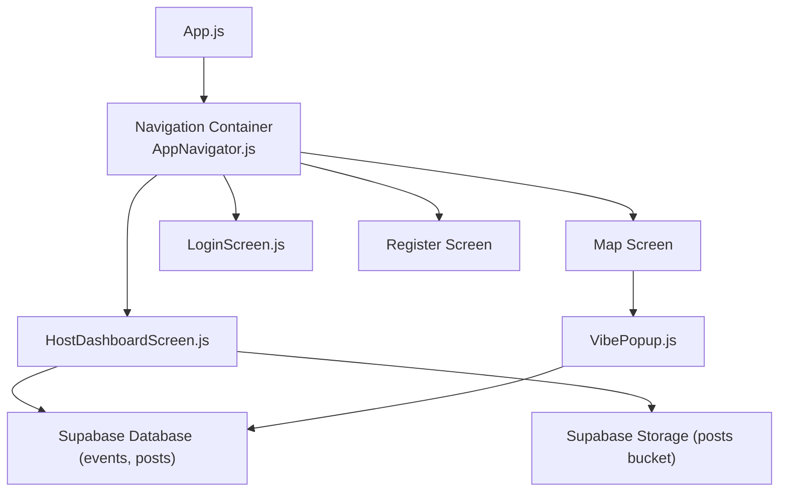
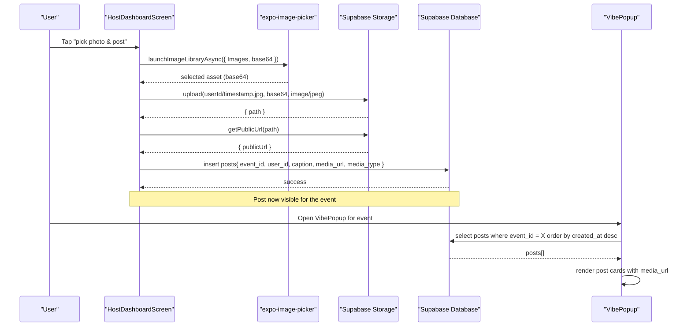
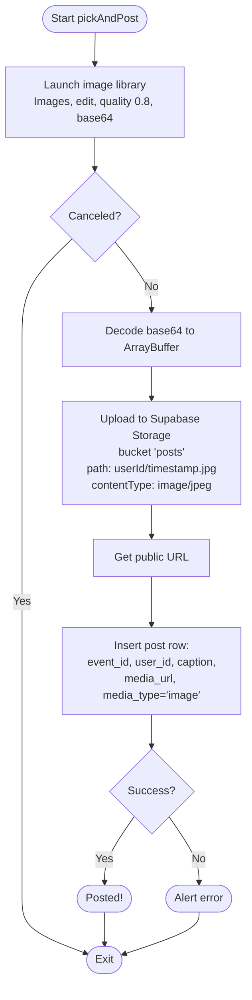
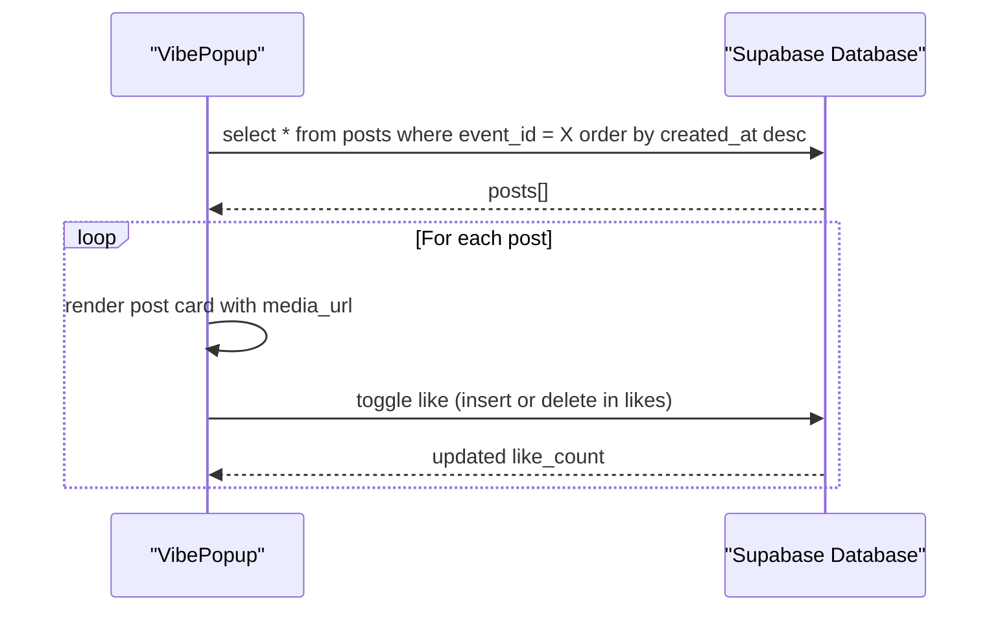
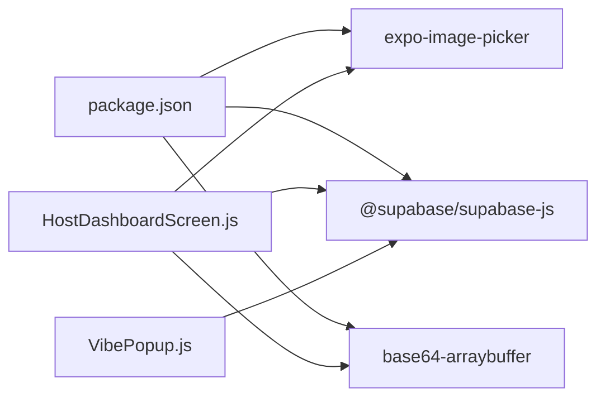

# Photo Sharing System

<cite>
**Referenced Files in This Document**
- [App.js](file://App.js)
- [package.json](file://package.json)
- [src/navigation/AppNavigator.js](file://src/navigation/AppNavigator.js)
- [src/screens/HostDashboardScreen.js](file://src/screens/HostDashboardScreen.js)
- [src/components/VibePopup.js](file://src/components/VibePopup.js)
- [src/hooks/useAuth.js](file://src/hooks/useAuth.js)
- [src/screens/LoginScreen.js](file://src/screens/LoginScreen.js)
</cite>

## Table of Contents
1. [Introduction](#introduction)
2. [Project Structure](#project-structure)
3. [Core Components](#core-components)
4. [Architecture Overview](#architecture-overview)
5. [Detailed Component Analysis](#detailed-component-analysis)
6. [Dependency Analysis](#dependency-analysis)
7. [Performance Considerations](#performance-considerations)
8. [Troubleshooting Guide](#troubleshooting-guide)
9. [Conclusion](#conclusion)

## Introduction
This document explains the photo sharing system that enables users to upload and share images during live events. It covers:
- Image selection using expo-image-picker
- Media storage via Supabase Storage
- End-to-end workflow from image selection to display in post cards within the VibePopup feed
- File organization, URL generation, and error handling
- How photos are associated with events and displayed in the VibePopup feed

The system is built on React Native with Expo, uses Supabase for authentication, database, and storage, and integrates location services for event context.

## Project Structure
At a high level:
- App entry renders the navigation container
- Navigation routes users based on auth state
- HostDashboardScreen handles going live and posting photos
- VibePopup displays posts for an active event, including images and likes
- Auth hook manages session state

**Diagram sources**
- [App.js:1-5](file://App.js#L1-L5)
- [src/navigation/AppNavigator.js:10-39](file://src/navigation/AppNavigator.js#L10-L39)
- [src/screens/HostDashboardScreen.js:88-124](file://src/screens/HostDashboardScreen.js#L88-L124)
- [src/components/VibePopup.js:48-58](file://src/components/VibePopup.js#L48-L58)

**Section sources**
- [App.js:1-5](file://App.js#L1-L5)
- [src/navigation/AppNavigator.js:10-39](file://src/navigation/AppNavigator.js#L10-L39)
- [package.json:5-22](file://package.json#L5-L22)

## Core Components
- HostDashboardScreen: Orchestrates going live and posting photos. Uses expo-image-picker to select images, uploads them to Supabase Storage, retrieves public URLs, and inserts posts linked to the active event.
- VibePopup: Displays posts for a given event, fetches media URLs, supports likes, and shows check-in status.
- useAuth: Manages current user session and updates UI accordingly.
- AppNavigator: Routes between screens based on authentication state.

Key responsibilities:
- Image selection and conversion to base64 array buffer
- Uploading to Supabase Storage under a per-user folder structure
- Generating public URLs and persisting post metadata
- Fetching and rendering posts in the VibePopup feed

**Section sources**
- [src/screens/HostDashboardScreen.js:88-124](file://src/screens/HostDashboardScreen.js#L88-L124)
- [src/components/VibePopup.js:48-58](file://src/components/VibePopup.js#L48-L58)
- [src/hooks/useAuth.js:1-22](file://src/hooks/useAuth.js#L1-L22)
- [src/navigation/AppNavigator.js:10-39](file://src/navigation/AppNavigator.js#L10-L39)

## Architecture Overview
The photo sharing flow spans UI, storage, and database layers:

**Diagram sources**
- [src/screens/HostDashboardScreen.js:88-124](file://src/screens/HostDashboardScreen.js#L88-L124)
- [src/components/VibePopup.js:48-58](file://src/components/VibePopup.js#L48-L58)

## Detailed Component Analysis

### HostDashboardScreen: Upload and Post Workflow
Responsibilities:
- Launch image picker with editing enabled and quality set
- Convert base64 string to ArrayBuffer for upload
- Upload to Supabase Storage bucket named posts with content type image/jpeg
- Generate public URL and create a post record tied to the active event
- Provide user feedback and handle errors

**Diagram sources**
- [src/screens/HostDashboardScreen.js:88-124](file://src/screens/HostDashboardScreen.js#L88-L124)

**Section sources**
- [src/screens/HostDashboardScreen.js:88-124](file://src/screens/HostDashboardScreen.js#L88-L124)

### VibePopup: Displaying Posts and Interactions
Responsibilities:
- Fetch posts for the provided event, ordered by newest first
- Render each post card with image, optional caption, and like count
- Support toggling likes and updating local state
- Show check-in status and count

**Diagram sources**
- [src/components/VibePopup.js:48-58](file://src/components/VibePopup.js#L48-L58)
- [src/components/VibePopup.js:120-155](file://src/components/VibePopup.js#L120-L155)

**Section sources**
- [src/components/VibePopup.js:48-58](file://src/components/VibePopup.js#L48-L58)
- [src/components/VibePopup.js:120-155](file://src/components/VibePopup.js#L120-L155)

### Authentication and Routing Context
- useAuth maintains the current user session and loading state
- AppNavigator switches between login/register and map/host dashboard based on auth state
- Screens import supabase client from a shared module to perform authenticated operations

**Section sources**
- [src/hooks/useAuth.js:1-22](file://src/hooks/useAuth.js#L1-L22)
- [src/navigation/AppNavigator.js:10-39](file://src/navigation/AppNavigator.js#L10-L39)
- [src/screens/LoginScreen.js:10-15](file://src/screens/LoginScreen.js#L10-L15)

## Dependency Analysis
External dependencies relevant to photo sharing:
- expo-image-picker: image selection with editing and base64 output
- @supabase/supabase-js: database and storage clients
- base64-arraybuffer: converts base64 strings to ArrayBuffer for upload

**Diagram sources**
- [package.json:5-22](file://package.json#L5-L22)
- [src/screens/HostDashboardScreen.js:1-15](file://src/screens/HostDashboardScreen.js#L1-L15)
- [src/components/VibePopup.js:1-15](file://src/components/VibePopup.js#L1-L15)

**Section sources**
- [package.json:5-22](file://package.json#L5-L22)
- [src/screens/HostDashboardScreen.js:1-15](file://src/screens/HostDashboardScreen.js#L1-L15)
- [src/components/VibePopup.js:1-15](file://src/components/VibePopup.js#L1-L15)

## Performance Considerations
- Image size and quality: The picker uses quality 0.8; consider further compression if large files cause slow uploads or high bandwidth usage.
- Base64 overhead: Converting to base64 increases payload size; ensure network conditions are acceptable or consider streaming/chunked uploads for very large images.
- Storage bucket naming: Using userId/timestamp.jpg avoids collisions and organizes files per user.
- Rendering performance: VibePopup uses FlatList for efficient list rendering of posts.
- Network calls: Batch-like interactions update counts locally to reduce re-renders and network chatter.

[No sources needed since this section provides general guidance]

## Troubleshooting Guide
Common issues and resolutions:
- Image picker canceled: Ensure user granted necessary permissions and selected an image.
- Upload errors: Check storage bucket permissions and content-type settings; verify network connectivity.
- Post insertion failures: Validate that event_id and user_id exist and that RLS policies allow inserts.
- Location permission required for going live: Request foreground location permission before creating an event.
- Duplicate check-ins: Handle unique constraint errors gracefully by marking user as checked in.

Error handling patterns observed:
- Alerts for user-facing errors during sign-in, go-live, and posting flows
- Graceful handling of duplicate check-in constraints
- Loading states to prevent repeated actions during async operations

**Section sources**
- [src/screens/HostDashboardScreen.js:51-86](file://src/screens/HostDashboardScreen.js#L51-L86)
- [src/screens/HostDashboardScreen.js:88-124](file://src/screens/HostDashboardScreen.js#L88-L124)
- [src/components/VibePopup.js:82-118](file://src/components/VibePopup.js#L82-L118)
- [src/screens/LoginScreen.js:10-15](file://src/screens/LoginScreen.js#L10-L15)

## Conclusion
The photo sharing system integrates expo-image-picker and Supabase to provide a seamless experience for capturing, uploading, and displaying images during live events. The HostDashboardScreen orchestrates the upload and post creation workflow, while VibePopup renders posts and supports engagement features like likes and check-ins. Proper file organization, URL generation, and robust error handling ensure reliability and scalability.

[No sources needed since this section summarizes without analyzing specific files]