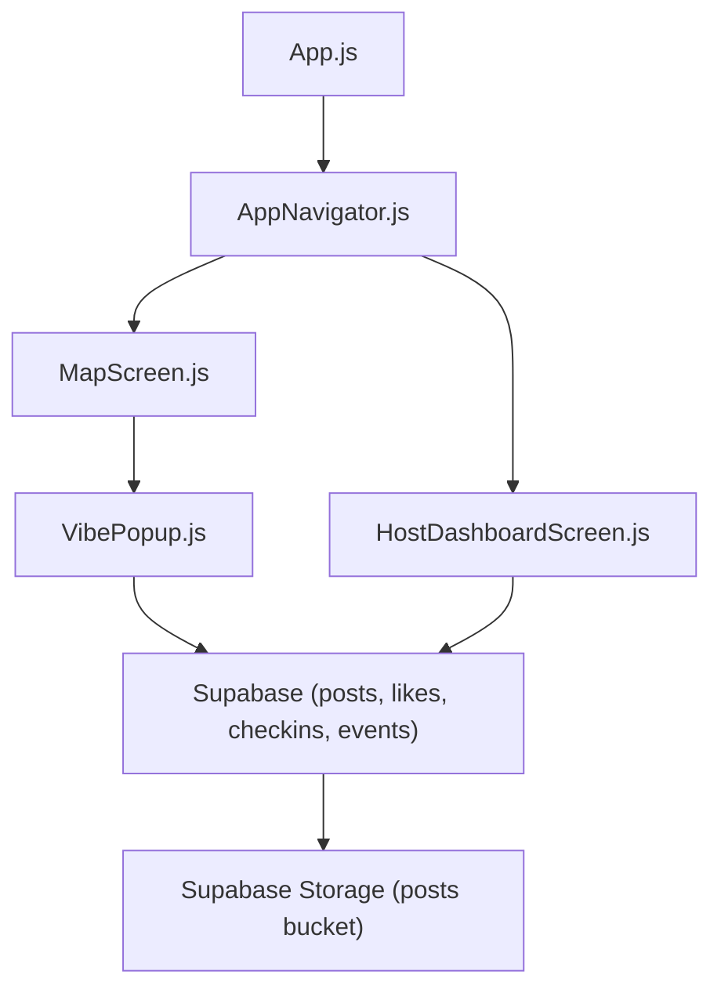
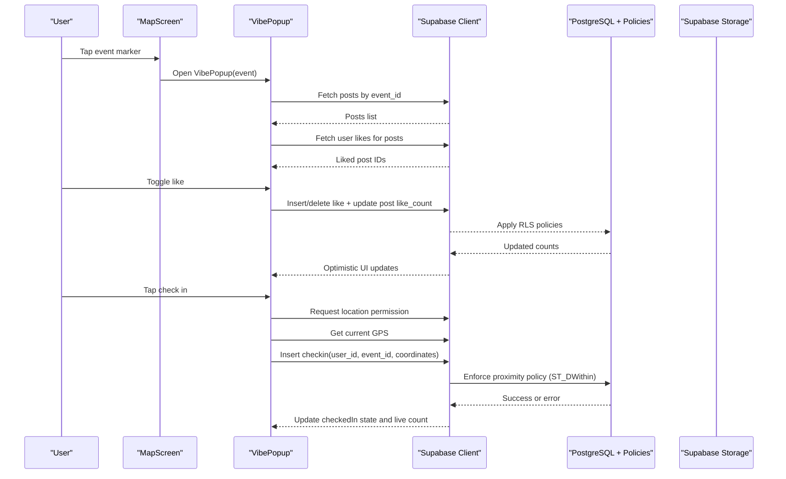
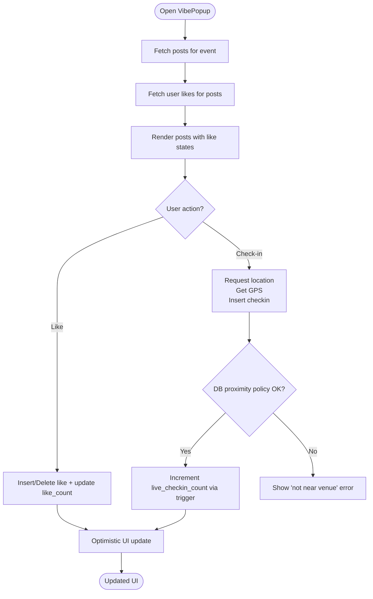
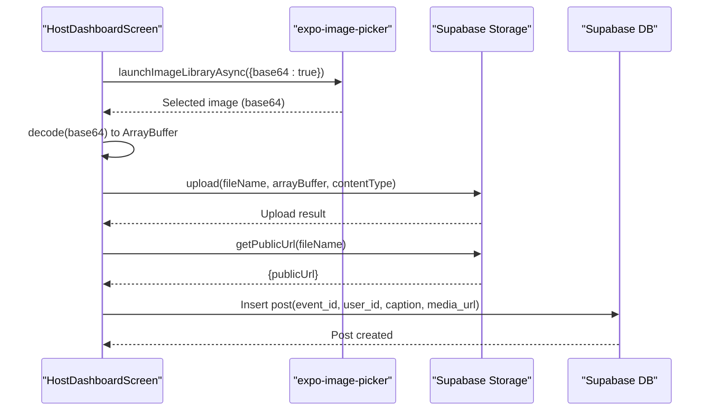
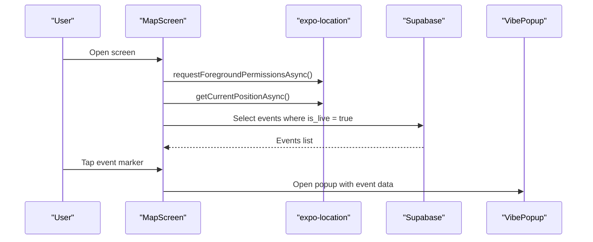
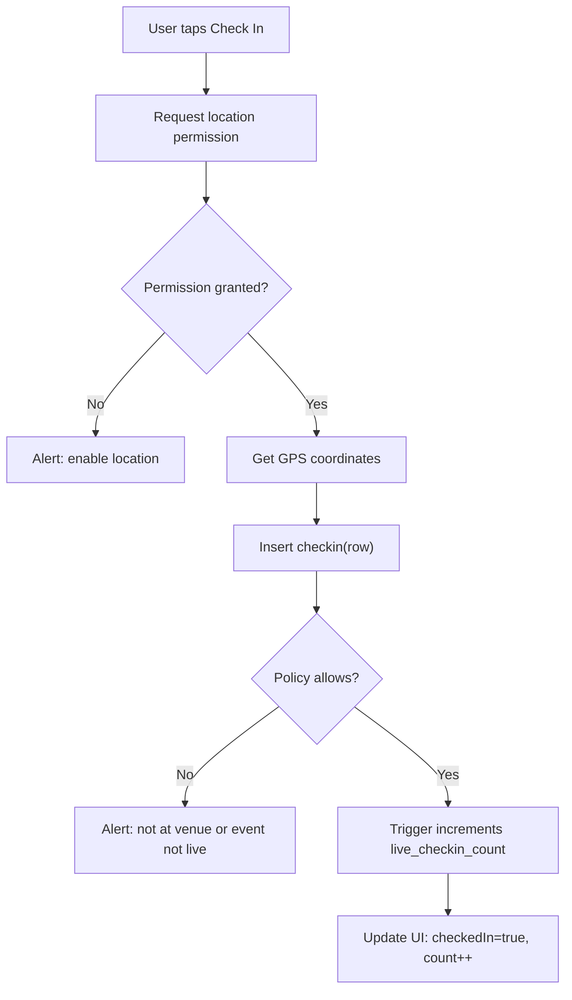
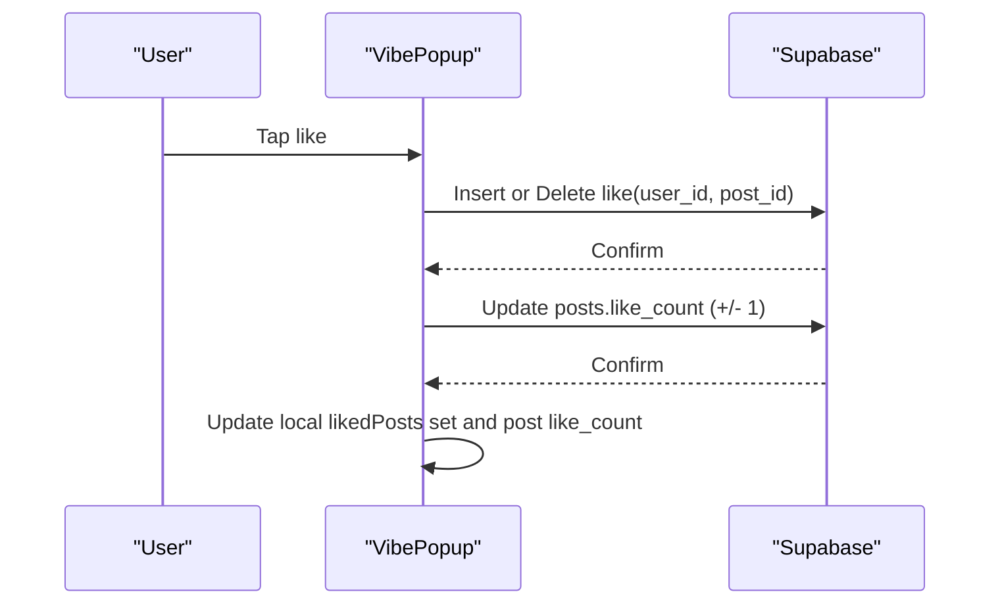
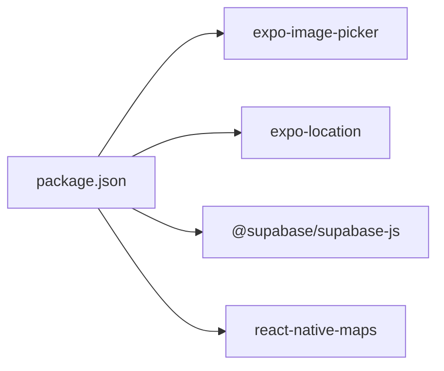

# Social Features

<cite>
**Referenced Files in This Document**
- [VibePopup.js](file://src/components/VibePopup.js)
- [MapScreen.js](file://src/screens/MapScreen.js)
- [HostDashboardScreen.js](file://src/screens/HostDashboardScreen.js)
- [AppNavigator.js](file://src/navigation/AppNavigator.js)
- [App.js](file://App.js)
- [package.json](file://package.json)
- [phase6_checkins.sql](file://supabase/sql/sql/phase6_checkins.sql)
</cite>

## Table of Contents
1. Introduction
2. Project Structure
3. Core Components
4. Architecture Overview
5. Detailed Component Analysis
6. Dependency Analysis
7. Performance Considerations
8. Troubleshooting Guide
9. Conclusion

## Introduction
This document explains the social interaction features implemented in the application, focusing on:
- VibePopup modal for event details and social interactions
- Photo upload and sharing using expo-image-picker with Supabase Storage
- Like system for user engagement tracking and local real-time updates
- Check-in verification system that validates proximity to live events using GPS coordinates
- Integration patterns across screens and navigation

The goal is to help developers understand how these features work together and how to extend or maintain them.

## Project Structure
At a high level:
- App entry renders a navigator that routes between authentication flows and core screens
- MapScreen displays live events and opens VibePopup for each event
- HostDashboardScreen hosts the “go live” flow and photo posting pipeline
- VibePopup provides the social layer: posts, likes, and check-ins
- Supabase SQL enforces security policies and maintains live counters

**Diagram sources**
- [App.js:1-5](file://App.js#L1-L5)
- [AppNavigator.js:1-40](file://src/navigation/AppNavigator.js#L1-L40)
- [MapScreen.js:1-100](file://src/screens/MapScreen.js#L1-L100)
- [HostDashboardScreen.js:1-305](file://src/screens/HostDashboardScreen.js#L1-L305)
- [VibePopup.js:1-333](file://src/components/VibePopup.js#L1-L333)

**Section sources**
- [App.js:1-5](file://App.js#L1-L5)
- [AppNavigator.js:1-40](file://src/navigation/AppNavigator.js#L1-L40)

## Core Components
- VibePopup: Modal UI showing event info, post feed, like toggles, and check-in button. It fetches posts, loads user likes, checks check-in status, and performs location-gated check-ins.
- MapScreen: Displays live events on a map and triggers VibePopup when an event marker is tapped.
- HostDashboardScreen: Enables hosts to go live, pick photos via expo-image-picker, upload to Supabase Storage, and create posts linked to the active event.
- Supabase SQL: Enforces policies for check-ins (proximity gate), ensures uniqueness per user/event, and increments live_checkin_count automatically via trigger.

Key integration points:
- Navigation: Authenticated users see Map and HostDashboard; unauthenticated users see Login/Register.
- Data: All social data lives in Supabase tables (events, posts, likes, checkins). Media assets are stored in Supabase Storage under the posts bucket.
- Location: expo-location is used to request permissions and capture current GPS coordinates for both hosting and checking in.

**Section sources**
- [VibePopup.js:1-333](file://src/components/VibePopup.js#L1-L333)
- [MapScreen.js:1-100](file://src/screens/MapScreen.js#L1-L100)
- [HostDashboardScreen.js:1-305](file://src/screens/HostDashboardScreen.js#L1-L305)
- [phase6_checkins.sql:1-63](file://supabase/sql/sql/phase6_checkins.sql#L1-L63)

## Architecture Overview
The social feature architecture centers around three layers:
- UI Layer: Screens and modals render state and handle user actions
- Service Layer: Supabase client reads/writes relational data and storage
- Policy Layer: Database policies enforce business rules (e.g., proximity-based check-ins)

**Diagram sources**
- [MapScreen.js:1-100](file://src/screens/MapScreen.js#L1-L100)
- [VibePopup.js:1-333](file://src/components/VibePopup.js#L1-L333)
- [phase6_checkins.sql:1-63](file://supabase/sql/sql/phase6_checkins.sql#L1-L63)

## Detailed Component Analysis

### VibePopup: Event Details, Likes, and Check-ins
Responsibilities:
- Load posts for the selected event
- Load user’s liked posts to reflect UI state
- Provide like toggle with optimistic UI updates
- Gate check-in behind location permission and database proximity policy
- Display live check-in count from event metadata

Data flow highlights:
- On mount: fetch current user session, then load posts and check-in status
- When posts load: fetch user likes for those posts
- Like toggle: insert or delete like row and update post like_count locally and remotely
- Check-in: request foreground location permission, get GPS, insert check-in row; DB policy ensures user is within 100m of a live event; trigger increments live_checkin_count

**Diagram sources**
- [VibePopup.js:1-333](file://src/components/VibePopup.js#L1-L333)
- [phase6_checkins.sql:1-63](file://supabase/sql/sql/phase6_checkins.sql#L1-L63)

Implementation notes:
- Local state tracks likedPosts as a Set for fast membership checks
- Like toggling updates both the likes table and the posts like_count atomically in sequence
- Check-in uses a POINT geometry string constructed from GPS coordinates; DB policy enforces proximity using geography types and distance threshold
- Error handling covers missing permissions, duplicate check-ins, and policy violations

**Section sources**
- [VibePopup.js:1-333](file://src/components/VibePopup.js#L1-L333)
- [phase6_checkins.sql:1-63](file://supabase/sql/sql/phase6_checkins.sql#L1-L63)

### HostDashboardScreen: Photo Upload and Sharing
Responsibilities:
- Create and manage live events
- Pick images via expo-image-picker
- Upload images to Supabase Storage
- Create posts referencing uploaded media URLs

Photo upload and sharing flow:
- Launch image library with editing enabled and base64 output
- Decode base64 to ArrayBuffer
- Upload to Supabase Storage bucket named posts
- Retrieve public URL for the uploaded asset
- Insert a post record linking to the media URL and the active event

**Diagram sources**
- [HostDashboardScreen.js:1-305](file://src/screens/HostDashboardScreen.js#L1-L305)

Integration points:
- Uses base64-arraybuffer to convert image data for storage upload
- Stores media in a dedicated bucket and references it via public URL in posts
- Associates posts with the currently active live event

**Section sources**
- [HostDashboardScreen.js:1-305](file://src/screens/HostDashboardScreen.js#L1-L305)
- [package.json:1-32](file://package.json#L1-L32)

### MapScreen: Event Discovery and Popup Trigger
Responsibilities:
- Request location permission and center map on user location
- Fetch live events and render markers
- Open VibePopup when a marker is pressed

**Diagram sources**
- [MapScreen.js:1-100](file://src/screens/MapScreen.js#L1-L100)

**Section sources**
- [MapScreen.js:1-100](file://src/screens/MapScreen.js#L1-L100)

### Check-in Verification System
The check-in system ensures only nearby users can check into live events:
- Frontend requests location permission and captures GPS
- Inserts a check-in row with user_id, event_id, and POINT coordinate
- Database policy enforces:
  - Only authenticated users can insert
  - The event must be live
  - The user’s coordinates must be within 100 meters of the event’s coordinates using geography-based distance calculation
- A trigger increments the event’s live_checkin_count on successful insert

**Diagram sources**
- [VibePopup.js:1-333](file://src/components/VibePopup.js#L1-L333)
- [phase6_checkins.sql:1-63](file://supabase/sql/sql/phase6_checkins.sql#L1-L63)

**Section sources**
- [VibePopup.js:1-333](file://src/components/VibePopup.js#L1-L333)
- [phase6_checkins.sql:1-63](file://supabase/sql/sql/phase6_checkins.sql#L1-L63)

### Like System Implementation
The like system supports user engagement tracking with immediate UI feedback:
- Loads user’s liked posts for the current event’s posts
- Toggling a like inserts or deletes a like row and updates the post’s like_count
- UI updates optimistically based on local state and remote results

**Diagram sources**
- [VibePopup.js:1-333](file://src/components/VibePopup.js#L1-L333)

**Section sources**
- [VibePopup.js:1-333](file://src/components/VibePopup.js#L1-L333)

## Dependency Analysis
External dependencies relevant to social features:
- expo-image-picker: Used to select images for posts
- expo-location: Used to request permissions and get GPS for hosting and check-ins
- @supabase/supabase-js: Used for auth, database queries, and storage operations
- react-native-maps: Used to display events on a map

**Diagram sources**
- [package.json:1-32](file://package.json#L1-L32)

**Section sources**
- [package.json:1-32](file://package.json#L1-L32)

## Performance Considerations
- Optimistic UI updates: Likes update the UI immediately while network calls complete, improving perceived responsiveness
- Efficient state management: Using a Set for likedPosts avoids repeated scans and speeds up membership checks
- Minimal re-renders: Local state changes are scoped to specific components to avoid unnecessary re-renders
- Proximity validation on server: Offloading distance checks to the database reduces client-side complexity and improves reliability
- Image handling: Using base64 decoding and targeted uploads minimizes payload size and simplifies storage workflow

[No sources needed since this section provides general guidance]

## Troubleshooting Guide
Common issues and resolutions:
- Location permission denied: Ensure foreground permission is requested before capturing GPS; prompt users to enable location access
- Check-in fails due to proximity: Verify the event is live and the user’s GPS is within 100 meters; confirm database policy and trigger are deployed
- Duplicate check-in: The unique constraint prevents multiple check-ins per user/event; treat duplicate errors as success and mark user as checked-in
- Image upload errors: Validate base64 decoding and content type; ensure storage bucket exists and has appropriate policies
- Like count mismatch: Ensure like insert/delete and like_count updates are executed in sequence; consider transactions if needed for strict consistency

**Section sources**
- [VibePopup.js:1-333](file://src/components/VibePopup.js#L1-L333)
- [HostDashboardScreen.js:1-305](file://src/screens/HostDashboardScreen.js#L1-L305)
- [phase6_checkins.sql:1-63](file://supabase/sql/sql/phase6_checkins.sql#L1-L63)

## Conclusion
The social features combine a responsive UI with robust backend policies to deliver engaging, location-aware interactions:
- VibePopup centralizes event details, posts, likes, and check-ins
- Photo sharing leverages expo-image-picker and Supabase Storage for seamless media workflows
- The like system provides immediate feedback and accurate engagement metrics
- Check-in verification ensures authenticity through GPS-based proximity enforcement
Together, these components form a cohesive social experience that scales with user growth and maintains data integrity through database policies and triggers.

[No sources needed since this section summarizes without analyzing specific files]