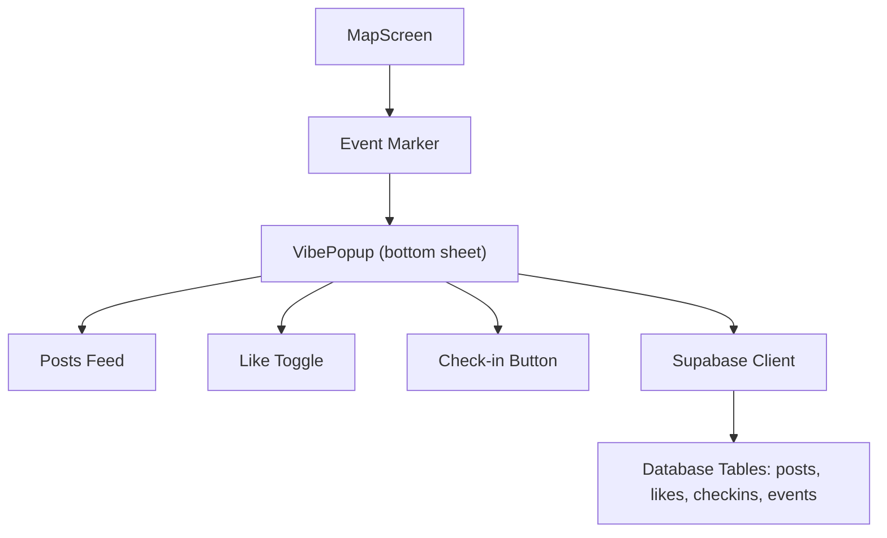
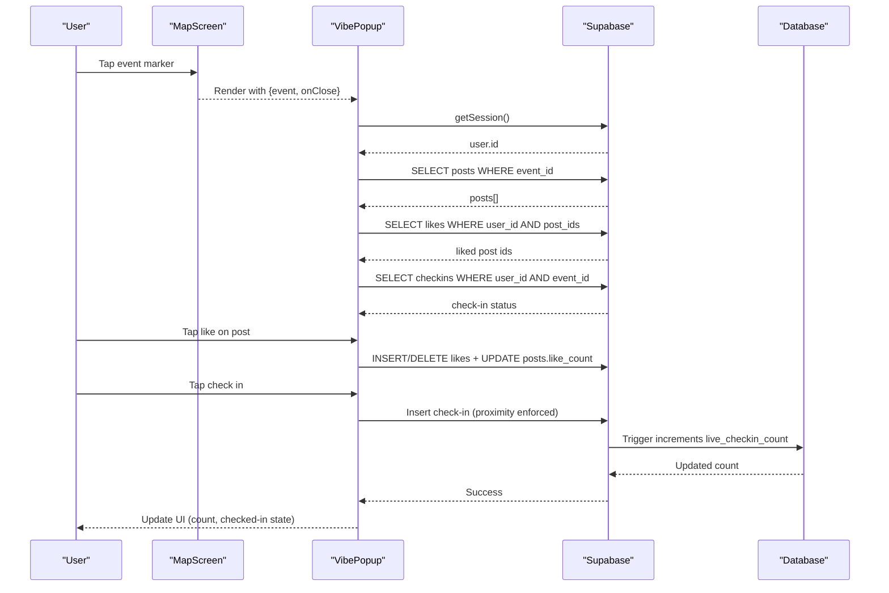
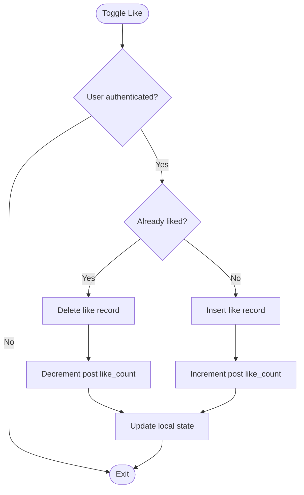
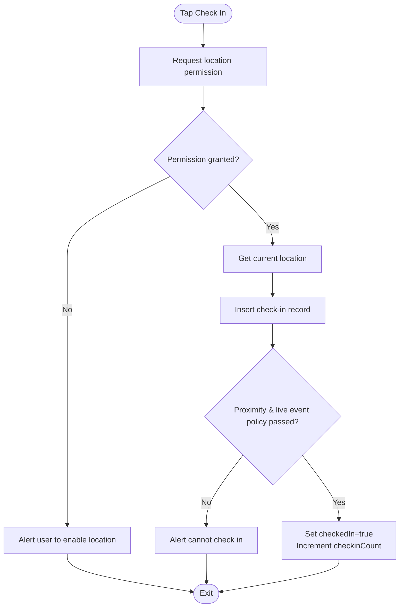
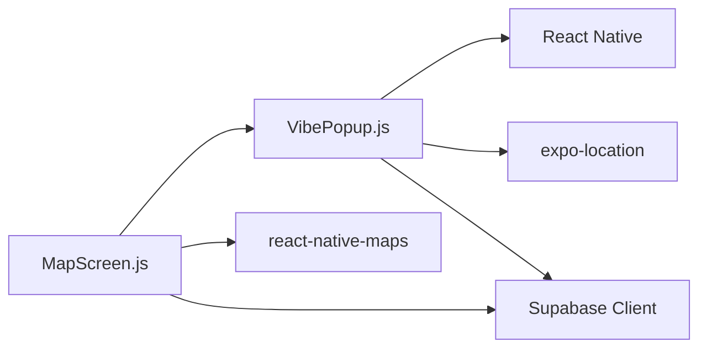

# VibePopup Component

<cite>
**Referenced Files in This Document**
- [VibePopup.js](file://src/components/VibePopup.js)
- [MapScreen.js](file://src/screens/MapScreen.js)
- [useAuth.js](file://src/hooks/useAuth.js)
- [phase6_checkins.sql](file://supabase/sql/sql/phase6_checkins.sql)
</cite>

## Table of Contents
1. [Introduction](#introduction)
2. [Project Structure](#project-structure)
3. [Core Components](#core-components)
4. [Architecture Overview](#architecture-overview)
5. [Detailed Component Analysis](#detailed-component-analysis)
6. [Dependency Analysis](#dependency-analysis)
7. [Performance Considerations](#performance-considerations)
8. [Troubleshooting Guide](#troubleshooting-guide)
9. [Conclusion](#conclusion)

## Introduction
The VibePopup component is the main social interaction interface for a live event experience. It renders a bottom sheet modal that shows event details, a feed of posts, real-time check-in status, and user interactions such as liking posts and checking into an event. It manages local state for posts, likes, authentication context, and check-ins, and integrates with Supabase to fetch and update data.

## Project Structure
VibePopup lives under src/components and is presented from MapScreen as a bottom sheet overlay when a user selects an event marker. The component uses React Native UI primitives and Expo Location for proximity-based check-ins. Authentication state is obtained via Supabase Auth within the component or through a shared hook elsewhere in the app.

**Diagram sources**
- [MapScreen.js:48-74](file://src/screens/MapScreen.js#L48-L74)
- [VibePopup.js:18-227](file://src/components/VibePopup.js#L18-L227)

**Section sources**
- [MapScreen.js:1-77](file://src/screens/MapScreen.js#L1-L77)
- [VibePopup.js:1-227](file://src/components/VibePopup.js#L1-L227)

## Core Components
- VibePopup: Bottom sheet modal displaying event info, post feed, like toggles, and check-in functionality.
- MapScreen: Hosts the map and triggers VibePopup by selecting an event marker.
- useAuth: Shared authentication hook used elsewhere; VibePopup obtains current user session directly via Supabase Auth.
- Supabase policies and triggers: Enforce proximity-gated check-ins and maintain live check-in counts.

Key responsibilities:
- Event context management: receives event object and updates UI accordingly.
- User state handling: resolves current user id and gates actions.
- Data fetching: loads posts for the event and user-specific likes/check-in status.
- Interactions: toggle likes and perform proximity-gated check-ins.

**Section sources**
- [VibePopup.js:18-227](file://src/components/VibePopup.js#L18-L227)
- [MapScreen.js:48-74](file://src/screens/MapScreen.js#L48-L74)
- [useAuth.js:4-22](file://src/hooks/useAuth.js#L4-L22)
- [phase6_checkins.sql:20-40](file://supabase/sql/sql/phase6_checkins.sql#L20-L40)

## Architecture Overview
VibePopup implements a bottom sheet modal architecture using absolute positioning anchored at the bottom of the screen with rounded top corners and a visual handle. It composes:
- Header with event title and close button
- Check-in row showing count and action button
- Post list rendered via FlatList
- Local state for loading, posts, liked posts set, and check-in status

Data flow:
- On mount and when event changes, fetch posts for the event.
- When userId and posts are available, fetch user’s likes for those posts.
- When userId and event are available, fetch check-in status.
- Like toggles update both local state and server-side like counts.
- Check-in requests location permissions, then inserts a check-in record if near the event; server-side trigger increments live_checkin_count.

**Diagram sources**
- [MapScreen.js:48-74](file://src/screens/MapScreen.js#L48-L74)
- [VibePopup.js:27-155](file://src/components/VibePopup.js#L27-L155)
- [phase6_checkins.sql:42-63](file://supabase/sql/sql/phase6_checkins.sql#L42-L63)

## Detailed Component Analysis

### Modal Architecture and Props
- Bottom sheet design: Uses absolute positioning at the bottom with height proportional to screen and rounded top corners to create a native-like drawer.
- Props:
  - event: Object containing event metadata including id, location_name, title, and live_checkin_count. Used to load posts and display header information.
  - onClose: Callback invoked to dismiss the popup.
- Visual elements:
  - Handle bar for visual affordance
  - Header with location name, event title, and close button
  - Check-in row with count and action button
  - Post list with images, optional captions, and like buttons

**Section sources**
- [VibePopup.js:18-227](file://src/components/VibePopup.js#L18-L227)

### Event Context Management
- The component reacts to the event prop:
  - Fetches posts for the event when event is present.
  - Updates local check-in count based on event.live_checkin_count.
- If the event changes, the component re-fetches relevant data to reflect the new context.

**Section sources**
- [VibePopup.js:35-38](file://src/components/VibePopup.js#L35-L38)

### User State Handling
- Current user resolution:
  - Retrieves session via Supabase Auth to obtain userId.
  - Gates interactions (like, check-in) behind authenticated state.
- Integration with useAuth:
  - While VibePopup resolves auth internally, other screens may use useAuth for global auth state.

**Section sources**
- [VibePopup.js:27-33](file://src/components/VibePopup.js#L27-L33)
- [useAuth.js:4-22](file://src/hooks/useAuth.js#L4-L22)

### Internal State Management
- posts: Array of posts fetched for the event.
- loading: Boolean indicating initial load state.
- userId: Current authenticated user id.
- likedPosts: Set of post ids the user has liked.
- checkedIn: Boolean indicating whether the user has checked into the event.
- checkingIn: Boolean indicating an ongoing check-in operation.
- checkinCount: Local mirror of event.live_checkin_count updated after successful check-in.

State transitions:
- On mount: fetch posts, resolve user, fetch likes and check-in status.
- On like toggle: update local likedPosts and posts like_count immediately, then persist changes.
- On check-in: request location, insert check-in, update checkedIn and increment checkinCount.

**Section sources**
- [VibePopup.js:19-25](file://src/components/VibePopup.js#L19-L25)
- [VibePopup.js:48-80](file://src/components/VibePopup.js#L48-L80)
- [VibePopup.js:120-155](file://src/components/VibePopup.js#L120-L155)
- [VibePopup.js:82-118](file://src/components/VibePopup.js#L82-L118)

### Data Flows and Processing Logic

#### Posts Loading
- Fetches posts ordered by creation time for the given event.
- Displays empty state when no posts exist.

**Section sources**
- [VibePopup.js:48-58](file://src/components/VibePopup.js#L48-L58)

#### Like Toggling
- Determines if post is already liked using likedPosts set.
- If liked: deletes like record and decrements post like_count locally and on server.
- If not liked: inserts like record and increments post like_count locally and on server.
- Optimistic UI updates ensure immediate feedback.

**Diagram sources**
- [VibePopup.js:120-155](file://src/components/VibePopup.js#L120-L155)

#### Check-in Flow
- Requests foreground location permission.
- Gets current coordinates and attempts to insert a check-in record.
- Server-side policy enforces proximity to a live event and uniqueness per user/event.
- On success, updates local checkedIn state and increments checkinCount.

**Diagram sources**
- [VibePopup.js:82-118](file://src/components/VibePopup.js#L82-L118)
- [phase6_checkins.sql:20-40](file://supabase/sql/sql/phase6_checkins.sql#L20-L40)

### Integration with Supabase
- Authentication:
  - Uses supabase.auth.getSession to retrieve current user id.
- Database operations:
  - Posts: SELECT by event_id, order by created_at.
  - Likes: SELECT by user_id and post_ids; INSERT/DELETE on toggle; UPDATE posts.like_count.
  - Check-ins: SELECT to determine status; INSERT with coordinates; server-side trigger increments live_checkin_count.
- Real-time considerations:
  - The component performs explicit fetches rather than subscriptions. For true real-time updates, consider subscribing to changes on posts, likes, and check-ins tables.

**Section sources**
- [VibePopup.js:27-33](file://src/components/VibePopup.js#L27-L33)
- [VibePopup.js:48-80](file://src/components/VibePopup.js#L48-L80)
- [VibePopup.js:120-155](file://src/components/VibePopup.js#L120-L155)
- [phase6_checkins.sql:42-63](file://supabase/sql/sql/phase6_checkins.sql#L42-L63)

## Dependency Analysis
- VibePopup depends on:
  - React hooks for state and effects.
  - React Native components for UI layout and interactions.
  - Expo Location for geolocation and permissions.
  - Supabase client for auth and database operations.
- MapScreen depends on:
  - react-native-maps for map rendering and markers.
  - VibePopup for event detail overlay.
  - Supabase client to fetch live events.

**Diagram sources**
- [VibePopup.js:1-14](file://src/components/VibePopup.js#L1-L14)
- [MapScreen.js:1-6](file://src/screens/MapScreen.js#L1-L6)

**Section sources**
- [VibePopup.js:1-14](file://src/components/VibePopup.js#L1-L14)
- [MapScreen.js:1-6](file://src/screens/MapScreen.js#L1-L6)

## Performance Considerations
- Minimize redundant queries:
  - Fetch posts once per event and cache locally.
  - Batch-like queries for user likes reduce network calls.
- Optimistic UI updates:
  - Immediate local state changes improve perceived performance during like toggles and check-ins.
- Efficient list rendering:
  - FlatList with keyExtractor ensures efficient scrolling for large post lists.
- Avoid unnecessary re-renders:
  - Memoize derived values if needed and keep state minimal.

[No sources needed since this section provides general guidance]

## Troubleshooting Guide
Common issues and resolutions:
- Location permission denied:
  - Ensure foreground location permission is granted before attempting check-in.
  - Prompt users to enable location access if denied.
- Cannot check in:
  - Proximity policy requires being within a specified distance of a live event. Verify event.is_live and coordinates.
- Duplicate check-in errors:
  - Unique constraint prevents multiple check-ins per user/event; treat duplicate insertion as success and update UI accordingly.
- No posts displayed:
  - Confirm event_id is correct and posts table contains entries for the event.
- Like count mismatch:
  - Ensure like toggle updates both likes table and posts.like_count consistently.

**Section sources**
- [VibePopup.js:82-118](file://src/components/VibePopup.js#L82-L118)
- [phase6_checkins.sql:20-40](file://supabase/sql/sql/phase6_checkins.sql#L20-L40)

## Conclusion
VibePopup delivers a cohesive social interaction layer for live events with a bottom sheet modal design. It manages event context, user authentication, and interactive features like likes and check-ins while integrating with Supabase for data persistence and enforcement of business rules. Its architecture balances responsiveness with correctness through optimistic UI updates and server-side constraints.

[No sources needed since this section summarizes without analyzing specific files]