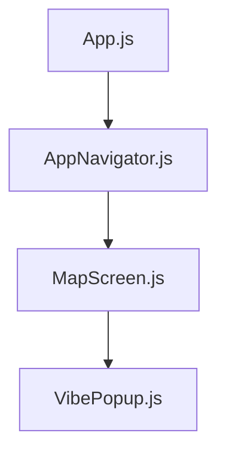
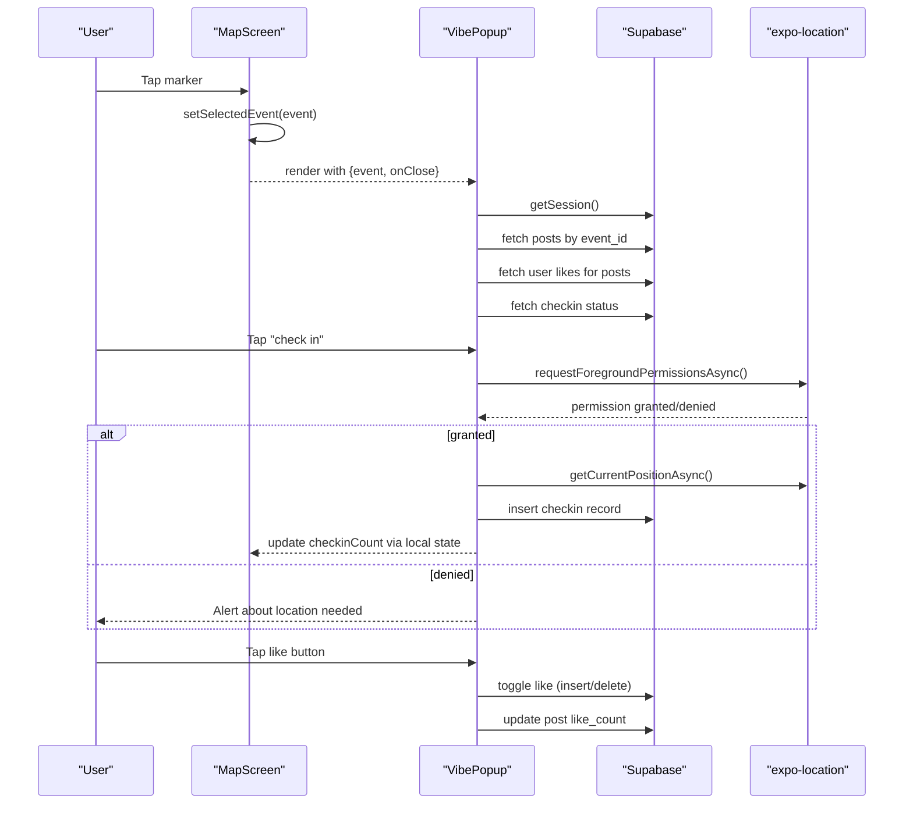
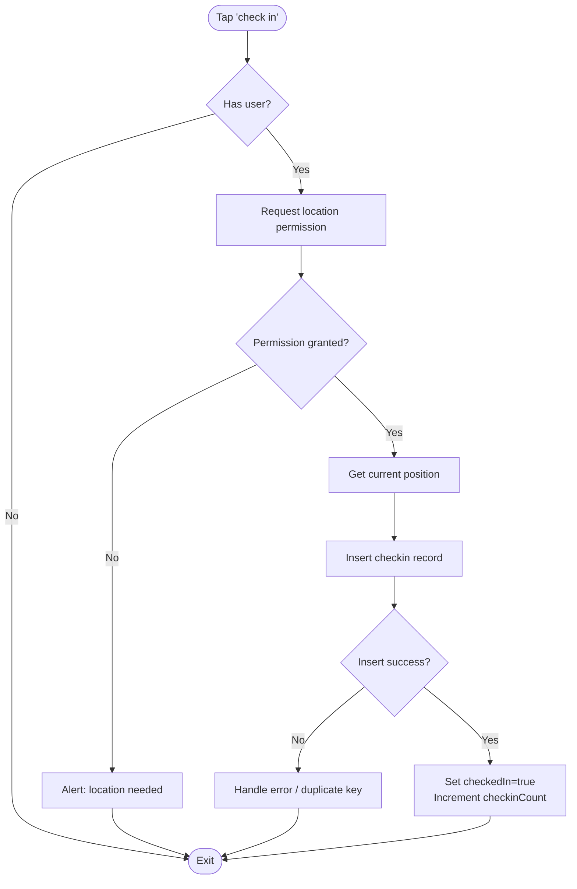
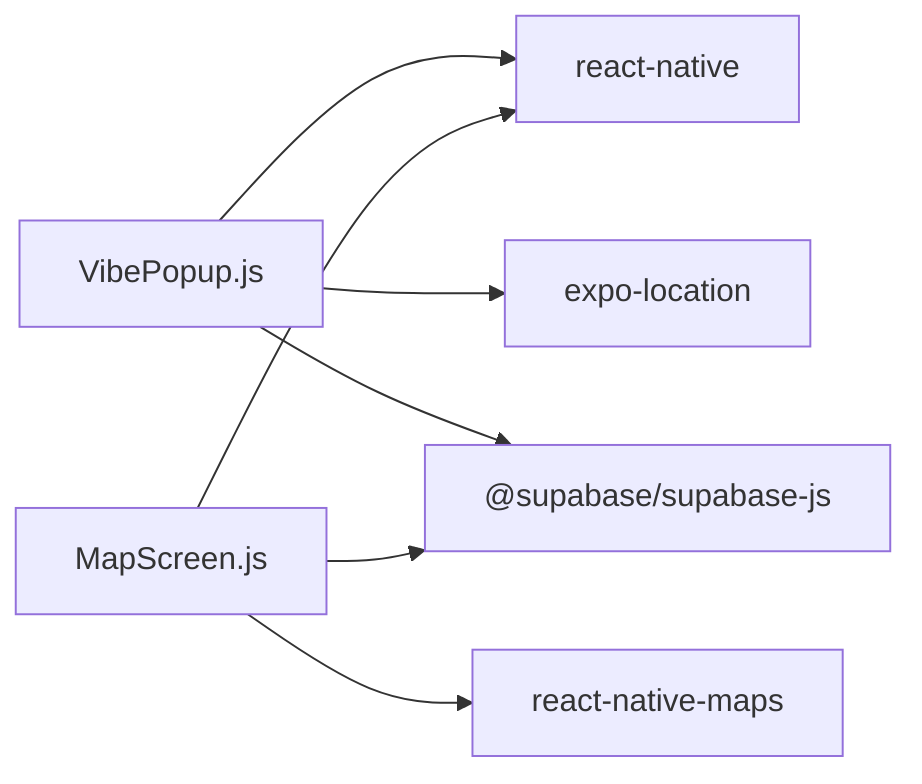

# UI Components

<cite>
**Referenced Files in This Document**
- [VibePopup.js](file://src/components/VibePopup.js)
- [MapScreen.js](file://src/screens/MapScreen.js)
- [AppNavigator.js](file://src/navigation/AppNavigator.js)
- [App.js](file://App.js)
- [package.json](file://package.json)
</cite>

## Table of Contents
1. [Introduction](#introduction)
2. [Project Structure](#project-structure)
3. [Core Components](#core-components)
4. [Architecture Overview](#architecture-overview)
5. [Detailed Component Analysis](#detailed-component-analysis)
6. [Dependency Analysis](#dependency-analysis)
7. [Performance Considerations](#performance-considerations)
8. [Troubleshooting Guide](#troubleshooting-guide)
9. [Conclusion](#conclusion)
10. [Appendices](#appendices)

## Introduction
This document provides detailed documentation for the reusable VibePopup component used in the Outside application. It covers visual appearance, behavior, user interactions, props, events, customization options, responsive design guidelines, accessibility considerations, states and transitions, theming support, and cross-platform compatibility notes for iOS and Android.

## Project Structure
The Outside app is a React Native (Expo) application with:
- A root entry that renders a navigation container
- A navigator that routes between screens based on authentication state
- Screens including a map view where the VibePopup is presented as an overlay when a marker is selected
- The VibePopup component itself, which displays event details, posts, check-in status, and like interactions



**Diagram sources**
- [App.js:1-5](file://App.js#L1-L5)
- [AppNavigator.js:1-40](file://src/navigation/AppNavigator.js#L1-L40)
- [MapScreen.js:1-100](file://src/screens/MapScreen.js#L1-L100)
- [VibePopup.js:1-333](file://src/components/VibePopup.js#L1-L333)

**Section sources**
- [App.js:1-5](file://App.js#L1-L5)
- [AppNavigator.js:1-40](file://src/navigation/AppNavigator.js#L1-L40)
- [MapScreen.js:1-100](file://src/screens/MapScreen.js#L1-L100)

## Core Components
- VibePopup: A bottom sheet-style popup that shows event information, live check-in count, a list of posts with images and captions, and per-post like actions. It also supports checking in to the event using device location services.

Key responsibilities:
- Display event metadata (location name and title)
- Show current check-in count and allow users to check in
- Render a scrollable list of posts with media and captions
- Allow toggling likes on posts
- Manage loading states and empty content feedback

**Section sources**
- [VibePopup.js:18-228](file://src/components/VibePopup.js#L18-L228)

## Architecture Overview
The VibePopup integrates with the map screen and external services:
- MapScreen manages event selection and conditionally renders VibePopup
- VibePopup fetches posts and user-specific data from Supabase
- Location permissions are requested before checking in
- User session is retrieved via Supabase Auth



**Diagram sources**
- [MapScreen.js:48-74](file://src/screens/MapScreen.js#L48-L74)
- [VibePopup.js:27-155](file://src/components/VibePopup.js#L27-L155)
- [VibePopup.js:82-118](file://src/components/VibePopup.js#L82-L118)

## Detailed Component Analysis

### VibePopup Component
Visual appearance:
- Bottom-sheet style panel anchored at the bottom of the screen
- Rounded top corners with a dark background
- A small handle bar at the top center
- Header with location name and event title, plus a close button
- Check-in row showing count and a primary action button
- Scrollable list of post cards with image, optional caption, and like button

Behavior and interactions:
- Loads posts for the given event and orders them by creation time
- Retrieves current user ID from session
- Fetches user’s liked posts to reflect active like states
- Checks whether the user has already checked in to the event
- On check-in: requests foreground location permission, captures coordinates, and inserts a check-in record; handles duplicate key errors gracefully
- On like toggle: updates local state and persists changes to both likes and post like counts

Props and attributes:
- event: object containing at least id, location_name, title, and live_checkin_count
- onClose: function called when the user taps the close button

Events/callbacks:
- onClose: invoked to dismiss the popup

State management:
- Internal states include posts, loading, userId, likedPosts, checkedIn, checkingIn, and checkinCount

Data flow:
- Uses Supabase client to read/write posts, likes, and checkins
- Uses expo-location for geolocation during check-in

Accessibility considerations:
- Interactive elements (close button, check-in button, like button) should be focusable and announce their role and state to assistive technologies
- Ensure sufficient color contrast for text and icons
- Provide meaningful labels or accessible names for buttons (e.g., “Check in”, “Like post”)

Responsive design:
- Height is set relative to screen height to adapt across devices
- FlatList scrolls vertically within the popup
- Images fill the width of the card with fixed height for consistent layout

Animations and transitions:
- No explicit animation library is used; the popup appears/disappears based on conditional rendering in the parent
- Loading indicators show progress during data fetching and check-in operations

Theming and customization:
- Styles are defined locally via StyleSheet.create
- Colors and typography are hardcoded; to customize, modify the styles in the component or extract them into a theme module
- To change dimensions or spacing, adjust the container height, padding, and border radius values

Cross-platform compatibility:
- Built with React Native and Expo, targeting iOS and Android
- Location features rely on expo-location; ensure proper permissions are configured in the app manifest for both platforms
- Behavior is consistent across platforms, but platform-specific permission prompts may differ

Usage example (integration):
- In MapScreen, when a marker is pressed, set the selected event and render VibePopup with the event and a close handler
- Reference the integration pattern in the map screen code

Code snippet paths:
- Integration usage: [MapScreen.js:69-74](file://src/screens/MapScreen.js#L69-L74)
- Props passed to VibePopup: [MapScreen.js:70-73](file://src/screens/MapScreen.js#L70-L73)

**Section sources**
- [VibePopup.js:18-228](file://src/components/VibePopup.js#L18-L228)
- [VibePopup.js:230-333](file://src/components/VibePopup.js#L230-L333)
- [MapScreen.js:69-74](file://src/screens/MapScreen.js#L69-L74)

#### Class-like structure (functional component)
```mermaid
classDiagram
class VibePopup {
+props.event
+props.onClose
-state.posts
-state.loading
-state.userId
-state.likedPosts
-state.checkedIn
-state.checkingIn
-state.checkinCount
+fetchPosts()
+fetchUserLikes()
+fetchCheckinStatus()
+checkIn()
+toggleLike(postId, currentLikes)
+renderPost({item})
}
```

**Diagram sources**
- [VibePopup.js:18-228](file://src/components/VibePopup.js#L18-L228)

#### Check-in flow


**Diagram sources**
- [VibePopup.js:82-118](file://src/components/VibePopup.js#L82-L118)

### MapScreen Integration
Responsibilities:
- Requests location permission and sets initial map region
- Fetches live events from Supabase and renders markers
- Handles marker press to select an event and conditionally render VibePopup
- Provides a host dashboard navigation button

Integration points:
- Imports and renders VibePopup with event and onClose
- Controls visibility through selectedEvent state

**Section sources**
- [MapScreen.js:1-100](file://src/screens/MapScreen.js#L1-L100)

### Navigation and App Entry
- App.js renders the navigation container
- AppNavigator decides which screens to show based on auth state and includes MapScreen and HostDashboardScreen
- VibePopup is not part of the route stack; it overlays the current screen

**Section sources**
- [App.js:1-5](file://App.js#L1-L5)
- [AppNavigator.js:1-40](file://src/navigation/AppNavigator.js#L1-L40)

## Dependency Analysis
External dependencies relevant to VibePopup:
- react-native core components (View, Text, StyleSheet, FlatList, Image, TouchableOpacity, Dimensions, ActivityIndicator, Alert)
- expo-location for geolocation and permissions
- @supabase/supabase-js for database and auth operations



**Diagram sources**
- [VibePopup.js:1-14](file://src/components/VibePopup.js#L1-L14)
- [MapScreen.js:1-6](file://src/screens/MapScreen.js#L1-L6)
- [package.json:5-22](file://package.json#L5-L22)

**Section sources**
- [package.json:5-22](file://package.json#L5-L22)

## Performance Considerations
- Data fetching: Posts are fetched once per event prop change; consider debouncing or caching if frequently switching events
- Likes: Local Set tracks liked posts to avoid redundant queries; batching could further reduce network calls
- Images: Use appropriate image sizing and compression to improve performance on mobile devices
- List rendering: FlatList efficiently renders large lists; ensure stable keys and minimal re-renders
- Location: Request permissions only when necessary (on check-in) to minimize overhead

[No sources needed since this section provides general guidance]

## Troubleshooting Guide
Common issues and resolutions:
- Location permission denied: The component alerts the user to enable location access; verify system settings and app permissions
- Duplicate check-in: Handled by catching specific error codes and treating as success; ensure backend constraints are in place
- Network errors: Errors from Supabase are logged; implement retry logic or user-friendly messages as needed
- Empty posts: Displays an empty state message; ensure correct event_id filtering

Error handling references:
- Permission and alert flows: [VibePopup.js:82-118](file://src/components/VibePopup.js#L82-L118)
- Error logging for posts and other operations: [VibePopup.js:48-80](file://src/components/VibePopup.js#L48-L80)

**Section sources**
- [VibePopup.js:48-118](file://src/components/VibePopup.js#L48-L118)

## Conclusion
VibePopup is a focused, reusable component that enhances event discovery and interaction on the map. It combines real-time data retrieval, location-based check-ins, and social interactions (likes) within a compact, bottom-sheet interface. By following the integration patterns and customization guidelines outlined here, developers can extend its functionality while maintaining consistency and performance across iOS and Android.

[No sources needed since this section summarizes without analyzing specific files]

## Appendices

### Props and Events Summary
- event: Required. Contains event metadata and live_checkin_count
- onClose: Required. Callback to dismiss the popup

**Section sources**
- [MapScreen.js:70-73](file://src/screens/MapScreen.js#L70-L73)
- [VibePopup.js:18-26](file://src/components/VibePopup.js#L18-L26)

### Style Customization Options
- Container height and positioning: Adjust bottom anchor and height percentage
- Colors and typography: Modify colors and font sizes in the stylesheet
- Button states: Customize disabled, active, and done states for check-in and like buttons
- Post cards: Adjust image height, padding, and border radius

**Section sources**
- [VibePopup.js:230-333](file://src/components/VibePopup.js#L230-L333)

### Accessibility Checklist
- Ensure all interactive elements have accessible labels
- Maintain sufficient contrast ratios for text and icons
- Provide clear feedback for actions (loading, success, errors)
- Support dynamic type scaling where applicable

[No sources needed since this section provides general guidance]

### Cross-Platform Notes
- Permissions: Configure expo-location permissions in app config for iOS and Android
- Behavior parity: Ensure consistent UX across platforms; test on both OS versions
- Platform differences: Be aware of subtle differences in permission prompts and location accuracy

**Section sources**
- [package.json:11-16](file://package.json#L11-L16)